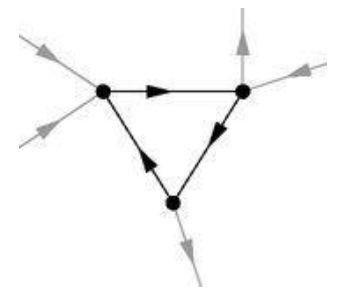
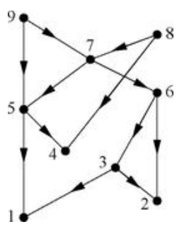

## Definition
- A ***cycle in a directed graph*** is a closed loop of edges with the arrows on each of the edges pointing the same way around the loop. A directed graph with no cycles is called an ***acyclic directed graph***, and one with cycles is called a ***cyclic directed graph***. A self-edge (an edge connecting a vertex to itself) counts as a cycle. 

## Lemma
- Every finite acyclic directed graph contains at least one vertex with an out-degree of zero.

즉 사이클이 없는 유향 그래프는 오로지 들어오는 에지만 가지는 정점을 반드시 가진다. 이 렘마를 통해 어떤 유향 그래프가 사이클을 가지는지 판별할 수 있고, 사이클을 가지지 않는다면 항상 에지의 방향을 위에서 아래로 정렬하는 알고리즘을 만들 수 있다.

### Proof
Let $G = (V, E)$ be a finite acyclic directed graph with $n$ vertices. Suppose, for the sake of contradiction, that every vertex in $V$ has an out-degree of at least 1. Choose an arbitrary starting vertex $v_1 \in V$. Since its out-degree is greater than or equal to 1, there exists an adjacent vertex $v_2 \in V$ such that the directed edge $(v_1, v_2) \in E$. We can iterate this process indefinitely to construct a sequence of vertices $v_1, v_2, v_3, \dots$ where $(v_i, v_{i+1}) \in E$ for all $i \geq 1$.

Because the vertex set $V$ is finite and has exactly $n$ elements, by the Pigeonhole Principle, examining the first $n+1$ vertices in our sequence guarantees that at least one vertex must be visited more than once. Let $v_j$ and $v_k$ be the same vertex with $j < k$. The sequence of directed edges from $v_j$ to $v_k$ forms a closed loop, which implies the existence of a cycle of length $k - j$ in $G$. This directly contradicts the initial assumption that $G$ is acyclic. Therefore, our assumption must be false, and there must exist at least one vertex in $V$ with an out-degree of zero. $\blacksquare$

## Algorithm
- Given a finite directed graph $G = (V, E)$, the following procedure determines whether the graph is acyclic and, if so, constructs a topological ordering of its vertices.

**(i)** Find a vertex with no outgoing edges (out-degree of zero).

**(ii)** If no such vertex exists and $V$ is not empty, halt; the graph is cyclic.

**(iii)** If such a vertex exists, remove it and all of its incoming edges from the graph.

**(iv)** If all vertices have been removed, halt; the graph is acyclic. Otherwise, go back to **(i)**.

If a directed network is acyclic, this algorithm will successfully remove all vertices. By assigning indices to the vertices in the exact order of their removal (i.e., the first removed vertex gets index $1$, the second gets $2$, \dots, the last gets $n$), we obtain a topological ordering. In this ordering, since every removed vertex only has incoming edges from vertices that are removed later, every directed edge must point from a vertex with a higher index to a vertex with a lower index.

## Theorem
A directed graph is acyclic $\iff$ all eigenvalues of its adjacency matrix are zero.

### Proof
Let $A$ be the $n \times n$ adjacency matrix of a directed graph $G$, and let $\kappa_1, \kappa_2, \dots, \kappa_n$ be its eigenvalues. We prove both directions of the biconditional statement.

$(\Longrightarrow)$ 

Assume $G$ is acyclic. By the above algorithm, we can find a topological ordering of the vertices. Relabel the vertices of $G$ such that vertex $1$ has out-degree zero, vertex $2$ is the next removed, and so forth up to vertex $n$. Let $A'$ be the adjacency matrix of this relabeled network. 

[By relabeling the vertices, $A'$ is orthogonally similar to $A$.](../Adjacency_Matrix/index.qmd#sec-theorem) Since similar matrices have identical characteristic polynomials, the eigenvalues of $A'$ are exactly the eigenvalues of $A$.

Under this topological relabeling, an edge exists from vertex $j$ to vertex $i$ only if $j > i$. Consequently, $A'_{ij} \neq 0$ implies $j > i$, meaning all non-zero elements of $A'$ lie strictly above the main diagonal. This makes $A'$ a strictly upper triangular matrix. Since the eigenvalues of a triangular matrix are its diagonal elements, and an acyclic network has no self-edges (hence all diagonal elements are zero), all eigenvalues of $A'$ are zero. Therefore, all eigenvalues $\kappa_i$ of the original matrix $A$ are also zero.

$(\Longleftarrow)$ 

We proceed by proving the contrapositive: if $G$ is cyclic, then $A$ has at least one non-zero eigenvalue. Assume $G$ contains at least one cycle, and let $r \ge 1$ be the length of one such cycle. Let $L_r$ denote the total number of cycles of length $r$ in $G$. By our assumption, $L_r > 0$. From algebraic graph theory, the total number of cycles of length $r$ can be expressed in terms of the eigenvalues of the adjacency matrix as:

$$L_r = \sum_{i=1}^{n} \kappa_i^r$$

Since $L_r > 0$, the sum $\sum_{i=1}^{n} \kappa_i^r$ must be strictly greater than zero. This implies that at least one term in the sum is non-zero, which in turn necessitates that at least one eigenvalue $\kappa_i$ is non-zero. By contraposition, if all eigenvalues are zero, the network cannot be cyclic. $\blacksquare$

# Reference
- Newman, M.E.J. (2010). Networks: An Introduction. Oxford University Press.