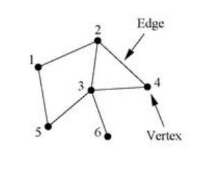

## Definition
Let $G$ be a graph with $V(G) = \{1, ..., n\}$. The ***adjacency matrix*** of $G$, denoted by $A = [A_{ij}]$, is an $n \times n$ matrix defined by 

$$A_{ij} = \begin{cases} 1 & \text{if } \{i, j\} \in E(G) \\ 0 & \text{otherwise} \end{cases}$$

## Example

즉 어떤 그래프가 주어진 경우 에지가 연결되어 있는 정보를 나타낸 행렬을 adjacency matrix, 인접 행렬이라고 부른다. 예를 들어 위 그래프의 경우 인접 행렬은 다음과 같이 얻어진다.

$$\begin{bmatrix}
0 & 1 & 0 & 0 & 1 & 0 \\
1 & 0 & 1 & 1 & 0 & 0 \\
0 & 1 & 0 & 1 & 1 & 1 \\
0 & 1 & 1 & 0 & 0 & 0 \\
1 & 0 & 1 & 0 & 0 & 0 \\
0 & 0 & 1 & 0 & 0 & 0
\end{bmatrix}$$

## Remark
- Any adjacency matrix is symmetric and non-diagonal.

당연하게도 인접 행렬은 대칭 행렬이다. $1$번과 $2$번을 연결한 에지는 다르게 말하면 $2$번과 $1$번을 연결한 에지도 되기 때문이다. 또한 대각 성분은 모두 $0$인데, 단순 그래프를 가정했으므로 self-edge가 없기 때문이다.

# Reference
- Newman, M.E.J. (2010). Networks: An Introduction. Oxford University Press.