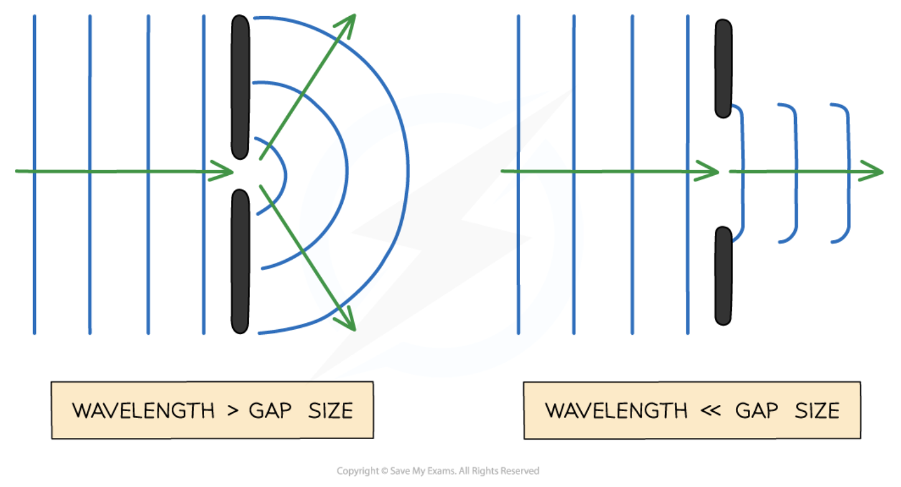

# 1. Radiation and Rays 

- 전자기 복사는 본질적으로 **파동**이다. 그래서 회절, 간섭, 위상 같은 파동의 성질을 갖는다. 그러나, 계(system)의 크기(scale)가 파장보다 아주 크다면 파동의 세부적인 물결무늬를 굳이 다 따질 필요가 없고 **복사의 진행을 "에너지가 이동하는 방향선"으로 근사**할 수 있다. 이때의 방향선을 **광선(rays)**라고 부른다. 
    - 파장을 $\lambda$, 계의 크기를 $L$ 이라고 하자. $\lambda \ll L$ 이면 한 파장에 비해서 계의 크기가 매우 커서 한 파장이 도달하기 전에 계의 겉모습이 변하지 않는다. (아래 그림 참고)

- 전파 천문학에서 주로 다루는 관측 파장대와 관측 대상은 다음과 같다: 
- **관측 파장대**: 대략 mm-m(주파수 영역으로 보면 수백 GHz - 수십 MHz)
    - 지구의 전리층(ionosphere)은 외계 전파가 지상으로 도달하지 못하도록 반사함으로써 지상 기반 전파 천문학의 저주파 한계를 만든다. $\nu \lesssim 10~\text{MHz}~(\lambda \sim 30~\text{m})$ 의 전파는 지상에서 관측될 수 없다. 
- **관측 대상**: 성간가스(HI 21cm), 분자운(CO 등 mm선), 펄사(pulsar), Fast Radio Burst(FRB), AGN 제트(jets), 은하 자기장, 태양 및 행성의 전파, 우주배경복사(CMB) 등...
