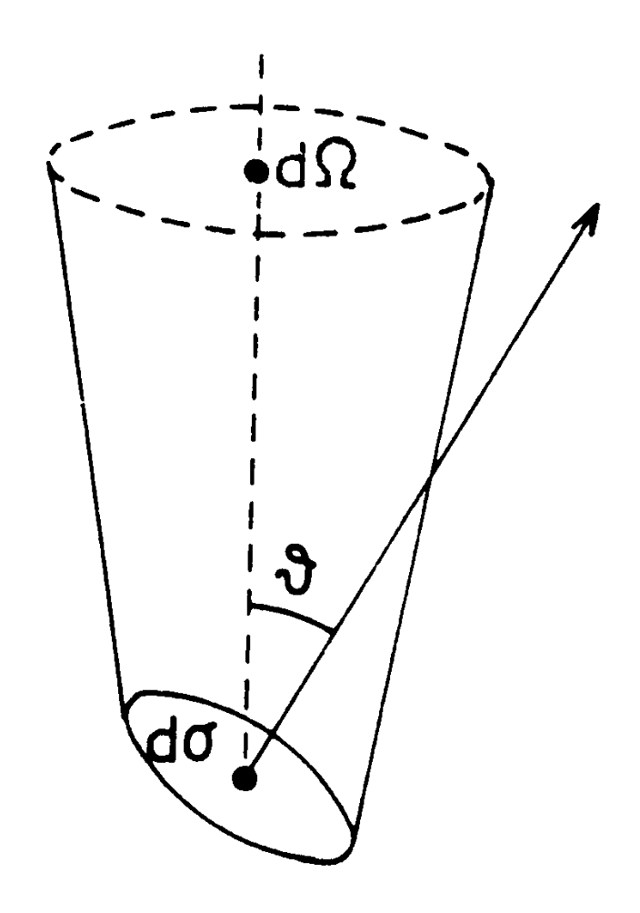

# 1. Power and Intensity, Brightness

- 전자기 복사를 광선으로 가정하자. 다음 그림과 같은 상황을 고려하자. 

{width="40%"}

- 그림에서 미소 면적 $d\sigma$ 에 가해지는 미소 power $dP$ 는 다음과 같다: 

$$
dP = I_\nu \cos \vartheta \, d\Omega \, d\sigma \, d\nu  \tag{1.1}
$$

- $dP$ = 미소 power (단위: ${\rm W} = {\rm J/s}$)
- $d\sigma$ = 표면의 미소 면적 (단위: $\text{cm}^2$)
- $d\nu$ = 미소 bandwidth (단위: Hz)
- $\theta$ = $d\sigma$의 법선과 $d\Omega$ 방향 사이의 각도
- $I_\nu$ = **밝기(brightness)** 또는 **specific intensity** (단위: $\text{W m}^{-2} \text{Hz}^{-1} \text{sr}^{-1}$)
    - 참고: specific intensity에서 "specific"이라는 용어는 '단위 진동수'가 포함된 경우에 사용하는 용어이다. 단위 진동수가 포함되지 않으면 "Intensity"라고 부른다. 
- 식 (1.1)은 **Intensity**, **Specific Intensity**, **Brightness**의 정의를 포함한다. 
- 전파 천문학에서는 power 많이 쓰는데, 이는 전파 망원경이 빛을 받으면 전압 신호로 바꾸기 때문이다. 

- 천체(source)의 총 플럭스(total flux)는 식 (1.1)을 천체가 차지하는 전체 입체각 $\Omega_s$ 에 대해 적분하여 얻을 수 있다: 
$$
S_\nu = \int_{\Omega_s} I_\nu(\vartheta, \varphi) \cos \vartheta \, d\Omega  \tag{1.2}
$$

- 식 (1.2)는 **플럭스 밀도(flux density)** 라고 부르며, 단위로 $\text{W m}^{-2} \text{Hz}^{-1}$ 를 가진다. 
- 전파원(radio sources)의 플럭스 밀도는 보통 매우 작기 때문에, **잔스키(Jansky, 약어 Jy)** 라는 단위를 이용한다: 
$$
1 \text{ Jy} = 10^{-26} \text{ W m}^{-2} \text{ Hz}^{-1} = 10^{-23} \text{ erg s}^{-1} \text{ cm}^{-2} \text{ Hz}^{-1} \tag{1.3}
$$

- extended source의 brightness는 광학 천문학에서의 표면 밝기(surface brightness)와 유사한 물리량이다. **빛의 회절과 소멸(extinction) 효과를 무시할 수 있는 한, brightness는 천체까지의 거리와 무관하다.** 

---

## 1.1. Voltage 

- **전압(voltage)**: 두 점 사이의 전위차(potential difference)를 나타내는 용어이다. 
    - **전위차(potential difference)**: 전하량 $q$ 가 두 점 사이를 이동할 때, 계의 전기적 위치 에너지 변화를 전하량으로 나눈 값: $\Delta V = \Delta U_E / q$
    - 전압(전위차)의 단위는 $1{\rm V} \equiv 1{\rm J/C}$ 로 정의되며, 이는 $1{\rm C}$(쿨룽)의 전하량을 가진 전하를 $1{\rm V}$ 의 전위차만큼 옮기는 데 $1{\rm J}$ 의 일이 필요하다는 의미를 담고 있다. 

- 전파 천문학 맥락에서 전압은 이렇게 이해할 수 있다: 우주에서 온 전파 신호의 전기장이 안테나로 입사하면, 안테나 도체의 전자들이 진동하고 피드(feed)의 두 단자 사이에는 시간에 따라 변하는 전압이 유도된다. 전위차는 일반적으로 $\Delta V_{\rm feed}(t)$ 로 쓸 수 있지만, 혼동을 피하기 위해, 관례상으로 $v_{\rm feed}(t)$ 로 많이 표현한다. 따라서 전파 천문학에서는 전압을 $v(t)$ 라고 표현한다. 
    - 그러나, $v(t)$ 라고 나오면 일반적으로 **두 점 사이의 전위차**를 의미한다는 사실을 기억하자. 
    - 우주에서 기원한 전기장에는 시간에 따른 **진폭(Amplitude)** 와 **위상(Phase)** 정보가 포함된다.  

---

## 1.2. Radiation Energy Density 

- 단위 입체각당 복사 에너지 밀도($u_\nu$)는 (specific) intensity를 빛의 속도로 나눈 값으로 정의된다: 
    - 다른 표현으로 스펙트럼 에너지 밀도(Spectral energy density)라고도 한다.

$$
u_\nu(\Omega) = \frac{1}{c} I_\nu   \tag{1.4}
$$

- 단위: ${\rm erg cm^{-3}}$
- 전체 구 영역에 달하는 $4\pi$ 스테라디안(steradian)에 대해 적분하면, 식 (1.4)는 전체 스펙트럼 에너지 밀도(total spectral energy density)를 의미한다: 

$$
u_\nu = \int_{4\pi} u_\nu(\Omega) d\Omega  
= \frac{1}{c} \int_{4\pi} I_\nu  d\Omega \tag{1.5}
$$

---

# Reference 

- Tools of Radio Astronomy 5th, T.L.Wilson et al. 

