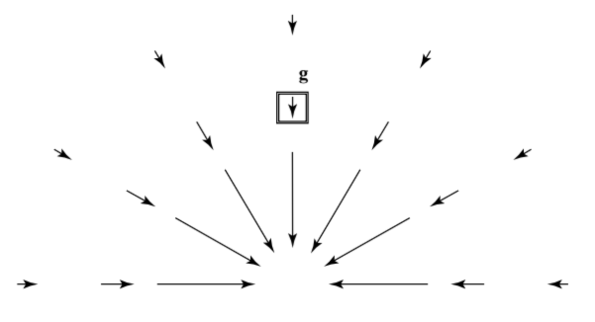

# 1. Equivalence principle(등가원리)

- **관성틀(inertial frame)**: 힘과 운동에 관한 뉴턴의 법칙이 간단한 식으로 표현되는 틀(frame) 
- **등가원리**: 중력은 어떤 의미에서 가속도와 같다. 특히, 균일한 중력장과 균일한 가속도는 local(작은 구역)에서 완전히 구별할 수 없다.
    - 예: 엘리베이터 탑승객의 입장에서 *엘리베이터가 위로 가속하는지* 또는 *중력이 강해졌는지* 구분할 수 없다. 따라서 작은 물체는 짧은 시간동안 중력장과 가속되는 기준틀 사이의 차이를 구분할 수 없다. 
- 등가원리에 대한 다른 표현은 "**관성질량($m_i$)**와 **중력질량($m_g$)**가 동일하다"는 것이다. 
    - **관성질량(inertial mass)**: 주어진 힘의 작용 하에서 물체의 가속도를 결정하는 질량. 즉, 물체가 가속에 저항하는 정도를 의미한다. 
    - **중력질량(gravitational mass)**: 물체와 다른 물체 사이의 중력 작용을 결정하는 질량
    - 실험적으로 관성질량과 중력질량이 거의 동일함이 밝혀졌다. 
- 이러한 맥락에서 $m_g /m_i$ 가 일정한 성질은 **약한 등가원리(weak equivalence principle)** 라고 불린다. 약한 등가원리는 같은 위치에 존재하는 모든 물체는 동일한 중력가속도를 경험한다는 사실을 알려준다. 
- 이는 질량 $m$ 인 물체가 중력에 의해 받는 가속도를 관성질량과 중력질량을 포함한 식으로 나타냈을 때, 알 수 있다:

$$
m_i a_g = G\frac{m_g M_g}{r^2} \rightarrow a_g = G \frac{M_g}{r^2} \frac{m_g}{m_i} \tag{1.1} 
$$

- 약한 등가원리에 의하면 식 (1.1)의 $m_g /m_i$ 가 1이 되므로 물체의 가속도는 오로지 질량 $M$ 인 물체와 거리 $r$ 에 의존하는 것을 알 수 있다. 즉, 같은 위치에 있다면 물체는 동일한 중력가속도를 경험한다. 

<!-- -->

- 앞서 언급한 엘리베이터 예시와 등가원리를 알아보기 위해 엘리베이터의 계를 $z'$ 이라고 하자. 이때 엘리베이터에 작용하는 운동방정식은 다음과 같다:

$$
m \ddot{z'}=F -mg \tag{1.2}
$$

- 식에 의하면 $z'$ 계에서 가속도는 외부 힘의 가속에 의한 효과와 중력에 의한 효과가 모두 작용하여 결정된다. 따라서 **엘리베이터의 탑승객 입장에서는 중력과 가속도를 구별할 수 없다.** 
- 단, 정전기력의 경우, 물체의 관성질량 $m_i$ 나 전하 $q$ 의 크기에 따라 가속도가 달라진다. 전기장 $E$ 가 존재하면 전하 $q$ 가 받는 힘은 다음과 같다:

$$
F_e = qE \tag{1.3}
$$

그리고 전하 $q$ 의 가속도는 다음과 같다:

$$
a = \frac{q}{m_i}E \tag{1.4}
$$

- 즉, 정전기력이 존재할 때 물체에 작용하는 가속도는 전하와 관성질량에 따라 달라지므로 **등가원리는 중력만이 가진 특징**이다. 

<!-- -->

- 앞서 등가원리가 국소적으로 작용한다고 설명했는데, 이는 **한 점에서만 적용되는 것이다.** 즉, 등가원리는 **국소적으로** 성립한다. 그 이유는 다음과 같다.
- 큰 규모로 확장하면 두 물체 사이에는 조석력(tidal force)이 작용할 수 있다. 조석력이 있다는 것은 **중력장이 위치에 따라 달라진다는 것을 시사한다.** 따라서 넓은 영역 전체를 하나의 자유낙하 좌표계로 덮어 중력을 완전히 없애는 것은 불가능하다. 이는 서로 다른 지점에서 중력의 크기와 방향이 달라지기 때문이다. 
    - 예: 자유낙하하는 두 입자는 처음에는 나란히 떨어진다고 해도, 시간이 지나면 두 입자 사이의 거리가 변할 수 있다. 이건 단순히 좌표를 이상하게 잡아서 생긴 효과가 아니고, **실제로 서로 다른 자유낙하 경로들이 벌어지거나 모이는 현상**이다. 

---

## 1.1. Equivalence principle and Special Relativity 

- 등가원리는 특수상대성이론에 심각한 문제를 제기한다. 그 이유는 특수상대성이론의 관성 기준계는 **일정한 속도를 유지**해야 하기 때문이다. 
- 그런데, 중력은 가속 중인 실험실과 물리적으로 구별할 수 없으므로 중력이 존재하는 한 관성 기준계를 정의할 수 없게 한다. (엘리베이터가 가속한다면 일정한 속도를 유지해야하는 특수상대성이론에 위배됨.) 이를 해결하기 위해 다음과 같은 논리를 따라가보자. 
- 엘리베이터와 그 안의 관찰자, 물체가 모두 같은 중력가속도 $g$ 로 자유낙하한다고 하자. 지표면 좌표에서 물체의 위치를 $z$, 자유낙하 엘리베이터의 원점 위치를 $z_0$ 라고 하면 다음이 성립한다:

$$
\frac{d^2 z}{dt^2} = -g, \qquad \frac{d^2 z_0}{dt^2} = -g \tag{1.5}
$$

- 엘리베이터 안의 관찰자는 물체의 위치를 지면이 아닌 엘리베이터를 기준으로 측정한다. 이때, 엘리베이터 안의 관찰자가 보는 물체의 위치는 두 위치의 차이인 $z' = z - z_0$ 가 될 것이다. 
- 예를 들어보자. 지면을 기준으로 엘리베이터가 지면에서 100m 높이에 공이 지면에서 102m 높이에 있다면 엘리베이터 안에서 공은 바닥을 기준으로 2m 위에 있는 것이다. 시간이 흘러 엘리베이터의 위치가 90m, 공의 위치가 92m가 되더라도 여전히 위치 차이는 2m로 같다. **지표면에서 보면 둘 다 움직였지만, 엘리베이터 안에서는 공의 위치가 변하지 않았다**는 것을 알 수 있다. 
- 그러면 식 (1.5)를 이용하여 상대 위치 $z'$ 의 가속도를 계산하면 다음과 같다:

$$
\frac{d^2 z'}{dt^2} = \frac{d^2 z}{dt^2} - \frac{d^2 z_0}{dt^2} = 0 \tag{1.6}
$$

- 식 (1.6)은 **엘리베이터 안에 있는 관찰자가 보기에 물체가 중력을 받지 않는 것처럼 보이는 효과**를 보여준다. 이렇게 되면 특수상대성이론에서 발생하던 관성 기준계 문제를 해결할 수 있다.
- 이 논의가 성립하려면 중력에 의한 가속도가 "우리가 설정한 어떤 기준계(예; 엘리베이터와 물체) 내에서는 크기와 방향 모두 거의 일정하게 유지될 만큼 충분히 작은 국소적인 자유낙하 기준계를 사용해야 한다." (아래 그림 참고)
    - **자유낙하(free-fall)**은 실험실에 중력이 아닌 힘이 전혀 없는 상태를 의미한다. 

{width="500px"}

- 따라서 국소적인 자유낙하 기준계를 사용한다면, 관측자는 중력의 효과가 제거된 관성 기준계에서 물체의 운동을 특수상대성이론에 따라 기술할 수 있다. 
- 이러한 관점에서 일반상대성이론은 특수상대성이론의 확장이라고 볼 수 있다. 

---

## 1.2. Equivalence principle Discussion 

- 등가원리의 또 다른 예시를 알아보자.
    - 사람 발 밑에 저울이 있다. 만약 사람과 저울이 같이 떨어지면 저울의 눈금은 0이다. 이 경우에는 저울과 사람이 같이 자유낙하하기 때문에 눈금이 0이 된다. 반면에, 평상시에는 눈금의 숫자가 0이 아닌데, 이는 중력이 저울에 작용하면서 동시에 저울이 "저울 위에 서있는 사람을 밀어 올리고 있기 때문이다."

---

# Reference 

- 물리의 정석, 일반상대성이론편 | 레너드 서스킨드, 앙드레 카반 지음 | 이종필 옮김 
- An Introduction to Morden Astrophysics 2th edition | Bradley W. Carroll, Dale A. Ostlie

