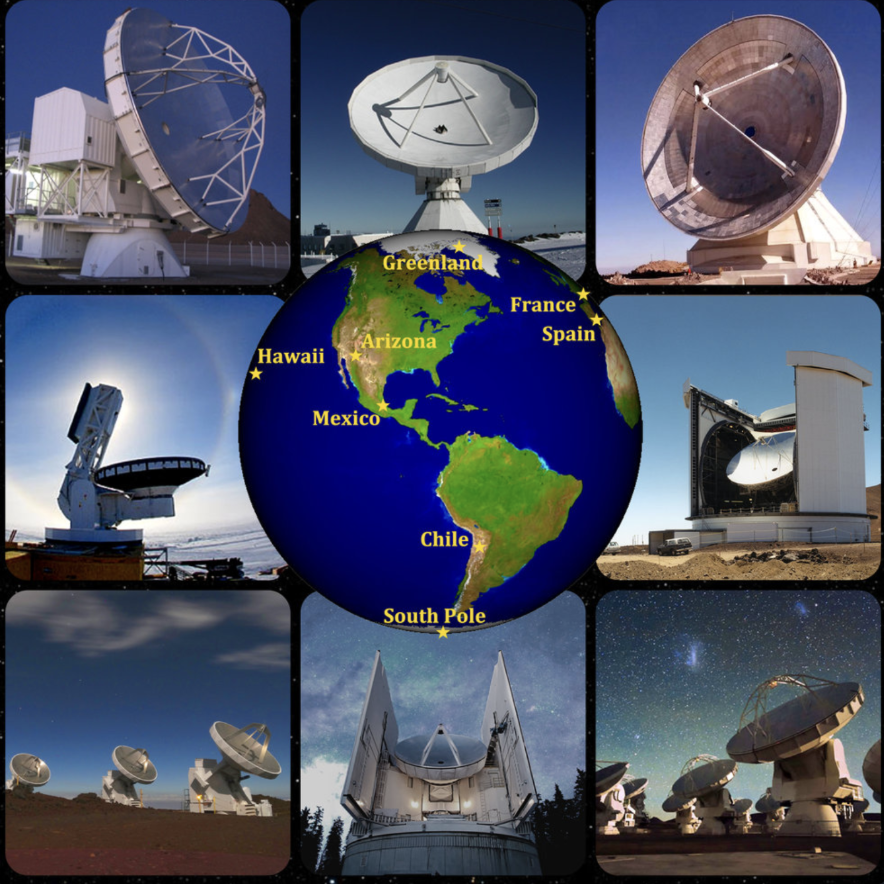
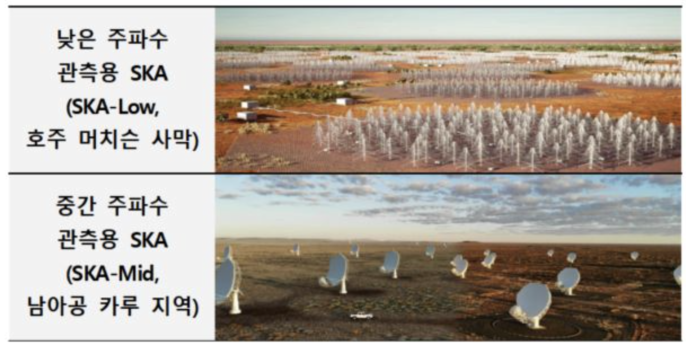
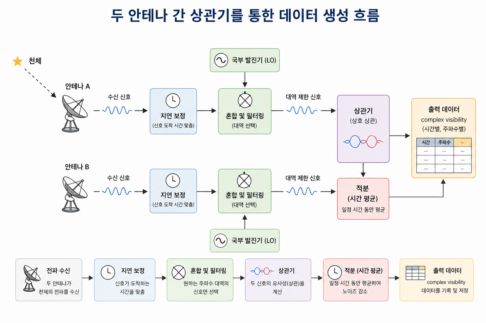

# 1. Basic Interferometer 

- 한 망원경의 구경을 크게하는 데는 한계가 있어 여러 대의 전파 망원경을 이용하여 전파를 서로 간섭시켜 하나의 전파 망원경으로 작동하는 시스템을 **전파 간섭계(Radio Interferometer)** 라고 한다. 
- 간섭계를 이루는 망원경들은 서로 완전히 떨어져 있다. (예: VLBI, VLA, EHT, KVN, EAVN)

{width="60%"}

- **배열(Array)**: 여러 대의 망원경이 지하의 케이블로 연결되어 있는 경우를 의미한다. 다른 표현으로 **connected array**라고 한다. (예: VLA, ALMA, LOFAR, SKA)
    - **Subarray**: 관측 시간에 따른 각각의 배열을 부르는 말이다. 예를 들어, A 시간대에는 VLA만 이용하고 B 시간대에는 VLA, ALMA를 같이 이용한다.

{width="60%"}

- **기선(Baseline)**: 간섭계에서 두 안테나 사이의 거리를 의미한다. 

---

## 1.1. Multipyling Interferometer 

- 간섭계에서는 전파 신호를 받아들이면 해당 신호를 원자 시계로 조정하여 모은 후, 데이터로 가공한다.  
- 간섭계에서는 두 안테나가 받은 전기 신호를 단순히 서로 더하는 것이 아니라, 서로 곱한 뒤 시간 평균을 낸다. 이러한 계산 방식을 **상관(correlation)** 이라고 한다. 
- 데이터가 만들어지는 과정을 대략적으로 나타내면 다음 그림처럼 나타낼 수 있다. 

---
# Reference 

- 1. [Andrew Chael, github](https://achael.github.io/_pages/imaging/)
- 2. ["블랙홀도 선명하게" 韓 국제거대전파망원경 건설 참여, hellodd.com](https://www.hellodd.com/news/articleView.html?idxno=107214) 

