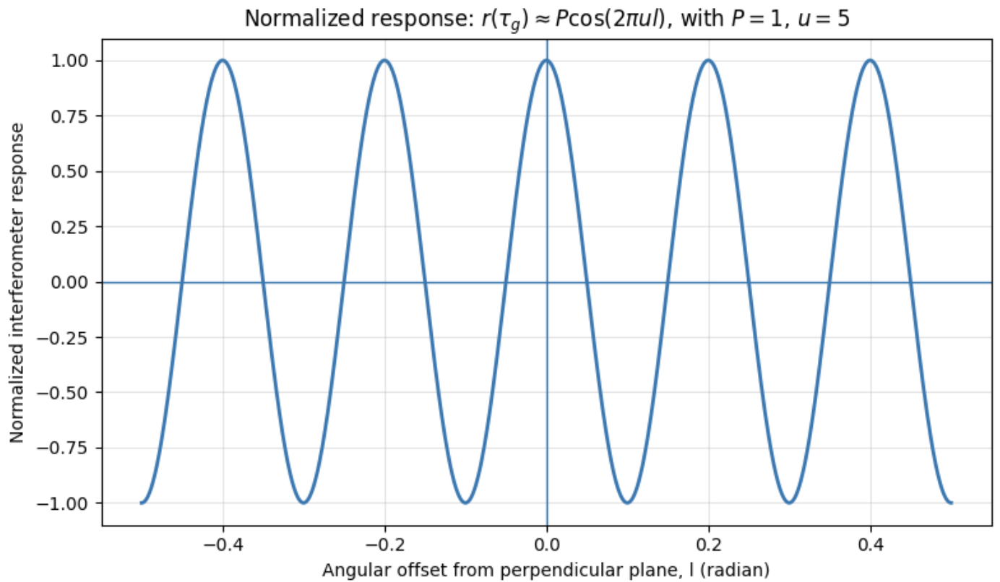
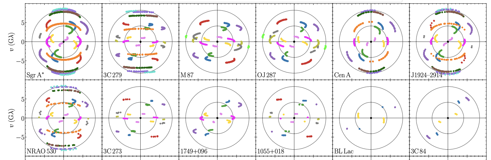

# 1. Basic Interferometer 

- 한 망원경의 구경을 크게하는 데는 한계가 있어 여러 대의 전파 망원경을 이용하여 전파를 서로 간섭시켜 하나의 전파 망원경으로 작동하는 시스템을 **전파 간섭계(Radio Interferometer)** 라고 한다. 
- 간섭계를 이루는 망원경들은 서로 완전히 떨어져 있다. (예: VLBI, VLA, EHT, KVN, EAVN)

{width="60%"}

- **배열(Array)**: 여러 대의 망원경이 지하의 케이블로 연결되어 있는 경우를 의미한다. 다른 표현으로 **connected array**라고 한다. (예: VLA, ALMA, LOFAR, SKA)
    - **Subarray**: 관측 시간에 따른 각각의 배열을 부르는 말이다. 예를 들어, A 시간대에는 VLA만 이용하고 B 시간대에는 VLA, ALMA를 같이 이용한다.

{width="60%"}

- **기선(Baseline)**: 간섭계에서 두 안테나 사이의 거리를 의미한다. 

---

## 1.1. Multipyling Interferometer 

- 간섭계에서는 전파 신호를 받아들이면 해당 신호를 원자 시계로 조정하여 모은 후, 데이터로 가공한다.  
- 간섭계에서는 두 안테나가 받은 전기 신호를 단순히 서로 더하는 것이 아니라, 서로 곱한 뒤 시간 평균을 낸다. 이러한 계산 방식을 **상관(correlation)** 이라고 한다. 
- 데이터가 만들어지는 과정을 대략적으로 나타내면 다음 그림처럼 나타낼 수 있다. 

---

## 1.2. One-Dimensional Source 

- 위상이 오는 방향, 즉, 천체에서 전파 신호가 오는 방향을 **phase reference position**이라고 한다. 다르게 말하면 안테나가 천체를 향하는 방향이다. 
- 다음 그림과 같은 상황을 고려해보자. 

{width="80%"}

- **Projected baseline**: 실제 두 안테나 사이의 baseline $D$ 를 전파 신호가 도달하는 방향에 수직인 평면에 투영한 길이를 의미한다. 
- 기하학적 지연 $\tau_g$ 는 "경로 길이 차이 / 전파 속도" 이므로 다음과 같이 나타낼 수 있다:

$$
\tau_g = \frac{D}{c}\sin \theta \tag{1.1}
$$

---

### 1.2.1. Fringe 

- 전파 간섭계에서 수신한 데이터를 상관기에서 상관처리하여 얻어낸 패턴을 **프린지(Fringe)** 라고 한다. 이는 상관 결과가 시간, 주파수, 또는 delay/rate 공간에서 보이는 간섭무늬의 진동 패턴이다. 
  - 상관(correlation) 과정에서 천체가 가진 적색이동(redshift) 등의 정보는 모두 동일하기 때문에, 상관 시, 고려해야할 요인은 기하학적 지연(geometric delay)만 남게된다. 
- 그림 4에서 상관(correlation) 후의 출력값을 유도해보자. 
- 그림 4에서 왼쪽의 안테나로 오는 신호가 기하학적 지연을 겪는다고 가정하자. 이때, 각 안테나에서 수신되는 전압은 다음과 같다: 

$$
V_1 = v_1 \cos(2\pi \nu(t -\tau_g)) \tag{1.2}
$$

$$
V_2 = v_2 \cos(2\pi \nu t) \tag{1.3}
$$

- $v_1$, $v_2$: 관측된 전압의 진폭
- $\nu$: 관측 주파수
- $t$: 관측 시간 
- 식 (1.2), (1.3)을 서로 곱하고 평균하면 다음과 같다:

$$
r(\tau_g) = <V_1 V_2> = \frac{1}{2}v_1 v_2 \cos(2\pi \nu \tau_g) \tag{1.4}
$$

- 식 (1.4)를 얻기 위해 삼각함수의 곱을 합으로 바꾸는 공식을 이용했으며, 충분히 긴 시간 동안 평균했다고 가정했다.
- 두 전파 망원경이 동일하다면 다음과 같이 식 (1.4)를 고쳐쓸 수 있다: 

$$
r(\tau_g) = <V_1 V_2> = \frac{1}{2}V^2 \cos (2\pi \nu \tau_g) \approx P \cos (\omega \tau_g) \tag{1.5}
$$

- $\omega = 2\pi \nu$: 각진동수

- 식 (1.5)에서 상관기 출력은 $\tau_g$ 에 따라 **사인형(sinusoidal)** 으로 진동한다. 왜냐하면 $\tau_g$ 가 baseline 길이 $D$ 와 천체 방향 $\theta$ 에 의존하기 때문이다.
  - $\theta$ 는 관측 시간동안 지구가 자전함에 따라 천체의 고도가 달라지면서 같이 변화한다.
- 여기서 **사인형의 출력 $(\cos(2\pi \nu \tau_g$ ))을 간섭계의 프린지(Fringe)** 라고 한다.

 

- 식 (1.5)에서 $l = \cos(\pi /2 - \theta) = \sin \theta$ 라고 하고 $u = D / \lambda$ 라고 두면 상관기의 출력은 다음과 같다:

$$
r(\tau_g) \approx P \cos(2\pi ul) \tag{1.6}
$$

- 식 (1.6)은 $u$ 와 $l$ 의 변화에 따라 진동한다. 이를 그림으로 나타내면 다음과 같다: 

{width="80%"}

- 위 그림에서 마루는 $2\pi u l = 2\pi n$ (단, $n$ 은 정수)을 만족해야 하므로 $l = n /u$ 이다. 이웃한 두 마루 사이의 간격은 다음과 같다: 

$$
\Delta l = l_{n+1} - l_n = \frac{n+1}{u} - \frac{n}{u} = \frac{1}{u} \sim \frac{\lambda}{D} \tag{1.7}
$$

- 즉, 식 (1.7)에 따르면 그림 5의 두 마루 사이의 간격은 **간섭계의 분해능**을 의미한다!
- 그림 5에서 $u = 5$이므로 만약에 관측 파장이 10cm라고 하면, 이 간섭계의 baseline $D$ 는 50cm 임을 알 수 있다. 
  - 간섭계의 분해능을 알고 관측 파장이 주어지면 두 전파 망원경의 baseline의 길이를 계산할 수 있다.
- **$u$ 가 더 커지면(분해능이 좋아지면) 프린지(fringe) 간격이 더 촘촘해지고 baseline 길이가 더 길다**는 것을 알 수 있다. 
- 프린지(fringe)는 물결 모양을 가지고 있어 마루와 골이 있다. 그래서 양수와 음수 영역을 모두 가지는데, 만약, 양수 영역에 대한 정보만 얻고 싶다면 위상 변화를 주어 보강 간섭을 일으키면 된다.

 

- 종종 논문에서 **Fringe spacing**이라는 표현이 나오는데, 이는 $\Delta l$ 을 원의 형태로 나타낸 것을 의미한다. 예를 들어서 $25{\rm \mu as}$, $50{\rm \mu as}$인 Fringe spacing은 간섭계의 각분해능을 아래 이미지와 같이 원의 형태로 나타낸 것이다. (아래 사진 참고)

---

# Reference 

- 1. [Andrew Chael, github](https://achael.github.io/_pages/imaging/)
- 2. ["블랙홀도 선명하게" 韓 국제거대전파망원경 건설 참여, hellodd.com](https://www.hellodd.com/news/articleView.html?idxno=107214) 
- 3. [Röder, J., Wielgus, M., Lobanov, A. P., et al. 2025, A multi-frequency study of sub-parsec jets with the Event Horizon Telescope, Astronomy & Astrophysics](https://arxiv.org/abs/2501.05518)

