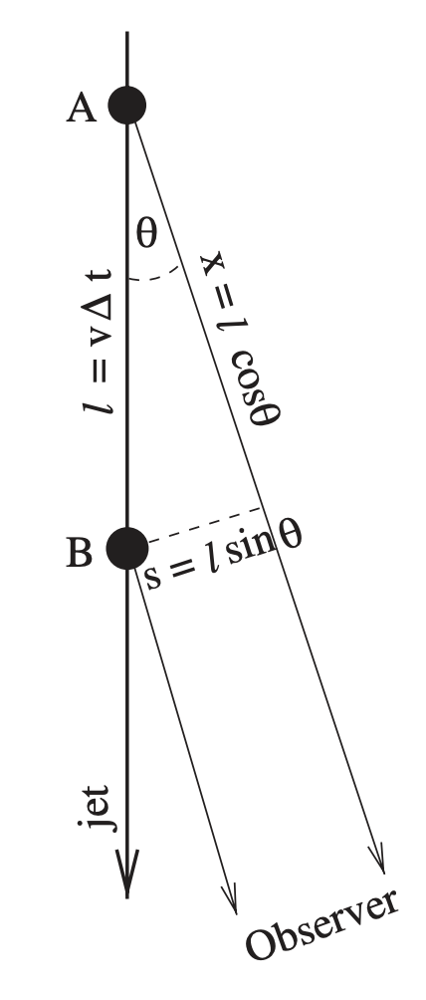
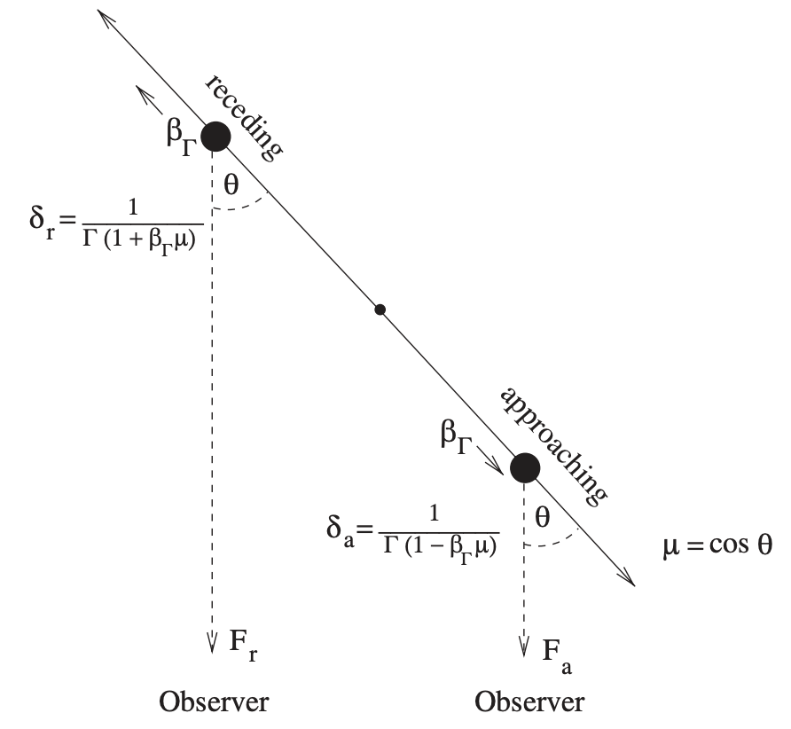

# 1. Superluminal motion  
- 로렌츠 인자($\Gamma$)는 상대론적 효과 정도를 나타낸다:

$$
\Gamma = \frac{1}{\sqrt{1-\beta^2}}, \qquad \beta = \frac{v}{c} \tag{1.1}
$$

- 식 (1.1)은 제트 물질이 실제 얼마나 빠르게 움직이는지를 보여준다. 
- 만약, 로렌츠 인자가 10정도이면 제트가 거의 가속을 마친 상태이다. 이때의 속도 $v$ 는 약 $v \sim 0.995c$ 로 계산된다. 

- 제트의 이동방향과 관측자 시선 방향 사이의 각도를 **viewing angle** 이라고 한다. 
- 초광속 운동을 알아보기 위해서 상황을 가정하자. 제트의 knot가 viewing anlge $\theta$ 를 이루며, A에서 B로 이동한다고 하자. (아래 그림 참고)

{width=150px}

- 이 상황에서 제트의 겉보기 횡방향 속도(apperent transverse velocity). 즉, 천구 상에서 옆으로 이동하는 것처럼 보이는 속도($v_{\perp,\mathrm{app}}$)는 아래와 같이 나타낼 수 있다:

$$
v_{\perp,\mathrm{app}} = \frac{s}{\Delta t_{\mathrm{obs}}} =\frac{v\sin\theta}{1-\beta\cos\theta}. \tag{1.2}
$$

- $s$: knot가 하늘면에 투영되어 이동한 거리. 즉, 원래 이동거리는 $l$ 인데, viewing angle의 효과로 인해 $s = l \sin \theta$ 가 된다.
- $\Delta t_{\mathrm{obs}}$: A에서 나온 빛과 B에서 나온 빛이 관측자에게 도착하는 시간 간격.
- $v$: 제트 knot의 실제 이동속도로 수평 성분과 수직 성분이 모두 포함되어 있다. 
- 그리고 식 (1.2)의 양변을 $c$ 로 나누면 다음과 같이 쓸 수 있다:

$$ 
\beta_{app} = \frac{\beta \sin \theta}{1 - \beta \cos \theta} \tag{1.3}
$$

- $v < c$ 의 조건을 만족하지만 $\theta$ 로 인해서 $\beta_{app}$ 가 1보다 크게 도출될 수 있다. 이렇게 "겉보기에 빛의 속도를 넘어가는 제트의 방출"을 **초광속 운동(superluminal motion)** 이라고 한다. 
- 그리고 자주 사용하는 또 다른 물리량인 **Doppler factor** 를 다음과 같이 정의할 수 있다:

$$
\delta = \frac{1}{\Gamma(1 - \beta \cos \theta)} \tag{1.4}
$$

*** 

## 1.1. Two-Sided Jets 

- **Two-Sided Jets** 는 상대론적 제트의 양쪽이 모두 고분해능 전파 관측으로 영상화되어서 다가오는 성분(approaching jet component)과 후퇴하는 성분(receding jet component)를 모두 가지는 경우를 의미한다. 
- 관측 주파수가 존재하고 다가오는 성분의 플럭스를 $F_a$, 후퇴하는 성분의 플럭스 $F_r$ 을 각각 측정한다고 가정하자. (아래 그림 참고)

{width=600px}

- **가정**: 다가오는 성분과 후퇴하는 성분 모두 rest frame에서 동일한 전파 광도를 등방적으로 방출하며, 제트를 따라 서로 반대 방향으로 동일한 속도로 운동한다. 즉, comoving frame에서의 플럭스를 $F_0$ 라고 하자. 그렇다면 관측되는 플럭스는 다음과 같이 기술할 수 있다:

$$
F_{a,r}=F_0 \delta_{a,r}^{3+\alpha},  \tag{1.5} 
$$

- $\alpha$: 전파 스펙트럼의 spectral index 
- 각 성분의 doppler factor는 다음과 같다:

$$
\delta_a=\frac{1}{\Gamma(1-\beta\mu)}, \qquad   \delta_r=\frac{1}{\Gamma(1+\beta\mu)},  \tag{1.6}
$$

- $\mu = \cos \theta$ 
- 이제 두 성분의 플럭스 비를 $F_a / F_r$ 이라고 하면 다음의 관계를 얻을 수 있다:

$$
r \equiv \left(\frac{F_a}{F_r}\right)^{1/(3+\alpha)}, \qquad  \frac{1+\beta\mu}{1-\beta\mu} = r, \tag{1.7}
$$

수학적 유도를 거치면 Two-Sided Jets에 대해서 다음과 같은 물리량을 얻을 수 있다:

$$
\beta=\frac{\sqrt{4\beta_{\perp,\mathrm{app}}^2+(r-1)^2}}{r+1}  \tag{1.8}  
$$

$$
\Gamma=\frac{r+1}{2\sqrt{r-\beta_{\perp,\mathrm{app}}^2}}  \tag{1.9} 
$$

$$
\mu=\cos\theta=\frac{r-1}{\sqrt{4\beta_{\perp,\mathrm{app}}^2+(r-1)^2}}  \tag{1.10}
$$

- 만약 viewing angle이 $\pi /2$ 라면, 즉, 제트를 정확히 직각으로 관측하면 $\mu =0$ 이므로 Doppler boosting 효과는 두 knot에 대해서 동일하므로 $r =1$ 이 된다. 그리고 이 상황에서는 관측된 겉보기 횡방향 운동이 knot의 실제 속도와 같으므로, $\beta=\beta_{\perp,\mathrm{app}}$ 이 성립한다. 
    - **Doppler Boosting**: 상대론적으로 빠르게 움직이는 방출 영역이 관측자 쪽으로 접근할 때, 그 영역이 원래 방출한 것보다 더 밝고 강하게 관측되는 현상. 이는 (1) 관측자 쪽으로 진행하는 광자의 에너지 증가, (2) 광자가 관측자에게 도착하는 시간 간격의 감소, (3) Relativistic beaming effect로 인해 발생하는 광자의 방향 쏠림 현상이 합쳐진 결과이다.
    - **Doppler deboosting**: 이는 Doppler Boosting과 반대로 상대론적으로 움직이는 방출 영역이 관측자로부터 멀어질 때, 그 영역의 복사가 원래보다 더 어둡고 약하게 관측되는 현상이다. 즉, 복사가 후퇴하는 제트 방향으로 집중되어 관측자에게 도달하는 복사가 줄어든다. 

*** 
### 1.1.1. Two-Sided Jets Discussion 
- 위 논의에서 다가오는 성분과 후퇴하는 성분의 intrinsic 광도와 속도가 같다는 가정은 문제를 지나치게 단순화할 수 있다. 
- 외부은하 전파 제트의 초광속 성분들은 일반적으로 pc에서 kpc에서 이르는 물리적 규모에서 분해되어 관측된다. 
- 따라서 다가오는 성분과 후퇴하는 성분에서 오는 빛의 이동 시간 차이는 수십 년에서 수천 년 정도일 것으로 예상된다. 
    - 이는 우리(관측자)는 다가오는 성분이 후퇴하는 성분에서 관측되는 것보다 훨씬 이후의 진화 단계에서 보고 있을 수 있다는 것을 시사한다. 

<!-- --> 

- 단순히 초광속 운동에 대한 정보만 안다면 식 (1.3)에서 볼 수 있듯이 미지수 $\beta(\Gamma)$, $\theta$ 에 대한 값을 정확히 알 수 없다. 
- 만약, Doppler factor($\delta$)를 초광속 운동과는 별개의 관측 또는 물리적 방법으로 추정해서 그 값을 얻어냈다면, 이제 (1) 초광속 운동에 대한 정보와 (2) Doppler factor에 대한 정보를 알게 되어 $\beta(\Gamma)$, $\theta$ 를 얻어낼 수 있다. 즉, 식 2개에 미지수 2개인 연립 방정식의 해를 구하는 것과 같다. 수학적 계산을 거치면 그 해는 다음과 같이 얻을 수 있다:

$$
\Gamma=\frac{\beta_{\perp,\mathrm{app}}^{2}+\delta^2+1}{2\delta}  \tag{1.11}
$$

$$
\theta=\arctan\left(  \frac{2\beta_{\perp,\mathrm{app}}}  {\beta_{\perp,\mathrm{app}}^{2}+\delta^2-1}  \right).  \tag{2.12}  
$$

*** 

## 1.2. One-Sided Jets 
- 강한 Doppler boosting 효과 때문에, 많은 외부은하 전파 제트에서는 다가오는 제트만 검출될 수 있다. 왜냐하면, 후퇴하는 제트(다른 표현으로 **counter-jet**)는 우리의 시선 방향에서 강하게 Doppler deboosting 되기 때문이다.
- 이렇게 Doppler boosting 효과로 인해, 한 방향의 제트만 보이는 제트를 **One-Sided Jets**라고 한다.

***

## 1.3. Superluminal motion Discussion 
- 보다 엄밀히 식 (1.5)에 대해서 논의해보자. 로렌츠 변환(Lorentz transformations)을 적용하면, 관측된 플럭스 밀도를 $S_0$ 라고 하면, 제트 성분의 intrinsic 플럭스 밀도 $S_e$ 와 $\delta^{n-\alpha}$ 만큼의 차이가 나타난다. (Scheuer 및 Readhead, 1979 참조)
    - 여기서 $\delta$ 는 Doppler factor, $\alpha$ 는 spectral index이다. 그리고 $n$ 은 2와 3사이의 값을 가진다. 

*** 

# Reference 
- 최승언 교수의 천체지구과학 강의 II 
- Relativistic Jets from Active Galactic Nuclei Markus Böttcher et al. 

