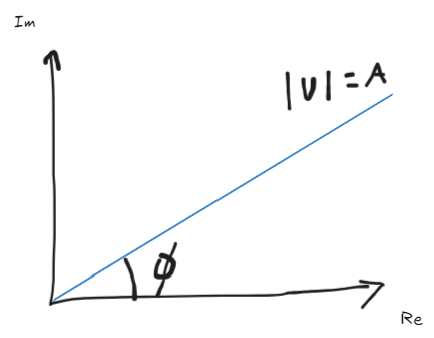

# 1. Complex Visibility 

- 전파 간섭계를 이용하면 서로 다른 안테나에서 얻은 전압 신호가 존재하게 된다. 간섭계 상의 두 안테나에서 얻은 전압 신호의 상대적인 진폭과 위상 관계를 표현하기 위해 **complex visibility**를 이용한다. 가장 간단한 visibility 표현은 다음과 같다: 

$$
V = R_c - iR_s = A e^{-i\phi} \tag{1.1}
$$

- $V$: visibility 
- $R_c$: 상관기에서 얻어낸 visibility의 실수 성분
- $R_s$: 상관기에서 얻어낸 visibility의 허수 성분
- $A$: visibility의 진폭(amplitude)
- $\phi$: visibility의 위상(phase)
- 식 (1.1)은 실수부와 허수부를 나눌 수 있으므로 이를 복소 공간 상에 그리면 아래의 그림과 같다. 

{width=50%}

- 위 그림을 통해서 다음의 관계식을 도출할 수 있다:

$$
|V| = A = \sqrt{Re^2 + Im^2} = \sqrt{R_c^2 + R_s^2} \tag{1.2}
$$

$$
\phi = \arctan (\frac{Im}{Re}) = \arctan(\frac{R_s}{R_c}) \tag{1.3}
$$

- 식 (1.1)을 좀 더 일반화해보자. 천체의 밝기 분포(brightness distribution)를 $I(\vec{s})$ 라고 하면 상관기의 출력을 2차원으로 확장할 수 있는데, 이는 다음과 같이 표현된다:

$$
r = \iint I(\vec{s}) \cos (2\pi \nu \frac{\vec{D} \cdot \vec{s}}{c})d\Omega \tag{1.4}
$$

- $r$: visibility 
- $\vec{D}$: **baseline vector**로 안테나 1과 안테나 2의 위치 벡터를 각각 $\vec{r}_1$, $\vec{r}_2$ 라고 할 때, $\vec{D} = \vec{r}_2 -\vec{r}_1$ 로 정의된다. 
- $\vec{s}$: 관측자가 바라보는 하늘의 특정 위치를 가리키는 **방향 단위벡터(unit direction vector)** 이다. 
- 엄밀히 말해, 천체의 밝기 분포를 포함하고 상관의 결과로 얻어내는 복소수 관측량을 **complex visibility** 라고 한다. 
- 상관기 출력에는 **cosine term**과 **sine term**이 함께 포함되는데, 각각은 다음과 같이 표현된다:

$$
r(\tau_g) = <V_1 V_2> = \frac{1}{2}v_1 v_2 \cos(2\pi \nu \tau_g) = R_c \tag{1.5}
$$

$$
r(\tau_g) = <V_1 V_2> = \frac{1}{2}v_1 v_2 \sin(2\pi \nu \tau_g) = R_s \tag{1.6}
$$

- $\tau_g$: 기하학적 지연(geometric delay) 
- $v_{1,2}$: 안테나 1과 안테나 2에서 수신한 전압 신호의 진폭

---

# 2. Complex visibility for Extended Source 

- 전파원이 점광원이 아닌 경우, 그 전파원의 각기 다른 부분에서 방출되는 전파 복사가 안테나로 들어올 때, 위상차이가 나타난다. 
- 이 경우, 간섭무늬 최솟값은 0이 아니면 양의 $P_{\rm min}$ 을 가진다. 만약 간섭무늬의 최댓값을 $P_{\rm max}$ 라고 하면 전파원 크기의 척도(**fringe visibility**)는 다음과 같다:

$$
\frac{P_{\rm max} - P_{\rm min}}{P_{\rm max} + P_{\rm min}} \tag{2.1}
$$

---

# 3. Complex visibility Discussion 

- 식 (1.1)을 보면 visibility를 나타내는 지수항에 $A$, $\phi$ 가 함께 포함되지 않아 보정 과정에서 **진폭과 위상을 따로 보정**할 수 있음을 알 수 있다. 
    - 각 visibility는 복소수 값을 가지며, baseline을 반전하면 복소켤레 관계를 따른다: $V_{ij}=V_{ji}^{*}$
- 계산된 visibility는 thermal noise, station-dependent errors, baseline-dependent errors 등에 의해 오염되어 있다.
- 간섭계에서는 우주에서 온 전파 신호를 전압으로 바꾸고 이를 이용하여, complex visibility를 얻어낸다. 그리고 이러한 visibility에 나타나는 진폭과 위상 정보는 대기, 기기 오차 등에 의해서 영향을 받게 되는데, 이러한 영향을 제거하기 위해서 보정(calibration) 과정을 거친다. 보정된 자료로부터 천체에서 온 실제(true) complex visibility를 얻고 이를 푸리에 변환하면 천체의 Intensity 정보를 도출할 수 있다. (자세한 내용은 점차 알게 될 것이다)
