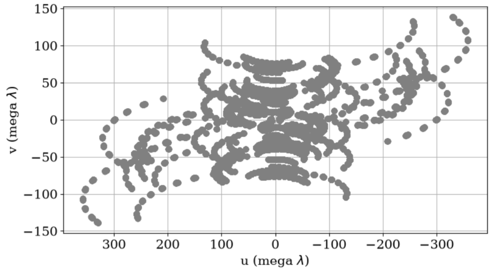

# 1. 안테나 공간 좌표계(Antenna Spacing Coordinates)

- 전파 망원경의 배열(array) 내 안테나들의 상대적 위치를 지정하기 위해 아래 그림과 같은 **오른손 좌표계(right-handed Cartesian coordinate system)** 를 이용한다. 

![**그림 1**: 위 그림은 오른손 좌표계를 나타낸다. $X$, $Y$ 는 지구 적도와 평행한 평면에서 측정된다. $X$ 축은 자오면(meridain plane) 안에 놓이며, VLBI 관측에서는 $X$ 축 방향을 그리치니 자오면 쪽을 향하는 방향으로 설정하는 것이 관례이다. 이때, 자오면은 지구의 양극과 배열 내의 기준점을 지나는 평면으로 정의된다. | 출처: [1]](cartesian.png){width="60%"}

- $Y$ 축의 경우, 동쪽을 향하고, $Z$ 축은 북극 방향을 향한다. 각 좌표를 시간각(hour angle) $H$ 와 적위 $\delta$ 의 관점에서 바라보면 좌표 $(X, Y, Z)$ 는 각각 $(H=0,\ \delta=0)$, $(H=-6^{\mathrm h},\ \delta=0)$, $(\delta=90^\circ)$ 방향을 향해 측정된다.
    - **시간각(hour angle)**: 자오선에서 시계방향으로 측정되는 값이다.
- 만약 $(X_\lambda,Y_\lambda,Z_\lambda)$ 가 $(X,Y,Z)$ 좌표계에서 $\mathbf{D}_\lambda$ 의 성분이라면 $(u,v,w)$ 성분은 다음과 같이 주어진다:
    - 단, $X_{\lambda} = X / \lambda$ 는 두 안테나 사이의 $X$ 방향 간격을 파장 단위로 나타낸 것이며, $\mathbf{D}_\lambda$ baseline 벡터(vector) $\mathbf{D}$ 를 파장 $\lambda$ 로 나눈 값이다.

$$
\begin{bmatrix}  
u\\  
v\\  
w  
\end{bmatrix}
=
\begin{bmatrix}  
\sin H & \cos H & 0\\  
-\sin\delta\cos H & \sin\delta\sin H & \cos\delta\\  
\cos\delta\cos H & -\cos\delta\sin H & \sin\delta  
\end{bmatrix}  
\begin{bmatrix}  
X_\lambda\\  
Y_\lambda\\  
Z_\lambda  
\end{bmatrix}.  \tag{1.1}
$$

- 식 (1.1)에서 $(H,\delta)$ 는 phase reference position의 시간각과 적위를 나타낸다.
- 변환 행렬의 원소들은 $(X,Y,Z)$ 축에 대한 $(u,v,w)$ 축의 방향 코사인(direction cosines)이며, 아래의 그림에서 유도된다.

![**그림 2**: $(X,Y,Z)$ 좌표계와 $(u,v,w)$ 좌표계 사이의 관계. $(u,v,w)$ 좌표계는 시간각 $H$ 와 적위 $\delta$ 를 갖는 점 $S$ 방향의 관측을 위해 정의된다. | 출처: [1]](uvwcoord.png){width="80%"}

- baseline 벡터를 나타내는 방법은 baseline의 길이 $D$ 와 baseline 방향을 무한히 연장하여 천구와 만나는 임의의 좌표를 시간각과 적위 $(h,d)$ 를 이용하여 나타내는 것이다. 이 경우, $(X,Y,Z)$ 좌표계 좌표는 다음과 같이 주어진다:

$$  
\begin{bmatrix}  
X\\  
Y\\  
Z  
\end{bmatrix}
=
D  
\begin{bmatrix}  
\cos d \cos h\\  
-\cos d \sin h\\  
\sin d  
\end{bmatrix}.  \tag{1.2}
$$

- 그리고 $(u,v,w)$ 좌표계에서 좌표는 식 (1.1)과 (1.2)로부터 다음과 같이 얻어진다:

$$  
\begin{bmatrix}  
u\\  
v\\  
w  
\end{bmatrix}
=
D_\lambda  
\begin{bmatrix}  
\cos d\sin(H-h)\\  
\sin d\cos\delta-\cos d\sin\delta \cos(H-h)\\  
\sin d\sin\delta+\cos d\cos\delta \cos(H-h)  
\end{bmatrix}.  \tag{1.3}
$$

- 식 (1.1) 또는 식 (1.3)을 살펴보면, projected 안테나 간격 성분 $u$ 와 $v$ 의 자취는 시간각을 변수로 하는 타원을 정의한다. phase reference position의 시간각과 적위를 $(H_0,\delta_0)$ 라고 하면, 식 (1.1)에서 다음을 얻을 수 있다: 

$$  
u^2  
+  
\left(  
\frac{v-Z_\lambda\cos\delta_0}  
{\sin\delta_0}  
\right)^2
=
X_\lambda^2+Y_\lambda^2.  \tag{1.4}
$$

- $(u, v)$ 평면(plane)에서 식 (1.4)는 장반경이 $\sqrt{X_\lambda^2+Y_\lambda^2}$ 이고, 단반경이 $\sin\delta_0\sqrt{X_\lambda^2+Y_\lambda^2}$ 인 타원을 정의한다. 이를 그림으로 나타내면 아래와 같다.

![**그림 3**: 타원의 중심은 $v$ 축 위의 $(u,v)=\left(0,Z_\lambda\cos\delta_0\right)$ 에 위치한다. 관측 중 실제로 추적되는 타원의 호는 baseline의 방위각, 고도, 전파원의 적위, 그리고 관측된 시간각에 따라 달라진다. | 출처 [1]](ellipse.png){width="60%"}

- complex visibility는 $\mathcal{V}(-u,-v)=\mathcal{V}^{*}(u,v)$ 이므로, 하나의 관측은 항상 두 개의 호에 대한 측정을 동시에 제공한다. 
    - 단, 이 두 호는 $Z_\lambda=0$ 인 경우에만 동일한 타원의 일부가 된다. 

---

# 2. UV-Plane

- 천체 입장에서 망원경의 분포를 보면 다양한 점으로 찍힌다. 이때, 각 점은 complex visibility에 해당하며, 이러한 visibility의 모임을 **uv-plane** 이라고 한다. uv-plane 이미지는 **전체 관측 시간 동안 망원경이 움직이는 경로**를 보여준다. 
- 앞선, 1. 안테나 공간 좌표계(Antenna Spacing Coordinates)의 논의를 이용하면 2개의 전파 망원경이 동서 방향으로 배열되어 지구 표면에서 자전하는 경우와 2개의 전파 망원경이 남북 방향으로 배열되어 지구 표면에서 자전하는 경우를 다음과 같이 그릴 수 있다. 

![**그림 4**: 오른쪽 그림이 **uv-plane**이며, 이는 source가 $w$ 축 방향에 있고 "source 기준 좌표계에서 지구의 망원경이 움직이는 궤적"을 보여준다. | 출처: [2]](uv-plane.png){width="80%"}

- 일반적으로 uv-plane을 그릴 때, $u$ 축은 반전되서 나타난다. 

{width="50%"}

- 위 그림을 보면, uv-plane은 모든 간섭계 배열에 대해서 채울 수 없다. 왜냐하면 지구의 자전으로 인해 망원경이 천체를 계속 관측할 수 없기 때문이다. 
- 이를 보완하기 위해 배열에 더 많은 망원경을 추가하거나 source 관측 시간을 최대 12시간까지 늘려서 uv-plane을 개선할 수 있다. 

- $(u,v,w)$ 좌표계를 나타내기 위해 다음과 같이 식을 나타내보자.

$$
\frac{\mathbf{B}}{\lambda} = (u,v,w) \tag{2.1}
$$

- $\mathbf{B}$: baseline 벡터
- $\lambda$: 관측 파장
- baseline 벡터를 성분 표기로 나타내면 다음과 같다:

$$
\mathbf{B} = B_u \mathbf{\hat{u}} + B_v \mathbf{\hat{v}} + B_{w}\mathbf{\hat{w}} \tag{2.2}
$$

- 식 (2.2)를 통해 식 (2.1)을 다시 나타내면 다음과 같다:

$$
u = \frac{B_u}{\lambda}, \qquad v =\frac{B_v}{\lambda}, \qquad w= \frac{B_w}{\lambda} \tag{2.3}
$$

- 식 (2.3)은 $(u,v,w)$ 좌표계에 대한 표현이며, 각 축은 **공간 주파수**에 해당한다. 
- VLBI는 각 망원경 쌍이 측정한 complex visibility를 이용해 하늘 밝기 분포의 푸리에(Fourier) 정보를 모은다. uv-plane이 좋을수록 이미지가 개선된다.

---

# 3. Parallactic Angle

- **Parallactic angle**: 하늘에서 관측자의 수직 방향이 북쪽으로부터 동쪽 방향으로 얼마나 회전해 있는지를 나타내는 위치각으로 아래 그림에서 $\psi_p$ 로 정의된다. 

![**그림 6**: 삼각형 ZSP에서 $\psi_p$ 는 parallactic angle로 정의된다. 여기서 $Z$ 는 관측자의 천정, $P$ 는 천구의 북극, $S$ 는 관측 대상이다. | 출처: [1]](parallactic.png){width="60%"}

- 대부분의 안테나는 고도-방위각(alt-az) 방식이라서 천체가 뜨고 지는 동안 $\psi_p$ 는 변한다. 이러한 변화는 데이터에서 반드시 보정되어야 한다.

---

# Reference 

- $1.$ Interferometry and Synthesis in Radio Astronomy A. Richard Thompson et al. 
- $2.$ [Baseline projection and uv-coverage](https://youtu.be/Al7M9lXaujw?si=frcrb2f4xldSZl3J)