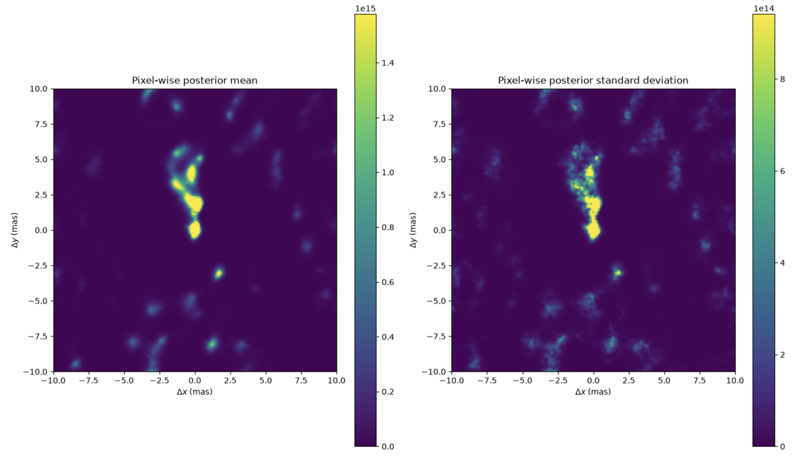
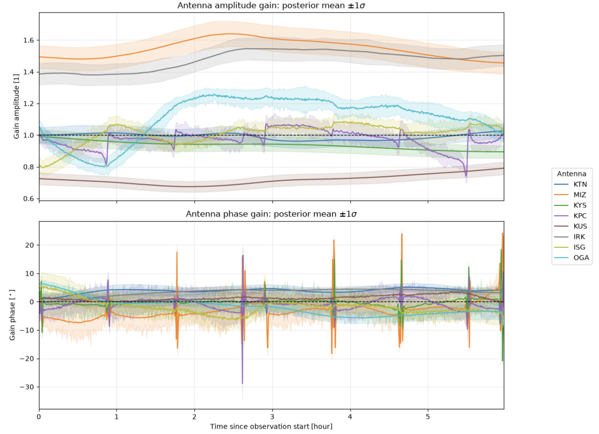

# 1. resolve, Bayesian inference and Bayesian Imaging 

- Boolean logic은 어떤 명제가 완전히 참이거나 완전히 거짓인 경우에는 잘 작동한다. 
- 예를 들어, 전파 간섭계 영상에서 어떤 희미한 구조를 보았다. 이때, Boolean logic을 이용하면 (1) True: 실제 구조이다, (2) False: 잡음이다. 라는 단, 2개의 선택지 중 하나만을 골라야 한다. 
- 하지만, 실제로는 $P(\text{실제구조} | \text{관측 데이터}) = 0.8$ 라고 이야기하고 싶을 수 있다. 즉, "관측 데이터를 고려했을 때 실제 구조일 확률이 80%이다"라는 식으로 불확실성 정도를 표현하고 싶을 수 있다.
- **데이터 분석에서 이러한 불확실성 추정을 포함하려면 Bayesian inference**를 이용해야 한다.
- Bayesian inference에서는 관측 전에 가지고 있는 사전 지식(priori, $B$)와 관측 데이터 정보를 분석하여 얻은 사후 지식(posterior, $A$)을 통해 사후확률을 계산한다:

$$
P(A |B) = \frac{P(B|A) P(A)}{P(B)} \tag{1.1}
$$

---

## 1.1. Bayesian Imaging

- 베이즈 정리는 불완전한 visibility 데이터 $V_{ij}(t)$ 로 부터 하늘 $I(x,y)$ 에 대한 posterior probability distribution을 생성한다.
- 베이즈 정리를 통해서 전파 간섭계 데이터를 이미징하는 작업을 **Bayesian Imaging**이라고 한다. (Junklewitz et al. 2015; Broderick et al. 2020; Arras et al. 2021; Tiede 2022)
- Bayesian Imaging은 관측 데이터로부터 생성할 수 있는 "가능한 이미지들의 확률 분포"를 제공한다. 이렇게 재구성된(reconstructed) 이미지를 **posterior**라고 한다. 그리고 그 때의 분포를 **posterior distribution**이라고 한다.
- 관측 데이터 $V$가 주어질 때, 이미지의 posterior distribution $I$는 prior distribution과 베이즈 이론의 likelihood를 통해 다음과 같이 주어진다:

$$
\mathcal{P}(I|V)=\frac{\mathcal{P}(V|I)\mathcal{P}(I)}{\mathcal{P}(V)} \tag{1.2}
$$

- $\mathcal{P}(V|I)$: likelihood, 어떤 모델 $I$ 가 주어졌을 때, 현재 관측 자료 $V$ 가 실제로 나타날 확률을 의미한다. 
- $\mathcal{P}(I)$: prior distribution
  - uv-coverage는 불완전하므로 이미징을 하기위해서 source 구조와 기기 효과에 대한 추가적인 가정이 필요하다. 이때 사용되는 가정들을 베이지안 통계에서 **사전 지식(prior knowledge)** 라고 한다.
- $\mathcal{P}(V) = \int \mathcal{D} I \mathcal{P}(V | I) \mathcal{P}(I)$: 관측 데이터 $V$ 가 주어졌을 때, 모든 가능한 이미지에 대한 posterior 확률의 총합이 1이 되도록 정규화하는 역할을 수행한다. 이를 **evidence**라고도 부른다.
  - Bayesian Imaging 맥락에서 evidence는 모든 가능한 이미지들의 공간에 대한 적분을 포함한다. 그래서 $\int \mathcal{D}I \dots$ 은 경로 적분(path integral)으로 볼 수 있다.
- 얻어낸 $\mathcal{P}(I|V)$ 의 차원은 매우 크기 때문에 일반적으로 **posterior mean**, **posterior standard deviation**을 얻게된다. 

- Bayesian Imaging에서도 CLEAN, eht-imaging과 유사하게 gain을 추정한다. 이러한 gain은 likelihood에 포함된다: $\mathcal{P}(V | g,I)$
- gain과 sky에 대한 **joint posterior distribution**을 다음과 같이 나타낼 수 있다:

$$
\mathcal{P}(g,I\mid V) = \frac{\mathcal{P}(V\mid g,I)\,\mathcal{P}(g,I)} {\mathcal{P}(V)} \tag{1.3}
$$

- $\mathcal{P}(V) = \int \mathcal{D} I \int \mathcal{D} g \mathcal{P}(V,g,I)$: joint evidence 
- ${\mathcal{P}(g,I)} = \mathcal{P}(g) \mathcal{P}(I)$: joint prior 
- $\mathcal{P}(g,I\mid V)$ 에서는 posterior mean, posterior standard deviation도 얻을 수 있지만, 각 안테나에 대해서 posterior gain 평균과 표준편차도 구할 수 있다. 

- Bayesian Imaging은 다음의 이점을 가진다:
- $1.$ 사전 지식으로 사용할 수 있는 source 정보, 기기에 대한 정보, closure quantities 등을 명시적으로 이미지 재구성에 이용할 수 있다. 
- $2.$ 재구성된 이미지를 통해서 **불확실성**을 추정할 수 있으며, 이를 이용하여 결과에 대한 reliability를 정량화할 수 있다.

---

## 1.2. Likelihood distribution 

- gain 벡터 $g$ 와 이미지 벡터 $I$ 를 구성하는 모든 개별 원소를 모은 **signal vector**를 $s = (g,I)$ 라고 하자. 그리고 관측 데이터 $d$ 에서 얻어낸 visibility를 $V$ 라고 하자. 
- 관측 데이터에 포함된 잡음(noise) $n$ 에 대한 확률 분포는 근사적으로 가우시안 분포로 주어진다. 이는 S/N 향상 및 계산의 최적화를 위해서 설정된다. 
- 잡음 $n$ 이 공분산(covariance) $N$ 을 가지는 가우시안 분포라면 다음과 같이 쓸 수 있다:

$$
n \curvearrowleft \mathcal{G}(n,N) = \frac{1}{\sqrt{|2\pi N|}} e^{-\frac{1}{2}n^\dagger N^{-1}n} \tag{1.4}
$$

- $|2\pi N|$: 잡음 공분산의 행렬식 
- 이제 likelihood distribution $\mathcal{P}(d | s)$ 는 다변량의(multivariate) 가우시안 분포로 쓸 수 있다: 

$$
\mathcal{P}(d|s)=\mathcal{G}\left(V-R^{(g)}I,N\right) \tag{1.5}
$$

- $R$ 은 $R \equiv R^{(g)}$ 로 정의되는 **response function**이다. 이는 $I$ 를 모델 visibility로 바꿔주는 역할을 한다. 
- 일반적으로 실제 계산에서는 매우 작은 확률들을 여러 번 곱하기 때문에 likelihood distribution에 음의 로그를 씌운 **Information Hamiltonian**을 이용한다:

$$
\mathcal{H}(d|s)=-\ln\left(\mathcal{P}(d|s)\right)
$$

$$
=\frac{1}{2}\left(V-R^{(g)}I\right)^\dagger N^{-1}\left(V-R^{(g)}I\right) +\frac{1}{2}\ln|2\pi N| \tag{1.6}
$$

- 잡음을 다룰 때, 잡음 간에 나타나는 correlation은 무시한다: $\rm {Cov}(n_i, n_j) = 0 \ (i \neq j)$.
  - 이는 계산의 복잡성을 줄이기 위함이다.
  - 다른 표현으로 하면, 잡음 공분산은 $N_{ij} = \delta_{ij} \sigma_i^2$ 을 만족하는 대각 행렬이다. 수학적으로 표현하면 다음과 같다:

$$
N=  
\begin{pmatrix}  
\sigma_1^2 & 0 & \cdots & 0\\  
0 & \sigma_2^2 & \cdots & 0\\  
\vdots & \vdots & \ddots & \vdots\\  
0 & 0 & \cdots & \sigma_M^2  
\end{pmatrix}
$$

- 그리고 잡음이 baseline 길이가 달라짐에 따라 급격하게 변하지 않도록 하기 위해서 다음과 같이 둔다: 

$$
\sigma_i = \sigma_{\rm th} \alpha(b_i) \tag{1.7}
$$

- $\sigma_i$: 각 visibility의 불확실성
- $\sigma_{\rm th}$: 관측 데이터로 얻어낸 열적 잡음(thermal noise)
- $\alpha(b_i)$: baseline 길이에 따라 달라지는 잡음 보정 계수

- 이러한 맥락에서 잡음 $n$ 은 데이터 벡터의 개별적인 한 점에서 주어진다. 그러므로, likelihood Hamiltonian은 데이터 재현도(data fidelity) 항으로 볼 수 있다:

$$
\mathcal{H}(d|s) = \frac{1}{2}\sum_n \frac{\left|V_n-\left(R^{(g)}I\right)_n\right|^2}{\sigma_n^2} = \frac{1}{2}\chi^2 \tag{1.8}
$$

- sky, gain의 posterior distribution에 대한 추정을 위해서 **Metric Gaussian Variational Inference method(MGVI)** (Knollmüller & Enßlin 2019)를 이용한다.

---

## 1.3. resolve Algorithm

- 지금까지 논의했던 Bayesian Imaging을 수행하는 소프트웨어가 **resolve**이다. 
- 앞선 내용을 보면, 전파 간섭계에서 Bayesian imaging은 하나의 이미지를 제시하는 대신, 잡음을 고려하여 관측 데이터 및 사전 가정(prior assumptions)과 일치하는 가능한 이미지들의 표본을 제공하는 확률론적 접근법으로 볼 수 있다.
- resolve는 CLEAN 알고리즘의 한계를 보완하기 위해서 등장했다. 
	- CLEAN이 residual image에서 가장 밝은 peak를 반복적으로 찾아 점광원 성분(CLEAN component)을 추가하는 방식이라면, resolve는 (1) 가능한 하늘 밝기 분포, (2) 각 안테나의 gain, (3) 영상의 공간적 상관구조를 함께 확률적으로 추론한다. 
- resolve의 궁극적인 목적은 관측 visibility와 일치하면서, 물리적으로 가능한 하늘 밝기 분포의 posterior distribution을 구하는 것이다.
- resolve는 기본적으로 베이지안 이미징을 채택하여 super-resolution에 도달할 수 있다.

---

## 1.4. resolve sky model

- resolve에서 하늘 모델(sky model)을 어떻게 설정하는지 살펴보자. 
- 하늘 모델(sky model)에서 픽셀 간의 공간적 상관관계는 비모수적 가우시안 커널(non-parametric Gaussian kernel)을 이용하여 추론된다. (Arras et al. (2021))
- 그럼 우선, 비모수적 가우시안 커널부터 살펴보자.
- resolve에서는 실제 하늘 밝기(sky brightness)를 다음과 같이 둔다: 

$$
I(x) = \exp\left(\psi(x)\right) \tag{1.9}
$$

- $\psi(x)$: logarithmic sky brightness 
	- 하늘 밝기는 양수이며, 크게 변할 수 있기 때문에 지수함수를 이용하는 것이다. 
- $\psi(x)$ 는 가우시안으로 모델링된다: $\psi \sim \mathcal{G}(\bar{\psi}, \Psi)$ 
	- $\psi \sim \mathcal{G}(\bar{\psi}, \Psi)$ 에서 $\Psi$ 를 **correlation kernel** 또는 **covariance matrix**라고 부른다. $\Psi$ 는 픽셀 사이의 구조에 대한 공간적 상관관계를 설명한다.  
- 우리는 source 구조에 대한 공간적 상관관계를 모르기 때문에 kernel 자체를 데이터에서 추론해야 한다. 그래서 "non-parametric"이라고 표현한다. 
  - 즉, 우리는 source의 correlation structure를 모르기 때문에 데이터로부터 $\Psi$ 를 추정해야 한다.   
- $\Psi$ 의 차원은 매우 크기 때문에 계산의 편의를 위해, prior log-sky $\psi$ 를 통계적으로 등방하고 균질한 것으로 가정한다. 
- Wiener-Khinchin 이론 (Wiener 1949; Khinchin 1934)에 따르면, 공간 공분산(spatial covariance) $S$ 는 등방하고 균질한 가우시안 process에 대해서 푸리에 공간의 대각 행렬로 바꿀 수 있다. 이를 이용하여 $\Psi$ 를 power spectrum을 포함하여 다음과 같이 표현할 수 있다:

$$
\Psi(\boldsymbol{k},\boldsymbol{k}') = \left\langle \psi(\boldsymbol{k})\psi(\boldsymbol{k}')^\dagger \right\rangle = (2\pi)^{d_k} \delta(\boldsymbol{k}-\boldsymbol{k}') P_{\Psi}(|\boldsymbol{k}|) \tag{1.10}
$$

- $\boldsymbol{k}$: 2차원 공간 주파수 벡터
- $d_k$: 푸리에 변환의 차원
	- 여기서는 2차원을 다루기 때문에 $d_k =2$ 로 생각할 수 있다. 그러나, $(2\pi)^{d_k}$ 는 푸리에 변환 과정에서 생기는 정규화 계수이므로 정의에 따라 달라질 수 있다.
- $\left\langle \psi(\boldsymbol{k})\psi(\boldsymbol{k}')^\dagger \right\rangle$: $k$ 와 $k'$ 사이의 공분산 
	- 공간을 등방하고 균질한 것으로 가정했기 때문에 $k \neq k'$ 을 만족하는 다른 영역을 모두 0으로 두기 위해서 식 (1.10)에 델타 함수가 포함되었다. 
- $P_{\Psi}(|\boldsymbol{k}|)$: power spectrum($P \sim k^{-s}$, $s$ 는 power spectrum의 spectral index), 픽셀의 수에 따라 계산량 및 저장해야하는 정보량이 증가한다. 
	- **공간 주파수가 커질수록 power spectrum 진폭은 작아지는 양상을 보인다.** 이는 작은 구조(공간 주파수가 큰)는 이미 충분히 밝기가 크기 때문에 공간 주파수 작은 희미한 구조를 살리기 위함이다. 
	- 이러한 측면에서 power spectrum은 이미지의 **smoothness**를 제공한다.  

---

## 1.5. resolve gain model 

- 이번에는 resolve에서 gain model을 어떻게 채택하는지 살펴보자. 
- 시간에 의존하는 gain solution들의 각 시점 간 시간적 상관관계를 고려하여, 시간에 따라 변하는 안테나별 진폭 및 위상 gain 항을 추론한다. 
- resolve에서 gain $g(t)$ 를 가우시안 process prior model로 둔다. 예를 들어, $i$ 번째 안테나의 RCP gain $g_i^R(t)$ 는 다음과 같이 구성되는 가우시안 process로 모델링된다: 

$$
g_i^R(t)=\exp\left(\lambda_i^R(t)+i\phi_i^R(t)\right) \tag{1.11}
$$

- $\lambda$: log amplitude gain 
- $\phi$: phase gain 
- 식 (1.11)이 가우시안 process라고 했는데, 이는 $\lambda(t)$ 는 $\mathcal{G}(\lambda, \Lambda)$ 의 형태로, $\phi(t)$ 가  $\mathcal{G}(\phi, \Phi)$ 로 모델링되기 때문이다. 
	- 여기서 $\Lambda$, $\Phi $ 는 가우시안 process의 공분산으로 앞서 식 (1.9)의 $\Psi$ 와 같은 역할을 수행한다고 생각하면 된다. 
- 가우시안 process로 진폭과 위상을 추정하면 시간적으로 연관되며, 비교적 smooth하게 gain이 추정될 수 있다. 
- 실제 코드 상에서 gain을 추정할 때, 가우시안 process가 FFT에 의존하기 때문에 zero padding을 주기적인 경계 조건(periodic boundary conditions)으로 설정해야 한다.  

---

## 1.6. resolve process 

- 그럼 이제는 실제로 resolve 코드가 어떻게 돌아가는지 그 과정을 살펴보자. 
- 단, 이는 전반적인 흐름이며, 세세한 부분은 직접 코드를 작성하면서 알아보길 바란다. 

---

### 1.6.1. **1. 관측 visibility에 대한 측정 model 설정**

- 전파 간섭계의 관측 model을 단순하게 표현하면 다음과 같다:

$$
d = RI +n \tag{1.12}
$$

- $d$: 실제로 측정된 visibility 
- $I$: 실제 하늘 밝기 분포
- $R$: 하늘 영상($I\in\mathbb{R}^{N}$)을 visibility($\mathbb{C}^M$)로 변환하는 연산자(operator)
	- $R$ 을 엄밀히 표현하면 $R \in \mathrm{Lin}_{\mathbb{R}}\left(\mathbb{R}^{N},\mathbb{C}^{M}\right)$ 으로 나타낼 수 있다. 
	- Lin: linear map의 약자로 "선형성"을 만족한다는 의미를 담고 있다: $R(aI_1 + bI_2) = aR(I_1) + bR(I_2)$. 즉, 두 하늘 영상을 더한 뒤 visibility를 계산한 결과는 각 영상의 visibility를 따로 계산한 뒤 더한 것과 같다. 
	- $\mathbb{R}^N$: $N$ 개의 실수로 이루어진 영상
	- $\mathbb{C}^M$: $M$ 개의 복소수로 이루어진 visibility 
	- $I\in\mathbb{R}^{N}$: 입력 영상 $I$ 자체는 실제 하늘 밝기이기 때문에 각 픽셀 값이 실수로 표현된다는 의미를 담고 있다. 
	- $(\mathbb{R}^{N},\mathbb{C}^{M})$: 입력값 $\mathbb{R}^N$ 에 대해 출력값 $\mathbb{C}^M$ 을 준다는 뜻을 담고 있다. 
- $n$: 관측 잡음 
	- 잡음은 $n\in\mathbb{C}^{M}$ 을 만족하여 연산자 적용 결과에는 잡음도 함께 반영된다. 
- 식 (1.12)는 원래 적분이었는데 discretization된다. **discretization**은 연속적인 적분을 합적분으로 바꾸는 과정을 의미한다. 컴퓨터에서는 연속적인 적분이 불가능하여 하늘을 픽셀로 나누고 적분을 합으로 바꾸는 과정이 수반된다. 

---

### 1.6.2. **2. 추론할 모든 미지수를 $\xi$로 표현** 

- resolve는 추론해야 할 모든 미지수를 $\xi$ 라는 벡터에 담는다: 

$$
\xi = \left (\xi^{(I)}, \xi^{(\sigma)},\dots \right) \tag{1.13}
$$

- $\xi^{(I)}$: 하늘 밝기 분포를 결정하는 model parameter 
- $\xi^{(\sigma)}$: 실제 잡음의 표준편차를 결정하는 model parameter 
- $\xi$ 의 차원은 약 천만 차원에 이른다. 그래서 정확한 posterior를 계산하는 것은 불가능하여 근사적인 방법을 도입한다. 

- resolve에서는 **reparameterization trick**을 이용하는데, 이는 prior density를 표준정규분포로 나타내는 것이다: $\mathcal{P}(\xi) = \mathcal{G}(\xi, \mathbb{1})$ 
-  reparameterization trick은 복잡한 물리적 prior를 직접 추론하지 않고 계산하기 쉬운 표준 가우시안공간에서 추론하여 우리가 필요로 하는 물리량을 얻기 위해서 사용된다. 
- 이제 앞서 만든 벡터 $\xi$ 를 여러 함수(예: $I$, $\sigma$ 등)에 통과시켜 물리적인 영상과 잡음 보정함수를 만든다:

$$
\xi \rightarrow [I(\xi^{(I)}), \sigma(\xi^{\sigma})] \tag{1.14}
$$

---

### 1.6.3. **3. 하늘 밝기 분포에 대한 prior model 설정**

- resolve에서는 "실제 하늘 밝기 분포일 가능성이 있다"고 가정하는 하나의 시험 영상 $I(\xi^{(I)})$ 로부터 가상의 visibility $s\left(\xi^{(I)}\right)$ 를 계산한다: 

$$
s\left(\xi^{(I)}\right)=\int  \frac{a \cdot I\left(\xi^{(I)}\right)}  {\sqrt{1-l^{2}-m^{2}}} e^{2\pi i\left[ul+vm+w\left(1-\sqrt{1-l^{2}-m^{2}}\right)\right]}  d(l,m),  
\tag{1.15}
$$

- $s\left(\xi^{(I)}\right)$: 현재 시험 영상 $I(\xi^{(I)})$ 가 예측하는 visibility 
- $a(l,m)$: 안테나 민감도 패턴(antenna sensitivity pattern)
- $I(\xi^{(I)})$ 를 연산자 $R$ 을 통해서 푸리에 변환한 후, $s(\xi^{(I)})$ 를 얻어서 실제 관측 데이터 $d$ 와 비교한다.

- 그러면 $I(\xi^{(I)})$ 가 어떻게 모델링되는지 좀 더 살펴보자. 
- resolve 에서 하늘 밝기 분포는 픽셀별 역감마 prior 분포(pixel-wise inverse gamma prior)로 모델링된 점광원(point source) 성분과 diffuse emission 성분의 합으로 구성된다:

$$
I = I_{\rm diffuse} + I_{\rm point} \tag{1.16}
$$

- prior 단계에서 diffuse emission은 로그정규분포(lognormal distribution)를 따르며, 그 correlation structure는 등방하고 균질하다고 가정하지만 그 자세한 형태는 모른다고 가정한다. 
- 이러한 가정 아래에서 $I(\xi^{(I)})$ 를 다음과 같이 쓸 수 있다:

$$
I\left(\xi^{(I)}\right) = \exp\left(F^{(2)}\left(\xi^{(I)}\right)\right) +
\left(  \mathrm{CDF}_{\mathrm{InvGamma}}^{-1}  \circ \mathrm{CDF}_{\mathrm{Normal}}  \right)  
\left(\xi^{(I)}\right),  
\tag{1.17}
$$

- $F^{(n)}(\xi)$: 표준정규분포를 따르는 parameter $\xi$ 를 주기적 경계조건(periodic boundary conditions)과 등방하고 균질한 correlation structure를 갖는 n차원의 Gaussian random field로 mapping하는 map 함수
	- 식 (1.17)에서는 $n=2$ 로 주어지는데, 우리가 다루는 공간이 2차원이기 때문이다. 
- $\circ$: 합성함수(function composition)
- $\mathrm{CDF}_{\mathrm{Normal}}$: 표준정규분포의 cumulative density function 
- $\mathrm{CDF}_{\mathrm{InvGamma}}^{-1}$: 역감마분포의 inverse cumulative density function 
- 첫 항의 지수함수는 구조의 intensity가 양수가 되도록 보장한다. 
- point source의 위치는 기존에 알려진 point source 정보에 의해서 결정된다. 

---

### 1.6.4. **4. visibility의 실제 잡음 수준 prior model과 gain prior model 생성**

- resolve에서는 안테나 수신, visibility 보정 등에 의한 systemactic 효과에 의해 생성되는 열적 잡음(thermal noise)에 $\sigma_{\rm th}$ 에 correction factor $\alpha$ 를 곱한다: 

$$
\sigma(\xi^{(\sigma)}) = \sigma_{\rm th}\alpha(\xi^{(\sigma)}) \tag{1.18}
$$

- $\alpha$ 의 구체적인 값은 모르지만 **baseline 길이에 의존한다.** 이러한 표현은 baseline에 따라서 잡음이 급격하게 변하는 것을 막아준다. 
- $\sigma$: 최종적으로 얻어낸 실제 visibility 잡음 수준
- $\sigma_{\rm th}$: 관측 자료에 기록된 열적 잡음
- $\alpha$: 열적 잡음 보정인자
- $\alpha\left(\xi^{(\sigma)}\right)$ 는 다음과 같이 정의된다:

$$
\alpha\left(\xi^{(\sigma)}\right)
=
\left(C\circ\exp\right)  
\left[  
F^{(1)}\left(\xi^{(\sigma)}\right)  
\right],  
\tag{1.19}
$$

- $C$: (1차원) log-normal field의 앞쪽 절반만 반환하는 cropping operator 
	- $\xi^{(\sigma)}$ 를 푸리에 변환하면 계산 격자가 양 끝으로 나타난다. 예를 들어, 길이 $2L$ 인 장을 만들면 수치적으로는 $f(0)$ 와 $f(2L)$ 이 서로 이웃한 것처럼 연결된다. 하지만 실제 baseline 길이는 $0\leq b \leq b_{\rm max}$ 처럼 유한한 한쪽 범위를 가진다. 그러므로 최대 baseline과 최소 baseline이 물리적으로 연결되어 있지 않다. 이렇게 연결되는 효과를 제거하기 위해 $C$ 를 도입한다. 
- 지수함수는 correction factor가 항상 양수가 되도록 보장한다. 
- $F^{(1)}$: baseline 길이에 따른 1차원 correlated Gaussian field 
- 만약 $\alpha\left(\xi^{(\sigma)}\right) =1$ 이면 기록된 잡음값을 그대로 사용하며, $\alpha\left(\xi^{(\sigma)}\right) =10$ 이면 실제 잡음이 기록된 잡음값보다 10배 크다고 판단한다. 이렇게 $\alpha\left(\xi^{(\sigma)}\right)$ 의 값에 따라서 실제 잡음 수준의 값을 조절하는 방식을 **Bayesian weighting scheme**라고 한다. 

-  gain prior model은 식 (1.11)을 이용하여 설정된다. 

---

#### 1.6.4.1 resolve Hyperparameter 
- prior model을 만들 때, 이용되는 Hyperparameter에는 다음이 존재한다: 
- **offset mean**: log-sky $\psi$ 에 대한 평균값을 설정한다. 
	- 만약 해당 값이 35로 주어진다면, $\exp(35) \approx 10^{15} \ {\rm Jy/sr} (\approx 10^{-2} \ {\rm Jy/mas^{2}})$ 이다. 이때, 입체각이 주어지면, 기준 상태의 픽셀당 플럭스를 계산할 수 있다. 
	- 만약 offset_mean뿐만 아니라, offset_std(zero mode variance)를 1로 주게되면, prior가 $\pm 1\sigma$ 범위에서 각각 2 e-fold($e^2$ 혹은 $e^{-2}$)만큼 변한다.
- **zero mode variance**: mean 값과 std 값을 줄 수 있는데, mean은 offset mean의 표준편차를 결정하고, std는 offset mean의 표준편차의 표준편차를 결정한다.
	- 예: 앞선 예시처럼 offset mean이 35일 때, zero mode variance의 값이 (3.0, 1.0)이면, 35를 기준으로 32, 38의 offset이 생성된다. 그리고 32, 38에도 각각 $\pm 1$ 의 변동성이 존재하여 31~33, 37~39의 값도 sky model prior에서 불확실성을 표현한다. 
- 위 2개의 값은 sky prior model에 대한 hyperparameter이다. 

- 아래의 나머지는 hyperparameter는 spatial correlation power 스펙트럼 $P_{\Psi}(\xi_{\Psi})$ 의 모델 parameter에 해당한다.
- **average slope**: mean과 std 값을 줄 수 있다. 이는 power spectrum에 루트를 씌운 amplitude 스펙트럼의 기울기에 대한 평균과 표준편차를 의미한다. 즉, 공간 주파수에 따라서 이미지의 smoothness를 설정한다. 
- **fluctuations**: 이미지 밝기가 평균값 주변에서 얼마나 크게 변할 수 있는지 설정한다. 작으면 전체적으로 부드럽고 평평한 이미지를 제공하며, 클수록 밝은 부분과 어두운 부분의 차이가 더 크게 난다. 
- **flexibility**: power spectrum이 기존의 power-law에서 벗어날 수 있는 정도로, 값이 작을수록 벗어나기 어렵다. 
- **asperity**: 0이 아닌 값을 주면 이미지에 주기적인 패턴을 형성한다. 

- zero mode variance, fluctuations, 그리고 flexibility는 작게 선택되는데, 이는 과도하게 높은 gain 보정을 막기 위함이다. 

---

### 1.6.5. **5. prior model을 이용하여 likelihood를 계산** 

- 앞서서 sky prior model, noise prior model, gain prior model을 정의했다. 이제, 이러한 prior model들을 이용하여 likelihood를 만들어보자. 
- $\xi$ 를 포함하여 likelihood distribution을 나타내면 다음과 같다: 

$$
\mathcal{P}\left(d \mid \sigma(\xi^{(\sigma)}), s(\xi^{(I)})\right)
=
\left|2\pi\widehat{\sigma}^{2}\right|^{-1}  
\exp\left[  
-\frac{1}{2}  
(s-d)^\dagger  
\widehat{\sigma}^{-2}  
(s-d)  
\right] \tag{1.20}
$$

- $d$: 관측 데이터
- $s$: signal vector 
- $\hat{\sigma}$: 잡음 공분산 (식 (1.4) 참고)
- 그러면, information Hamiltonian $\mathcal{H}(d|\sigma, s)=-\ln\left(\mathcal{P}(d|\sigma, s)\right)$ 은 다음과 같이 쓸 수 있다: 

$$
\mathcal{H}\left(d \mid \sigma(\xi^{(\sigma)}), s(\xi^{(I)})\right)
=
\frac{1}{2}  
(s-d)^\dagger  
\widehat{\sigma}^{-2}  
(s-d)  
+ \ln |2\pi \widehat{\sigma}^{2}| \tag{1.21}
$$

- 식 (1.20)의 정규화 계수(normalization factor) $\left|2\pi\widehat{\sigma}^{2}\right|^{-1}$ 는 실제 데이터 $d$ 를 두 개의 실수 확률변수 집합(two sets of real random variables)으로 이루어진 것으로 간주할 때, 식 (1.20)이 정규화되도록 선택되었다. 이는 다음의 조건을 만족할 때, $\left|2\pi\widehat{\sigma}^{2}\right|^{-1}$ 가 정규화 계수로 이용된다는 의미이다. 

$$
d=\Re(d)+i\Im(d),\qquad \int \mathcal{P}(d\mid \xi) d\Re(d) d\Im(d)=1
$$

- $\Re(d)$: 실수부 
- $\Im(d)$: 허수부

- information Hamiltonian 정의에 따라 $\mathcal{H}\left(d \mid \sigma(\xi^{(\sigma)}), s(\xi^{(I)})\right)$ 이 작을수록 likelihood가 커지는 것을 알 수 있다. 즉, **information Hamiltonian의 값이 작을수록 likelihood가 커지며, likelihood가 크다는 것은 후보 영상이 실제 관측 데이터를 잘 설명한다는 뜻이다.** 

---

### 1.6.6. **6. likelihood와 prior를 결합하여 posterior 계산**
- 이제 식 (1.3)을 이용하여 posterior을 계산할 수 있다: 

$$
\mathcal{P}(\sigma(\xi^{(\sigma)}) ,s(\xi^{(I)})\mid d) = \frac{\mathcal{P}(d\mid \sigma(\xi^{(\sigma)}), s(\xi^{(I)}))\,\mathcal{P}(s(\xi^{(I)})} {\mathcal{P}(d)} \tag{1.22}
$$

- 앞서 언급했지만, $\xi$ 차원은 약 천만 차원이므로 posterior의 차원도 약 천만 차원에 이른다. 그래서 resolve에서는 NIFTy의 **Metric Gaussian Variational Inference (MGVI)** 를 이용하여 posterior를 근사한다. 
	- 단순한 해석적인 적분 수행(analytical integration)이 불가하여, 수치적으로(numerical) 근사하여 계산한다. 
	- MGVI는 가장 확률이 높은 한 점을 찾는 MAP 추정과 달리, 가능한 해들의 분포를 근사한다. 
	- MGVI는 서로 다른 픽셀이나 모델 변수 사이의 상관관계도 반영한다. 

- 이러한 과정의 결과로 posterior mean과 posterior standard deviation, 각 안테나에서 시간에 따른 진폭과 위상 gain에 대한 평균과 표준편차를 얻어낼 수 있다. 
- sample들을 이용하여 픽셀별 posterior mean은 다음과 같이 계산할 수 있다: 

$$
\langle I(l,m) \rangle \approx \frac{1}{N_s} \sum^{N_s}_{k=1}I^{(k)} (l,m) \tag{1.23}
$$

- $N_s$: 전체 sample 수 
- 그리고 픽셀별 posterior variance는 다음과 같이 계산할 수 있다:

$$
{\rm Var}[I(l,m)] \approx \frac{1}{N_s -1} \sum^{N_s}_{k=1}[I^{(k)}(l,m) - \langle I(l,m) \rangle]^2 \tag{1.24}
$$

- 아래의 그림 resolve에서 얻어낸 posterior mean, standard deviation 그림과 진폭과 위상에 대한 posterior gain 평균과 표준편차를 보여준다. 

---

## 1.7. resolve Discussion 

- 픽셀별 불확실성 map만으로 전체 불확실성을 표현할 수 없다. 왜냐하면 각 픽셀의 posterior가 반드시 가우시안은 아니며, 서로 다른 픽셀 사이의 상관관계를 고려해야하기 때문이다. 따라서 resolve에서는 posterior sample 자체가 가장 풍부한 결과이다. 
- resolve를 통해 성능 향상은 이뤄낼 수 있지만 계산량이 크게 증가한다. 
	- RML method는 하나의 최종 이미지만 얻기 때문에 속도 측면에서 더욱 빠르다. 그러나, resolve와 같은 베이지안 접근법은 posterior sample 이미지들을 제공한다. 이러한 측면에서 RML method에서 얻은 하나의 이미지는 베이지안 통계에서 얻어내는 maximum posteriori (MAP) 추정으로 볼 수 있다. 
- resolve의 결과물은 이미지 형태가 maximum entropy imaging과 유사하다.
- resolve에서 얻어낸 결과로 픽셀 별 spectral index를 계산할 수 있다. 

