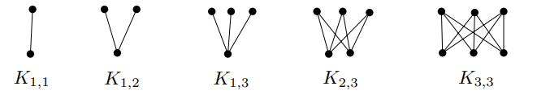
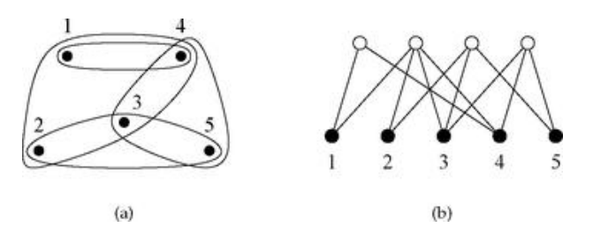
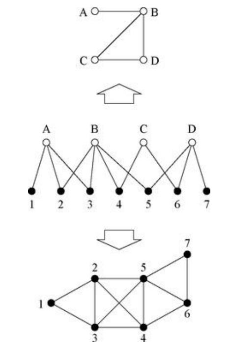

## Bipartite Graph
**(i)** A graph $G$ is ***bipartite*** if $V(G)$ has a partition $V(G) = A \cup B$ such that all edges go from $A$ to $B$.

**(ii)** The ***complete bipartite graph*** $K_{m, n}$ on the sets $M$ and $N$ with $\vert M \vert = m$ and $\vert N \vert = n$ is defined by 

$$V(K_{m, n}) = M \cup N \quad \text{and} \quad E(K_{m, n}) = \{\{ x, y \} \mid x \in M, y \in N \}.$$

## Two-Mode Network
일반적으로는 위와 같이 정의되지만, 네트워크 이론의 맥락에서는 하이퍼그래프의 또 다른 표현으로 기술되기도 한다. 예컨대 아래 그림과 같이 표현된 하이퍼그래프는 '그룹'과 '멤버'라는 두 가지 모드로 구분할 수 있다. 이분그래프는 멤버를 아래 검은색 정점으로 두고, 멤버들이 속하는 그룹을 위 흰색 정점으로 두어서 어떤 멤버들이 어떤 그룹에 속하는지를 하나의 에지로 표현한다. 

## Incidence Matrix
- Let $G$ be a bipartite graph with $n$ members and $g$ groups. The ***incidence matrix*** $B$ is a $g \times n$ matrix defined by

$$B_{ij} = \begin{cases}
1 & \text{if vertex } j \text{ belongs to group } i \\
0 & \text{otherwise}
\end{cases}$$

일반적인 그래프에 인접 행렬을 정의했던 것처럼, 이분그래프에서는 incidence matrix라는 개념을 정의할 수 있다. 예컨대 위 이분그래프의 incidence matrix는 다음과 같다.

$$B = \begin{bmatrix}
1 & 0 & 0 & 1 & 0 \\
1 & 1 & 1 & 1 & 0 \\
0 & 1 & 1 & 0 & 1 \\
0 & 0 & 1 & 1 & 1
\end{bmatrix}$$

## One-Mode Projection
이분그래프가 기본적으로 two-mode network라면, 기존의 정보를 유지한 채 one-mode network로 projection하는 방법이 자주 사용된다. 

위 사진을 참고하면, 멤버 1, 2, 3은 A라는 그룹에 함께 속해있다. 그러면 그룹 노드들을 삭제하고 멤버 노드들만 남긴채 1, 2, 3을 각각 에지로 연결하면 된다. 이런 방식으로 반복해주면 아래 그림과 같은 one-mode projection이 완성된다.

거꾸로, 그룹 A와 B는 멤버 2와 3을 공유하고 있으므로, 멤버 노드들을 삭제하고 그룹 노드들만 남긴채 A와 B를 에지로 연결하면 된다. 그룹 A와 C는 멤버를 공유하고 있지 않으므로 에지로 연결하지 않는다. 이렇게 반복해주면 위 그림과 같은 one-mode projection이 완성된다.

한편, projection이 이분그래프를 일반적인 단순 그래프로 바꿔주는 편리한 방법인 건 맞지만, 기본적으로 사영을 했기 때문에 정보가 손실되는 일이 발생한다. 예를 들어 위와 같은 projection은 연결성은 보여줄 수 있지만, 얼마나 강하게 연결되는지는 보여주지 않는다. 이러한 경우 사영된 그래프에 weight을 부여해주면 얼마나 강하게 연결되는지에 대한 정보까지 포함시킬 수 있다. 

Incidence matrix의 언어로 표현하면 다음과 같다. 멤버 $i$와 $j$가 동시에 속한 그룹의 총 개수를 $P_{ij}$라고 하면 다음이 성립한다.

$$P_{ij} = \sum_{k=1}^g B_{ki}B_{kj} = \sum_{k=1}^g B^T_{ik} B_{kj} = (B^T B)_{ij}$$

위와 같은 방법으로 행렬 $P = B^TB$를 정의할 수 있고, $P$는 projection graph의 인접 행렬과 같은 역할을 한다는 사실을 알 수 있다. 그러나 완벽하게 인접 행렬은 아닌데, $P$의 대각 성분 $P_{ii}$는 멤버 $i$가 속한 그룹의 개수를 나타내기 때문에 일반적으로 $0$이 아니다.

$$P_{ii} = \sum_{k=1}^g B^2_{ki} = \sum_{k=1}^g B_{ki}$$

비슷한 방법으로 그룹 $i$와 $j$가 동시에 포함하고 있는 멤버의 총 개수를 $P'_{ij}$라고 하면 행렬 $P' = BB^T$를 정의할 수 있고, 동일한 논의를 할 수 있다.

# Reference
- Matousek, J., & Nesetril, J. (2008). Invitation to Discrete Mathematics. Oxford University Press.
- Newman, M.E.J. (2010). Networks: An Introduction. Oxford University Press.