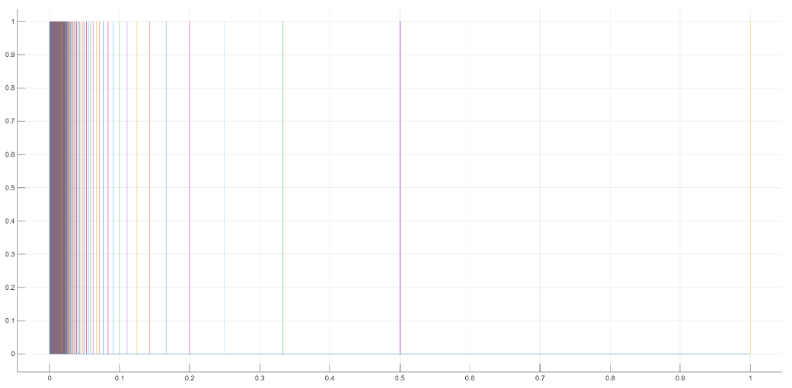
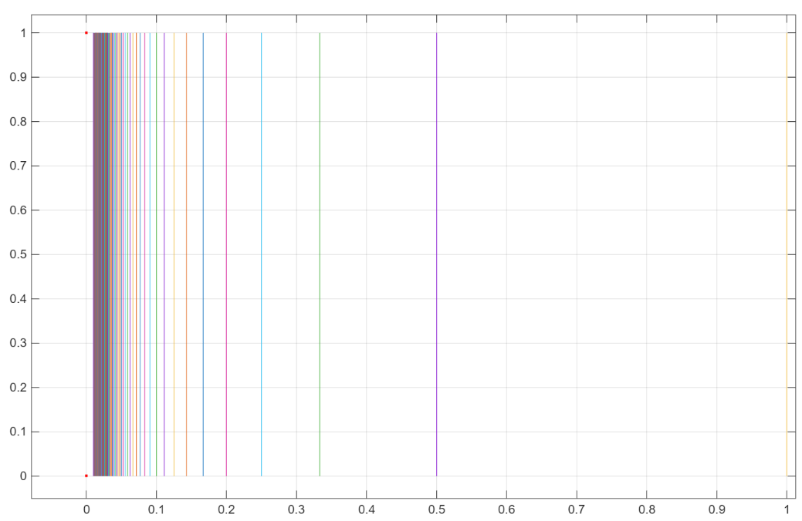

## Definition
The subspace $C$ of the standard topology on $\mathbb{R}^2$, defined by 

$$C = [0, 1] \times \{0\} \cup \left(\{ 0 \} \cup \left\{ \frac{1}{n} \mid n \in \mathbb{N} \right\} \right) \times [0, 1]$$

is called the ***comb space***.

생긴 모양이 마치 빗을 연상시킨다고 하여 ***빗공간***이라고 부른다. 보이는 바와 같이 경로 연결되어 있고, 따라서 연결되어 있다.

## Theorem
The comb space $C$ is path connected, so $C$ is connected.

## Proof
We denote 

$$X = [0, 1] \times \{0\}.$$

Let $x = (x_1, x_2), y = (y_1, y_2) \in C.$ 

**Case 1:** $x, y \in X$

Clearly, the path in $C$ from $x$ to $y$ is given the line segment joining $x$ and $y$. 

**Case 2:** $x \in X, y \notin X$

WLOG, we assume that $x \in X, y \notin X.$ Since $y \notin X,$ $y \in K \times [0, 1],$ so $y_1 = 0$ or $y_1= \frac{1}{n}$ for some $n \in \mathbb{N}.$ Note that the line segment joining $y$ and $(y_1, 0)$ and the line segment joining $(y_1, 0)$ and $x$ are in $C.$ By pasting lemma, the path in $C$ from $x$ to $y$ is given as the union of two line segments. 

**Case 3:** $x, y \notin X$

Note that $x_1 = 0$ or $x_1 = \frac{1}{n}$ for some $n \in \mathbb{N}$ and $y_1 = 0$ or $y_1= \frac{1}{m}$ for some $m \in \mathbb{N}.$ We construct three line segments, 

**(i)** from $x$ to $(x_1, 0)$,

**(ii)** from $(x_1, 0)$ to $(y_1, 0)$,

**(iii)** from $(y_1, 0)$ to $y.$

By pasting lemma, the path in $C$ from $x$ to $y$ is given as the union of three above line segments. 

Thus, in any case, the path in $C$ from $x$ to $y$ exists, so $C$ is path connected. $\blacksquare$

## Example
빗공간의 부분공간으로 다음의 공간을 생각해보자.

$$D = [0, 1] \times \{0\} \cup \left\{ \frac{1}{n} \mid n \in \mathbb{N} \right\} \times [0, 1] \cup \{0\} \times \{0, 1 \}$$

원래 빗공간은 $(0, 0)$부터 $(0, 1)$을 잇는 직선이 포함되어 있었는데, $D$는 직선은 없고 양 끝점만 포함되어 있는 경우다. 이런 경우 $D$는 연결되어 있을까?

당연하게도 $(0, 1)$이라는 점만 뚝 떨어져 있으니 당연히 경로 연결되어 있지 않고, 더욱이 연결되어 있지 않겠다고 생각할 수 있으나... 충격적이게도 $D$는 연결되어 있다.

우선 문제의 점 $(0, 1)$을 제외하기 위해 $A := D - \{ (0, 1) \}$로 잡자. 그러면 위에서 $C$가 경로 연결됨을 보였던 방법처럼 $A$ 또한 경로 연결되어 있음을 보일 수 있고, 따라서 연결되어 있다. 

그리고 $C$에서의 $A$의 closure는 원래 $C$에 있었던, $(0, 0)$과 $(0, 1)$을 잇는 선분을 포함하게 된다. 다시 말해 $\overline{A} = C$가 성립한다. 이때 [$A \subset D \subset \overline{A}$가 성립하고 $A$는 연결되어 있으므로 $D$ 또한 연결되어 있음을 확인할 수 있다.](../Connected_Space/index.qmd#sec-theorem-2)

따라서 $D$는 연결되어 있지만 국소 연결되어 있지는 않은 예시임을 확인할 수 있다.

# Reference
- James R. Munkres. (2000). Topology (2nd ed.). Pearson.