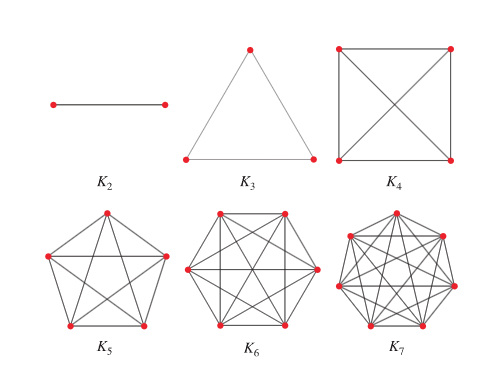

## Definition
The ***complete graph*** (or ***clique***) $K_n$ on $n$ vertices is defined by 

$$V(K_n) = [n] = \{ 1, 2, \cdots, n \} \quad \text{and} \quad E(K_n) = \binom{V(K_n)}{2}.$$

단순 그래프가 가질 수 있는 가장 큰 형태의 그래프로, 에지의 밀도를 정의할 때 완전 그래프의 에지의 개수가 사용된다.

# Reference
- Matousek, J., & Nesetril, J. (2008). Invitation to Discrete Mathematics. Oxford University Press.