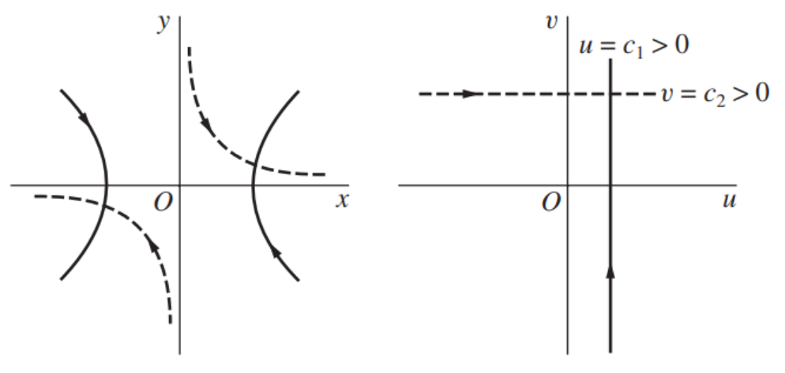
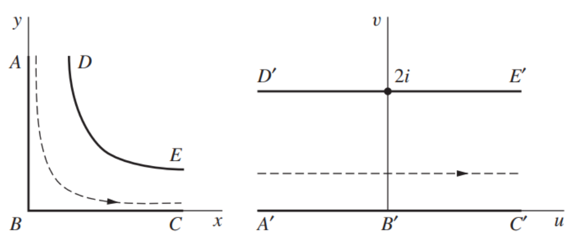
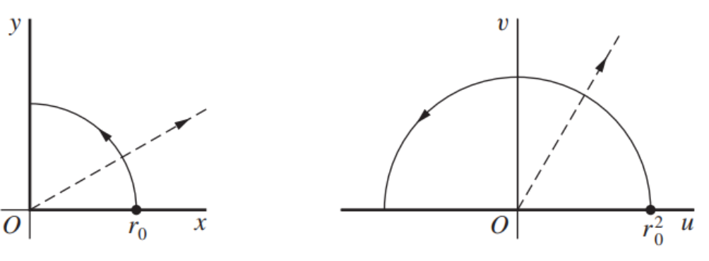

## Definition
**(i)** Let $S \subset \mathbb{C}$. A function $f: S \to \mathbb{C}$ is called a ***complex valued function*** on $S$. 

**(ii)** The function that assigns more than one value to a point $z$ in the domain of the function is called a ***multi-valued function***. We usually construct a single-valued function from a multi-valued function by assigning just one of the possible values at each point is taken.

## Remark 1
Let $f$ be a complex valued function on $S$. Then $f$ can be written as $f(z) = u(x, y) + i v(x, y)$ for all $z = x + iy \in S$, where $u$ and $v$ are real valued functions on $S$. 

## Example
**(i)** Consider $f(z) = \frac{1}{z}, \forall z \in \mathbb{C} \setminus \{ 0 \}$. Note that 

$$\begin{align*}
f(z) &= \frac{1}{z} \\
&= \frac{\bar{z}}{\vert z \vert^2} \\
&= \frac{x - iy}{x^2 + y^2} \\
&= \left( \frac{x}{x^2 + y^2} \right) + i \left( \frac{-y}{x^2 + y^2} \right).
\end{align*}$$

Hence $f = u + iv$ where 

$$u(x, y) = \frac{x}{x^2 + y^2} \quad \text{and} \quad v(x, y) = \frac{-y}{x^2 + y^2}.$$

**(ii)** Consider $f(z) = z^2, \forall z \in \mathbb{C}$. Note that 

$$\begin{align*}
f(z) &= z^2 \\
&= (x + iy)^2 \\
&= x^2 - y^2 + 2xyi \\
&= \left( x^2 - y^2 \right) + i \left( 2xy \right).
\end{align*}$$

Hence $f = u + iv$ where 

$$u(x, y) = x^2 - y^2 \quad \text{and} \quad v(x, y) = 2xy.$$

**(iii)** Consider $f(z) = z^{\frac{1}{2}}, \forall z \in \mathbb{C} \setminus \{ 0 \}$. Since $z^{\frac{1}{2}}$ has the two possible values

$$z^{\frac{1}{2}} = \pm \sqrt{r} \exp \left( i \frac{\Theta}{2} \right)$$

where $r = \vert z \vert$ and $\Theta \in (-\pi, \pi]$ is the principal value of the argument of $z$. But, if we choose only the positive value of $\pm \sqrt{r}$ and write

$$f(z) = \sqrt{r} \exp \left( i \frac{\Theta}{2} \right)$$

then $f$ is a single-valued function on $\mathbb{C} \setminus \{ 0 \}$. By assigning $f(0) = 0$, the function $f$ is well-defined on $\mathbb{C}$.

## Remark 2
회전 행렬 

$$R_{\theta} = \begin{bmatrix} 
\cos \theta & \sin \theta \\
-\sin \theta & \cos \theta
\end{bmatrix}$$

은 $\mathbb{R}^2$ 위의 점들을 반시계 방향으로 $\theta$만큼 회전시키는 선형변환이다. 즉 $R_{\theta} : \mathbb{R}^2 \to \mathbb{R}^2$는 2차원 평면을 또 다른 2차원 평면으로 매핑하는 변환이다. 같은 논리로 복소 함수 $f : \mathbb{C} \to \mathbb{C}$는 복소 평면을 또 다른 복소 평면으로 매핑하는 변환으로 이해할 수 있다.

복소수 전체에서 정의된 복소 함수 $w = f(z) = z^2$을 생각하자. 이때 $f(z) = u(x, y) + i v(x, y)$로 표현하면, $u(x, y) = x^2 - y^2$이고 $v(x, y) = 2xy$이다. 이때 복소평면 상에서 $u = c_1 > 0$을 만족하는 점들을 다 모아놓으면 그 점들의 집합의 그래프는 쌍곡선이 될 것이다. 그리고 $x^2 - y^2 = c_1$이면 $x = \pm \sqrt{y^2 + c_1}$이므로 $v = \pm 2y \sqrt{y^2 + c_1}$이다. $x > 0$인 부분만 고려하면 $v = 2y \sqrt{y^2 + c_1}$이고, $y$가 음수부터 $0$, 양수까지 서서히 증가한다고 했을 때 $v$ 또한 음수에서부터 서서히 증가하는 걸 알 수 있다. 즉 복소평면 상에서 쌍곡선 모양의 커브는 $w = z^2$이라는 매핑을 거치면 복소평면에서 $u = c_1$ 꼴의 상수함수로 변환되며, 변환될 때 방향성 또한 알 수 있다. 

마찬가지로 $v= c_2 > 0$을 만족하는 점들을 다 모아놓으면 유리함수, 다시 말해 쌍곡선이 될 것이고 위와 같은 방법으로 살펴보면 매핑을 거쳤을 때 $v = c_2$ 꼴의 상수함수로 변환된다. 

이와 같은 논리를 사용하면 복소평면 상에서 정의된 도메인 셋 $\{ (x, y) \mid x > 0, y > 0, xy < 1 \}$이 $w = z^2$ 매핑을 거쳤을 때 또 다른 도메인 셋 $\{ (u, v) \mid 0 < v < 2 \}$로 변환된다는 사실을 알 수 있다.

한편 $w = z^2$은 극좌표계로 나타냈을 때 $w = r^2 e^{i(2\theta)}$로 쓸 수 있다. 마찬가지로 변환의 관점에서 생각해본다면 이 매핑은 주어진 복소수 $z = re^{i \theta}$의 크기는 제곱하고 각도는 두 배로 회전시키는 변환이다. 만약 복소평면에서 제 1사분면에 놓인 반지름 $1$의 사분원을 매핑시킨다면 모든 각도가 두 배가 되므로 반경은 그대로 유지한 채 사분원에서 반원으로 변환될 것이다. 이와 같이 복소 함수를 적절히 사용한다면 다루기 까다로운 모양의 영역을 간단한 모양의 영역으로 변환시킬 수 있다. 

# Reference
- Brown, James Ward, & Churchill, Ruel V. (2017). Complex Variables and Applications (9th ed.). McGraw-Hill.