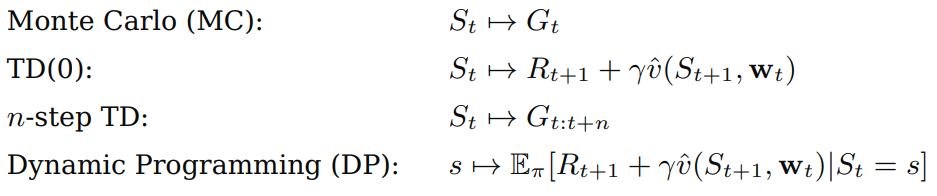
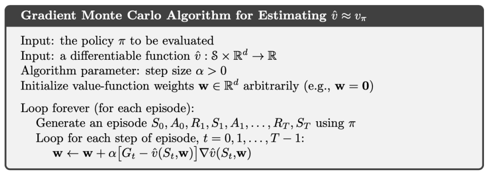
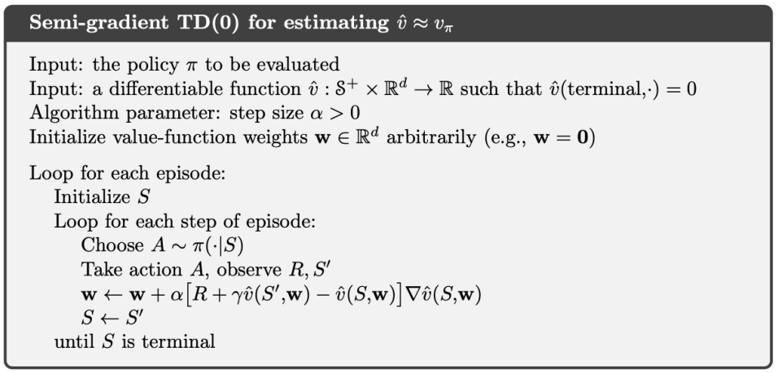
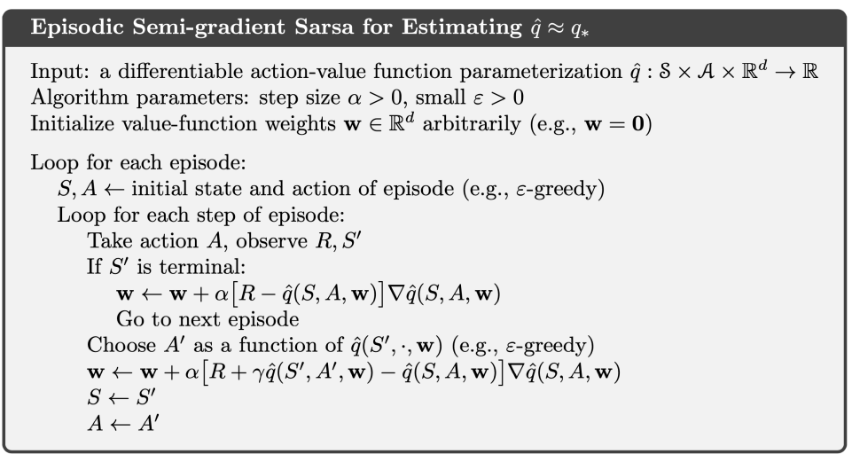

# Function Approximation
강화 학습에서 자주 예시로 등장하는 격자 모델(grid model)의 경우 가능한 상태 자체가 그렇게 크지 않는 경우가 대다수이다. 그러나 많은 현실 세계의 문제들은 가능한 상태가 매우 많은데, 예컨대 바둑 같은 경우 약 $10^{170}$개의 상태가 가능하다. 

이러한 문제들에서 최적의 정책을 찾기 위해 지금까지의 알고리즘들은 모든 상태에 대응하는 값을 배열에 저장해서 사용했다. 그러나 상태의 개수가 너무 많아지면 이러한 접근 방식은 불가능해지는데, 이럴 때 사용할 수 있는 방법이 ***함수 근사(function approximation)***이다. 

각 상태 $s$에 대응되는 value function의 값 $v(s)$를 모두 저장해서 사용하는 대신, 함수 근사는 가중치 벡터 $\mathbf{w}$를 사용해 함수 $\hat{v}(s, \mathbf{w})$를 만들어 사용한다. 이렇게 근사시킨 함수 $\hat{v}$를 사용하면 하나의 상태에 대해 학습한 정보를 다른 유사한 상태로 일반화해 적용할 수 있으므로 상태 공간의 차원이 커지는 문제를 해결할 수 있다.

## Evaluation
지금까지의 알고리즘은 모두 상태 $S_t$를 가지고 타겟값을 얻어서 이를 통해 value function을 개선해나가는 방식으로 설계되었었다. 

함수 근사는 조금 방식이 다른데, 우선 가중치 벡터 $\mathbf{w}$에 대해 미분가능한 함수 $\hat{v}(s, \mathbf{w})$를 정의한다. 이때 우리가 개선하는 대상은 가중치 벡터 $\mathbf{w}$이다. 우리는 각 방법에서의 타겟들을 마치 지도학습에서의 정답처럼 간주하고 경사하강법을 사용해 타겟과 예측값 $\hat{v}(S_t, \mathbf{w}_t)$의 차이를 줄여나가는 방식으로 가중치 벡터 $\mathbf{w}$를 개선한다. 그러면 자연스럽게 함수 $\hat{v}$는 $\mathbf{w}$의 함수이므로 개선된 예측값을 내놓게 되고, 이런 식으로 value function을 evaluation하게 된다. 이때 학습에 사용되는 상태는 주체(agent)가 경험한 데이터들을 사용한다. 

### Stochastic Gradient Descent (SGD)
우선 학습에 사용할 상태 $S_t$에 대해서 value function의 참값 그 자체인 $v_\pi(S_t)$를 알고 있다고 가정한다. 당연하지만 현실적으로는 어려운, 이상적인 가정이지만, 여기서 시작해 현실적인 상황으로 이론을 전개해 나간다. 이때 가중치 벡터 $\mathbf{w}$의 업데이트 룰은 다음과 같은 ***확률적 경사하강법(SGD)***을 따른다.

$$\begin{align*}
\mathbf{w}_{t+1} &= \mathbf{w}_t - \frac{1}{2} \alpha \nabla_{\mathbf{w}_t} [v_\pi(S_t) - \hat{v}(S_t, \mathbf{w}_t)]^2 \\
&= \mathbf{w}_t - \alpha [v_\pi(S_t) - \hat{v}(S_t, \mathbf{w}_t)] \nabla_{\mathbf{w}_t} \hat{v}(S_t, \mathbf{w}_t)
\end{align*}$$

즉 우리가 최소화할 손실 함수(Loss Function)은 $\frac{1}{2} [v_\pi(S_t) - \hat{v}(S_t, \mathbf{w}_t)]^2$이다. 이러한 업데이트를 각 스텝 $t$마다 반복적으로 수행해서 벡터 $\mathbf{w}$를 개선한다는 점에서 '확률적'이라고 불린다. 이때 적절한 $\alpha$를 선택한다면 무수히 많은 반복 후 local optimum으로 수렴함이 보장되어 있다.

한편, 앞서 지적했듯이 우리는 참값 $v_\pi(S_t)$를 알 수 없고, 이 경우 각 방법의 타겟값을 근사치 $U_t$로 대체한다. 즉 업데이트 룰은 다음과 같다.

$$\mathbf{w}_{t+1} = \mathbf{w}_t + \alpha [U_t - \hat{v}(S_t, \mathbf{w}_t)] \nabla_{\mathbf{w}_t} \hat{v}(S_t, \mathbf{w}_t)$$

즉 $U_t$는 $G_t, R_{t+1} + \gamma \hat{v}(S_{t+1}, \mathbf{w}_t)$등이 될 수 있다. 다음은 몬테카를로 방법과 TD Learning을 function approximation을 사용해 구현한 유사코드이다.

### Monte Carlo Approximation

### TD Approximation

여기서는 특별히 ***semi-gradient***라는 이름이 붙었는데, TD Learning의 경우 타겟은 $U_t = R_{t+1} + \gamma \hat{v}(S_{t+1}, \mathbf{w}_t)$이다. 이때 $U_t$도 $\mathbf{w}_t$에 대한 함수이므로 그래디언트를 계산할 때 이것까지 포함시켜 계산해야 하지만, 잘 보면 $U_t$를 미분한 항은 온데간데 없다. 그러나 여기서는 $U_t$의 미분을 의도적으로 무시하는데, 원칙적으로 계산하게 되면 오히려 학습 속도가 느려지고 최적의 정책을 찾지 못하는 일들이 생기기 때문이다. 따라서 그래디언트를 취하되 전부 취하진 않는다는 점에서 semi-gradient라고 불린다.

### Linear Function Approximation
특별히 $\hat{v}$를 선형 함수로 근사하는 예시를 자세하게 살펴보자. 가중치 벡터 $\mathbf{w}$와 같은 차원을 가지는 상태 벡터 $\mathbf{x}(s)$에 대해서 함수 $\hat{v}$는 다음과 같이 정의된다.

$$\hat{v}(s, \mathbf{w}) := \mathbf{w}^\top \mathbf{x}(s)$$

즉 두 벡터의 유클리드 내적으로 정의된다. 이때

$$\nabla_{\mathbf{w}_t}\hat{v}(s, \mathbf{w}_t) = \mathbf{x}(s)$$

로 간단하게 주어지므로, 업데이트 룰은 다음과 같이 매우 간단하게 주어진다.

$$\mathbf{w}_{t+1} = \mathbf{w}_t + \alpha[U_t - \hat{v}(S_t, \mathbf{w}_t)]\mathbf{x}(S_t)$$

선형 함수의 경우 매우 특별하게도 벡터 $\mathbf{w}_t$가 수렴하게 되는 고정점을 찾아낼 수 있다. TD Learning의 타겟 $R_{t+1} + \gamma \hat{v}(S_{t+1}, \mathbf{w}_t)$를 사용한다고 가정하면 업데이트 룰을 다음과 같이 정리할 수 있다.

$$\begin{align*}
\mathbf{w}_{t+1} &= \mathbf{w}_t + \alpha [R_{t+1} + \gamma \mathbf{w}_t^\top \mathbf{x}_{t+1} - \mathbf{w}_t^\top \mathbf{x}_t] \mathbf{x}_t \\
&= \mathbf{w}_t + \alpha [R_{t+1} \mathbf{x}_t - \mathbf{x}_t (\mathbf{x}_t - \gamma \mathbf{x}_{t+1})^\top \mathbf{w}_t]
\end{align*}$$

$\mathbf{x}_t = \mathbf{x}(S_t)$로 표기했다. 이때 양변에 조건부 기댓값을 취해서 정리하면 다음과 같다.

$$\mathbb{E}[\mathbf{w}_{t+1} | \mathbf{w}_t] = \mathbf{w}_t + \alpha(\mathbf{b} - \mathbf{A}\mathbf{w}_t)$$

이때 

$$\begin{align*}
\mathbf{b} &= \mathbb{E}[R_{t+1} \mathbf{x}_t] \\
\mathbf{A} &= \mathbb{E}[\mathbf{x}_t (\mathbf{x}_t - \gamma \mathbf{x}_{t+1})^\top]
\end{align*}$$

로 두었다. 만약 이 업데이트 룰이 반복됨에 따라 벡터 $\mathbf{w}_t$가 수렴한다면 $\mathbf{b} - \mathbf{A}\mathbf{w}_t = 0$이 성립해야 하고, 그때의 $\mathbf{w}_t$를 $\mathbf{w}_{TD}$라고 둔다면 다음의 결론을 얻게 된다.

$$\mathbf{w}_{TD} = \mathbf{A}^{-1}\mathbf{b}$$

행렬 $\mathbf{A}$는 가역행렬이라고 가정한다. 즉 선형 함수의 경우 벡터 $\mathbf{w}_t$가 항상 수렴하며, 더욱이 수렴하게 되는 고정점을 닫힌 형식으로 찾아낼 수 있다는 점이 특별하다. 반대로 비선형의 경우 이러한 수렴성이 선형과 비교했을 때 전혀 보장되어 있지 않다는 점에서 다루기 까다롭다고 할 수 있다.

## Control
이제 컨트롤 문제로 넘어가보자. 결국 우리는 최적의 정책 $\pi_\ast$를 찾아야 하고, 더욱이 model-free 문제에서도 마찬가지이다. 따라서 이제 단순한 value function이 아닌 action-value function을 사용하게되고, 함수 $\hat{q}(s, a, \mathbf{w})$를 사용해야 한다. 업데이트 룰은 다음과 같다.

$$\mathbf{w}_{t+1} = \mathbf{w}_t + \alpha [U_t - \hat{q}(S_t, A_t, \mathbf{w}_t)] \nabla_{\mathbf{w}_t} \hat{q}(S_t, A_t, \mathbf{w}_t)$$

### Episodic Semi-Gradient Sarsa
특별히 타겟을 $U_t = R_{t+1} + \gamma \hat{q}(S_{t+1}, A_{t+1}, \mathbf{w}_t)$로 두는 Sarsa 알고리즘을 예시로 살펴보자. 다음은 알고리즘의 유사코드이다.

# Reference 
- Richard S. Sutton, Andrew G. Barto. (2020). Reinforcement Learning : An Introduction (2nd ed.). MIT press.