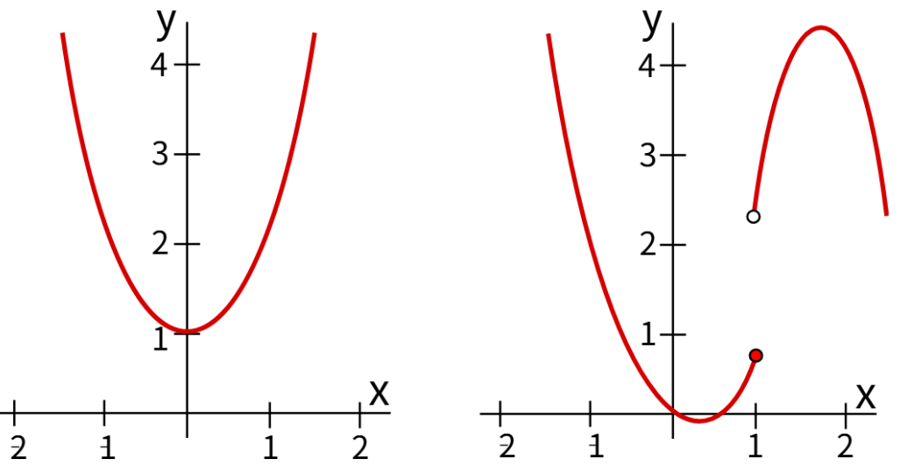

## Definition
Let $(X, \mathscr{T}_X)$ and $(Y, \mathscr{T}_Y)$ be topological spaces. A function $f: X \to Y$ is said to be ***continuous*** if $f^{-1}(V) \in \mathscr{T}_X, \forall V \in \mathscr{T}_Y$. 

정의만 보면 왜 이 모양인가 싶겠지만, 사실 해석학에서 다루던 $\varepsilon - \delta$ 논법을 위상수학의 언어로 바꾼 것과 다름 없다. 

$$\begin{align*}
f: \mathbb{R} \to \mathbb{R} \text{ is continuous at } a &\iff \forall \varepsilon > 0, \exists \delta > 0 \text{ such that } \vert x - a \vert < \delta \implies \vert f(x) - f(a) \vert < \varepsilon \\
& \iff \forall \varepsilon > 0, \exists \delta > 0 \text{ such that } x \in (a - \delta, a + \delta) \implies f(x) \in (f(a) - \varepsilon, f(a) + \varepsilon) \\
& \iff \forall \varepsilon > 0, \exists \delta > 0 \text{ such that } x \in (a - \delta, a + \delta) \implies x \in f^{-1}((f(a) - \varepsilon, f(a) + \varepsilon)) \\
& \iff \forall \varepsilon > 0, \exists \delta > 0 \text{ such that } (a - \delta, a + \delta) \subset f^{-1}((f(a) - \varepsilon, f(a) + \varepsilon))
\end{align*}$$

즉 양수 $\varepsilon$을 하나 가지고 온다는 것은 $f(a)$의 네이버후드 $V$를 가지고 오는 것이고, 그에 대응되는 양수 $\delta$가 존재한다는 것은 $f^{-1}(V)$에 속하는 $a$의 네이버후드가 존재한다는 말이다. 그런데 이건 사실상 $f^{-1}(V)$가 open이 되는 조건이므로, 위에서 새롭게 정의한 연속과 $\varepsilon- \delta$ 논법의 정의가 사실상 같음을 알 수 있다. 

## Remark
**(i)** Let $\mathscr{B}$ be a basis generating $\mathscr{T}_Y$. If $f^{-1}(B) \in \mathscr{T}_X, \forall B \in \mathscr{B}$, then $f$ is continuous.  

$\big[ (\because)$ Let $V \in \mathscr{T}_Y$. Then $V = \bigcup _ {B \in \mathcal{A}} B$ for some $\mathcal{A} \subset \mathscr{B}$. Then

$$\begin{align*}
f^{-1}(V) &= f^{-1} \left( \bigcup_{B \in \mathcal{A}} B \right) \\
&= \bigcup_{B \in \mathcal{A}}f^{-1}(B) \in \mathscr{T}_X
\end{align*}$$

because each $f^{-1}(B) \in \mathscr{T}_X$. Thus, $f$ is continuous. $\blacksquare$ $\big]$

**(ii)** Let $\mathscr{S}$ be a subbasis generating $\mathscr{T}_Y$. If $f^{-1}(S) \in \mathscr{T}_X, \forall S \in \mathscr{S}$, then $f$ is continuous.

$\big[ (\because)$ Let $B \in \mathscr{B}$. Then $B = \bigcap_{i=1}^n S_i$ for some $S_1, ..., S_n \in \mathscr{S}$. Then

$$\begin{align*}
f^{-1}(B) &= f^{-1} \left( \bigcap_{i=1}^n S_i \right) \\
&= \bigcap_{i=1}^n f^{-1}(S_i) \in \mathscr{T}_X
\end{align*}$$

because each $f^{-1}(S_i) \in \mathscr{T}_X$. By (i), $f$ is continuous. $\blacksquare \big]$

## Example
**(i)** Let $f_1 : \mathbb{R} _ {\ell} \to \mathbb{R} _ {\text{usual}}$ defined by $f_1(x) = x$. Then $f$ is continuous.

$\big[(\because)$ Let $(a, b)$ be a basis element of $\mathbb{R} _ {\text{usual}}$. Then we have $f^{-1}((a, b)) = (a, b)$. Note that 

$$(a, b) = \bigcup_{n=1}^{\infty} \left[ a + \frac{1}{n}, b \right).$$

Thus $(a, b)$ is open in $\mathbb{R} _ {\ell}$. By Remark (i), $f$ is continuous. $\big]$

**(ii)** Let $f_2 : \mathbb{R} _ {\text{usual}} \to \mathbb{R} _ {\ell}$ defined by $f_2(x) = x$. Then $f$ is NOT continuous.

$\big[(\because)$ Note that $f^{-1}([0, 1)) = [0, 1).$ If $f$ is continuous, then $[0, 1)$ is open in $\mathbb{R} _ {\text{usual}}$. But there is no basis element $B$ of $\mathbb{R} _ {\text{usual}}$ such that $0 \in B$ and $B \subset [0, 1)$. Hence $f$ is not continuous. $\big]$

## Theorem 1
Let $(X, \mathscr{T}_X)$ and $(Y, \mathscr{T}_Y)$ be topological spaces, and let $f:X \to Y$ be a function. TFAE.

**(i)** $f$ is continuous.

**(ii)** $f(\overline{A}) \subset \overline{f(A)}, \forall A \subset X$.

**(iii)** $f^{-1}(B)$ is closed in $X$ for all closed set $B$ of $Y$.

**(iv)** For each $x \in X$ and a neighborhood $V$ of $f(x)$, there exists a neighborhood $U$ of $x$ such that $f(U) \subset V$. In this case, we say that $f$ is ***continuous at*** $x \in X$.

### Proof
**(i)** $\Longrightarrow$ **(ii)**

Suppose that $f$ is continuous. Let $y \in f(\overline{A})$. Then $y = f(x)$ for some $x \in \overline{A}$. Let $V$ be a neighborhood of $y$. Since $f(x) = y \in V$, we have $x \in f^{-1}(V)$. Since $V$ is open in $Y$,  $f^{-1}(V) \in \mathscr{T}_X$, which means that $f^{-1}(V)$ is a neighborhood of $x$. Then $f^{-1}(V) \cap A \neq \emptyset$, which implies that $\exists a \in f^{-1}(V) \cap A$. Then $a \in f^{-1}(V)$ and $a \in A$, so that $f(a) \in V$ and $f(a) \in f(A)$. Thus, $f(a) \in V \cap f(A)$, which means that $V \cap f(A) \neq \emptyset$. Hence, $y \in \overline{f(A)}$, so that $f(\overline{A}) \subset \overline{f(A)}$. 

**(ii)** $\Longrightarrow$ **(iii)**

Suppose that $f(\overline{A}) \subset \overline{f(A)}, \forall A \subset X$. Let $C$ be a closed set of $Y$, and let $x \in \overline{f^{-1}(C)}.$ Then we have 

$$\begin{align*}
f(x) &\in f(\overline{f^{-1}(C)}) \\
& \subset \overline{f(f^{-1}(C))} \\
& \subset \overline{C} \\
&= C,
\end{align*}$$

so $x \in f^{-1}(C),$ which means that $\overline{f^{-1}(C)} \subset f^{-1}(C).$ 

Since clearly $f^{-1}(C) \subset \overline{f^{-1}(C)}$, we have $f^{-1}(C) = \overline{f^{-1}(C)}$, which means that $f^{-1}(C)$ is closed in $X$. 

**(iii)** $\Longrightarrow$ **(i)**

Suppose that $f^{-1}(B)$ is closed in $X$ for all closed set $B$ of $Y$. Let $V \in \mathscr{T}_Y$. Since $Y - V$ is closed in $Y$, we have $f^{-1}(Y-V)$ is closed in $X$. Then 

$$\begin{align*}
f^{-1}(Y- V) &= f^{-1}(Y) - f^{-1}(V) \\
&= X - f^{-1}(V),
\end{align*}$$

so that $f^{-1}(V)$ is open in $X$. Thus, $f$ is continuous.

**(i)** $\Longrightarrow$ **(iv)**

Suppose that $f$ is continuous. Let $x \in X$ and let $V$ be a neighborhood of $f(x)$. Since $f(x) \in V$, we have $x \in f^{-1}(V)$. Since $f^{-1}(V)$ is open, $f^{-1}(V)$ is a neighborhood of $x$. Then $f(f^{-1}(V)) = V \subset V$. 

**(iv)** $\Longrightarrow$ **(i)**

Suppose that for each $x \in X$ and a neighborhood $V$ of $f(x)$, there exists a neighborhood $U$ of $x$ such that $f(U) \subset V$. Let $V \in \mathscr{T}_Y$. Let $x \in f^{-1}(V)$. Then $f(x) \in V$. Then there exists a neighborhood $U$ of $x$ such that $f(U) \subset V$, which implies that $U \subset f^{-1}(V)$. Thus, $f^{-1}(V) \in \mathscr{T}_X$, so that $f$ is continuous. $\blacksquare$

## Theorem 2
Let $(X, \mathscr{T}_X)$ and $(Y, \mathscr{T}_Y)$ be topological spaces, and let $f: X \to Y$ be a injective continuous function. Let $A \subset X$. Then $f(A') \subset f(A)'$. 

### Proof
Let $y \in f(A')$. Then $y = f(x)$ for some $x \in A'$. Let $V$ be a neighborhood of $f(x)$. Then $f(x) \in V$, which means that $x \in f^{-1}(V)$. Since $f$ is continuous, $f^{-1}(V)$ is open in $X$. Then $f^{-1}(V) \cap (A - \{ x \}) \neq \emptyset$, which means that $\exists a \in f^{-1}(V) \cap (A - \{ x \})$. Then $a \in f^{-1}(V)$ and $a \in A - \{ x \}$, which means that $f(a) \in V$ and $f(a) \in f(A - \{ x \}) = f(A) - \{ f(x) \}$ because $f$ is injective. Thus, $f(a) \in V \cap (f(A) - \{ f(x) \})$, which means that $f(x) \in f(A)'$. Hence, $f(A') \subset f(A)'. \blacksquare$

위상 공간에서 연속 함수란 일종의 '가까이 있음'을 보존하는 함수라고 생각해도 좋다. Theorem 1의 (iv)를 생각해본다면, 점 $x$에서 함수 $f$가 연속이라는 말은, $f(x)$의 어떤 근방 $V$를 잡아도(거리 공간의 센스로 생각한다면, 얼마나 가깝게 잡거나 멀게 잡든지 상관없이) 점 $x$의 적당한 근방 $U$가 존재해서 $f$에 의해 보내진 $U$의 image, 즉 $f(U)$가 여전히 적당히 $V$의 근처에 머물고 있다는 뜻이다. 뒤집어서 말하면, $x$의 근방을 굉장히 이상하게 잡고 $f$에 의해 보냈을 때 갑자기 $V$와 멀리 떨어져버리는 상황이 생기지 않는다는 뜻이다. 

예컨대 위 그림과 같이 불연속함수를 가져오면, $f(1)$ 주변에서 어떤 근방을 잡아도 여전히 $f$가 근방성을 보존하도록 하는 그러한 $1$의 근방은 존재하지 않는다. 갑자기 점프해버리는 상황을 머릿속으로 생각해보자. 

이러한 컨셉은 거리공간에서 생각해보면 더욱 명확하다.

$$\forall \varepsilon > 0, \exists \delta > 0 \text{ such that } d(x, a) < \delta \implies d(f(x), f(a)) < \varepsilon.$$

반면, limit point는 필연적으로 '서로 다른 점들'이라는 컨셉으로 이해해야 한다. 

> Let $X$ be a $T_1$-space, and let $A \subset X$. Then $x \in A'$ $\iff$ every neighborhood of $x$ contains infinitely many points of $A$.

이는 limit point가 연속함수에 의해서 보존되기 위해서는 추가적으로 조건이 더 필요하고, '서로 다름'이라는 조건을 가지고 있는 함수는 다름아닌 단사함수이고, 이를 표현한 정리가 Theorem 2이다.

## Theorem 3
Let $X, Y, Z$ be topological spaces. Then

**(i)** For some $y_0 \in Y$, the function $f : X \to Y$ defined by $f(x) = y_0, \forall x \in X$, called a ***constant function***, is continuous.

**(ii)** Let $A$ be a subspace of $X$. The function $i : A \hookrightarrow X$ given by $i(a) = a, \forall a \in A$, called the ***inclusion***, is continuous.

**(iii)** If $f : X \to Y$ and $g : Y \to Z$ are continuous, then the composition $g \circ f: X \to Z$ is continuous.

**(iv)** If $f : X \to Y$ is continuous and $A$ is a subspace of $X$, then the restriction of $f$ onto $A$, denoted by $f\vert_A : A \to Y$, is continuous.

**(v)** Let $f : X \to Y$ be a continuous function.

**(v-1)** If $Z$ is a subspace of $Y$ containing $f(X)$, then the function $g : X \to Z$, obtained by restricting the range of $f$, is continuous.

**(v-2)** If $Y$ is a subspace of $Z$, then the function $h : X \to Z$, obtained by expanding the range of $f$, is continuous.

**(vi)** Let $\{U_\alpha\}$ be a collection of open sets in $X$. The function $f : X \to Y$ is continuous if $X = \bigcup U_\alpha$ and $f \vert _ {U_\alpha}$ is continuous for each $\alpha$.

### Proof
**(i)** Let $V \in \mathscr{T}_Y$. If $y_0 \in V$, then $f^{-1}(V) = X \in \mathscr{T}_X$. If $y_0 \notin V$, then $f^{-1}(V) = \emptyset \in \mathscr{T}_X$. Thus, $f$ is continuous.

**(ii)** Let $V \in \mathscr{T}_Y$. We claim that $i^{-1}(V) = V \cap A$. 

$\big[(\because)$ Let $a \in i^{-1}(V)$. Then $a = i(a) \in V$. Since $a \in A$, we have $a \in V \cap A$. If $b \in V \cap A$, then $i(b) = b \in V$, so that $b \in i^{-1}(V)$. Thus, $i^{-1}(V) = V \cap A$. $\big]$ 

Since $i^{-1}(V) = V \cap A \in \mathscr{T}_A$, $i$ is continuous. 

**(iii)** Let $W \in \mathscr{T}_Z$. Since $g$ is continuous, $g^{-1}(W) \in \mathscr{T}_Y$. Since $f$ is continuous, $f^{-1}(g^{-1}(W)) \in \mathscr{T}_X$. We claim that $f^{-1}(g^{-1}(W)) = (g \circ f)^{-1}(W)$.

$\big[(\because)$ 

$$\begin{align*}
x \in f^{-1}(g^{-1}(W)) & \iff f(x) \in g^{-1}(W) \\
& \iff g(f(x)) \in W \\
& \iff (g \circ f)(x) \in W \\
& \iff x \in (g \circ f)^{-1}(W). \big]
\end{align*}$$

Since $(g \circ f)^{-1}(W) = f^{-1}(g^{-1}(W)) \in \mathscr{T}_X$, $g \circ f$ is continuous.

**(iv)** By (ii), the inclusion $i: A \to X$ is continuous. By (iii), $f \vert A = f \circ i: A \to Y$ is continuous. 

Let $V \in \mathscr{T}_Y$. Since $f$ is continuous, $f^{-1}(V) \in \mathscr{T}_X$. Then $f^{-1}(V) \cap A \in \mathscr{T}_A$. We claim that $f^{-1}(V) \cap A = \left( f \vert_A \right)^{-1}(V)$.

$\big[(\because)$ Let $x \in \left( f \vert_A \right)^{-1}(V)$. Since $\left( f \vert_A \right)^{-1}(V) \subset A$, $x \in A$. Then $f(x) = (f \vert_A)(x) \in V$, so that $x \in f^{-1}(V) \cap A$. 

If $y \in f^{-1}(V) \cap A$, then $y \in A$ and $(f \vert_A)(y) = f(y) \in V$, which means that $y \in \left( f \vert_A \right)^{-1}(V)$. Thus, $f^{-1}(V) \cap A = \left( f \vert_A \right)^{-1}(V)$. $\big]$

Since $\left( f \vert_A \right)^{-1}(V) = f^{-1}(V) \cap A \in \mathscr{T}_A$, $f \vert_A$ is continuous. 

**(v-1)** Let $W \in \mathscr{T}_Z$. Since $Z$ is a subspace of $Y$, $W = V \cap Z$ for some $V \in \mathscr{T}_Y$. Note that $f(x) = g(x), \forall x \in X$. Then we have 

$$\begin{align*}
g^{-1}(W) &= f^{-1}(W) \\
&= f^{-1}(V \cap Z) \\
&= f^{-1}(V) \cap f^{-1}(Z) \\
&= f^{-1}(V) \cap X \\
&= f^{-1}(V) \in \mathscr{T}_X,
\end{align*}$$

so that $g$ is continuous.

**(v-2)** By (ii), the inclusion $i: Y \to Z$ is continuous. By (iii), $h = i \circ f: X \to Z$ is continuous. 

**(vi)** Let $\{ U_\alpha \}$ be a collection of open sets in $X$ such that $X = \bigcup U _ {\alpha}$. Suppose that each $f \vert U _ {\alpha} : U _ {\alpha} \to Y$ is continuous. Let $V \in \mathscr{T}_Y$. If we consider each $U _ {\alpha}$ as a subspace of $X$, then $\left( f \vert U _ {\alpha} \right)^{-1}(V) \in \mathscr{T} _ {U _ {\alpha}}$ for each $\alpha$. Since each $U _ {\alpha}$ is open in $X$, we have $\left( f \vert U _ {\alpha} \right)^{-1}(V) \in \mathscr{T}_X$. We claim that 

$$\bigcup_\alpha \left( f \vert U _ {\alpha} \right)^{-1}(V) = f^{-1}(V).$$

$\big[(\because)$ Let $x \in \bigcup_\alpha \left( f \vert U _ {\alpha} \right)^{-1}(V)$. Then $x \in \left( f \vert U _ {\alpha} \right)^{-1}(V)$ for some $\alpha$. Then $x \in U _ {\alpha}$ and $(f \vert U _ {\alpha})(x) \in V$, so that $x \in f^{-1}(V)$.

If $y \in f^{-1}(V)$, then $f(y) \in V$. Since $f^{-1}(V) \subset X$, $y \in U _ {\alpha}$ for some $\alpha$, so that $\left( f \vert U _ {\alpha} \right)(y) = f(y) \in V$. Thus, $y \in \left( f \vert U _ {\alpha} \right)^{-1}(V)$. Hence, $f^{-1}(V) = \bigcup_\alpha \left( f \vert U _ {\alpha} \right)^{-1}(V)$. $\big]$

Since $f^{-1}(V)= \bigcup_\alpha \left( f \vert U _ {\alpha} \right)^{-1}(V) \in \mathscr{T}_X$, $f$ is continuous. $\blacksquare$

## Theorem 4
Let $A, B, X$ and $Y$ be topological spaces.

**(i)** Let $f_1: A \to X$ and $f_2:A \to Y$ be functions. Then the function $f: A \to X \times Y$ defined by $f(a) = (f_1(a), f_2(a))$ is continuous $\iff$ the coordinate functions $f_1$ and $f_2$ of $f$ are continuous.

**(ii)** Let $f: A \to X$ and $g: B \to Y$ be continuous functions. Then the function $f \times g: A \times B \to X \times Y$ defined by 

$$(f \times g)(a, b) = (f(a), g(b))$$

is continuous.

### Proof
**(i)**

$(\Longrightarrow)$

Suppose that $f$ is continuous. Note that the projection maps $\pi_1: X \times Y \to X$ and $\pi_2 : X \times Y \to Y$ are continuous.

$\big[(\because)$ Let $U$ be an open subset of $X$. Then we have $\pi_1^{-1}(U) = U \times Y$, which is open in $X \times Y$. Thus, $\pi_1$ is continuous. Similarly, $\pi_2$ is also continuous.$\big]$

Note that $\pi_1 \circ f = f_1$ and $\pi_2 \circ f = f_2$.

$\big[(\because)$ For each $a \in A$, we have that 

$$\begin{align*}
(\pi_1 \circ f)(a) &= \pi_1(f(a)) \\
&= \pi_1(f_1(a), f_2(a)) \\
&= f_1(a),
\end{align*}$$

so that $\pi_1 \circ f = f_1$. Similarly, we have that $\pi_2 \circ f = f_2$.$\big]$

Since $\pi_1, \pi_2$ and $f$ are continuous, their compositions are also continuous.
 Thus, $f_1$ and $f_2$ are continuous.

$(\Longleftarrow)$

Suppose that $f_1$ and $f_2$ are continuous. Let $U \times V$ be a basis element of $X \times Y$, where $U$ and $V$ are open subsets of $X$ and $Y$, respectively. Note that $f^{-1}(U \times V) = f_1^{-1}(U) \cap f_2^{-1}(V)$.

$\big[(\because)$ We have

$$\begin{align*}
a \in f^{-1}(U \times V) & \iff (f_1(a), f_2(a)) = f(a) \in U \times V \\
& \iff f_1(a) \in U \wedge f_2(a) \in V \\
& \iff a \in f_1^{-1}(U) \wedge a \in f_2^{-1}(V) \\
& \iff a \in f_1^{-1}(U) \cap f_2^{-1}(V).
\end{align*}$$

Thus, $f^{-1}(U \times V) = f_1^{-1}(U) \cap f_2^{-1}(V)$.$\big]$

Since $f_1$ and $f_2$ are continuous, $f_1^{-1}(U)$ and $f_2^{-1}(V)$ are open in $X$ and $Y$, respectively, which implies that $f^{-1}(U \times V) = f_1^{-1}(U) \cap f_2^{-1}(V)$ is open in $X \times Y$. Thus, $f$ is continuous.

**(ii)** Let $W$ be an open set of $B \times D$. Let $(x, y) \in (f \times g)^{-1}(W)$. Then $(f(x), g(y)) = (f \times g)(x, y) \in W$, which implies that $(f(x), g(y)) \in U \times V \subset W$ for some open sets $U$ and $V$ of $B$ and $D$, respectively. Then $f(x) \in U$ and $g(y) \in V$, which means that $x \in f^{-1}(U)$ and $y \in g^{-1}(V)$. Then $(x, y) \in f^{-1}(U) \times g^{-1}(V)$. Note that 

$$f^{-1}(U) \times g^{-1}(V) = (f \times g)^{-1}(U \times V)$$

because 

$$\begin{align*}
    (x, y) \in f^{-1}(U) \times g^{-1}(V) & \iff x \in f^{-1}(U) \wedge y \in g^{-1}(V) \\
    & \iff f(x) \in U \wedge g(y) \in V \\
    & \iff (f \times g)(x, y) = (f(x), g(y)) \in U \times V \\
    & \iff (x, y) \in (f \times g)^{-1}(U \times V).
\end{align*}$$

Then we have 

$$(x, y) \in f^{-1}(U) \times g^{-1}(V) = (f \times g)^{-1}(U \times V) \subset (f \times g)^{-1}(W).$$

Since $f$ and $g$ are continuous, $f^{-1}(U)$ and $g^{-1}(V)$ are open in $A$ and $C$, respectively. Then $f^{-1}(U) \times g^{-1}(V)$ is a basis element of the product space $A \times C$, which means that $(f \times g)^{-1}(W)$ is open in $A \times C$. Thus, $f \times g$ is continuous. $\blacksquare$

## Theorem 5
Let $f:X \to Y$ be a continuous function. Suppose that $Y$ is a $T_2$ space. Then the ***graph*** $G_f := \{ (x, f(x)) \in X \times Y \}$ of $f$ is closed in $X \times Y.$

### Proof 1
We will show that $X \times Y - G_f$ is open in $X \times Y.$ Let $(x, y) \in X \times Y - G_f.$ Since $(x, y) \notin G_f$, $y \neq f(x).$ Since $Y$ is $T_2,$ there exists open sets $U$ and $V$ of $Y$ such that $f(x) \in U, y \in V$ and $U \cap V = \emptyset.$ Then $x \in f^{-1}(U),$ and $f^{-1}(U)$ is open in $X$ because $f$ is continuous. Note that $f^{-1}(U) \times V$ is a basis element of $X \times Y.$ 

We claim that $f^{-1}(U) \times V \subset X \times Y - G_f.$ To see this, let $(a, b) \in f^{-1}(U) \times V.$ Then $a \in f^{-1}(U),$ so $f(a) \in U$ and $b \in V.$ If $(a, b) \in G_f,$ then $b = f(a).$ Then $b \in U \cap V,$ which is a contradiction. Thus, $(a, b) \in X \times Y - G_f,$ and therefore $f^{-1}(U) \times V \subset X \times Y - G_f.$ 

Hence, we obtain 

$$(x, y) \in f^{-1}(U) \times V \subset X \times Y - G_f,$$

which implies that $X \times Y - G_f$ is open in $X \times Y$, and therefore $G_f$ is closed in $X \times Y.$ $\blacksquare$

### Proof 2
Define a map $g : X \times Y \to Y \times Y$ by 

$$g(x, y) = (f(x), y), \forall (x, y) \in X \times Y.$$

That is, $g= f \times \mathrm{id}_Y.$ Since $f$ and $\mathrm{id}_Y$ are continuous, $g$ is also continuous by Theorem 4 (ii). 

Note that the diagonal $\Delta_Y = \{ (y, y) \mid y \in Y \}$ is closed in $Y \times Y$ because $Y$ is $T_2.$ Then $g^{-1}(\Delta_Y)$ is closed in $X \times Y$.

Note that 

$$\begin{align*}
g^{-1}(\Delta_Y) &= \{ (x, y) \in X \times Y \mid (f(x), y) = g(x, y) \in \Delta_Y \} \\
&= \{ (x, y) \in X \times Y \mid y = f(x) \} \\
&= G_f.
\end{align*}$$

Thus, $G_f$ is closed in $X \times Y.$ $\blacksquare$

# Reference
- James R. Munkres. (2000). Topology (2nd ed.). Pearson.

