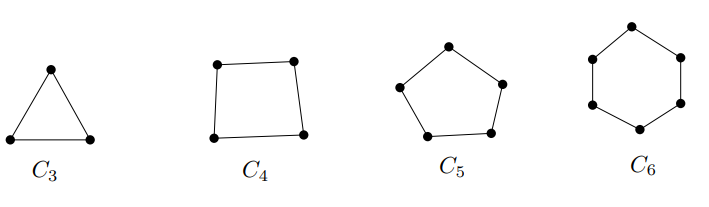

## Definition
**(i)** The ***$n$-cycle*** $C_n$ on $n$ vertices is defined by 

$$V(C_n) = [n] \quad \text{and} \quad E(C_n) = \{\{ 1, 2 \}, \{ 2, 3 \}, ..., \{ n-1, n \}, \{ n, 1 \} \}.$$

**(ii)** A ***cycle*** in a graph $G$ is a subgraph isomorphic to $k$-cycle $C_k$ for some $k \le \vert V(G) \vert$.

## Theorem
The number of $k$-cycles in a graph $G$ with $\vert V(G) \vert = n$ is 

$$\binom{n}{k} \frac{(k-1)!}{2}.$$

### Proof
By choosing the $k$ vertices and arrange them in order, we have 

$$\binom{n}{k} k!.$$

Since the cycle does not depend on the starting vertex and the direction of the cycle, we should divide by $2k$. Thus, we obtain 

$$\binom{n}{k} \frac{k!}{2k} = \binom{n}{k} \frac{(k-1)!}{2}. \blacksquare$$ 

## Corollary
The number of cycles in $K_n$ is given by 

$$\sum_{k=3}^n \binom{n}{k} \frac{(k-1)!}{2}.$$

# Reference
- Matousek, J., & Nesetril, J. (2008). Invitation to Discrete Mathematics. Oxford University Press.