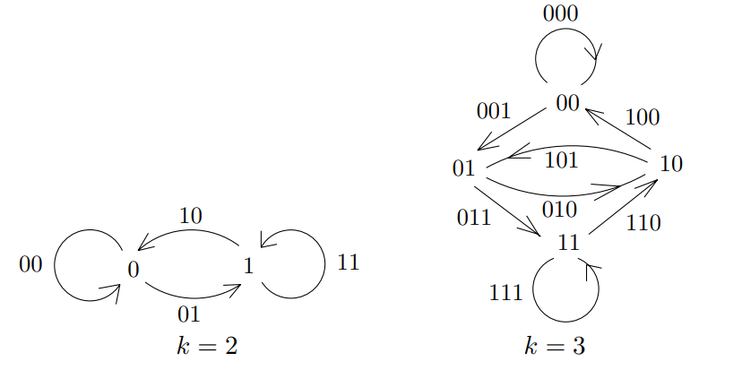
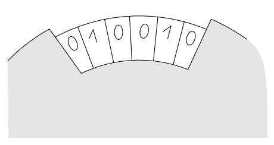

## Definition
For each $k \ge 2$, the ***De Bruijn graph*** $D_k$ is a digraph having $V(D_k) = \{0, 1\}^{k-1}$ and edges defined by 

$$(a_1, a_2, \cdots, a_{k-1}) \to (a_2, a_3, \cdots, a_k), \forall (a_1, \cdots, a_k) \in \{0, 1\}^k.$$

We refer to the edge $(a_1, a_2, \cdots, a_{k-1}) \to (a_2, a_3, \cdots, a_k)$ as $a_1a_2\cdots a_k.$

## Theorem
For each $k \ge 2$, $D_k$ is Eulerian. 

### Proof
Note that for each $v \in D_k$, $\mathrm{deg}^+(v) = 2 = \mathrm{deg}^-(v)$. 

From any vertex $v = (a_1, \cdots, a_{k-1})$, we have the path 

$$(a_1, \cdots, a_{k-1}) \to (a_2, \cdots, a_k, 0) \to (a_3, \cdots, a_k, 0, 0) \to \cdots \to (a_k, 0, \cdots, 0) \to (0, \cdots, 0)$$

from $v$ to $(0, \cdots, 0)$. Thus, we can always find a walk between any two vertices of $D_k$, so $D_k$ is connected.

By [Theorem](<#theorem>), $D_k$ is Eulerian. $\blacksquare$

## Remark
De Bruijn graph는 다음과 같이 응용할 수 있다고 한다.

그림과 같이 $0$과 $1$로만 이루어진 숫자들이 고정되어서 원형으로 배치되어 있을 때, 룰렛을 돌려서 $6$개 숫자를 얻는다고 하자. 이때 $(0, 0, 0, 0, 0, 0)$부터 $(1, 1, 1, 1, 1, 1)$까지 총 $2^6 = 64$개의 경우의 수가 존재한다. 이 모든 경우의 수를 나타낸다고 하면, 총 $64$개의 $0$과 $1$들을 원형으로 잘 배치해야 한다. 이때 $64$개의 모든 경우의 수를 얻을 수 있게 하는 룰렛을 항상 만들 수 있을까? 

이 문제는 사실상 De Bruijin graph가 Eulerian인지 묻는 문제와 동일하다. 위 정리에서 모든 De Bruijn graph가 Eulearian임을 보였으므로 우리는 모든 경우의 수를 얻을 수 있도록 항상 숫자들을 원형으로 잘 배치할 수 있다. 

예컨대 $k=3$에서 예시를 들면, directed closed Eulerian trail은 다음과 같이 잡을 수 있다. 

$$(0, 0) \to (0, 0) \to (0, 1) \to (1, 1) \to (1, 1) \to (1, 0) \to (0, 1) \to (1, 0) \to (0, 0)$$

이 trail을 edge 표현으로 쓰면 $00111010$이고, 원형으로 배치하면 우리가 원했던 모든 경우의 수를 다 얻게 하는 룰렛이 완성된다. 같은 방식으로 각각의 $k$에 대해서도 룰렛을 만들 수 있다. 

# Reference
- Matousek, J., & Nesetril, J. (2008). Invitation to Discrete Mathematics. Oxford University Press.