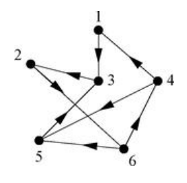

## Definition
**(i)** A ***directed graph***, or ***digraph*** is a pair $(V, E)$, where $V$ is a set of vertices and $E \subset V \times V$ is a set of edges. We write $u \to v$ if $(u, v) \in E$. 

**(ii)** The ***adjacency matrix*** of a directed graph is defined by 

$$A_{ij} = \begin{cases} 1 & \text{if } j \to i \\ 0 & \text{otherwise} \end{cases}$$

말 그대로 에지에 방향을 고려한 그래프로, 유향 그래프라고 부른다. 정의상 유향 그래프의 인접 행렬은 더이상 대칭 행렬이 아니다. 주의할 점은 $i \to j$이면 $A_{ij} = 1$이 아니라 거꾸로 $j \to i$이어야 $A_{ij} = 1$이 된다. 

## Example

예컨대 위 그래프의 경우 인접 행렬은 다음과 같다.

$$\begin{bmatrix}
0 & 0 & 0 & 1 & 0 & 0 \\
0 & 0 & 1 & 0 & 0 & 0 \\
1 & 0 & 0 & 0 & 1 & 0 \\
0 & 0 & 0 & 0 & 0 & 1 \\
0 & 0 & 0 & 1 & 0 & 1 \\
0 & 1 & 0 & 0 & 0 & 0
\end{bmatrix}$$

# Reference
- Newman, M.E.J. (2010). Networks: An Introduction. Oxford University Press.