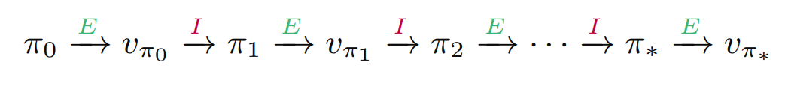
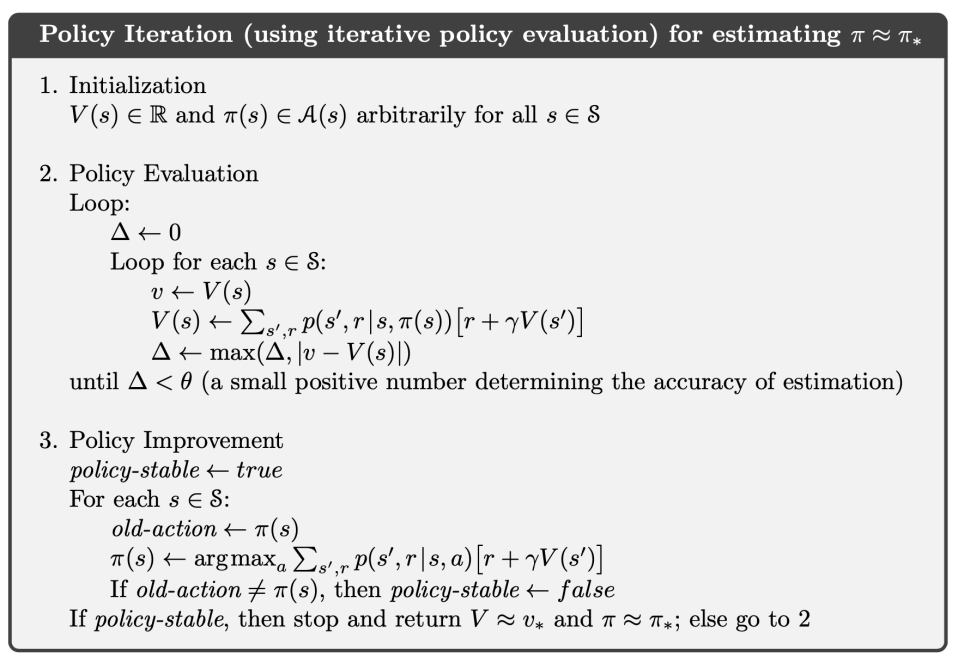
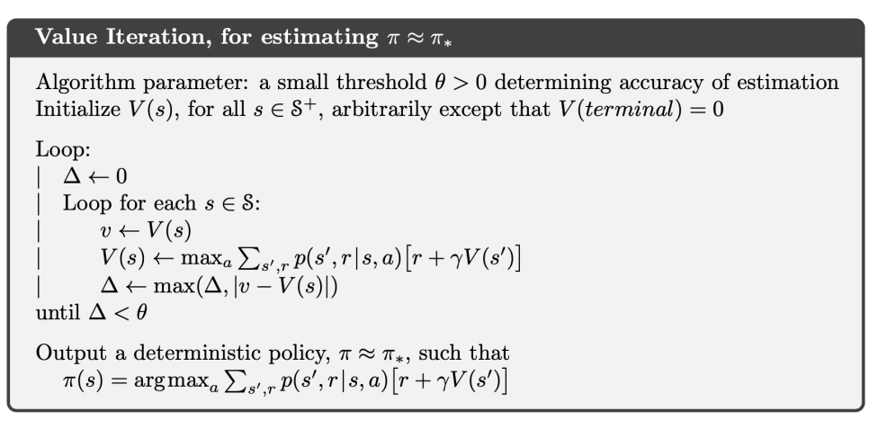
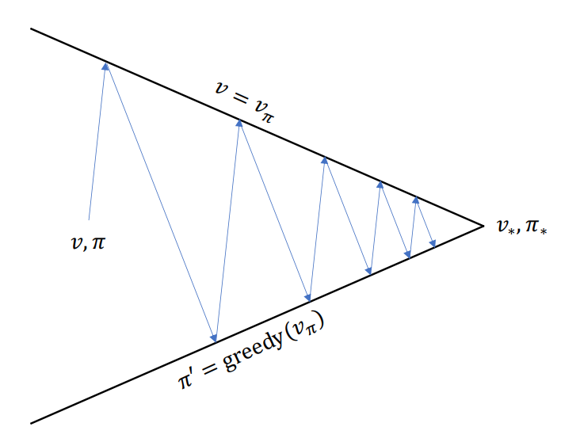
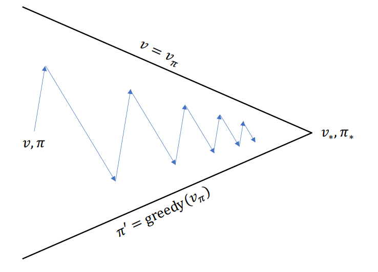

# Dynamic Programming
강화 학습에서 ***dynamic programming (DP)***이란 환경에 대한 완벽한 모델이 주어졌다는 전제 하에, 다시 말해 dynamics function $p$가 주어졌다는 가정 하에 optimal policy를 찾아내는 방법이다. 즉 MDP를 푸는 방법 중 하나로 제시된다. 

거꾸로 말해서, $p$가 주어져 있지 않다면 DP를 사용할 수 없지만 강화 학습에서 사용되는 대부분의 방법들은 사실상 DP와 같은 효과를 만들어 내기 위해 시도하는 방법들에 불과하다.

DP는 policy evaluation과 policy improvement라는 두 단계로 구분된다. Policy evaluation은 주어진 policy의 value function을 계산하는 과정이고, policy improvement는 value function을 통해 policy를 개선하는 과정이다. 두 과정을 반복하다 보면 언젠가는 optimal policy
를 찾을 수 있고, 우리의 목표가 달성된다.

## Policy Evaluation
간단하게 말해서 policy $\pi$를 주면 value function $v_\pi$를 계산하는 과정이다. 이론적으로는 $\pi$가 주어지면 $v_\pi$를 정의를 통해 바로 계산할 수 있지만, 차원의 저주와 같은 문제로 인해 현실적으로 쉽지 않다. 때문에 iteration을 통해 계산해내는 과정이 필요하고, 이 과정이 policy evaluation에서 이뤄진다. Prediction problem이라고도 부른다.

기본적으로 Bellman equation을 통해 계산해낸다.

$$v_\pi(s) = \sum_{a \in \mathcal{A}(s)} \pi(a \mid s) \sum_{s' \in \mathcal{S}} \sum_{r \in \mathcal{R}} p(s', r \mid s, a) \left( r + \gamma v_\pi(s') \right)$$

초기값 $v_0$는 임의로 주고, $v_1, v_2, \cdots$을 Bellman equation으로 업데이트해서 계산해준다. 즉, 

$$v_{k+1}(s) \longleftarrow \sum_{a \in \mathcal{A}(s)} \pi(a \mid s) \sum_{s' \in \mathcal{S}} \sum_{r \in \mathcal{R}} p(s', r \mid s, a) \left( r + \gamma v_k(s') \right)$$

으로 주어진다.

## Policy Improvement
Policy evaluation에서 value function $v_\pi$를 계산해 냈으면 이를 통해 $\pi$보다 더 나은 정책 $\pi'$을 계산해 낼 수 있고, 이를 policy improvement라고 부른다. Control이라고도 부른다. 구체적으로는 다음의 정리에 기반한다.

### Policy Improvement Theorem
Let $\pi$ and $\pi'$ be any pair of deterministic policies such that, for all $s \in \mathcal{S}$,
$$
q_\pi(s, \pi'(s)) \ge v_\pi(s).
$$

Then the policy $\pi'$ must be as good as, or better than $\pi$.

우리는 $\pi$를 통해 새로운 정책 $\pi'$을 유도해내려고 한다. 이때 $\pi'$은 위 정리의 가정을 만족하도록 정의해야 하는데, 다음과 같이 assign해주면 된다.

$$\begin{align*}
\pi'(s) &\leftarrow \underset{a}{\arg\max} \, q_\pi(s, a) \\
&= \underset{a}{\arg\max} \, \mathbb{E} [R_{t+1} + \gamma v_\pi(S_{t+1}) \mid S_t = s, A_t = a] \\
&= \underset{a}{\arg\max} \sum_{s', r} p(s', r \mid s, a) [r + \gamma v_\pi(s')]
\end{align*}$$

보이는 바와 같이 그리디하게 선택하는 방법이다. 

한편, 이렇게 개선된 정책 $\pi'$가 진짜 optimal policy라고 어떻게 확신할 수 있을까? 만약 $\pi$와 $\pi'$이 조금이라도 차이가 있다면 $\pi'$이 $\pi$에 비해 개선된 정책이라는 뜻이므로 우리는 optimal하다고 확신할 수 없지만, 만약 차이가 없다면 더이상 개선될 여지가 없는 정책, 다시 말해 optimal에 도달했다고 생각할 수 있으므로 더이상 변화가 없을 때까지 policy evaluation과 improvement를 반복하게 된다. 즉 다음과 같은 iteration이 이루어지고, 이를 ***policy iteration***이라고 부른다.

## Policy Iteration Pseudocode

## Value Iteration
한편 policy iteration은 한 가지 단점이 있는데, policy evaluation 과정에서 꽤나 많은 반복이 필요하다는 점이다. 어차피 중간중간 모든 정책들을 사용할 것도 아닌데, 이 모든 정책들의 value function을 다 구할 필요가 있을까?

이러한 질문에서 나온 방법이 value interation이다. Policy iteration이 Bellman equation에 근거하고 있는 것과 달리, value interation은 Bellman optimal equation에 기반한다. Policy iteration에서 중간중간의 정책 $\pi$의 value function $v_\pi$를 업데이트해 가며 수렴하도록 기다리는 반면, value iteration은 max를 활용해 한 번에 값을 정해버린다. 이렇게 $\pi$를 개선해 나가도 최종적으로는 optimal policy $\pi_\ast$에 수렴함이 증명되었기 때문에 이러한 방법을 사용할 수 있다.

## Value Iteration Pseudocode

## Generalized Policy Iteration
위에서 살펴보았던 policy iteration과 value iteration은 모두 policy evaluation과 improvement라는 DP의 두 가지 단계를 어떻게 번갈아 수행할 것인가에 대한 방법일 뿐, 사실상 하나의 방법에 불과하다. 이렇듯 DP의 두 가지 단계를 적절히 번갈아 수행해 나가는 프레임워크를 ***generalized policy iteration (GPI)***이라고 부른다. 두 단계가 모든 상태에 대한 업데이트를 계속한다면 최종적으로 optimal policy에 수렴함이 보장되어 있기 때문에 우리는 GPI라는 하나의 틀 아래 DP를 진행할 수 있다.

예컨대 policy iteration은 다음과 같이 수행된다.

반면 GPI는 일반적으로 다음과 같이 수행된다.

## Conclusion
이와 같이 MDP를 풀기 위해 DP는 매우 효과적인 방법이지만, 데이터의 크기 자체가 커지면 차원의 저주로 인해 효율이 상당히 떨어지는 것 또한 사실이다. 또한 dynamics function $p$가 주어져 있다는 가정 하에 진행되기 때문에, $p$를 모르는 경우에는 직접적으로 사용할 수 없다는 단점이 있다. 따라서 이러한 model-free 문제에서는 DP와 비슷한 효과를 낼 수 있는 다른 방법들을 고안해내게 되고, Monte Carlo나 temporal difference learning과 같은 방법들이 등장하게 된다.

# Reference
- Richard S. Sutton, Andrew G. Barto. (2020). Reinforcement Learning : An Introduction (2nd ed.). MIT press.