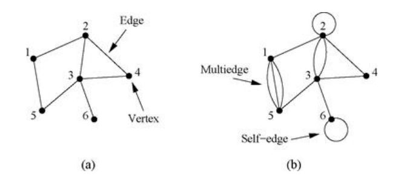

## Definition
**(i)** A graph or network is a pair $G = (V, E)$ where $V$ is a finite set whose elements are called ***vertices*** and $E \subset \binom{V}{2}$ is a set whose elements are called ***edges***. We often write $V(G)$ and $E(G)$ for the vertex set and edge set of a given graph $G$, respectively. 

**(ii)** A graph that has neither self-edges nor multiedges is called a simple graph. 

## Example

단순하게 위 그림에서 (a)가 simple graph인 예시, (b)가 아닌 예시이다. Self-edge란 자기 자신과 연결된 엣지를 말하며 multiedge란 두 버텍스 사이에 연결된 둘 이상의 엣지들을 말한다. 즉 Simple graph는 여러 가능성을 배제한 채 두 버텍스 사이에 딱 하나의 에지만 연결된 단순한 경우만을 고려한 그래프라고 생각할 수 있다. 앞으로 특별한 언급이 없는 경우 그래프는 항상 simple graph로 들고온 것으로 생각한다.

# Reference
- Newman, M.E.J. (2010). Networks: An Introduction. Oxford University Press.