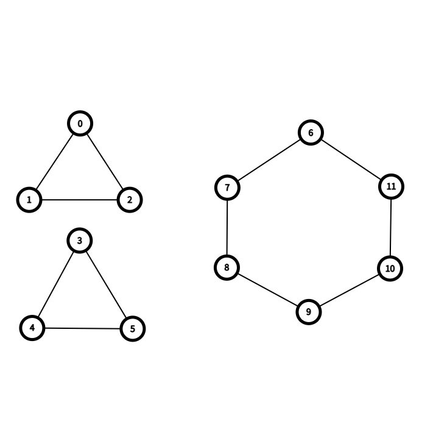

## Definition
**(i)** The ***graph score*** of $G$ is the set $\{ \deg_G(v) \mid v \in V(G) \}$. 

**(ii)** The ***degree sequence*** of $G$ is the sequence of the graph score of $G$ in non-decreasing order.

**(iii)** A non-decreasing sequence $D$ is said to be ***graphic*** if it is the degree sequence of some graph $G$, which is called a ***realisation*** of $D$. That is, the vertex set $V(G)$ satisfies that $\mathrm{deg}_G(v_i) = d_i$ for each $i = 1, 2, \cdots, n$.

## Remark
**(i)** Isomorphic graphs have the same degree sequence.

**(ii)** The converse of (i) is NOT true.

$(\because)$ The following two graphs have the same degree sequence $(2, 2, 2, 2, 2, 2)$, but not isomorphic.

**(iii)** There is a nondecreasing sequence of nonnegative integers which is NOT a degree seqeunce of a graph.

$(\because)$ Take $(1, 2)$. Since the sum of degrees of a graph must be even, $(1, 2)$ cannot be a degree sequence of a graph.

**(iv)** A realisation of the graphic seqeunce need not be unique.

## Theorem (Havel-Hakimi)
If a sequence $D = (d_1, d_2, \cdots, d_n)$ is graphic, then there is a realisation $G$ of $D$ such that the vertex $v_n$, having the degree $d_n$, is adjacent to $v_{n-1}, \cdots, v _ {n - d_n}$. 

### Proof
Let $D = (d_1, \cdots, d_n)$ be a graphic sequence. If $d_n = n-1$, then clearly there is a realisation $G$ of $D$ such that $v_n$ is adjacent to all other verticies $v_{n-1}, \cdots, v_1 (= v_{n - (n-1)}),$ so we are node. 

We may assume that $d_n < n-1$. For each realisation $G$ of $D$, let $j(G)$ be the maximum index $j$ such that $v_j \not \sim v_n$. Let $G$ be the realisation of $D$ that minimizes $j(G)$. Note that $j(G) \ge n-d_n-1 \ge 1$, and we are done if $j(G) = n-d_n-1$. 

We claim that $j(G) = n-d_n-1.$

$\big[(\because)$ Assume that $j = j(G) > n-d_n-1$. Then there is a neighbor $v_z \in V(G)$ of $v_n$ with $z < n-d_n \le j$. Note that $v_z \sim v_n$ but $v_j \not \sim v_n$.  Since $z < j$, we have $d_z \le d_j$, which means that $v_j$ has some neighbor $v_x$ that is not a neighbor of $v_z$. 

Let $G'$ be the graph we get from $G$ by removing the edges $\{ v_n, v_z \}$ and $\{v_j, v_x \}$ and adding the edges $\{ v_n, v_j \}$ and $\{ v_x, v_z \}$. Then $G'$ has the same degree sequence $D$ to $G$, which means that $G'$ is a realisation of $D$. Since $v_j \sim v_n$ and $v_z \not \sim v_n$, we have $j(G') = z < j = j(G)$, which is a contradiction. $\bigotimes$ Thus $j(G) = n-d_n-1$. $\blacksquare$$\big]$

## Corollary
Let $D = (d_1, d_2, \cdots, d_n)$ be a nondecreasing sequence. Then $D$ is graphic $\iff$ the sequence $D' = (d_1, d_2, \cdots, d_{n-d_n-1}, d_{n - d_n}-1, \cdots, d_{n-1} - 1, 0)$ is graphic.

### Proof
If $D$ is graphic, then there is a realisation $G$ of $D$ such that the vertex $v_n$, with $\mathrm{deg}_G (v_n) = d_n$, is adjacent to $v_{n-1}, \cdots, v_{n - d_n}$ by Havel-Hakimi Theorem. By removing the vertex $v_n$ from $G$, we get a realisation $G'$ of $D'$. Thus $D'$ is graphic.

Conversely, if $D'$ is graphic, then there is a realisation $G'$ of $D'$. By adding a vertex adjacent to $v_{n - d_n - 1}, \cdots, v_{n-1}$ to $G'$, we get a realisation $G$ of $D$. Thus, $D$ is graphic. $\blacksquare$

## Algorithm
Remark (iii)에서 언급했듯이, 어떤 수열이 항상 그래프의 degree sequence일 필요는 없다. 그러면 수열이 주어질 때마다 이 수열이 degree sequence인지 결정하는 과정이 필요하고, 그 과정을 알고리즘으로 제시하는 정리가 위 Havel-Hakimi Theorem과 그 Corollary이다. 

수열 $D = (d_1, d_2, \cdots, d_n)$이 주어져 있으면 가장 큰 값을 갖는 degree $d_n$을 $0$으로 바꾼 뒤, 인접한 $d_n$개의 $d_i$들, 그러니까 $d_{n-1}, \cdots, d_{n - d_n}$들의 값에 $1$을 빼서 새로운 수열 $D'$을 얻을 수 있고, $D$와 $D'$의 graphic 여부는 서로 동치이다. (만약 $D'$이 nondecreasing이 아니라면 nondecreasing하도록 재배열시켜줘야 한다.) 어떤 버텍스 $v$를 빼면 그 $v$에 인접해 있던 버텍스들의 degree가 하나씩 줄어들 것이고, 그러한 행위가 수열에도 그대로 반영된다면 그래픽할 수 밖에 없다는 것이다. 

만약 이 과정을 여러 번 반복해서 최종적으로 모든 항이 $0$인 수열을 얻는다면 기존 수열 $D$는 그래픽하다는 사실을 자명하게 알 수 있다. 모든 항이 $0$인 수열은 edge가 없고 버텍스만 존재하는 그래프이기 때문이다. 반대로 모든 항이 $0$인 수열은 얻을 수 없다면, 그 수열은 그래픽하지 않다. 

# Reference
- Matousek, J., & Nesetril, J. (2008). Invitation to Discrete Mathematics. Oxford University Press.