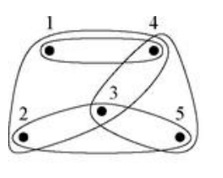

## Hypergraph
일반적인 그래프는 하나의 에지로 두 개의 정점만을 연결하지만, 모든 관계가 항상 이런 식으로 표현될 수 있는 것은 아니다. 예컨대 세 개의 정점이 하나의 그룹으로 묶이는 경우를 표현하려면 지금까지의 방법으로는 한계가 있다. 이러한 관계를 그래프로 나타낸 것을 ***하이퍼그래프***라고 한다. 이렇게 여러 정점들을 연결하는 에지를 ***하이퍼에지***라고 부르고, 보통 루프로 표현된다. 

# Reference
- Newman, M.E.J. (2010). Networks: An Introduction. Oxford University Press.