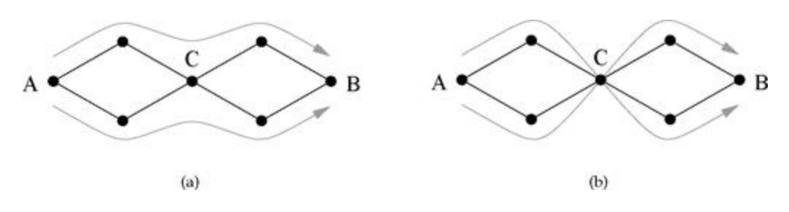

## Definition
Let $G$ be a graph, and let $u, v \in V(G)$.

**(i)** Two $uv$-walks are said to be ***edge-independent*** if they share no edges.

**(ii)** Two $uv$-walks are said to be ***vertex-independent*** if they share no vertices other than $u$ and $v$.

**(iii)** The number of edge-independent $uv$-walks is called the ***edge-connectivity*** of the vertices. 

**(iv)** The number of vertex-independent $uv$-walks is called the ***vertex-connectivity*** of the vertices.

**(v)** The ***vertex cut set*** of $u, v$ is a set of vertices whose removal will disconnect $u$ and $v$.

**(vi)** The ***edge cut set*** of $u, v$ is a set of edges whose removal will disconnect $u$ and $v$.

**(vii)** A ***minimum cut set*** is the smallest cut set that will disconnect a specified pair of vertices.

두 경로가 서로 "독립"이냐를 얘기할 때 에지 기준과 정점 기준으로 할 수 있다. 위 사진에서 (a), (b)의 경우 두 경로는 모두 edge-independent이지만 vertex-independent는 아니다. 즉 vertex-independent walk는 오직 하나만 존재한다고 말할 수 있다. 

또한 위 그래프에서 edge-connectivity는 2, vertex-connectivity는 1이다. Connectivity는 그 이름에서 알 수 있듯이 두 정점이 얼마나 강하게 연결되어 있는지를 나타내는 척도로 사용될 수 있다. 강하게 연결되어 있을수록 독립인 경로가 더 많다고 짐작할 수 있기 때문이다.

한편, 두 정점이 연결되어 있는 상태는 일종의 "bottleneck"의 관점에서도 이해할 수 있다. 예컨대 위 그래프에서 정점 $C$는 $A$에서 $B$로 가기 위해 반드시 지나쳐야 할 bottlenck이 되고, 다시 말해 $C$를 그래프에서 제거한다면 $A$와 $B$는 분리된다. 이러한 점들을 모아놓은 집합을 cut set이라고 부른다. 

## Remark
**(i)** If two walks are vertex-independent, then they are edge-independent, but the reverse is not true.

**(ii)** The edge- or vertex-independent walks between two vertices are not necessarily unique.

**(iii)** The number of edge-independent walks between two vertices cannot exceed the number of edges in the graph. Similarly, the number of vertex-independent walks between two vertices cannot exceed the number of vertices in the graph. 

**(iv)** A minimum cut set need not be unique. 

## Menger's Theorem
- If there is no vertex- or edge-cut set of size less than $n$ between a given pair of vertices, then there are at least $n$ vertex- or edge-independent paths between the same vertices. 

정리의 스테이트먼트 자체만 해석해 보면 다음과 같다. 즉 cut set의 크기의 lower bound가 $n$으로 주어져 있다면 독립 경로의 개수 또한 lower bound로 $n$이 주어진다는 것이다. 이를 minimum cut set의 관점에서 본다면, 더 크리티컬한 결과가 생긴다. 

두 정점 사이의 minimum cut set의 크기가 $n$으로 주어져 있다고 해보자. 그러면 독립 경로의 개수는 적어도 $n$개 이상으로 주어진다. 즉, 

$$\vert \text{minimum cut set} \vert \le \text{number of independent walks}$$

이 성립한다. 역으로 이번에는 독립 경로의 개수가 $n$개로 주어져 있다고 해보자. 편의상 vertex-independent walk로 가정하자. 더도 덜도 말고 딱 $n$개로 주어져 있으므로, 두 정점의 연결성을 끊으려면 이 $n$개의 독립 경로에게서 적어도 하나씩은 정점을 제거를 해야 연결성을 끊을 수 있을 것이다. 다시 말해 minimum cut set의 크기는 적어도 $n$ 이상이 되고, 

$$\text{number of independent walks} \le \vert \text{minimum cut set} \vert$$

이 성립한다. 위 두 결과를 합치면 결국 minimum cut set의 크기와 독립 경로의 개수는 항상 같다는 결과가 도출된다.

## Corollary
- The size of the minimum vertex cut set that disconnects a given pair of vertices in a graph is equal to the vertex connectivity of the same vertices.

# Reference
- Newman, M.E.J. (2010). Networks: An Introduction. Oxford University Press.