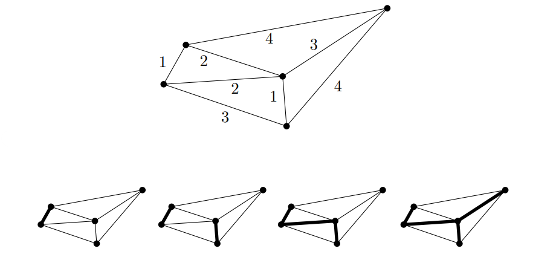

## Kruskal's Algorithm
***Input:*** A connected weighted graph $(G, w).$

***Steps:***
Let $T$ be an null subgraph of $G$, that is, $E(T) = \emptyset$ and $V(T) = V(G).$

**(i)** Order the edges $\{ e_1, e_2, \cdots, e_m \}$ of $G$ by weight labeled to them: 

$$w(e_1) \le w(e_2) \le \cdots \le w(e_m)$$

**(ii)** Add the edge $e_1$ to $T.$ 

**(iii)** For $i = 1$ to $m$, add $e_i$ to $T$ unless it makes a cycle. 

***Output:*** The spanning tree $T \le G$ that minimizes $w(T).$

## Theorem
The spanning tree $T$ of $G$ returned by Kruskals' algorithm is a minimum weighted spanning tree of $G$.

### Proof
First, we will show that $T$ is a spanning tree.

Note that $T$ has no cycle. If $T$ has more than one component, then there is some edge $e_i$ of $G$ between two of the components, because $G$ is connected. If we add $e_i$ to $T$, it makes no cycle, so it should have been added by the algorithm, which is a contradiction that $T$ is the output of the algorithm. Thus, $T$ has only one component, and an addition of any edge to $T$ makes a cycle in $T$, which means that $T$ is a tree. Since $V(T) = V(G)$, $T$ is a spanning tree of $G$. 

Next, we will show that $T$ is a minimum weighted.

Assume, towards contradiction, that $S$ is a spanning tree of $G$ of weight less than $T$, that is, $w(S) < w(T).$ Clearly, $S$ and $T$ have the same number of edges by the construction of the algorithm. 

Label the edges of $T$ as $\{ t_1, \cdots, t_n \}$ such that 

$$w(t_1) \le w(t_2) \le \cdots \le w(t_n),$$

and similarly, label the edges of $S$ as $\{ s_1, \cdots, s_n \}$ such that 

$$w(s_1) \le w(s_2) \le \cdots \le w(s_n).$$

As $w(S) < w(T),$ there exists an index $i \in \{ 1, \cdots, n \}$ such that $w(s_i) < w(t_i).$ We may assume that $i$ is the smallest index for which this holds.

Let $T'$ be the subgraph of $T$ consisting of the edges $\{ t_1, \cdots, t_{i-1} \}$, and let $S'$ be the subgraph of $S$ consisting of the edges $\{ s_1, \cdots, s_i \}.$ Since both $T'$ and $S'$ are subgraphs of trees, they have components consisting of trees, which contain all vertices of $G.$ 

We claim that there is an edge in $S'$ that goes between two components of $T'$.

To see this, we assume that each component $C$ of $T'$ has $n_C$ vertices and $n_C + 1$ edges of $T'.$ (Because they are trees.) Then there can only be at most $n_C + 1$ edges of $S'$ between vertices of $C$, because $S'$ is acyclic. 

Summing the number of edges of $S'$ in the components of $T'$, we get at most $i-1,$ because $T'$ has $i-1$ edges. Since $S'$ has $i$ edges, there must exists an edge $s$ in $S'$ that goes between two components of $T'.$ 

Since this $s \in \{ s_1, \cdots, s_i \}$, we have $w(s) \le w(s_i) < w(t_i)$. Since $s$ is between two components of $T'$, the addition $s$ to $T'$ does not make a cycle, so it sholud have been added to $T$ before $t_i$ by the algorithm, which is a contradiction. Thus, $T$ is a minimum weighted spanning tree. $\blacksquare$

## Example
연결 그래프 $G$가 주어지면 spanning tree는 쉽게 찾을 수 있지만, 많은 상황에서는 그래프에 가중치가 부여된 상황에서 가중치를 최소화하는 spanning tree를 찾는 문제를 해결해야 한다. 이런 상황에서는 문제가 조금 더 복잡해지지만, 위에 서술되어 있는 바와 같이 그리디 알고리즘으로 해결할 수 있다. 

예시로 확인해보자. 위와 같이 각 에지에 가중치가 부여된 연결 그래프가 주어졌다. 각 노드를 가중치의 크기가 낮은 순서부터 나열해서 하나씩 선택해 나간다. 

가중치 $1$에 해당하는 에지 두 개가 선택되었고, 그 다음에 $2$에 해당하는 에지를 선택해야 하는데 둘 모두를 선택하면 사이클이 생기므로 tree가 아니다. 따라서 둘 중 임의로 하나를 선택한다. 다음으로, 아래 쪽에 있는 $3$은 사이클이 만들어지므로 위쪽 $3$을 선택하고, $4$는 어느 걸 고르든지 항상 사이클이 생기므로 선택하지 않는다. 이제 모든 에지를 탐색했으므로 알고리즘은 종료되고, 결과물은 당연하게 minimum spanning tree이다. 

# Reference
- Matousek, J., & Nesetril, J. (2008). Invitation to Discrete Mathematics. Oxford University Press.