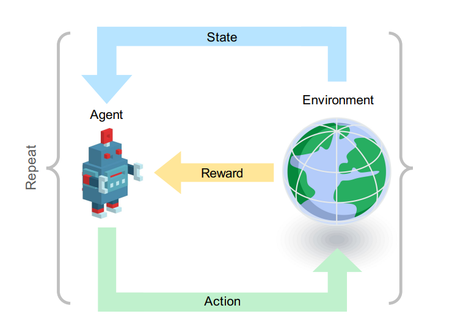
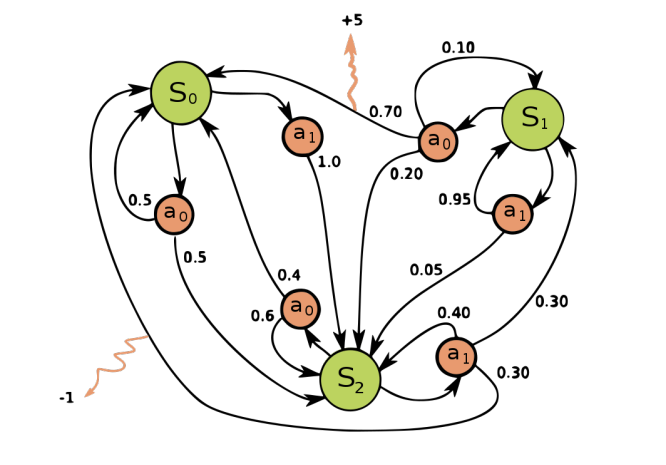
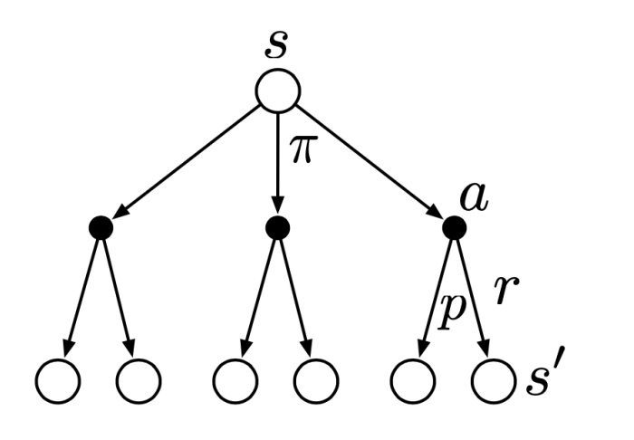

# Agent-Environment Interface
강화학습에서 순차적 의사 결정이란, 특정한 상태에서 행동과 보상을 통해 또 다른 상태로 이동하는 전이 과정을 의미한다. 행동하는 주체는 에이전트라고 부르고, 에이전트는 특정한 환경 안에 있는 상태에 영향을 받아 행동을 하며, 환경은 주체가 행한 행동에 따라 보상을 준다. 이때 강화학습의 목적은 앞으로 받을 보상의 총합을 최대화하는 것이다. 이 말인즉슨, 그리디하게 움직이지 않는다는 뜻이며 다시 말해 보상이 즉각적이지 않을 수 있다는 뜻이다. 또한 음의 보상도 가능하며, 이런 경우 최대한 음의 보상을 피하는 쪽으로 행동을 하게 된다. 

예컨대 알파고를 생각해보면, 주체는 알파고 자신이며 환경은 대국판이다. 이때 대국판 위에 현재 바둑알이 어떻게 배치되어 있는지가 현재 상태이며, 다음 배치로 넘어가기 위해 알파고가 두는 하나 하나의 수가 모두 행동이 된다. 그렇지만 보상이 즉각적으로 오진 않으며, 대국이 끝난 뒤 승패에 따라 주어진다. 

이러한 과정을 형식화하면 다음과 같다.

- For each time $t = 0, 1, 2, \dots,$

1. agent receives state information $S_t \in \mathcal{S}$
2. agent selects an action $A_t \in \mathcal{A}(s_t)$
3. (one step later) agent receives reward $R_{t+1}$ and next state $S_{t+1}$ is
determined.

- Interactions produce a sequence (or trajectory): $S_0, A_0, R_1, S_1, A_1, R_2, S_2, A_2, \dots$

# Markov Decision Process
이 포스트에서는 이러한 의사 결정을 하기 위한 규칙 중 마르코브 성질을 가지는 의사 결정 모델인 마르코브 결정 과정을 다룬다. 

## Markov Property
- A state $s$ has the ***Markov property*** if 

$$\begin{align*}
&\mathbb{P} \{ S_t = s', R_t = r \mid S_{t-1} = s, A_{t-1} = a \} \\ = &\mathbb{P} \{ S_t = s', R_t = r \mid S_0, \cdots, S_{t-1} = s, A_0, \cdots A_{t-1} = a \}
\end{align*}$$

for all possible histories $\{ S_0, A_0, \cdots, S_{t-1}, A_{t-1} \}$.

내가 현재 있는 위치를 생각해보자. 이 위치에 있기까지 실제로 내가 이동해온 경로 뿐만 아니라, 나는 수많은 경로들로 움직여서 이 위치에 도달할 수 있었겠지만 그 모든 가능성에 상관없이 다른 위치로 이동하는데 영향을 미치는 건 오직 내가 현재 어느 위치에 있느냐 뿐이다. 이러한 성질을 마르코브 성질이라고 부른다. 

$$\text{"The future is independent of the past given the present."}$$

## Dynamics Function
We define the ***dynamics function*** $p: \mathcal{S} \times \mathcal{R} \times \mathcal{S} \times \mathcal{A} \to [0, 1]$ (takes $4$ arguments: next state, reward, current state, action) by 

$$p(s', r \mid s, a) = \mathbb{P} \{ S_t = s', R_t = r \mid S_{t-1} = s, A_{t-1} = a \}$$

for all $s', s \in \mathcal{S}, r \in \mathcal{R}$ and $a \in \mathcal{A}(s)$.

Dynamics function이란 쉽게 말해 conditional joint probability mass function이다. $t-1$ 시점에서의 상태와 행동이 주어졌을 때 $t$ 시점에서 $s'$이라는 상태에 처하고 $r$이라는 보상을 얻을 확률을 알려준다. 다시 말해 주체가 처한 환경이 어떻게 형성되어 있는지에 대한 정보를 담고 있는 함수라고 할 수 있다. 이때 다음과 같은 여러 값들을 계산할 수 있다. 

1. State-transition 

$$p(s'|s, a) := \mathbb{P}\{S_t = s' | S_{t-1} = s, A_{t-1} = a\} = \sum_{r \in \mathcal{R}} p(s', r | s, a)$$

2. Expected rewards for state-action pair

$$ r(s, a) := \mathbb{E}\{R_t | S_{t-1} = s, A_{t-1} = a\} = \sum_{r \in \mathcal{R}} r \sum_{s' \in \mathcal{S}} p(s', r | s, a) $$

3. Expected rewards for state-action-next-state triple

$$ r(s, a, s') := \mathbb{E}\{R_t | S_{t-1} = s, A_{t-1} = a, S_t = s'\} = \sum_{r \in \mathcal{R}} r \frac{p(s', r | s, a)}{p(s' | s, a)} $$

## Example

Note that 

- Joint probability of $s_0$ and reward $5$ after taking $a_0$ in $s_1$: $p(s_0, 5|s_1, a_0) = 0.7$
- Transition to $s_2$ after taking $a_0$ in $s_1$: $p(s_2|s_1, a_0) = 0.2$
- Expected reward of $a_0$ in $s_1$: $r(s_1, a_0) = 5 \cdot 0.7 + 0 \cdot 0.1 + 0 \cdot 0.2 = 3.5$

## Return
도입부에서 주체는 앞으로 받을 보상의 총합을 최대화하길 원한다고 했었다. 이를 표현하기 위해 $t$ 시점을 기준으로 받게 될 보상의 총합을 $G_t$라고 쓰자. 이때 두 가지 가능성이 있는데, 유한한 시간 안에 모든 과정이 끝나는 경우인 ***episodic case***와 한없이 이어지는 경우인 ***continuing case***, 혹은 ***non-episodic case***가 있다.

$$\begin{align*}
G_t := \begin{cases}
\text{(episodic)}  & R_{t+1} + R_{t+2} + R_{t+3} \cdots + R_T \\
\text{(continuing)} & R_{t+1} + \gamma R_{t+2} + \gamma^2 R_{t+3} \cdots = \sum_{k=0}^\infty \gamma^k R_{t+k+1}
\end{cases} \\
\text{where } \gamma \in [0, 1] \text{ is the discount rate.}
\end{align*}$$

Episodic case를 종료 시점 $T$에서 무한히 빠져나오지 못하는 상태로 간주한다면 두 정의를 합쳐서 다음과 같이 일반적으로 쓸 수 있다.

$$G_t := \sum_{k = t+1}^T \gamma^{k - t-1} R_k \quad (\text{possibly } T = \infty \text{ or } \gamma = 1)$$

## Policy
The ***policy*** $\pi$ is a mapping from states to possible action defined by 

$$\pi(a \mid s) = \mathbb{P} \{ A_t = a \mid S_t = s \}$$

이름 그대로 주체가 주어진 환경에서 어떤 행동을 할지 결정하는 역할을 하는 "정책"이다. 크게 결정론적 정책과 확률적 정책 두 가지를 생각해 볼 수 있다. 

1. Deterministic policy: $\pi(a' \mid s) = 1$ for some $a'$ and $\pi(a \mid s) = 0, \forall a \neq a'$

2. Stochastic policy: $\pi(a \mid s)$ is constant for each $a \in \mathcal{A}(s).$ 

가위바위보를 예를 들면, 결정론적 정책은 항상 바위만 내는 전략이고 확률적 정책은 가위, 바위, 보를 균등하게 $\frac{1}{3}$의 확률로 내는 전략이다. 주체는 어떤 정책을 주느냐에 따라 각 상태에 처했을 때 행동이 달라진다.

## Value Function
**(i)** ***State-value function*** under policy $\pi$

$$v_\pi(s) := \mathbb{E}_\pi[G_t | S_t = s] = \mathbb{E}_\pi\left[ \sum_{k=0}^{\infty} \gamma^k R_{t+k+1} \mid S_t = s \right]$$

**(ii)** ***Action-value function*** under policy $\pi$

$$q_\pi(s, a) := \mathbb{E}_\pi[G_t | S_t = s, A_t = a] = \mathbb{E}_\pi\left[ \sum_{k=0}^{\infty} \gamma^k R_{t+k+1} \mid S_t = s, A_t = a \right]$$

Value function은 정책 $\pi$ 하에서 주어진 상태 $s$가, 혹은 상태-행동 페어 $(s, a)$가 "얼마나 좋은지"를 측정해주는 함수이다. 정의를 보면 알겠지만, return값 $G_t$의 기댓값으로 정의된다. 앞서 주체의 목표는 앞으로 받을 보상의 총합 최대화하는 것임을 언급했는데, $G_t$는 확률변수이므로 최대화한다는 개념이 성립하지 않는다. 따라서 우리의 목표는 $G_t$의 기댓값을 최대화하는 것으로 바뀌게 되며, $G_t$의 기댓값이 높으면 높을수록 주어진 $s$ 혹은 $(s, a)$가, 또한 주어진 정책 $\pi$가 얼마나 좋은지 알 수 있다. 

$v$는 $s$ 하나로 측정하는 데 반해 $q$는 $(s, a)$로 측정한다는 점에 유의하자. 상태 $s$에서 주체가 행할 수 있는 수많은 행동들이 있을텐데, $q$는 그 행동들 중 $a$라는 특정한 하나의 행동에 대해서 측정한다. 그러면 자연스럽게 $v$와 $q$를 엮을 수 있을텐데, 그 관계는 다음과 같이 주어진다.

$$v_\pi(s) = \sum_{a \in \mathcal{A}(s)} \pi(a \mid s) q_\pi (s, a)$$

한편, value function은 우리의 목표와 직결되어 있는 중요한 개념이다. $G_t$는 간단히 말해 보상들의 총합인데, 보상은 주체가 각 시점에서 처한 상태에서 어떤 행동을 하느냐에 따라 결정된다. 그리고 앞서 설명한 것처럼 행동은 정책 $\pi$에 영향을 받으므로, 결국 우리의 목표는 $G_t$의 기댓값을 최대화하는 그러한 정책 $\pi_\ast$를 찾는 것으로 바뀌게 된다.

## Bellman Equation
앞서 보았듯이, 의사 결정 구조는 특정 상태에서 행동을 함으로 또 다른 상태로 이동하고 보상을 얻는 전이 과정이 반복됨으로써 수열이 얻어진다. 또한 이 수열에서 보상인 $R$들을 모두 더함으로써 return 값인 $G_t$가 얻어진다. 

이걸 뒤집어서 생각해보면, 내가 현재 특정 상태 $s$에 있고, 이 상태가 정책 $\pi$ 하에서 얼마나 "좋은지"를 측정하기 위해서는 필연적으로 상태 $s$에서 가능한 행동들과 그 행동으로 옮겨지는 또 다른 상태들을 고려할 수 밖에 없다는 뜻이다. 이러한 관계를 나타낸 방정식이 Bellman equation이다.

우선 $G_t = R_{t+1} + \gamma R_{t+2} + \gamma^2 R_{t+3} + \cdots$이므로, recursively 표현하면 $G_t = R_{t+1} + \gamma G_{t+1}$과 같이 쓸 수 있고, 따라서 다음과 같이 쓸 수 있음을 알 수 있다. 

$$
\begin{aligned}
v_\pi(s) &= \mathbb{E}_\pi [G_t \mid S_t = s] \\
&= \mathbb{E}_\pi [R_{t+1} + \gamma G_{t+1} \mid S_t = s]
\end{aligned}
$$

또한 정책 $\pi$와 dynamics function $p$의 정의에 의해 위 값은 다음과 같이 쓸 수 있다.

$$
\begin{aligned}
v_\pi(s) &= \mathbb{E}_\pi [R_{t+1} + \gamma G_{t+1} \mid S_t = s] \\
&= \sum_{a \in \mathcal{A}(s)} \pi(a \mid s) \mathbb{E}_\pi \left[ R_{t+1} + \gamma G_{t+1} \mid S_t = s, A_t = a \right] \\
&= \sum_{a \in \mathcal{A}(s)} \pi(a \mid s) \sum_{s' \in \mathcal{S}} \sum_{r \in \mathcal{R}} p(s', r \mid s, a) \mathbb{E}_\pi \left[ R_{t+1} + \gamma G_{t+1} \mid S_t = s, A_t = a, S_{t+1} = s', R_{t+1} = r \right] \\
\end{aligned}
$$

한편 기댓값은 선형이므로 다음과 같이 분리해서 쓸 수 있다.

$$
\begin{align*}
v_\pi(s) &= \sum_{a \in \mathcal{A}(s)} \pi(a \mid s) \sum_{s' \in \mathcal{S}} \sum_{r \in \mathcal{R}} p(s', r \mid s, a) \mathbb{E}_\pi \left[ R_{t+1} + \gamma G_{t+1} \mid S_t = s, A_t = a, S_{t+1} = s', R_{t+1} = r \right] \\
&= \sum_{a \in \mathcal{A}(s)} \pi(a \mid s) \sum_{s' \in \mathcal{S}} \sum_{r \in \mathcal{R}} p(s', r \mid s, a) ( \mathbb{E}_\pi [R_{t+1} \mid S_t = s, A_t = a, S_{t+1} = s', R_{t+1} = r] \\
&+ \gamma \mathbb{E}_\pi [G_{t+1} \mid S_t = s, A_t = a, S_{t+1} = s', R_{t+1} = r] ) \\
&= \sum_{a \in \mathcal{A}(s)} \pi(a \mid s) \sum_{s' \in \mathcal{S}} \sum_{r \in \mathcal{R}} p(s', r \mid s, a) \left( r + \gamma v_\pi(s') \right)
\end{align*}
$$

마지막 등호는 

$$\mathbb{E}_\pi \left[ G_{t+1} \mid S_{t+1} = s' \right] = v_\pi(s')$$

에서 얻어지는데, value function의 값은 오직 상태 $s'$에만 의존하기 때문에 성립하는 관계식이다. 원래 정의의 형태만 생각하면

$$\mathbb{E}_\pi \left[ G_{t} \mid S_{t} = s' \right] = v_\pi(s')$$

이어야만 할 것 같지만, $s'$이라는 상태가 $S_t$에서 시작했건 $S_{t+1}$에서 시작했건 사실 우리로서는 알 바 아니다. $s'$이라는 상태에서 시작해서 앞으로 얻게 될 보상의 누적합인 $G_t$의 기댓값이 목적이기 때문이다. 

따라서 최종적으로 

$$v_\pi(s) = \sum_{a \in \mathcal{A}(s)} \pi(a \mid s) \sum_{s' \in \mathcal{S}} \sum_{r \in \mathcal{R}} p(s', r \mid s, a) \left( r + \gamma v_\pi(s') \right)$$

이라는 식을 얻게 되고, 이를 ***Bellman equation***이라고 부른다. 

복잡해 보이지만 단지 보상의 weighted sum에 불과하다. 식 맨 끝 괄호 안의 항 $(r + \gamma v_\pi(s'))$에 주목하자. $r$은 현재 상태 $s$에서 $a$라는 행동을 한 뒤 전이된 상태 $s'$에서 얻게 될 보상이며, $v_\pi(s')$은 그렇게 전이된 상태 $s'$에서 평가한 value function의 값이다. 이걸 policy $\pi$와 dynamics function $p$로 주어지는 확률에 근거해 모든 $a, s', r$에 대해서 모두 더하면 현재 상태 $s$에서의 value function의 값이 나온다는 것이다. 

자세히 보면 현재 상태 $s$에서 할 수 있는 모든 행동 $a$와 그렇게 해서 옮겨진 모든 상태 $s'$, 그리고 얻을 수 있는 모든 보상 $r$을 고려한 식이다. 특별히 바로 다음 상태에서 다이렉트하게 얻어지는 보상 $r$과 한 상태를 건넌 value function의 값을 discount해서 (상태를 하나 건너 뛰었으므로) 더한 값에 대해서 모두 고려한 결과이다. 이정도면 직관적으로도 어느 정도 이해가 될 것이다. 한 마디로 요약하면, 현재 상태의 value function의 값은 주변 상태들의 가중평균이라고 할 수 있고, 이를 ***bootstrap***이라고 부른다.

## Optimal Policies and Optimal Value Funcitons
**(i)** A policy $\pi$ is ***better than*** $\pi'$ if $v_\pi(s) \geq v_{\pi'}(s)$ for all $s \in \mathcal{S}$.

**(ii)** An ***optimal pollicy*** is a policy better than or equal to all other policies.

**(iii)** ***Optimal state-value function***:

$$v_*(s) := \max_{\pi} v_\pi(s), \forall s \in \mathcal{S}$$

**(iv)** ***Optimal action-value function***:

$$q_*(s, a) := \max_{\pi} q_\pi(s, a), \forall s \in \mathcal{S}, \forall a \in \mathcal{A}(s)$$

앞서 우리의 목표는 $G_t$의 기댓값을 최대화하는 정책 $\pi_\ast$를 찾는 것이라고 했었다. 위에서 정의한 용어에 따르면, optimal policy가 바로 그 정책이 될 것이다. 그리고 자연스럽게 $\pi_\ast$의 value function $v_{\pi_\ast}$는 optimal value function $v_\ast$와 같음을 알 수 있다. 

## Bellman Optimality Equation
앞서 유도한 Bellman equation을 optimal 버전으로도 유도할 수 있고, 이를 ***Bellman Optimality Equation***이라고 부른다.

$$\begin{align*}
v_\ast(s) &= \max_{a \in \mathcal{A}(s)} q_{\pi_\ast}(s, a) \\
&= \max_{a \in \mathcal{A}(s)} \mathbb{E}_{\pi_\ast} \left[ G_t \mid S_t = s, A_t = a \right] \\
&= \max_{a \in \mathcal{A}(s)} \mathbb{E}_{\pi_\ast} \left[ R_{t+1} + \gamma G_{t+1} \mid S_t = s, A_t = a \right] \\
&= \max_{a \in \mathcal{A}(s)} \mathbb{E}_{\pi_\ast} \left[ R_{t+1} + \gamma v_\ast(S_{t+1}) \mid S_t = s, A_t = a \right] \\
&= \max_{a \in \mathcal{A}(s)} \sum_{s' \in \mathcal{S}} \sum_{r \in \mathcal{R}} p(s', r \mid s, a) \left( r + \gamma v_\ast(s') \right)
\end{align*}$$

Bellman equation과 유사해 보이지만, $\max$ 값을 취한다는 점에서 큰 차이가 있다. 그냥 Bellman equation은 모든 가능성을 다 고려한 weighted sum이지만, Bellman optimal equation은 max 값을 주는 딱 하나의 행동 $a$만을 그리디하게 취한다. 바로 이 지점에서 우리가 $\pi_\ast$를 찾을 수 있게 되고, 이러한 방법을 ***dynamic programming***이라고 부른다.

# Reference
- Richard S. Sutton, Andrew G. Barto. (2020). Reinforcement Learning : An Introduction (2nd ed.). MIT press.