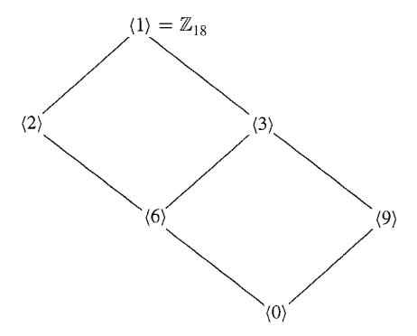

## Theorem 1
Let $G$ be a group, and let $a \in G$. Then the set

$$
\langle a \rangle = \{ a^n \mid n \in \mathbb{Z} \}
$$

is a subgroup of $G$.

### Proof
Clearly $\langle a \rangle$ is a nonempty subset of $G$. Let $x, y \in \langle a \rangle$. Then $x = a^m$ and $y = a^n$ for some $m, n \in \mathbb{Z}$. Note that $y^{-1} = (a^n)^{-1} = (a^{-1})^n = a^{-n} \in \langle a \rangle$. Thus

$$xy^{-1} = a^m a^{-n} = a^{m-n} \in \langle a \rangle,$$

and therefore $\langle a \rangle \le G$. $\blacksquare$

## Remark
$\langle a \rangle$ is the smallest subgroup of $G$ containing $a$.

$\big[ (\because)$ Let $H \le G$ such that $a \in H$. Then $a^n \in H, \forall n \in \mathbb{Z}$. Thus $\langle a \rangle \subseteq H$. $\blacksquare \big]$

## Definition
Let $G$ be a group, and let $a \in G$.

**(i)** $\langle a \rangle$ is called ***the cyclic subgroup generated by*** $a$.

**(ii)** $G$ is called ***a cyclic group*** if $G = \langle a \rangle$ for some $a \in G$.

**(iii)** If $G$ is a cyclic group, then $a$ is called ***a generator*** of $G$.

## Example
**(i)** $\mathbb{Z}_4 = \langle 1 \rangle = \langle 3 \rangle$

**(ii)** $\mathbb{Z}_n = \langle 1 \rangle, \forall n \ge 2$.

**(iii)** Let $V$ be the [Klein 4-group.](../Klein_Group/index.qmd#sec-definition) Then $a^2 = e, \forall a \in V$, so $V$ is not cyclic.

**(iv)** Let $n \in \mathbb{Z}$. Then $\langle n \rangle = n\mathbb{Z}$ is a cyclic subgroup of $\langle \mathbb{Z}, + \rangle$.

## Remark 1
$2$보다 큰 정수 $n$에 대해서 $\mathbb{Z}_n$의 생성원 중 $n$보다 작은 생성원 $m$은 몇 개나 있을까? 우선 Example (ii)에 의해서 $1$은 항상 생성원임을 알 수 있다. 이 말인즉슨 $1$이 순환군의 원소이면 항상 $\mathbb{Z}_n$을 생성해 낼 수 있다는 뜻이다. 즉 $m$의 적당한 정수배를 $n$으로 나눈 나머지가 $1$이 되면 $\langle m \rangle$에 $1$이 포함되고 $\mathbb{Z}_n$을 생성해 낼 수 있다. 즉 다음의 조건을 만족해야 한다.

$$ \begin{gather*}
km \equiv 1 \quad \text{mod } n \quad \text{for some } k \in \mathbb{Z} \\
\iff km - \ell n = 1 \quad \text{for some } k, \ell \in \mathbb{Z}
\end{gather*}$$

이때 $\gcd(m, n) = d > 1$이라고 가정하면 $m = ad, n = bd$를 만족하는 정수 $a, b$가 존재한다. 따라서 

$$km - \ell n = kad - \ell bd = (ka - \ell b)d = 1$$

이 성립해야 하는데 $d > 1$이고 $ka - \ell b$ 또한 정수이므로 모순이고, 즉 $\gcd(m, n) = 1$이다. 따라서 순환군 $\langle m \rangle$에 원소 $1$을 포함해서 $\mathbb{Z}_n$의 생성원이 되는 $n$보다 작은 자연수 $m$은 $n$과 서로소인 자연수만큼, 즉 $\phi(n)$개 존재한다. 

## Theorem 2
Every cyclic group is abelian. 

### Proof
Let $G$ be a cyclic group, which means that $G$ is a group and $G = \langle a \rangle$ for some $a \in G$.

Let $x, y \in G$. Then $x = a^n$ and $y = a^m$ for some $n, m \in \mathbb{Z}$. Thus we have

$$\begin{align*}
    xy &= a^na^m \\
    &= a^{n + m} \\
    &= a^{m + n} \\
    &= a^m a^n \\
    &= yx,
\end{align*}$$ 

which means that $G$ is abelian. $\blacksquare$

## Theorem 3
A subgroup of a cyclic group is cyclic. 

### Proof
Let $G$ be a cyclic group, which means that $G$ is a group and $G = \langle a \rangle$ for some $a \in G$. Let $H \le G$, and let $e$ denote the identity of $G$.

If $H = \{ e \}$, then clearly $H = \langle e \rangle$.

Suppose that $H \neq \{ e \}$, that is, some element $a(\neq e)$ of $G$ belongs to $H$. Note that the set $\{ n \in \mathbb{N} \mid a^n \in H \}$ is a nonemtpy subset of $\mathbb{N}$, so by the Well-Ordering Principle, there exists a smallest positive integer $m$ such that $a^m \in H$. We claim that $H = \langle a^m \rangle$.

We claim that $H = \langle a^m \rangle$.
$\big[ (\because)$ Clearly $\langle a^m \rangle \subset H$ since $a^m \in H$ and $H$ is a group. Let $x \in H$. Since $x \in G$, $x = a^n \in H$ for some $n \in \mathbb{Z}$. By the Division Algorithm, there exist integers $q$ and $r$ such that $n = mq + r$ and $0 \le r < m$. Thus we have

$$\begin{gather*}
a^n = a^{mq + r} = (a^m)^q a^r \\
\implies a^r = ((a^m)^q)^{-1} a^n.
\end{gather*}$$

Since $a^n \in H$ and $(a^m)^q \in H$, so that its inverse is also in $H$, we have $a^r \in H$. If $r > 0$, then $a^r \in H$ and $r < m$, which contradicts the definition of $m$. Thus $r = 0$. Thus, $a^n = (a^m)^q \in \langle a^m \rangle$, which means that $H \subset \langle a^m \rangle$. Hence $H = \langle a^m \rangle$. $\blacksquare \big]$

## Corollary
The subgroups of $\langle \mathbb{Z}, + \rangle$ are precisely of the forms $n\mathbb{Z}$ for some $n \in \mathbb{Z}$.

### Proof
Let $H \le \langle \mathbb{Z}, + \rangle$. Since $\langle \mathbb{Z}, + \rangle$ is cyclic, by Theorem 3, $H$ is cyclic. Thus $H = \langle n \rangle$ for some $n \in \mathbb{Z}$. Note that $\langle n \rangle = \{mn \mid m \in \mathbb{Z} \} = n\mathbb{Z}$. Hence $H = n\mathbb{Z}$. $\blacksquare$

## Remark 2
An abelian group need not be cyclic. For example, the Klein 4-group $V$ is abelian but not cyclic.

## Theorem 4
Let $G$ be a cyclic group.

**(i)** If $\vert G \vert = \infty$, then $G \cong \langle \mathbb{Z}, + \rangle$.

**(ii)** If $\vert G \vert = n \in \mathbb{N}$, then $G \cong \langle \mathbb{Z}_n, + \rangle$.

### Proof
Let $G = \langle a \rangle$, and let $e$ denote the identity of $G$.

**(i)** Suppose that $\vert G \vert = \infty$. Then $a^m \neq a^n, \forall m \neq n \in \mathbb{Z}$.

$\Big[ (\because)$ Suppose that $a^m = a^n$ for some integers $m > n$. Then $a^{m - n} = e$. We claim $G = \{ e, a, a^2, \cdots, a^{m - n - 1} \}$.

$\Big[ (\because)$ Since $a \in G$, clearly $G \supset \{ e, a, a^2, \cdots, a^{m - n - 1} \}$. Let $x \in G$. Then $x = a^k$ for some $k \in \mathbb{Z}$. By division algorithm, $\exists \, q, r \in \mathbb{Z}$ such that $k = (m - n)q + r$ and $0 \le r < m - n$. Then we have 

$$\begin{align*}
x &= a^k \\
&= a^{(m-n)q + r} \\
&= (a^{m - n})^q a^r \\
&= a^r \in \{ e, a, a^2, \cdots, a^{m - n - 1} \}. \Big]
\end{align*}$$

Thus $G = \{ e, a, a^2, \cdots, a^{m - n - 1} \}$, so that $\vert G \vert = m - n < \infty$. $\bigotimes$ Hence $a^m \neq a^n, \forall m \neq n \in \mathbb{Z}$. $\Big]$

Define the function $\phi : G \to \mathbb{Z}$ by $\phi(a^m) = m, \forall a^m \in G$. Clearly $\phi$ is well-defined. 

If $\phi(a^m) = \phi(a^n)$, then $m = n$, so that $a^m = a^n$. Thus $\phi$ is injective. 

Let $m \in \mathbb{Z}$. Then $a^m \in G$, so that $\phi(a^m) = m$. Thus $\phi$ is surjective.

Let $a^m, a^n \in G$. Then 

$$
\begin{align*}
    \phi(a^m a^n) &= \phi(a^{m + n}) \\
    &= m + n \\
    &= \phi(a^m) + \phi(a^n).
\end{align*}
$$

Thus $\phi$ is a homomorphism, and so that $G \cong (\mathbb{Z}, +)$.

**(ii)** Suppose that $\vert G \vert = n \in \mathbb{N}$. Then $a^i \neq a^j, \forall 0 \le i < j \le n-1$.

$\Big[ (\because)$ If $a^i = a^j$ for some $0 \le i < j \le n-1$, then $a^{j-i} = e$, which means that $G = \{ e, a, a^2, \cdots, a^{j - i - 1} \}$. Thus $\vert G \vert = j - i \le n-1$. $\bigotimes$ Hence $a^i \neq a^j, \forall 0 \le i < j \le n-1$. $\Big]$

Since $G = \langle a \rangle$ and $\vert G \vert = n$, we have $G = \{ e, a, a^2, \cdots, a^{n-1} \}$. Then $a^n = e$. 

$\Big[ (\because)$ Since $a^n \in G$, $a^n = a^k$ for some $k \in \mathbb{Z}$ with $0 \le k < n$. If $k \neq 0$, then we have $a^{n-k} = e$ and with $n-k \in \{ 1, 2, \cdots, n-1 \}$. $\bigotimes$ Thus, $a^n = e$. $\Big]$

Define the function $\phi : G \to \mathbb{Z}_n$ by $\phi(a^m) = m, \forall a^m \in G$. Since $m \in \{ 0, 1, ..., n-1 \}$ for each $a^m \in G$, $\phi(a^m) = m \in \mathbb{Z}_n$. With this and above claim, $\phi$ is well-defined. 

If $\phi(a^m) = \phi(a^k)$, then $m = k$, so that $a^m = a^k$. Thus $\phi$ is injective. 

Let $m \in \mathbb{Z}_n$. Then $a^m \in G$ and $\phi(a^m) = m$. Thus $\phi$ is surjective.

Let $a^m, a^k \in G$. Then 

$$
\begin{align*}
    \phi(a^m a^k) &= \phi(a^{m + k}) \\
    &= m + k \\
    &= \phi(a^m) + \phi(a^k).
\end{align*}
$$

Thus $\phi$ is a homomorphism. Hence $\phi$ is an isomorphism, which implies that $G \cong \langle \mathbb{Z}_n, + \rangle$. $\blacksquare$

## Remark
Let $G = \langle a \rangle$ with $\vert G \vert = n$. 

**(i)** $n$ is the smallest positive integer such that $a^n = e$.

**(ii)** $a^m = e$ for some $m \in \mathbb{Z} \setminus \{ 0 \} \iff n \vert m$.

## Example
Let $U_n = \{ z \in \mathbb{C} \mid z^n = 1 \}$. Then $\langle U_n, \cdot \rangle \cong \langle \mathbb{Z}_n, + \rangle$.

## Theorem 2
Let $G = \langle a \rangle$ be a cyclic group with $\vert G \vert = n$. Then 

$$\vert \langle a^s \rangle \vert = \frac{n}{\gcd(n, s)}, \quad \forall s \in \mathbb{Z}$$

### Proof

Since $\langle a^s \rangle \le G$, $\vert \langle a^s \rangle \vert < \infty$. Let $m = \vert \langle a^s \rangle \vert$. Then $m$ is the smallest positive integer such that $a^{sm} = (a^s)^m = e$. Since $\vert \langle a \rangle \vert = \vert G \vert = n$, $n \vert sm$. 

We claim $m = \frac{n}{\gcd(n, s)}$.

$(\because)$ Let $d = \gcd(n, s)$. Then 

$$\begin{align*}
d &= n \alpha + s \beta \\
\implies 1 &= \left( \frac{n}{d} \right) \alpha + \left( \frac{s}{d} \right) \beta
\end{align*}$$

for some $\alpha, \beta \in \mathbb{Z}$. Note that 

$$\frac{\frac{ms}{d}}{\frac{n}{d}} = \frac{ms}{n} \in \mathbb{Z},$$

so that $\frac{n}{d} \vert \frac{ms}{d}$, and so $\frac{n}{d} \vert m$ because $\gcd(\frac{n}{d}, \frac{s}{d}) = 1$. 

Since $(a^s)^{\frac{n}{d}} = (a^{n})^{\frac{s}{d}} = e$, we have $m \vert \frac{n}{d}$. Thus $m = \frac{n}{d}$.  $\blacksquare$

## Corollary
Let $G = \langle a \rangle$ with $\vert G \vert = n$. 

**(i)** $\vert \langle a^s \rangle \vert = \vert \langle a^t \rangle \vert \iff \gcd(n, s) = \gcd(n, t)$.

**(ii)** The other generators of $G$ are the elements of the form $a^r$, where $\gcd(n, r) = 1$.

### Proof
**(i)** By Theorem 2, 

$$\begin{gather*} 
\frac{n}{\gcd(n, s)} = \vert \langle a^s \rangle \vert = \vert \langle a^t \rangle \vert = \frac{n}{\gcd(n, t)} \\
\iff \gcd(n, s) = \gcd(n, t).
\end{gather*}$$

**(ii)** Let $G = \langle a^r \rangle$. By Theorem 2, we have

$$n = \vert G \vert = \vert \langle a^r \rangle \vert = \frac{n}{\gcd(n, r)}.$$

Thus $\gcd(n, r) = 1$. $\blacksquare$

순환군 $G$의 생성원을 $a$라고 하면, $G$의 어떤 부분군 $H$도 순환군이므로 적당한 정수 $k$에 대하여 $a^k$를 생성원으로 가질 것이다. 

순환군은 생성원의 반복 연산으로 얻어진 집합이다. 그러니까 어떤 원소 $x$에 $a$를 연산하는 것은 $x$의 '다음 단계'원소를 얻는 행위로 이해할 수 있다. 이때 군의 order가 $n$이면 $\langle a \rangle = \{ e, a, a^2, ..., a^{n-1} \}$로 나타낼 수 있다. 그러니까 모든 원소를 생성해 내기 위해 항등원에서 거쳐야 할 단계가 총 $n$단계 있다는 뜻이다. 

그런데 부분 순환군 $H$가 $a^k$를 생성원으로 가지면, $H$ 안에서는 다음 단계로 가기 위해서는 $a^k$, 즉 $a$를 $k$번 연산해야 한다. 만약 $k$가 $n$의 약수라면, 즉 $k$를 적당히 $m$번의 정수번 만큼 더해서 $n$을 만들어낼 수 있다면, $H$ 안에서 모든 원소를 생성해 내기 위해 항등원에서 거쳐야 할 단계는 총 $m$단계인 것이다. 그리고 $m$은 정확히 $H$의 order이다. 

$k$가 $n$의 약수는 아니지만 적당히 공유하는 약수가 있다고 하자. 일반적으로 얘기하면, 기존에는 총 $n$ 단계를 거쳐서 순환군의 모든 원소를 만들어냈어야 했다면, 부분군에서는 단위가 $a$에서 $a^k$로 $k$배가 늘어났기 때문에, 즉 $1$에서 $k$로 단위가 늘어났기 때문에 모든 원소를 $k$번씩 연산해서 만들어낸다. 이때 공약수만큼은 모든 원소를 만들어내기 위해 $a^k$를 반복적으로 취한다는 관점에서 아무런 영향을 미치지 못하므로, '진짜' 기여도를 보기 위해서는 $\gcd(n, k)$로 나눠줘야 하는 것이다.

한편 $G$의 생성원이 $a$이지만, 유일하게 $a$일 필요는 없다. 어떤 원소를 적당히 반복적으로 취해서 $G$의 모든 원소를 만들어낼 수 있다면, 그 원소 역시 $G$의 생성원이 될 수 있다. 

그러면 Corollary (ii)의 관점에서 볼 때, $a^r$이 $G$의 생성원이라면 $n$과 $r$은 서로소여야 한다. 그리고 이를 만족하는 $r$은 정확히 $\phi(n)$개 존재하므로, $G$의 생성원은 총 $\phi(n)$개 존재한다. 

## Example
$\mathbb{Z}_{18}$를 고려하자. 부분군 중 하나를 직접 구해보면 $\langle 3 \rangle = \{ 0, 3, 6, 9, 12, 15 \}$이고, 위 정리를 사용해서 계산해도 $\vert \langle 3 \rangle \vert = 6 = \frac{18}{\gcd(18, 3)}$으로 같은 결과를 얻는다. 그런데 위에서 언급했듯이 $\langle 3 \rangle$을 생성하는 원소는 $3$이 유일하다고 말할수는 없다. Remark와 위 내용에 의하면 $\langle 3 \rangle$이라는 군에 대해서 3의 배수 $3n$ 중 $\gcd(18, 3n) = 3$을 만족하는 정수 $n$들을 구하면 생성원을 구할 수 있다. 즉, $n = 1, 5$이므로 $\langle 3 \rangle = \langle 15 \rangle$이다.

다른 방법으로도 $\langle 3 \rangle$과 같은 공간을 생성하는 생성원을 찾을 수 있다. 예컨대 $\mathbb{Z}_{18}$ 안에 어떤 원소 $1^m = m$이 $\langle m \rangle = \langle 3 \rangle$을 만족한다고 하자. 이때 두 공간이 같으므로 order도 같고, 위의 정리를 사용하면 결국 $3 = \gcd(18, 3) = \gcd(18, m)$을 얻는다. 그리고 corollary (i)에 의해 이 두 조건이 동치이므로, 우리는 $\gcd(18, m) = 3$을 만족하는 정수 $m$을 모두 구함으로 $\langle 3 \rangle$과 같은 공간을 생성하는 생성원을 모두 찾을 수 있다.

위와 같은 방법으로 어떤 순환군의 여러 생성원들을 구할 수 있고, 순환군을 표현하는 여러 가지 방법을 얻게 된다. 사실 위 예시에서는 숫자가 작으므로 굳이 이런 방법을 쓰지 않고 단순 계산으로도 쉽게 구할 수 있지만, 숫자가 커질수록 단순 계산만으로는 알기가 힘들어진다. 때문에 큰 숫자에 대해서는 순환군을 표현하는 여러 가지 방법 중 가능한 쉬운 방법을 택하는 것이 중요하다. 

한편 이런 방법으로 $\mathbb{Z}_{18}$ 안에 각 원소에 대해서 부분 순환군을 구해보면 일종의 포함 관계가 생기게 된다. 이를 Hasse diagram으로 나타내면 다음과 같다. 

# Reference
- John B. Fraleigh. (2004). A First Course in Abstract Algebra (7th ed.). Pearson.