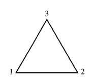
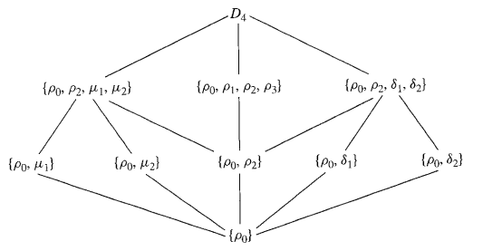
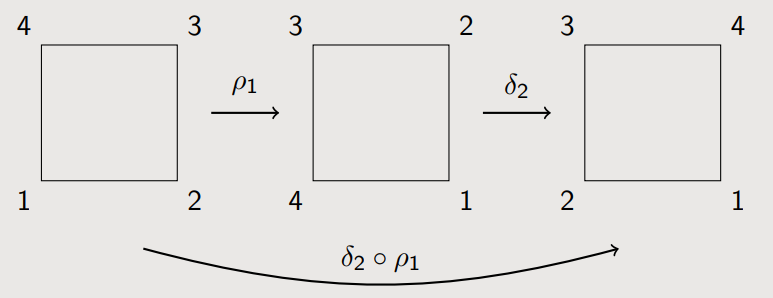

## Definition 1
Let $n \ge 3$ be a positive integer. Then the ***$n$-th dihedral group***, denoted by $D_n$, is defined as the group of symmetries of a regular $n$-gon.

## Example
**(i)** 예컨대 $D_3$을 고려해보자. 정의대로 생각하면 $D_3$는 정삼각형의 대칭성을 가지는 군인데, 예컨대 다음과 같이 각 꼭짓점에 번호를 붙인 정삼각형을 생각해보자. 

삼각형의 무게중심을 축으로 반시계방향으로 회전시킨다고 할 때, 기존의 삼각형과 완전히 겹쳐지도록 하는 변환의 경우의 수는 총 3가지가 있다. 아예 회전시키지 않거나, $\frac{2\pi}{3}$만큼 회전시키거나, $\frac{4\pi}{3}$만큼 회전시키는 경우이다. 

반면 기존의 삼각형과 완전히 겹쳐지도록 하는 변환이 꼭 회전만 있는 건 아니다. 이등분선을 기준으로 뒤집어도 여전히 삼각형과 겹쳐지는데, 꼭짓점 1을 지나는 이등분선을 기준으로 뒤집는 경우, 꼭짓점 2를 지나는 이등분선을 기준으로 뒤집는 경우, 꼭짓점 3을 지나는 이등분선을 기준으로 뒤집는 경우가 있다. 따라서 정삼각형의 대칭성을 가지도록 바꿔주는 변환의 개수는 총 $6$개이고, 즉 $D_3$는 원소의 개수가 $6$개다. 

한편 꼭짓점에 매겨진 번호를 생각해보면 변환이란 각 번호를 다른 번호들로 바꿔주는 변환이다. 즉 일종의 순열로 생각할 수 있고, 각 순열을 나열해보면 다음과 같다.

$$ \begin{align*}
\rho_0 = \begin{pmatrix} 1 & 2 & 3 \\ 1 & 2 & 3 \end{pmatrix}, \quad 
\rho_1 = \begin{pmatrix} 1 & 2 & 3 \\ 2 & 3 & 1 \end{pmatrix}, \quad 
\rho_2 = \begin{pmatrix} 1 & 2 & 3 \\ 3 & 1 & 2 \end{pmatrix}, \\
\mu_1 = \begin{pmatrix} 1 & 2 & 3 \\ 1 & 3 & 2 \end{pmatrix}, \quad 
\mu_2 = \begin{pmatrix} 1 & 2 & 3 \\ 2 & 1 & 3 \end{pmatrix}, \quad 
\mu_3 = \begin{pmatrix} 1 & 2 & 3 \\ 3 & 2 & 1 \end{pmatrix}.
\end{align*}
$$

$\rho$는 회전, $\mu$는 반전이다. 즉 $D_3 = \{ \rho_0, \rho_1, \rho_2, \mu_1, \mu_2, \mu_3 \}$이고 이는 정확히 대칭군 $S_3$이다. 

**(ii)** 이번엔 $D_4$를 고려해보자. 정삼각형의 경우와 동일하게 정사각형도 회전과 반전을 통해 갖게 되는 대칭성이 존재한다. 꼭짓점에 번호를 붙여놓고 생각해보면, 회전은 총 $4$개 존재할 것이고 반전은 각 대각선을 축으로 뒤집는 경우 2개, 그리고 변의 중점을 지나는 직선을 축으로 뒤집는 경우 2개가 존재한다. 따라서 $D_4$는 원소의 개수가 $8$개이고 각 순열을 나열해보면 다음과 같다. 

$$ \begin{align*}
\rho_0 = \begin{pmatrix} 1 & 2 & 3 & 4 \\ 1 & 2 & 3 & 4 \end{pmatrix}, \quad 
\rho_1 = \begin{pmatrix} 1 & 2 & 3 & 4 \\ 2 & 3 & 4 & 1 \end{pmatrix}, \quad 
\rho_2 = \begin{pmatrix} 1 & 2 & 3 & 4 \\ 3 & 4 & 1 & 2 \end{pmatrix}, \quad 
\rho_3 = \begin{pmatrix} 1 & 2 & 3 & 4 \\ 4 & 1 & 2 & 3 \end{pmatrix}, \\
\mu_1 = \begin{pmatrix} 1 & 2 & 3 & 4 \\ 2 & 1 & 4 & 3 \end{pmatrix}, \quad 
\mu_2 = \begin{pmatrix} 1 & 2 & 3 & 4 \\ 4 & 3 & 2 & 1 \end{pmatrix}, \quad 
\delta_1 = \begin{pmatrix} 1 & 2 & 3 & 4 \\ 3 & 2 & 1 & 4 \end{pmatrix}, \quad 
\delta_2 = \begin{pmatrix} 1 & 2 & 3 & 4 \\ 1 & 4 & 3 & 2 \end{pmatrix}.
\end{align*}
$$

이때 $D_4 = \{ \rho_0, \rho_1, \rho_2, \rho_3, \mu_1, \mu_2, \delta_1, \delta_2 \}$는 자명하게 대칭군 $S_4$의 부분군이다. 한편 $D_4$의 table을 작성해보면 다음과 같다. 

$$\begin{array}{c|c|c|c|c|c|c|c|c}
       & \rho_0 & \rho_1 & \rho_2 & \rho_3 & \mu_1  & \mu_2  & \delta_1  & \delta_2  \\ \hline
\rho_0 & \rho_0 & \rho_1 & \rho_2 & \rho_3 & \mu_1  & \mu_2  & \delta_1  & \delta_2  \\ \hline
\rho_1 & \rho_1 & \rho_2 & \rho_3 & \rho_0 & \delta_2  & \mu_1  & \mu_3  & \delta_1  \\ \hline
\rho_2 & \rho_2 & \rho_3 & \rho_0 & \rho_1 & \mu_2  & \delta_2  & \delta_1  & \mu_1  \\ \hline
\rho_3 & \rho_3 & \rho_0 & \rho_1 & \rho_2 & \delta_1  & \mu_2  & \mu_1  & \delta_2  \\ \hline
\mu_1  & \mu_1  & \delta_1  & \mu_2  & \delta_2  & \rho_0 & \rho_1 & \rho_2 & \rho_3 \\ \hline
\mu_2  & \mu_2  & \mu_1  & \delta_2  & \delta_1  & \rho_3 & \rho_0 & \rho_1 & \rho_2 \\ \hline
\delta_1  & \delta_1  & \mu_3  & \delta_1  & \mu_1  & \rho_2 & \rho_3 & \rho_0 & \rho_1 \\ \hline
\delta_2  & \delta_2  & \delta_1  & \mu_1  & \mu_2  & \rho_1 & \rho_2 & \rho_3 & \rho_0
\end{array}$$

Subgroup diagram은 다음과 같다.

위 예시들을 통해 $\vert D_n \vert = 2n$임을 쉽게 짐작할 수 있다.

## Remark

한편 $D_n$을 다룰 때 주의해야 하는 점이 있다. $D_3$에서 회전 

$$\rho_1 = \begin{pmatrix} 1 & 2 & 3 \\ 2 & 3 & 1 \end{pmatrix}$$

과 반전 

$$\mu_1 = \begin{pmatrix} 1 & 2 & 3 \\ 1 & 3 & 2 \end{pmatrix}$$

을 생각해보자. 둘을 합성하면 

$$
\rho_1 \mu_1 = \begin{pmatrix} 1 & 2 & 3 \\ 2 & 3 & 1 \end{pmatrix} \begin{pmatrix} 1 & 2 & 3 \\ 1 & 3 & 2 \end{pmatrix} = \begin{pmatrix} 1 & 2 & 3 \\ 2 & 1 & 3 \end{pmatrix} = \mu_3
$$

이다. 한편 다음과 같이 그림을 그려놓고 직접 순열을 적용해보자. 

첫번째로 $\mu_1$은 꼭짓점 1을 기준으로 뒤집는 것이므로, 꼭짓점 1은 그대로 있고 꼭짓점 2와 3이 자리를 바꾼다. 여기에 회전 $\rho_1$을 적용하면, $\rho_1$은 꼭짓점 1을 2로, 2를 3으로, 3을 1로 보내므로 위와 같은 결과를 얻는다. 이때 처음과 마지막만 놓고 보면 결국 

$$\begin{pmatrix} 
1 & 2 & 3\\
3 & 2 & 1
\end{pmatrix} = \mu_2$$

라는 결과를 얻고, 직접 합성한 결과와 그림을 통해 얻은 결과가 다르다는 사실을 알 수 있다. 둘 다 과정을 잘 따라간 것 같은데 왜 이런 일이 생긴걸까?

문제는 그림을 그려놓고 적용할 때 숫자 $1, 2, 3$을 그 자체로 이동시켰기 때문이다. $D_3$는 정삼각형의 대칭성을 가지는 군이기 때문에, 우리는 각 순열을 삼각형에 적용했을 때 모두 기존의 삼각형에서 전혀 바뀌지 않은 모습들을 보게 된다. 즉 이렇게만 놓고 보면 구체적으로 어떻게 삼각형이 회전하고 뒤집혔는지 알 방도가 없기 때문에 꼭짓점에 숫자를 붙여놓고 그 변화한 추이를 쉽게 살펴보려고 했던 것이다. 그러면 우리가 꼭짓점에 붙인 숫자들은 그 자체로 이동하는 뭔가가 아니라, 그냥 각 꼭짓점의 위치에 부여되는 고유한 넘버링인 것이다. 

물론 한 번 적용시킬 때는 마치 실제로 숫자들이 움직이는 것처럼 봐도 무방하지만, 한 번더 적용되는 순간부터는 숫자를 신경쓰면 안된다. 처음 $\mu_1$을 적용시키고 그 다음에 $\rho_1$을 적용할 때에는 무게중심에 대하여 반시계 방향으로 $\frac{2\pi}{3}$만큼 회전시킨다는 $\rho_1$의 기하학적 의미로 적용해야지, 숫자만 보고 무작정 1은 2가 있던 자리로, 2는 3이 있던 자리로, 3은 1이 있던 자리로 보내면 안된다는 것이다. 실제로 위 그림에서 $\rho_1$을 반시계 방향으로 회전시켜보면 정상적으로 $\mu_3$의 결과를 얻게 된다. 

$D_4$에서도 마찬가지이다. 회전 

$$
\rho_1 = \begin{pmatrix} 1 & 2 & 3 & 4 \\ 2 & 3 & 4 & 1 \end{pmatrix}
$$

과 반전 

$$
\delta_2 = \begin{pmatrix} 1 & 2 & 3 & 4 \\ 1 & 4 & 3 & 2 \end{pmatrix}
$$

을 생각해보자. 둘을 합성하면 

$$
\delta_2 \rho_1 = \begin{pmatrix} 1 & 2 & 3 & 4 \\ 1 & 4 & 3 & 2 \end{pmatrix} \begin{pmatrix} 1 & 2 & 3 & 4 \\ 2 & 3 & 4 & 1 \end{pmatrix} = \begin{pmatrix} 1 & 2 & 3 & 4 \\ 4 & 3 & 2 & 1 \end{pmatrix} = \mu_2
$$

을 얻는다. 처음 그림을 그렸을 때처럼 적용해보면 다음과 같다.

마지막 결과는 사실상 

$$\begin{pmatrix} 
1 & 2 & 3 & 4 \\
2 &1  & 4 & 3
\end{pmatrix} = \mu_1$$

이다. 이것도 마찬가지로 숫자만 보고 반전 $\delta_2$를 1과 3을 잇는 대각선에 대하여 뒤집는 것으로 적용했기 때문에 얻어진 잘못된 결과이다. 

# Reference
- John B. Fraleigh. (2004). A First Course in Abstract Algebra (7th ed.). Pearson.