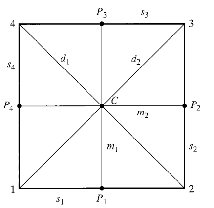

## Definition
Let $G$ be a group, and let $X$ be a nonempty set. Then a ***group action*** of $G$ on $X$ is a map $\ast: G \times X \to X,$ denoted by $\ast(g, x) = g \ast x = gx,$ such that 

**(i)** $ex = x, \forall x \in X,$

**(ii)** $(g_1g_2)x = g_1(g_2x), \forall g_1, g_2 \in G, x \in X.$

If there exists a group action of $G$ on $X$, then $X$ is called a ***$G$-set.***

$X$라는 집합은 공집합이 아니기만 하면 딱히 제한이 없고, 군이 될 필요도 없을 뿐더러 연산조차 주어지지 않아도 상관없다. 핵심은 이런 집합 $X$에 군 $G$의 원소를 가하는 action을 취했을 때 $X$의 다른 원소로 매핑되는 관계가 위 조건에 따라 잘 정의되면 그 원소를 가하는 행위를 group action이라고 부른다. Permutation 같은 예를 생각해보면 $X$의 원소를 $X$의 또 다른 원소로 보내는 행위가 무엇인지 자연스럽게 알 수 있겠다.

## Example
**(i)** Let $X$ be any nonemptyset, and let $H \le S_X.$ Then $X$ is a $H$-set.

$\big[(\because)$ Define $\ast: H \times X \to X$ by $\ast(\sigma, x) = \sigma(x), \forall (\sigma, x) \in H \times X$. Then $\ast$ is well-defined. 

**(a)** $\ast(e_H, x) = e_H(x) = x, \forall x \in X.$ 

**(b)** 

$$\begin{align*}
\ast(\sigma_1 \sigma_2, x) &= \sigma_1 \sigma_2(x) \\
&= \sigma_1(\sigma_2(x)) \\
&= \ast(\sigma_1, \sigma_2(x)) \\
&= \ast(\sigma_1, \ast(\sigma_2, x))
\end{align*}$$

for all $\sigma_1, \sigma_2 \in H,x \in X.$ Thus, $(\sigma_1 \sigma_2)(x) = \sigma_1(\sigma_2(x)).$

Hence, $\ast$ is a group action of $H$ on $X.\big]$

**(ii)** Let $G$ be a group. Then $G$ is a $G$-set.

$\big[(\because)$ Define $\ast: G \times G \to G$ by $\ast(g_1, g_2) = g_1g_2, \forall (g_1, g_2) \in G \times G.$ Then $\ast$ is well-defined. 

**(a)** $\ast(e, g) = eg = g, \forall g \in G.$

**(b)** 

$$\begin{align*}
\ast(g_1g_2, g) &= (g_1g_2)g \\
&= g_1(g_2g) \\
&= \ast(g_1, g_2g) \\
&= \ast(g_1, \ast(g_2, g))
\end{align*}$$

for all $g_1, g_2, g \in G.$ 

Hence, $\ast$ is a group action of $G$ on $G.\big]$

**(iii)** Let $H \le G.$ Then $G$ is an $H$-set.

$\big[(\because)$ Define $\ast: H \times G \to G$ by $\ast(h, g) = hgh^{-1}, \forall (h, g) \in H \times G.$ Then $\ast$ is well-defined. 

**(a)** $\ast(e, g) = ege^{-1} = g, \forall g \in G.$

**(b)** 

$$\begin{align*}
\ast(h_1h_2, g) &= (h_1h_2)g(h_1h_2)^{-1} \\
&= (h_1h_2)g(h_2^{-1}h_1^{-1}) \\
&= h_1(h_2gh_2^{-1})h_1^{-1} \\
&= \ast(h_1, h_2gh_2^{-1}) \\
&= \ast(h_1, \ast(h_2, g)).
\end{align*}$$

for all $h_1, h_2 \in H, g \in G.$ 

Hence, $\ast$ is a group action of $H$ on $G.\big]$

**(iv)** Let $G = D_4 = \{\rho_0, \rho_1, \rho_2, \rho_3, \mu_1, \mu_2, \delta_1, \delta_2\}$ and $X = \{1, 2, 3, 4, S_1, S_2, S_3, S_4, m_1, m_2, d_1, d_2, p_1, p_2, p_3, p_4, C\}$, where

Then $X$ is a $G$-set in a natural way. 

이 예시에서야 비로소 "action"이라는 말의 진가가 드러난다. 위 사진과 같이 정사각형의 꼭짓점과 중점, 모서리와 중선, 대각선에 라벨링을 한 집합을 $X$라고 두고 그룹 $G$를 dihedral group으로 둔다. 그러면 중심 $C$를 기준으로 돌리거나 뒤집는 연산을 생각해보면 정사각형을 이리저리 돌리고 뒤집는 행위로 대응되고, $X$의 원소들은 또 다른 $X$의 원소들로 대응된다.

## Theorem 1
Let $X$ be a $G$-set. 

**(i)** For each $g \in G$, the map $\sigma_g: X \to X$ defined by $\sigma_g(x) = gx, \forall x \in X$ is a permutation on $X$.

**(ii)** The map $\phi: G \to S_X$ defined by $\phi(g) = \sigma_g, \forall g \in G$ is a group homomorphism with $\phi(g)(x) = \sigma_g(x) = gx$.

### Proof
**(i)** Clearly, $\sigma_g$ is well-defined. Suppose that $\sigma_g(x_1) = \sigma_g(x_2).$ Then $gx_1 = gx_2,$ so 

$$\begin{align*}
x_1 &= ex_1 \\
&= (g^{-1}g)x_1 \\
&= g^{-1}(gx_1) \\
&= g^{-1}(gx_2) \\
&= (g^{-1}g)x_2 \\
&= ex_2 \\
&= x_2.
\end{align*}$$

Thus, $\sigma_g$ is one-to-one.

Let $x \in X.$ Then we have $\sigma_g(g^{-1}x) = g(g^{-1})x = ex = x,$ and $g^{-1}x \in X.$ Thus, $\sigma_g$ is onto, so $\sigma_g$ is a permutation on $X.$

**(ii)** Clearly, $\phi$ is well-defined. Let $g_1, g_2 \in G,$ and let $x \in X.$ Then we have 

$$\begin{align*}
(\phi(g_1g_2))(x) &= \sigma_{g_1g_2}(x) \\
&= (g_1g_2)x \\
&= g_1(g_2x) \\
&= \sigma_{g_1}(\sigma_{g_2}(x)) \\
&= (\phi(g_1))(\phi(g_2)(x)) \\
&= (\phi(g_1)\phi(g_2))(x),
\end{align*}$$

so $\phi(g_1g_2) = \phi(g_1)\phi(g_2).$ Hence, $\phi$ is a homomorphism. $\blacksquare$

# Reference
- John B. Fraleigh. (2004). A First Course in Abstract Algebra (7th ed.). Pearson.