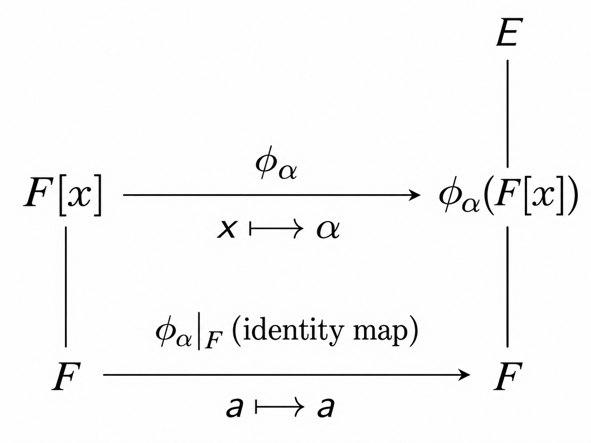

# Definition
Let $R$ be a ring. A ***polynomial*** $f(x)$ with coefficients in $R$ is 

$$f(x) = \sum_{i=0}^\infty a_ix^i = a_0 + a_1x + a_2x^2 + \cdots$$

where $a_0, a_1, \cdots \in R$ and $a_i = 0$ for all but finite numbers of values of $i$. Each $a_i$ is called a ***coefficient*** of $f(x)$. If $a_i \neq 0$ for some $i \ge 0$, then the largest such value of $i$ is the ***degree*** of $f(x)$. We define the degree of $0 \in R[x]$ as $-\infty$. The set of all polynomials in $x$ with coefficients in $R$ is denoted by $R[x]$.

대수적으로 다항식은 환 $R$ 위에서 정의된다. 다시 말해 어떤 환이 주어지느냐에 따라서 다항식이 속하는 범위가 달라진다. 예컨대 $\frac{1}{2} + 3x \notin \mathbb{Z}[x]$이지만 $\frac{1}{2} + 3x \in \mathbb{Q}[x]$이다. 따라서 다항식을 다룰 때는 어떤 환 위에서 주어졌는지 반드시 파악해야 한다.

한편 다항식 $f(x) = 0$의 차수는 $0$이 아닌 $-\infty$로 정의한다. 이는 다항식의 곱에서 차수를 보존하는 문제와 관련되어 있는데, 예컨대 $n$차 다항식 $f(x)$와 $m$차 다항식 $g(x)$가 주어졌을 때 우리는 두 다항식을 곱해서 얻은 다항식 $f(x)g(x)$의 차수가 $(n+m)$ 차가 되기를 바란다. 만약 $f(x) = 0$이라면 $f(x)g(x) = 0$이고, 곱의 차수는 $0+m = m$차가 아닌 $0$차가 되버리는 일이 생긴다. 이런 일을 허용하지 않으려면 $f(x) = 0$의 차수를 $\infty$ 혹은 $-\infty$와 같이 정의해야 할 필요가 생기고, 여기서는 $-\infty$로 정의한다.

# Theorem 1
Let $R$ be a ring. 

**(i)** $\langle R[x], +, \cdot \rangle$ is a ring under the addition and multiplication defined as: for $f(x) = a_0 + a_1x + \cdots$ and $g(x) = b_0 + b_1x + \cdots$

$$\begin{align*}
(f + g)(x) &:= (a_0 + b_0) + (a_1 + b_1)x + \cdots \\
(fg)(x) &:= (a_0b_0) + (a_0b_1 + a_1b_0)x + (a_0b_2 + a_1b_1 + a_2b_0)x^2 + \cdots \\
&= \sum_{k=0}^\infty \left( \sum_{i=0}^k a_ib_{k-i} \right)x^k
\end{align*}$$

**(ii)** $R$ is commutative $\iff$ $R[x]$ is commutative.

**(iii)** $R$ has the unity $\iff$ $R[x]$ has the unity.

**(iv)** $R$ is an integral domain $\iff$ $R[x]$ is an integral domain.

**(v)** $R$ is a subring of $R[x]$.

당연하게도 환 $R$에서 정의된 다항식들의 집합 $R[x]$는 환이 됨을 알 수 있고, $R[x]$는 $R$과 여러 성질을 공유한다는 사실까지 알 수 있다. 관점을 바꿔서 보면 $R$은 $R[x]$에서 상수함수들을 모아놓은 집합이라고 볼 수 있고, 따라서 $R[x]$의 부분환으로 주어진다.

한편 위에서 $0$의 차수를 설명하면서 언급했던, 다항식의 곱에서 차수가 보존되는지에 대한 문제는 $R$이 정역(integral domain)이면 자연스럽게 해결됨을 알 수 있다. 만약 $R$이 정역이 아니라면, 예컨대 $R = \mathbb{Z}_6$와 같이 주어지면 $2x, 3x \in \mathbb Z_6[x]$에 대해서 $(2x)(3x) = 0$이므로 차수가 보존되지 않게 된다.

# Theorem 2
Let $F$ be a subfield of a field $E$, and let $\alpha \in E$. Then the ***evaluation map*** $\phi_\alpha: F[x] \to E$ defined by

$$\phi_\alpha(a_0 + a_1x + \cdots + a_nx^n) = a_0 + a_1\alpha + \cdots + a_n\alpha^n$$

for all $f(x) = a_0 + a_1x + \cdots + a_nx^n \in F[x]$ is a homomorphism. 

If $\phi_\alpha(f(x)) = f(\alpha) = 0$, then $\alpha$ is called a ***zero*** of $f(x)$. We define

$$\ker(\phi_\alpha) = \{ f(x) \in F[x] \mid f(\alpha) = 0 \}.$$

즉 $\phi_\alpha$는 $x \mapsto \alpha$로 치환하며, 상수는 $a \mapsto a$와 같이 그대로 매핑하는 사상이다. 다시 말해 $\phi_\alpha \big \vert_F : F \to E$는 항등함수이며, 이러한 관계를 요약하면 다음과 같다.

우리는 위 사실들을 가지고 다항함수 $f(x) \in F[x]$에 대하여 방정식 $f(x) = 0$이 해를 갖는다는 사실이 어떤 $\alpha \in E$에 대하여 $f(x) \in \ker(\phi_\alpha)$와 정확히 동일함을 알 수 있다. 거꾸로 말해서, 만약 $f(x) \in \ker(\phi_\alpha)$라면 $f(x)$는 $(x-\alpha)$를 인수로 가지고 있음을 알 수 있다. 이와 같은 논의를 통해 방정식의 해라던지, 인수와 같은 개념을 대수적으로 풀어낼 수 있다.

# Reference
- John B. Fraleigh. (2004). A First Course in Abstract Algebra (7th ed.). Pearson.