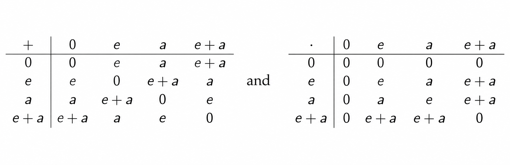

# Definition 1
**(i)** A ***ring*** $\langle R, +, \cdot \rangle$ is a set $R$ together with two [binary operations](../binaryop/index.qmd#sec-1.1.-definition) $+$ and $\cdot$, which we call addition and multiplication, defined on $R$ such that

- $\langle R, + \rangle$ is an [abelian group.](../group/index.qmd#sec-definition)

- $\langle R, \cdot \rangle$ is a [semigroup.](../binaryop/index.qmd#sec-2.1.-definition)

- $\forall a, b, c \in R, a \cdot (b + c) = (a \cdot b) + (a \cdot c)$ and $(a + b) \cdot c = (a \cdot c) + (b \cdot c)$.

We denote $ab$ instead of $a \cdot b$ for simplicity. The ***additive identity*** of $R$ is written as $0$, and the ***additive inverse*** of $a$ is denoted by $-a$.

**(ii)** A ring is said to be ***commutative*** or ***abelian*** if the multiplication $\cdot$ is commutative.

**(iii)** Let $R$ be a ring. Then a subset $S$ of $R$ is called a ***subring*** of $R$, denoted by $S \le R$, if $E$ is a ring under the induced operations from $F$.

특별히 덧셈에 대해서는 [군](../group/index.qmd#sec-definition)이 되기 때문에 항등원과 역원이 모두 유일하게 존재하지만, 곱셈에 대해서는 반군만 되기 때문에 일반적으로 항등원과 역원을 가지지 않음을 주의하자.

## Example
**(i)** $\langle \mathbb{Z}, +, \cdot \rangle, \langle \mathbb{Q}, +, \cdot \rangle, \langle \mathbb{R}, +, \cdot \rangle, \langle \mathbb{C}, +, \cdot \rangle$ are abelian rings.

**(ii)** Let $R$ be a ring. Then $\langle R^{n \times n}, +, \cdot \rangle$ is a ring but it is not abelian.

**(iii)** $\langle \mathbb{R}^{\mathbb{R}}, +, \cdot \rangle$ is a ring.

**(iv)** $\forall n \in \mathbb{Z}, \langle n\mathbb{Z}, +, \cdot \rangle$ is a ring, and it is a subring of $\mathbb{Z}$.

**(v)** $\forall n \ge 2, \langle \mathbb{Z}_n, +, \cdot \rangle$ is a ring.

**(vi)** Let $R_1, \dots, R_n$ be rings, and let $R = R_1 \times \cdot \times R_n$. Define $+$ and $\cdot$ on $R$ by

$$\begin{align*}
(a_1, \dots, a_n) + (b_1, \dots, b_n) = (a_1 + b_1, \dots, a_n + b_n) \quad \text{and} \\
(a_1, \dots, a_n) \cdot (b_1, \dots, b_n) = (a_1 b_1, \dots, a_n b_n)
\end{align*}$$

Then $\langle R, +, \cdot \rangle$ is a ring which is called the ***direct product*** of $R_1, \cdots, R_n$.

**(vii)** For $0 \in \mathbb{Z}$, $\langle \{ 0 \}, +, \cdot \rangle$ is a ring, called the ***zero ring***.

## Notation
Let $R$ be a ring, and let $a \in R$.

**(i)** For $n \in \mathbb{N}$, $na = \underbrace{a + \cdots + a}_{n \text{ times}}$. 

**(ii)** For $n \in \mathbb{Z} \setminus \mathbb{N}_0, na = \underbrace{(-a) + \cdots + (-a)}_{\vert n \vert \text{ times}}$

**(iii)** For $0 \in \mathbb{Z}$, $0a = 0$.

**(iv)** For $a, b \in R$, $a - b := a + (-b)$.

정수배의 $0$과 덧셈의 항등원 $0$을 헷갈리지 않도록 주의하자. 위 (iii)에서의 $0$은 정수 $0$이지만 아래 정리 (i)에서의 $0$은 덧셈의 항등원 $0$이다.

# Properties
Let $R$ be a ring, and let $a, b \in R$.

**(i)** $0a = 0 = a0$

**(ii)** $a(-b) = -(ab) = (-a)b$

**(iii)** $(-a)(-b) = ab$

## Proof
**(i)** Since $0a = (0 + 0)a = 0a + 0a$, we have $0a = 0$. Similarly, $a0 = 0$. 

**(ii)** Note that $ab + a(-b) = a(b + (-b)) = a0 = 0$ by (i). Similarly, $ab + (-a)b = 0$. Clearly, $ab + (-(ab)) = 0$. Since the additive inverse is unique, we have $a(-b) = -(ab) = (-a)b$.

**(iii)** By (ii), we have $(-a)(-b) = -(a(-b)) = -(-(ab))$. Since $-(ab) + (-(-(ab))) = 0$ and $ab + (-(ab)) = 0$, it follows from the uniqueness of the additive inverse that $(-a)(-b) = ab$. $\blacksquare$

# Theorem
**(i)** Let $S$ be a nonempty subset of a ring $R$. Then $S \le R$ $\iff$ $a - b, ab \in S, \forall a, b \in S$.

**(ii)** An intersection of subrings of a ring $R$ is a subring of $R$.

부분군 판정법과 유사하지만 환은 군과는 달리 곱셈이라는 연산이 추가되므로 곱셈에 대해서 닫혀있음도 보여야 한다.

## Proof
**(i)** $(\implies)$ Let $a, b \in S$. Since $S$ is a ring, the additive inverse of $b$ belongs to $S$, so $a - b \in S$. Clearly, $ab \in S$.

$(\impliedby)$ Let $a \in S$. Since $0 = a - a \in S$, $S$ contains the additive identity $0$. Furthermore, since $-a = 0 - a \in S$, it also contains the additive inverse of every element in $S$.

Let $a, b \in S$. Since $S$ contains $-b$, we have $a + b = a - (-b) \in S$, which means that $S$ is closed with respect to addition. By assumption, $S$ is closed with respect to multiplication.

Since $S \subset R$, the associativity and commutativity of the addition is clearly held, and so is the distributivity of the operations. Hence, $S$ is a subring of $R$. 

**(ii)** Let $\{ R_\alpha \}$ be a collection of subrings of $R$, and let $\displaystyle R^\ast = \bigcap_\alpha R_\alpha$. Since $0 \in R_\alpha, \forall \alpha$, we have $0 \in R^\ast$, so $R^\ast \neq \emptyset$. 

Let $a, b \in R^\ast$. Then $a, b \in R_\alpha, \forall \alpha$. Since $R_\alpha$ is a subring, we have $a - b, ab \in R_\alpha, \forall \alpha$, which implies that $a-b, ab \in R^\ast$. Hence, $R^\ast \le R$ by **(i)**. $\blacksquare$

# Definition 2
Let $R$ be a ring. If there exists an $n \in \mathbb{N}$ such that $na = 0, \forall a \in R$, then the least such positive integer is called the ***characteristic*** of $R$. If no such positive integer exists, then $R$ is of ***characteristic 0***. We denote the characteristic of $R$ $\mathrm{char}(R)$.

한국어로는 표수, 특성 정도로 번역되는 듯하다. $\mathbb{Z}, \mathbb{R}$ 등의 집합은 당연하게 $0$의 표수를 가진다. 어떤 정수를 자연수 배를 한 결과가 항상 $0$이 나올 수는 없기 때문이다. 다르게 말하면 이를 만족하는 $n$은 오직 $0$ 뿐이다. 그러나 $\mathbb{Z}_n$과 같은 집합은 $n$의 배수는 모두 항등원인 $0$이 되기 때문에 $n$의 표수를 가지게 된다.

# Remark
**(i)** $\mathrm{char}(\mathbb{Z}_n) = n$

**(ii)** $\mathrm{char}(\mathbb{Z}) = \mathrm{char}(\mathbb{Q}) = \mathrm{char}(\mathbb{R}) = \mathrm{char}(\mathbb{C}) = 0$.

**(iii)** Let $R$ be a ring with identity. If $n \cdot 1 \neq 0, \forall n \in \mathbb{N}$, then $\mathrm{char}(R) = 0$. If $n \cdot 1 = 0$ for some $n \in \mathbb{N}$, then the smallest such integer $n$ is the characteristic of $R$.

원래 표수를 찾으려면 환 $R$의 임의의 원소에 대해서 정의를 체크해야 하지만, 곱셈의 항등원 $1$에 대해서만 체크해도 충분하다는 사실을 얻는다.

$\big[ (\because)$ If $n \cdot 1 \neq 0, \forall n \in \mathbb{N}$, then clearly $\mathrm{char}(R) = 0$.

Suppose $n \cdot 1 = 0$ for some $n \in \mathbb{N}$. Let $a \in R$. Then we have

$$\begin{align*}
n \cdot a &= \underbrace{a + \cdots + a}_{n \text{ times}} \\
&= \underbrace{a \cdot 1 + \cdots + a \cdot 1}_{n \text{ times}} \\
&= a (\underbrace{1 + \cdots 1}_{n \text{ times}}) \\
&= a \cdot (n \cdot 1) \\
&= a \cdot 0 \\
&= 0
\end{align*}$$

Thus, the smallest positive integer $n$ is the characteristic of $R$. $\blacksquare \big]$

# Noncommutative Examples
여기서는 비가환환, 즉 곱셈에 대해서 가환법칙이 성립하지 않는 몇 가지 환의 예시를 소개한다. 정역(Integral Domain)이 그렇듯이 가환환이라는 조건이 워낙에 좋다보니 학부 현대대수학은 가환환을 중심으로 내용이 전개가 되지만 그렇다고 대수학이라는 넓은 분야에서 가환환만 다루지는 않는다.

**(i)** For $n \ge 2$, the ring $M_{n}(\mathbb{R})$ of $n \times n$ matrices with entries in $\mathbb{R}$ is a noncommutative ring with unity.

**(ii)** The set $\mathrm{End}(G)$ of all [endomorphisms](../Binary_Algebraic_Structure/Homomorphism/index.qmd#sec-definition) of an abelian group $G$ is a ring with unity under addition and composition. If $G$ is cyclic, then $\mathrm{End}(G)$ is commutative. In general, $\mathrm{End}(G)$ is a noncommutative ring. For example, $\mathrm{End}(\mathbb{Z} \times \mathbb{Z})$ is a noncommutative ring.

::: {.callout-note title="Proof" collapse="true" icon=false}
$\big[ (\because)$ Suppose that $G = \langle a \rangle$. Let $\phi, \psi \in \mathrm{End}(G)$, and let $x \in G$. Let us denote that $x = a^n, \phi(a) = a^r$ and $\psi(a) = a^s$ for $n, r, s \in \mathbb{Z}$. Then we have

$$\begin{align*}
(\phi \circ \psi)(x) &= \phi(\psi(x)) \\
&= \phi(\psi(a^n)) \\
&= \phi(a^{ns}) \\
&= a^{nsr} \\
&= \psi(a^{nr}) \\
&= \psi(\phi(a^n)) \\
&= (\psi \circ \phi)(x),
\end{align*}$$

so $\phi \circ \psi = \psi \circ \phi$. Thus, $\mathrm{End}(G)$ is commutative.

Next, we will show that $\mathrm{End}(\mathbb{Z} \times \mathbb{Z})$ is a noncommutative ring.

Let $\phi, \psi \in \mathrm{End}(\mathbb{Z} \times \mathbb{Z})$ be given by

$$\phi(m, n) = (m + n, 0) \quad \text{and} \quad \psi(m, n) = (0, n)$$

for all $(m, n) \in \mathbb{Z} \times \mathbb Z$. Then we have

$$\begin{align*}
(\phi \psi) (m, n) &= (n, 0) \\\
(\psi \phi) (m, n) &= (0, 0).
\end{align*}$$So $\phi \psi \neq \psi \phi$ in general.$\big]$
:::

**(iii)** Let $F$ be a field of characteristic zero, and let $\mathbb{X}, \mathbb{Y} \in \mathrm{End}(F[X])$ be given by

$$\begin{align*}
\mathbb{X}(a_0 + a_1X + \cdots + a_nX^n) &= a_0X + a_1X^2 + \cdots + a_nX^{n+1} \\
\mathbb{Y}(a_0 + a_1X + \cdots + a_nX^n) &= a_0 + 2a_2X + 3a_3X^2 + \cdots + (n+1)a_{n+1}X^n,
\end{align*}$$

for all $a_0 + a_1X + \cdots + a_nX^n \in F[X]$. Then we can easily verify $\mathbb{Y}\mathbb{X} - \mathbb{X} \mathbb{Y} = \mathrm{id}_{F[X]}$, which means that $\mathbb{Y}\mathbb{X} \neq \mathbb{X} \mathbb{Y}$ in general. 

Thu subring of $\mathrm{End}(F[X])$ generated by $\mathbb{X}$ and $\mathbb{Y}$ and multiplications by elements of $F$ is called the ***Weyl algebra***.

**(iv)** Let $R$ be a ring, and let $G$ be a multiplicative group. Let

$$RG := \left\{ \sum_{\text{finite}} r_ig_i \,\, \Bigg \vert \,\, r_i \in R, g_i \in G \right\}$$

Define $+: RG \times RG \to RG$ by

$$\sum_{i=1}^n r_ig_i + \sum_{i=1}^n s_ig_i = \sum_{i=1}^n (r_i+s_i)g_i$$

and $\cdot: RG \times RG \to RG$ by

$$\left( \sum_{i=1}^n r_ig_i \right) \left( \sum_{j=1}^m s_jh_j \right) = \sum_{i=1}^n \sum_{j=1}^m (r_is_j) (g_ih_j).$$

Then $\langle RG, +, \cdot \rangle$ is a ring, and it is called the ***group ring*** of $G$ over $R$. 

Note that

1. $RG$ is commutative $\iff$ $R$ and $G$ are commutative.

2. If $R$ contains the unity $1$ and $e$ is the identity of $G$, then $1e$ is the unity of $RG$.

$RG$라는 집합은 그 원소가 $r_ig_i$의 유한합의 형태로 나타나도록 정의한다. 주의할 점은 $r_ig_i$는 어떤 연산의 결과가 아니라, 그냥 $R$의 원소 $r_i$와 $G$의 원소 $g_i$를 하나씩 가져와서 이 두 원소로 결정되는 또 다른 어떤 원소 $x$를 $r_ig_i$의 노테이션을 가지고 쓰겠다는 뜻이다. 일종의 순서쌍 $(r_i, g_i)$처럼 받아들여도 좋다. 이러한 의미로 $\displaystyle \sum_{\text{finite}} r_ig_i$ 또한 $r_ig_i$들의 "합"이 아니라 $r_1, \dots, r_n, g_1, \dots g_n$들로 결정되는 어떤 원소를 $r_1g_1 + \cdots r_ng_n$로 표기하기로 하고, 축약해서 시그마 기호로 나타내겠다는 뜻이다. 그리고 이렇게 표현되는 원소들을 모아놓은 집합을 $RG$라고 하면, 이제야 비로소 $RG$ 위에서 이항연산 $+, \cdot$을 정의할 수 있다.

덧셈 연산 $+$를 보면 $RG$의 두 원소를 합의 인덱스가 모두 $n$으로 동일하게 가져왔다. 이는 $R$ 부분의 원소를 덧셈의 항등원 $0$으로 두어서 항상 $n$으로 맞춰줄 수 있기 때문인데, 예컨대 $r_1g_1 + r_3g_3$와 $s_2g_2 + s_3g_3$의 덧셈은 다음과 같이 계산된다.

$$\begin{align*}
(r_1g_1 + r_3g_3) + (s_2g_2 + s_3g_3) = (r_1g_1 + 0g_2 + r_3g_3) + (0g_1 + s_2g_2 + s_3g_3)
\end{align*}$$

이러한 컨벤션 하에서 우리는 항상 인덱스를 동일하게 가져올 수 있다. 참고로 $R$은 환이어서 덧셈이 정의되어 있으므로 $r_i$끼리의 덧셈은 $R$에서의 덧셈이다. 이러한 연산 하에서 $RG$는 항상 환이 되는데, 곱셈의 정의를 보면 당연하게도 $R$과 $G$가 가환이 되어야만 $RG$도 가환이 됨을 쉽게 파악할 수 있다. 구체적인 예시로 $R = \mathbb{Z}_2, G = \{ e, a \}$로 두면 

$$\mathbb{Z}_2G = \{ 0e + 0a, 0e + 1a, 1e + 0a, 1e + 1a \}$$

이고, 각 원소를 축약해서

$$\mathbb{Z}_2G = \{ 0, a, e, e+a \}$$

로 쓰자. 그러면 연산 결과는 다음과 같이 테이블로 나타낼 수 있다.

한편, $RG$를 정의할 때 $G$를 군으로 들고 왔는데, 실은 [모노이드(monoid)](../Binary_Algebraic_Structure/Homomorphism/index.qmd#sec-definition)만 되어도 동일하게 $RG$가 환이 됨을 보일 수 있다. 오히려 이 경우가 더 유의미한데, 예컨대 $G = \mathbb{N}_0$로 가지고 오면 $R\mathbb{N}_0 = R[x]$이 성립한다. 이 경우 $R\mathbb{N}_0$에서 연산은 $rn + sn = (r+s)n$, $(rm)(sn) = (rs)(m+n)$과 같이 계산되는데, 이는 다름아닌 $R[x]$에서의 연산인 $rx^n + sx^n = (r + s)x^n$, $(rx^m)(sx^n) = (rs)x^{m+n}$과 정확히 대응된다. 즉 $R$은 다항식의 계수 역할을 하고, $\mathbb{N}_0$는 다항식의 차수 역할을 하는 것이다. 더 나아가 $G$를 정수에서의 순환군 $\langle x \rangle$으로 두면 $RG = R[x, x^{-1}]$, 다시 말해 ***로랑 다항식환(Laurent Polynomial Ring)***이 된다.

**(v)** 집합 $\mathbb{H} = \mathbb{R}^4$의 원소를 다음과 같이 표기하자.

$$\mathbb{H} = \{ a_1 1 + a_2i + a_3j + a_4k \mid a_1, a_2, a_3, a_4 \in \mathbb{R} \}$$

이때

$$\begin{align*}
1 = (1, 0, 0, 0) \\
i = (0, 1, 0, 0) \\
j = (0, 0, 1, 0) \\
k = (0, 0, 0, 1)
\end{align*}$$

이다. 또한 $\mathbb{H}$의 연산 $+, \cdot: \mathbb{H} \times \mathbb{H} \to \mathbb{H}$을 다음과 같이 정의하자.

$$\begin{align*}
& (a_1 1+a_2i+a_3j+a_4k)+(b_1 1+b_2i+b_3j+b_4k) = (a_1+b_1)1+(a_2+b_2)i+(a_3+b_3)j+(a_4+b_4)k
\end{align*}$$

$$\begin{aligned}
& (a_1 1+a_2i+a_3j+a_4k)(b_1 1+b_2i+b_3j+b_4k) \\
= &(a_1b_1-a_2b_2-a_3b_3-a_4b_4)1 + (a_1b_2+a_2b_1+a_3b_4-a_4b_3)i \\
+ & (a_1b_3-a_2b_4+a_3b_1+a_4b_2)j + (a_1b_4+a_2b_3-a_3b_2+a_4b_1)k.
\end{aligned}$$

이때 $\langle H, +, \cdot \rangle$은 상환(division ring)이 되고, 특별히 ***사원수환(quaternion ring)***이라고 부른다. 사원수환은 복소공간 $\mathbb{C}$를 부분환으로 가지며, 자명하게 비가환환이다.

# Reference
- John B. Fraleigh. (2004). A First Course in Abstract Algebra (7th ed.). Pearson.