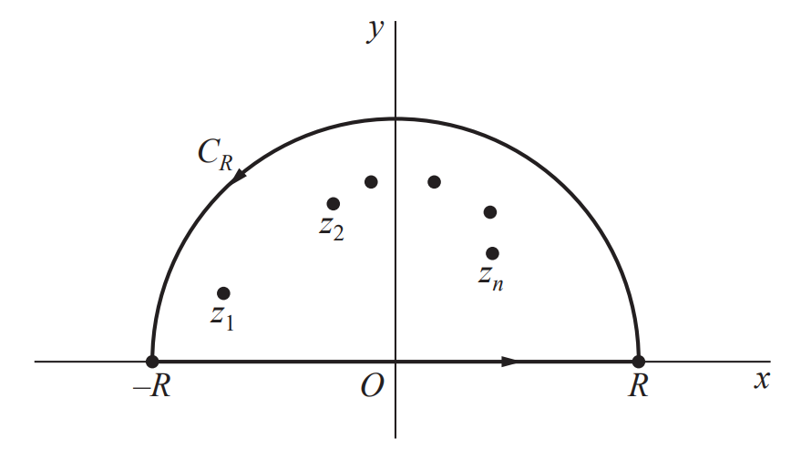

# Definition
Let $f : \mathbb{R} \to \mathbb{R}$ be a continuous function. 

**(i)** The ***improper integral*** of $f(x)$ is defined as

$$\begin{align*}
\int_a^\infty f(x) dx &= \lim_{t \to \infty} \int_a^t f(x) dx \\
\int_{-\infty}^\infty f(x) dx &= \lim_{s \to -\infty} \int_s^a f(x) dx + \lim_{t \to \infty} \int_a^t f(x) dx
\end{align*}$$

When the limit on the right-hand side exists, we say that the integral ***converges***.

**(ii)** The ***Cauchy principle value*** of $f(x)$ is defined as

$$\mathrm{P.V.} \int_{-\infty}^\infty f(x) dx = \lim_{t \to \infty} \int_{-t}^t f(x) dx$$

적분의 위끝과 아래끝이 모두 무한대인 이상적분의 경우 하나의 극한으로 정의되지 않고, 각각에 대해서 극한을 적용해야 한다. 양쪽이 동시에 무한대로 뻗어나가는 극한은 코시 주요값이라는 이름으로 정의된다. 일반적으로 코시 주요값과 이상적분은 같을 필요도 없고, 존재성이 함께 보장될 필요도 없다. 딱봐도 알 수 있듯이 이상적분이 존재할 조건이 좀 더 강한 조건이고, 따라서 이상적분이 존재하면 코시 주요값도 존재하고, 그 값은 동일하게 계산된다.

## Properties
**(i)** If the integral $\int_{-\infty}^\infty f(x) dx$ exists, then the Cauchy principle value exists and

$$\mathrm{P.V.} \int_{-\infty}^\infty f(x) dx = \int_{-\infty}^\infty f(x) dx$$

**(ii)** If $f(x)$ is an even function, then

$$\mathrm{P.V.} \int_{-\infty}^\infty f(x) dx = \lim_{t \to \infty} \int_{-t}^t f(x) dx = \lim_{t \to \infty} 2\int_0^t f(x) dx = 2\int_0^\infty f(x) dx$$

이상적분과 코시 주요값은 동일한 개념이 아니지만, 주어진 함수 $f(x)$가 짝함수라면 존재성은 동치로 주어진다. 즉 $\int_a^\infty f(x) dx$가 존재하면 $\int_{-\infty}^\infty f(x) dx$도 존재하고, 코시 주요값도 존재한다.

# Motivation
이 포스트에서는 실함수의 이상적분

$$\int_0^\infty f(x) dx, \quad \int_{-\infty}^\infty f(x) dx$$

를 계산하는 것을 목표로 한다. 실함수를 적분하는데 복소해석학이 필요한 이유는, 공간을 복소평면으로 옮겨서 유수 정리를 사용하는 것을 목표로 하기 때문이다. 

위와 같은 적분을 실수 안에서 여러 테크닉을 가지고 해결하려는 방법은 대게 복잡하고 많은 계산을 요구한다. 그러나 복소평면으로 정의역을 확장시켜보면, $-\infty$부터 $\infty$의 적분은 복소평면에서 실수축의 부분집합인 $[-R, R]$에서 $R \to \infty$인 상황에 해당한다. 따라서 우리는 아래와 같이 복소평면 위의 반원을 그린 뒤 $C_R$과 $[-R, R]$에서의 선적분을 계산해준뒤 $R \to \infty$의 극한을 취하고, 유수를 계산해서 이상적분을 계산하려고 한다.

# Theorem 1
For a function $f(z)$, suppose that  

**(i)** $f$ is analytic throughout a neighborhood of the upper half-plane except for finitely many isolated singular points $z_1, \dots, z_n$ with $\mathrm{Im}(z_i) > 0$,

**(ii)** $\displaystyle \lim_{z \to \infty} z f(z) = 0$

**(iii)** $\displaystyle \int_{-\infty}^\infty f(x) dx$ exists.

Then 

$$\int_{-\infty}^\infty f(x) dx = 2\pi i \sum_{k=1}^n \operatorname*{Res}_{z=z_k} f(z)$$

## Proof
Let $C_{R_0}: \vert z \vert = R_0$ be a counterclockwise circle with a radius $R_0 > \max_{1 \le i \le n} \vert z_i \vert$. Set a closed contour $\Gamma_R = C_{R} \cup [-R, R]$ where $C_R: \vert z \vert = R$ is a counterclockwise circle with a radius $R > R_0$. Then all $z_i$'s are contained in $\Gamma_R$. By [Cauchy's Residue Theorem](../Residue/index.qmd#sec-cauchy's-residue-theorem) and the assumption **(i)**, we have

$$\begin{align*}
\int_{\Gamma_R} f(z) dz &= \int_{C_{R}} f(z) dz + \int_{-R}^{R} f(x) dx \\ 
&= 2\pi i \sum_{i=1}^n \operatorname*{Res}_{z = z_i} f(z) \,\, \cdots \,\, (\ast)
\end{align*}$$

We claim that 

$$\lim_{R \to \infty} \int_{C_R} f(z)dz = 0$$

$\big[ (\because)$ Let $\varepsilon > 0$. Since $\displaystyle \lim_{z \to \infty} z f(z) = 0$, there exists $\delta > 0$ such that 

$$\vert z \vert > \frac{1}{\delta} \implies \vert z f(z) \vert < \frac{\varepsilon}{\pi}.$$

We will show that

$$\vert R \vert > \frac{1}{\delta} \implies \left \vert \int_{C_R} f(z) dz \right \vert < \varepsilon.$$

Suppose that $\vert R \vert > \frac{1}{\delta}$. For any $z$ in $C_R$, we have $\vert z \vert = R$ and 

$$\vert f(z) \vert = \left \vert \frac{zf(z)}{z} \right \vert < \frac{\varepsilon}{\pi R}$$

By [ML Lemma](../ML_Lemma/index.qmd#sec-theorem), we have

$$\begin{align*}
\left \vert \int_{C_R} f(z) dz \right \vert &\le \frac{\varepsilon}{\pi R} \cdot \pi R \\
&= \varepsilon.
\end{align*}$$

Thus, $\displaystyle \lim_{R \to \infty} \int_{C_R} f(z) dz = 0$.$\big]$

Since the improper integral $\displaystyle \int_{-\infty}^\infty f(x) dx$ exists, it is the same as the Cauchy principal value. By taking the limit $R \to \infty$ in the equation $(\ast)$, we have

$$\int_{-\infty}^\infty f(x) dx = 2\pi i \sum_{i=1}^n \operatorname*{Res}_{z = z_i} f(z). \blacksquare$$

## Example 1
이상적분 

$$I = \int_0^\infty \frac{1}{x^6+1} dx$$

를 위 정리를 이용해 계산해보자. $f(z) = \frac{1}{z^6+1}$로 두면 분모가 $0$이 되는 지점을 제외하고는 모든 곳에서 해석적이다. 이때 방정식 $z^6+1 = 0$은

$$c_k = \exp \left[ i \left( \frac{\pi}{6} + \frac{2k\pi}{6} \right) \right], \quad k = 0, 1, \dots, 5$$

의 해를 가지고, 이 중 상반평면에 있는 해는 $c_0, c_1, c_2$이므로 함수 $f$는 이 세 개의 고립특이점을 제외하고 항상 해석적이고, 또한 자명하게

$$\lim_{z \to \infty} zf(z) = \lim_{z \to \infty} \frac{z}{z^6+1} = 0$$

이 성립한다. 마지막 가정은 수렴판정법에 의해 성립함이 확인된다. 자연수 $n$에 대해서 $\frac{1}{n^6+1} \le \frac{1}{n^6}$가 성립하고 $\displaystyle \sum_{n=1}^\infty \frac{1}{n^6}$는 $p$-판정법에 의해 수렴하므로 $\displaystyle \sum_{n=1}^\infty \frac{1}{n^6+1}$ 또한 수렴한다. 따라서 이상적분 $\displaystyle \int_{0}^\infty \frac{1}{x^6+1} dx$의 값이 존재함을 알 수 있다.

한편 $f(x) = \frac{1}{x^6+1}$은 짝함수이고, 따라서 위의 성질 **(ii)**를 참고하면 다음의 결과가 성립한다.

$$\begin{align*}
\int_{-\infty}^\infty \frac{1}{x^6+1} dx = 2bb \int_0^\infty \frac{1}{x^6+1} dx = 2I
\end{align*}$$

즉 이상적분 $\displaystyle \int_{-\infty}^\infty \frac{1}{x^6+1} dx$의 값 또한 존재하며, 구체적으로는 $2I$로 주어진다. 이제 위 정리를 적용하면 구하고자 하는 적분값 $I$는 다음과 같이 계산된다.

$$\begin{align*}
2I &= 2\pi i \sum_{k=0}^2 \operatorname*{Res}_{z=c_k} \frac{1}{z^6+1} \\
\implies I &= \pi i \sum_{k=0}^2 \operatorname*{Res}_{z=c_k} \frac{1}{z^6+1}
\end{align*}$$

이제 각 유수의 값을 계산해보자. 각 $c_k$가 함수 $f$의 단순극점이라는 사실을 생각한다면 $f$는

$$\frac{1}{z^6+1} = \frac{1}{(z-c_k)g_k(z)} = \frac{\frac{1}{g_k(z)}}{z-c_k}$$

의 꼴로 항상 표현될 수 있고, 이때 $g_k$는 $g_k(c_k) \neq 0$을 만족하는 다항함수이다. 이때 유수의 값은

$$\operatorname*{Res}_{z = c_k} f(z) = \frac{1}{g_k(c_k)}$$

로 주어진다. 한편 

$$6c_k^5 = \frac{d}{dz}(z^6+1) \Bigg \vert_{z = c_k} = \frac{d}{dz} [(z-c_k)g_k(z)] \Bigg \vert_{z = c_k} = g_k(c_k)$$

으로 주어지므로,

$$\operatorname*{Res}_{z = c_k} f(z) = \frac{1}{6c_k^5} = -\frac{c_k}{6}$$

임을 얻는다. 따라서 최종적으로

$$\begin{align*}
I &= \pi i \sum_{k=0}^2 \operatorname*{Res}_{z=c_k} \frac{1}{z^6+1} \\
&= \pi i \sum_{k=0}^2 \left( -\frac{c_k}{6} \right) \\
&= -\frac{\pi i}{6} \left( c_0 + c_1 + c_2 \right) \\
&= -\frac{\pi i}{6} \left( e^{\frac{\pi}{6}} + e^{\frac{3\pi}{6}} + e^{\frac{5\pi}{6}} \right) \\
&= -\frac{\pi i}{6} \cdot 2i \\
&= \frac{\pi}{3}
\end{align*}$$

임을 알 수 있다. 이와 같은 방법으로 실함수의 이상적분을 유수를 사용해 구할 수 있다.

# Theorem 2
For a function $f(z)$ and a real constant $a > 0$, suppose that  

**(i)** $f$ is analytic throughout a neighborhood of the upper half-plane except for finitely many isolated singular points $z_1, \dots, z_n$ with $\mathrm{Im}(z_i) > 0$,

**(ii)** $\displaystyle \lim_{z \to \infty} z f(z) = 0$,

**(iii)** $\displaystyle \int_{-\infty}^\infty f(x) e^{iax} dx$ exists.

Then 

$$\int_{-\infty}^\infty f(x) e^{iax} dx = 2\pi i \sum_{k=1}^n \operatorname*{Res}_{z=z_k} \left[ f(z) e^{iaz} \right]$$

## Proof
Since $e^{iaz}$ is an entire function, $f(z)e^{iaz}$ has the same singularities as $f(z)$. Let $C_{R_0}: \vert z \vert = R_0$ be a counterclockwise circle with a radius $R_0 > \max_{1 \le i \le n} \vert z_i \vert$. Set a closed contour $\Gamma_R = C_{R} \cup [-R, R]$ where $C_R: \vert z \vert = R$ is a counterclockwise circle with a radius $R > R_0$. Then all $z_i$'s are contained in $\Gamma_R$. By [Cauchy's Residue Theorem](../Residue/index.qmd#sec-cauchy's-residue-theorem) and the assumption **(i)**, we have

$$\begin{align*}
\int_{\Gamma_R} f(z)e^{iaz} dz &= \int_{C_{R}} f(z)e^{iaz} dz + \int_{-R}^{R} f(x)e^{iax} dx \\ 
&= 2\pi i \sum_{i=1}^n \operatorname*{Res}_{z = z_i} f(z)e^{iaz} \,\, \cdots \,\, (\ast)
\end{align*}$$

We claim that 

$$\lim_{R \to \infty} \int_{C_R} f(z)e^{iaz}dz = 0$$

$\big[ (\because)$ Let $\varepsilon > 0$. Since $\displaystyle \lim_{z \to \infty} z f(z) = 0$, there exists $\delta > 0$ such that 

$$\vert z \vert > \frac{1}{\delta} \implies \vert z f(z) \vert < \frac{\varepsilon}{\pi}.$$

We will show that

$$\vert R \vert > \frac{1}{\delta} \implies \left \vert \int_{C_R} f(z)e^{iaz} dz \right \vert < \varepsilon.$$

Suppose that $\vert R \vert > \frac{1}{\delta}$. For any $z = x+iy$ in $C_R$, we have $\vert z \vert = R$ and $\mathrm{Im}(z) = y > 0$. Since

$$\begin{align*}
\vert e^{iaz} \vert &= \vert e^{ia(x+iy)} \vert \\
&= \vert e^{iax} e^{-ay} \vert \\
&= e^{-ay} \le 1,
\end{align*}$$

we have

$$\begin{align*}
\vert f(z) e^{iaz} \vert &\le \vert f(z) \vert \\
&= \left \vert \frac{zf(z)}{z} \right \vert \\
&< \frac{\varepsilon}{\pi R}
\end{align*}$$

By [ML Lemma](../ML_Lemma/index.qmd#sec-theorem), we have

$$\begin{align*}
\left \vert \int_{C_R} f(z)e^{iaz} dz \right \vert &\le \frac{\varepsilon}{\pi R} \cdot \pi R \\
&= \varepsilon.
\end{align*}$$

Thus, $\displaystyle \lim_{R \to \infty} \int_{C_R} f(z)e^{iaz} dz = 0$.$\big]$

Since the improper integral $\displaystyle \int_{-\infty}^\infty f(x)e^{iax} dx$ exists, it is the same as the Cauchy principal value. By taking the limit $R \to \infty$ in the equation $(\ast)$, we have

$$\int_{-\infty}^\infty f(x)e^{iax} dx = 2\pi i \sum_{i=1}^n \operatorname*{Res}_{z = z_i} f(z)e^{iaz}. \blacksquare$$

## Exmaple 2
::: {.content-hidden}
$e^{iaz} = \cos (az) + i \sin (az)$이므로

$$\int_{-\infty}^\infty f(x)e^{iax} dx = \int_{-\infty}^\infty f(x) \cos (ax) dx + i \int_{-\infty}^\infty f(x) \sin (ax) dx$$

으로 쪼갤 수 있다. 따라서 위 정리는 적분

$$\int_{-\infty}^\infty f(x) \sin ax dx, \quad \int_{-\infty}^\infty f(x) \cos ax dx$$

을 계산하는데 사용될 수 있다.

예컨대 적분

$$\int_0^\infty \frac{\cos 2x}{(x^2+4)^2} dx$$

을 계산해보자. 함수 $f(z) = \frac{1}{(z^2+4)^2}$로 두면 방정식 $z^2+4 = 0$은 $z = \pm 2i$의 해를 가진다. 이 중 상반평면에 있는 해는 $z_0 = 2i$로 유일하며, 함수 $f$는 $z_0$를 제외한 모든 점에서 해석적이다. 또한 자명하게

$$\lim_{z \to \infty} z f(z) = \lim_{z \to \infty} \frac{z}{(z^2+4)^2} = 0$$

이므로 위 정리의 조건 **(ii)**가 성립한다. 한편

$$\int_{-\infty}^\infty f(x)e^{iax} dx = \int_{-\infty}^\infty \frac{\cos 2x}{(x^2+4)^2} dx + i \int_{-\infty}^\infty \frac{\sin 2x}{(x^2+4)^2} dx$$

이므로
:::

# Reference
- Brown, James Ward, & Churchill, Ruel V. (2017). Complex Variables and Applications (9th ed.). McGraw-Hill.