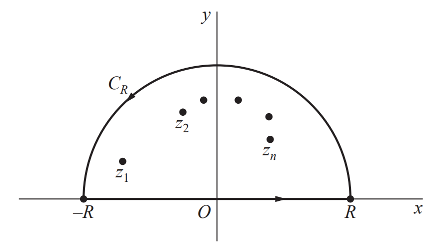

# Introduction
이 포스트에서는 실함수의 여러 적분, 예컨대

$$\int_{-\infty}^\infty f(x) dx, \quad \int_{-\infty}^\infty f(x) \cos (ax) dx,  \quad \int_{-\infty}^\infty f(x) \sin (ax) dx, \quad \int_0^{2\pi} F(\sin \theta, \cos \theta) d \theta$$

등의 적분을 유수 정리를 이용해 계산하는 방법을 서술한다. 많은 경우 이러한 적분은 특이점을 가지고 있거나 실수 안에서 해결하려면 대게 복잡하고 많은 계산을 요구한다. 그러나 복소평면으로 정의역을 확장시켜보면, 이상적분의 경우 $-\infty$부터 $\infty$의 적분은 복소평면에서 실수축의 부분집합인 $[-R, R]$에서 $R \to \infty$인 상황에 해당한다. 따라서 우리는 아래와 같이 복소평면 위의 반원을 그린 뒤 $C_R$과 $[-R, R]$에서의 선적분을 계산해준뒤 $R \to \infty$의 극한을 취하고, 유수를 계산해서 이상적분을 계산하려고 한다.

# 1. Improper Integral
## Definition
Let $f : \mathbb{R} \to \mathbb{R}$ be a continuous function. 

**(i)** The ***improper integral*** of $f(x)$ is defined as

$$\begin{align*}
\int_a^\infty f(x) dx &= \lim_{t \to \infty} \int_a^t f(x) dx \\
\int_{-\infty}^\infty f(x) dx &= \lim_{s \to -\infty} \int_s^a f(x) dx + \lim_{t \to \infty} \int_a^t f(x) dx
\end{align*}$$

When the limit on the right-hand side exists, we say that the integral ***converges***.

**(ii)** The ***Cauchy principle value*** of $f(x)$ is defined as

$$\mathrm{P.V.} \int_{-\infty}^\infty f(x) dx = \lim_{t \to \infty} \int_{-t}^t f(x) dx$$

적분의 위끝과 아래끝이 모두 무한대인 이상적분의 경우 하나의 극한으로 정의되지 않고, 각각에 대해서 극한을 적용해야 한다. 양쪽이 동시에 무한대로 뻗어나가는 극한은 코시 주요값이라는 이름으로 정의된다. 일반적으로 코시 주요값과 이상적분은 같을 필요도 없고, 존재성이 함께 보장될 필요도 없다. 딱봐도 알 수 있듯이 이상적분이 존재할 조건이 좀 더 강한 조건이고, 따라서 이상적분이 존재하면 코시 주요값도 존재하고, 그 값은 동일하게 계산된다.

### Properties
**(i)** If the integral $\int_{-\infty}^\infty f(x) dx$ exists, then the Cauchy principle value exists and

$$\mathrm{P.V.} \int_{-\infty}^\infty f(x) dx = \int_{-\infty}^\infty f(x) dx$$

**(ii)** If $f(x)$ is an even function, then

$$\mathrm{P.V.} \int_{-\infty}^\infty f(x) dx = \lim_{t \to \infty} \int_{-t}^t f(x) dx = \lim_{t \to \infty} 2\int_0^t f(x) dx = 2\int_0^\infty f(x) dx$$

이상적분과 코시 주요값은 동일한 개념이 아니지만, 주어진 함수 $f(x)$가 짝함수라면 존재성은 동치로 주어진다. 즉 $\int_a^\infty f(x) dx$가 존재하면 $\int_{-\infty}^\infty f(x) dx$도 존재하고, 코시 주요값도 존재한다.

## Theorem 1
For a function $f(z)$, suppose that  

**(i)** $f$ is analytic throughout a neighborhood of the closed upper half-plane $y \ge 0$ except for finitely many isolated singular points $z_1, \dots, z_n$ with $\mathrm{Im}(z_i) > 0$,

**(ii)** $\displaystyle \lim_{z \to \infty} z f(z) = 0$

**(iii)** $\displaystyle \int_{-\infty}^\infty f(x) dx$ exists.

Then 

$$\int_{-\infty}^\infty f(x) dx = 2\pi i \sum_{k=1}^n \operatorname*{Res}_{z=z_k} f(z)$$

### Proof
Let $C_{R_0}: \vert z \vert = R_0$ be a counterclockwise circle with a radius $R_0 > \max_{1 \le i \le n} \vert z_i \vert$. Set a closed contour $\Gamma_R = C_{R} \cup [-R, R]$ where $C_R: \vert z \vert = R$ is a counterclockwise circle with a radius $R > R_0$. Then all $z_i$'s are contained in $\Gamma_R$. By [Cauchy's Residue Theorem](../Residue/index.qmd#sec-cauchy's-residue-theorem) and the assumption **(i)**, we have

$$\begin{align*}
\int_{\Gamma_R} f(z) dz &= \int_{C_{R}} f(z) dz + \int_{-R}^{R} f(x) dx \\ 
&= 2\pi i \sum_{i=1}^n \operatorname*{Res}_{z = z_i} f(z) \,\, \cdots \,\, (\ast)
\end{align*}$$

We claim that 

$$\lim_{R \to \infty} \int_{C_R} f(z)dz = 0$$

$\big[ (\because)$ Let $\varepsilon > 0$. Since $\displaystyle \lim_{z \to \infty} z f(z) = 0$, there exists $\delta > 0$ such that 

$$\vert z \vert > \frac{1}{\delta} \implies \vert z f(z) \vert < \frac{\varepsilon}{\pi}.$$

We will show that

$$\vert R \vert > \frac{1}{\delta} \implies \left \vert \int_{C_R} f(z) dz \right \vert < \varepsilon.$$

Suppose that $\vert R \vert > \frac{1}{\delta}$. For any $z$ in $C_R$, we have $\vert z \vert = R$ and 

$$\vert f(z) \vert = \left \vert \frac{zf(z)}{z} \right \vert < \frac{\varepsilon}{\pi R}$$

By [ML Lemma](../ML_Lemma/index.qmd#sec-theorem), we have

$$\begin{align*}
\left \vert \int_{C_R} f(z) dz \right \vert &\le \frac{\varepsilon}{\pi R} \cdot \pi R \\
&= \varepsilon.
\end{align*}$$

Thus, $\displaystyle \lim_{R \to \infty} \int_{C_R} f(z) dz = 0$.$\big]$

Since the improper integral $\displaystyle \int_{-\infty}^\infty f(x) dx$ exists, it is the same as the Cauchy principal value. By taking the limit $R \to \infty$ in the equation $(\ast)$, we have

$$\int_{-\infty}^\infty f(x) dx = 2\pi i \sum_{i=1}^n \operatorname*{Res}_{z = z_i} f(z). \blacksquare$$

## Example 1
이상적분 

$$I = \int_0^\infty \frac{1}{x^6+1} dx$$

를 위 정리를 이용해 계산해보자. $f(z) = \frac{1}{z^6+1}$로 두면 분모가 $0$이 되는 지점을 제외하고는 모든 곳에서 해석적이다. 이때 방정식 $z^6+1 = 0$은

$$c_k = \exp \left[ i \left( \frac{\pi}{6} + \frac{2k\pi}{6} \right) \right], \quad k = 0, 1, \dots, 5$$

의 해를 가지고, 이 중 상반평면에 있는 해는 $c_0, c_1, c_2$이므로 함수 $f$는 이 세 개의 고립특이점을 제외하고 항상 해석적이고, 또한 자명하게

$$\lim_{z \to \infty} zf(z) = \lim_{z \to \infty} \frac{z}{z^6+1} = 0$$

이 성립한다. 마지막 가정은 수렴판정법에 의해 성립함이 확인된다. 자연수 $n$에 대해서 $\frac{1}{n^6+1} \le \frac{1}{n^6}$가 성립하고 $\displaystyle \sum_{n=1}^\infty \frac{1}{n^6}$는 $p$-판정법에 의해 수렴하므로 $\displaystyle \sum_{n=1}^\infty \frac{1}{n^6+1}$ 또한 수렴한다. 따라서 이상적분 $\displaystyle \int_{0}^\infty \frac{1}{x^6+1} dx$의 값이 존재함을 알 수 있다.

한편 $f(x) = \frac{1}{x^6+1}$은 짝함수이고, 따라서 위의 성질 **(ii)**를 참고하면 다음의 결과가 성립한다.

$$\begin{align*}
\int_{-\infty}^\infty \frac{1}{x^6+1} dx = 2bb \int_0^\infty \frac{1}{x^6+1} dx = 2I
\end{align*}$$

즉 이상적분 $\displaystyle \int_{-\infty}^\infty \frac{1}{x^6+1} dx$의 값 또한 존재하며, 구체적으로는 $2I$로 주어진다. 이제 위 정리를 적용하면 구하고자 하는 적분값 $I$는 다음과 같이 계산된다.

$$\begin{align*}
2I &= 2\pi i \sum_{k=0}^2 \operatorname*{Res}_{z=c_k} \frac{1}{z^6+1} \\
\implies I &= \pi i \sum_{k=0}^2 \operatorname*{Res}_{z=c_k} \frac{1}{z^6+1}
\end{align*}$$

이제 각 유수의 값을 계산해보자. 각 $c_k$가 함수 $f$의 단순극점이라는 사실을 생각한다면 $f$는

$$\frac{1}{z^6+1} = \frac{1}{(z-c_k)g_k(z)} = \frac{\frac{1}{g_k(z)}}{z-c_k}$$

의 꼴로 항상 표현될 수 있고, 이때 $g_k$는 $g_k(c_k) \neq 0$을 만족하는 다항함수이다. 이때 유수의 값은

$$\operatorname*{Res}_{z = c_k} f(z) = \frac{1}{g_k(c_k)}$$

로 주어진다. 한편 

$$6c_k^5 = \frac{d}{dz}(z^6+1) \Bigg \vert_{z = c_k} = \frac{d}{dz} [(z-c_k)g_k(z)] \Bigg \vert_{z = c_k} = g_k(c_k)$$

으로 주어지므로,

$$\operatorname*{Res}_{z = c_k} f(z) = \frac{1}{6c_k^5} = -\frac{c_k}{6}$$

임을 얻는다. 따라서 최종적으로

$$\begin{align*}
I &= \pi i \sum_{k=0}^2 \operatorname*{Res}_{z=c_k} \frac{1}{z^6+1} \\
&= \pi i \sum_{k=0}^2 \left( -\frac{c_k}{6} \right) \\
&= -\frac{\pi i}{6} \left( c_0 + c_1 + c_2 \right) \\
&= -\frac{\pi i}{6} \left( e^{\frac{\pi}{6}} + e^{\frac{3\pi}{6}} + e^{\frac{5\pi}{6}} \right) \\
&= -\frac{\pi i}{6} \cdot 2i \\
&= \frac{\pi}{3}
\end{align*}$$

임을 알 수 있다. 이와 같은 방법으로 실함수의 이상적분을 유수를 사용해 구할 수 있다.

## Jordan's Lemma
Let $a > 0$ and let $C_R: z = Re^{i \theta} (0 \le \theta \le \pi)$ for $R > 0$. Suppose that $f$ is continuous on $C_R$ and $\displaystyle \lim_{z \to \infty} f(z) = 0$.

Then $\displaystyle \lim_{R \to \infty} \int_{C_R} f(z) e^{iaz} dz = 0$.

### Proof
We first estimate the integral $\displaystyle \int_0^\pi e^{-R \sin \theta} d\theta$. Note that for $0 \le \theta \le \frac{\pi}{2}$, we have 

$$\begin{align*}
&\sin \theta \ge \frac{2}{\pi} \theta \\
\implies &-R \sin \theta \le -\frac{2R}{\pi} \theta \\
\implies &e^{-R \sin \theta} \le e^{-\frac{2R}{\pi} \theta} \\
\implies & \frac{1}{2} \int_0^\pi e^{-R \sin \theta} d\theta = \int_0^{\pi / 2} e^{-R \sin \theta} d\theta \\
& \le \int_0^{\pi / 2} e^{-\frac{2R}{\pi} \theta} d\theta \\
& = \frac{\pi}{2R}(1-e^{-R}) \\
& < \frac{\pi}{2R},
\end{align*}$$

so that $\displaystyle \int_0^\pi e^{-R \sin \theta} d\theta < \frac{\pi}{R}$. Since $\displaystyle \lim_{z \to \infty} f(z) = 0$, for each $\varepsilon > 0$, there exists $\delta > 0$ such that 

$$\left \vert \frac{1}{z} \right \vert < \delta \implies \vert f(z) \vert < \frac{a \varepsilon}{\pi}.$$

Then for all $R > 0$ such that $\displaystyle \frac{1}{\delta} < \vert z \vert = R$, we have

$$\begin{align*}
\left \vert \int_{C_R} f(z) e^{iaz} dz \right \vert &= \left \vert \int_0^\pi f(Re^{i \theta}) e^{iaRe^{i \theta}} \cdot Rie^{i\theta} d\theta \right \vert \\
& \le \int_0^\pi \left \vert f(Re^{i \theta}) e^{iaRe^{i \theta}} \cdot Rie^{i\theta} \right \vert d\theta \\
& = R \int_0^\pi \left \vert f(Re^{i \theta}) \right \vert e^{-aR \sin \theta}d \theta \\
& \le \frac{a \varepsilon}{\pi} R \int_0^\pi e^{-aR \sin \theta}d \theta \\
& < \frac{a \varepsilon}{\pi} R \cdot \frac{\pi}{aR} \\
&= \varepsilon.
\end{align*}$$

Hence, we conclude that 

$$\lim_{R \to \infty} \int_{C_R} f(z) e^{iaz} dz = 0. \blacksquare$$

## Theorem 2
For a function $f(z)$ and a real constant $a > 0$, suppose that  

**(i)** $f$ is analytic throughout a neighborhood of the closed upper half-plane $y \ge 0$ except for finitely many isolated singular points $z_1, \dots, z_n$ with $\mathrm{Im}(z_i) > 0$,

**(ii)** $\displaystyle \lim_{z \to \infty} f(z) = 0$,

**(iii)** $\displaystyle \int_{-\infty}^\infty f(x) e^{iax} dx$ exists.

Then 

$$\int_{-\infty}^\infty f(x) e^{iax} dx = 2\pi i \sum_{k=1}^n \operatorname*{Res}_{z=z_k} \left[ f(z) e^{iaz} \right]$$

### Proof
Since $e^{iaz}$ is an entire function, $f(z)e^{iaz}$ has the same singularities as $f(z)$. Let $C_{R_0}: \vert z \vert = R_0$ be a counterclockwise circle with a radius $R_0 > \max_{1 \le i \le n} \vert z_i \vert$. Set a closed contour $\Gamma_R = C_{R} \cup [-R, R]$ where $C_R: \vert z \vert = R$ is a counterclockwise circle with a radius $R > R_0$. Then all $z_i$'s are contained in $\Gamma_R$. By [Cauchy's Residue Theorem](../Residue/index.qmd#sec-cauchy's-residue-theorem) and the assumption **(i)**, we have

$$\begin{align*}
\int_{\Gamma_R} f(z)e^{iaz} dz &= \int_{C_{R}} f(z)e^{iaz} dz + \int_{-R}^{R} f(x)e^{iax} dx \\ 
&= 2\pi i \sum_{i=1}^n \operatorname*{Res}_{z = z_i} f(z)e^{iaz} \,\, \cdots \,\, (\ast)
\end{align*}$$

By the Jordan's Lemma, we obtain $\displaystyle \lim_{R \to \infty} \int_{C_R} f(z)e^{iaz}dz = 0$. Since the improper integral $\displaystyle \int_{-\infty}^\infty f(x)e^{iax} dx$ exists, it is the same as the Cauchy principal value. By taking the limit $R \to \infty$ in the equation $(\ast)$, we have

$$\int_{-\infty}^\infty f(x)e^{iax} dx = 2\pi i \sum_{i=1}^n \operatorname*{Res}_{z = z_i} f(z)e^{iaz}. \blacksquare$$

## Exmaple 2
$e^{iaz} = \cos (az) + i \sin (az)$이므로

$$\int_{-\infty}^\infty f(x)e^{iax} dx = \int_{-\infty}^\infty f(x) \cos (ax) dx + i \int_{-\infty}^\infty f(x) \sin (ax) dx$$

으로 쪼갤 수 있다. 따라서 위 정리는 적분

$$\int_{-\infty}^\infty f(x) \sin ax dx, \quad \int_{-\infty}^\infty f(x) \cos ax dx$$

을 계산하는데 사용될 수 있다.

예컨대 적분

$$\int_0^\infty \frac{\cos 2x}{(x^2+4)^2} dx$$

을 계산해보자. 함수 $f(z) = \frac{1}{(z^2+4)^2}$로 두면 방정식 $z^2+4 = 0$은 $z = \pm 2i$의 해를 가진다. 이 중 상반평면에 있는 해는 $z_0 = 2i$로 유일하며, 함수 $f$는 $z_0$를 제외한 모든 점에서 해석적이다. 이때 유수를 구하면 $\displaystyle \frac{5}{32e^4 i}$를 얻는다.

또한 자명하게

$$\lim_{z \to \infty} f(z) = \lim_{z \to \infty} \frac{1}{(z^2+4)^2} = 0$$

이므로 위 정리의 조건 **(ii)**가 성립한다. 한편 **(iii)**에 의해 이상적분의 값이 존재하고

$$\int_{-\infty}^\infty f(x)e^{iax} dx = \int_{-\infty}^\infty \frac{\cos 2x}{(x^2+4)^2} dx + i \int_{-\infty}^\infty \frac{\sin 2x}{(x^2+4)^2} dx$$

이다. 또한 우함수의 성질에 의해 $\displaystyle \int_{-\infty}^\infty \frac{\sin 2x}{(x^2+4)^2} dx = 0$이므로, 위 정리에 의해 다음의 결론을 얻는다.

$$\int_0^\infty \frac{\cos 2x}{(x^2+4)^2} dx = 2\pi i \left( \frac{5}{32e^4i} \right) = \frac{5\pi}{16e^4}.$$

## Theorem 3
Suppose that 

**(i)** a function $f(z)$ is analytic at all points in the upper half-plane $y \geq 0$ except for finitely many simple poles $z_1, \dots, z_n$,

**(ii)** $\displaystyle \lim_{z \to \infty} f(z) = 0$,

**(iii)** $\displaystyle \int_{-\infty}^\infty f(x) dx$ exists.

Then

$$\int_{-\infty}^\infty f(x)e^{iax} dx = \pi i \sum_{k=1}^n \operatorname*{Res}_{z = z_k} \left[ f(z)e^{iaz} \right].$$

### Proof

# 2. Definite Integral
이번엔 이상적분이 아닌 유한한 구간에서의 정적분

$$\int_0^{2 \pi} F(\sin \theta, \cos \theta) d \theta$$

을 계산해보자. 중심이 원점이고 반지름이 $1$인 반시계방향의 원 $C$는 $z = e^{i \theta}$로 적을 수 있고, $\displaystyle d \theta = \frac{1}{i z} dz$이 성립하므로 변수를

$$\begin{align*}
\sin \theta &= \frac{e^{i \theta} - e^{-i \theta}}{2i} = \frac{z - 1/z}{2i} \\
\cos \theta &= \frac{e^{i \theta} + e^{-i \theta}}{2} = \frac{z + 1/z}{2}
\end{align*}$$

로 치환하면 위 적분은

$$\int_C F \left( \frac{z - z^{-1}}{2i}, \frac{z + z^{-1}}{2} \right) \frac{1}{iz} dz$$

로 변환된다. 이는 복소함수의 적분이므로 유수 정리를 사용해서 값을 구할 수 있다.

## Example 3
상수 $\vert a \vert < 1$에 대해서

$$\int_0^{2 \pi} \frac{d \theta}{1 + a \sin \theta} = \frac{2 \pi}{\sqrt{1 - a^2}}$$

이 성립함을 보이자. 위와 같이 변수를 치환해서 정리하면

$$\begin{align*}
\int_C \frac{1}{iz} \frac{1}{1 + a \frac{z - z^{-1}}{2i}} dz &= \int_C \frac{1}{iz} \frac{2iz}{2iz + a(z^2 - 1)} dz \\
&= \int_C \frac{2}{az^2 + 2iz - a}dz \\
&= \int_C \frac{2}{a} \frac{1}{z^2 + \frac{2i}{a}z - 1}dz
\end{align*}$$

이 성립한다. 한편 피적분함수를 $f(z)$로 두고 분모를 인수분해하면

$$\begin{align*}
f(z) &= \frac{2}{a} \frac{1}{z^2 + \frac{2i}{a}z - 1} \\
&= \frac{2}{a} \frac{1}{(z - z_1)(z - z_2)}
\end{align*}$$

이고,

$$z_1 = \left( \frac{-1 + \sqrt{1-a^2}}{a} \right)i, \quad \text{and} \quad z_2 = \left( \frac{-1 - \sqrt{1-a^2}}{a} \right)i$$

로 주어진다. 한편 $\vert a \vert < 1$이므로

$$\vert z_2 \vert = \frac{1 + \sqrt{1 - a^2}}{\vert a \vert} > 1$$

이고, 또한 $\vert z_1 z_2 \vert = 1$이므로 $\vert z_1 \vert < 1$을 얻는다. 즉 원 $C$의 내부에는 $z_1$이 존재한다. 따라서 유수 정리를 적용해 계산하면

$$\int_C \frac{2}{a} \frac{1}{z^2 + \frac{2i}{a}z - 1}dz = 2\pi i \operatorname*{Res}_{z = z_1} f(z) = \frac{2\pi}{\sqrt{1 - a^2}}$$

을 얻는다.

# Reference
- Brown, James Ward, & Churchill, Ruel V. (2017). Complex Variables and Applications (9th ed.). McGraw-Hill.