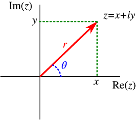

## Remark
Let $z = (x, y) \in \mathbb{C}$ and let $\vert z \vert = r$. Assume $z \neq 0$. 

Note that $\theta$ is the angle between the positive real axis and the directed line segment from the origin to $z$. Since $x = r \cos \theta$ and $y = r \sin \theta$, we have $z = r(\cos \theta + i \sin \theta)$.

Note that the ***Euler's formula*** is given by

$$
e^{i\theta} = \cos \theta + i \sin \theta.$$

Thus, we have

$$
z = r e^{i\theta}.
$$

## Definition 1
Let $z (\neq 0) \in \mathbb{C}$. Then $z$ can be written in ***exponential form*** as

$$z = r e^{i\theta}.$$

## Remark
**(i)** The circle 

$$C_R(z_0) = \{ z \in \mathbb{C} \mid \vert z - z_0 \vert = R \}$$

with radius $R$ centered at $z_0$ can be parametrized by 

$$z = z_0 + Re^{i\theta}, \quad \theta \in [0, 2\pi).$$

**(ii)** Note that $\cos \theta$ and $\sin \theta$ are periodic with period $2\pi$. Thus, there exists infinitely many $\theta$ such that $z = r e^{i\theta}$, says 

$$z = re^{i\theta} = r e^{i(\theta + 2n\pi)}, \quad \forall n \in \mathbb{Z}.$$ 

Each value of $\theta$ is called the ***argument*** of $z$, and the set of all such values is denoted by $\arg z$. The ***principal value*** of $\arg z$, denoted by $\text{Arg } z$, is the unique value $\Theta$ such that $-\pi < \Theta \le \pi$. Then we have

$$\arg z = \{\text{Arg } z + 2n\pi \mid n \in \mathbb{Z}\}$$

## Theorem 1
Let $z_1 = r_1 e^{i\theta_1}$ and $z_2 = r_2 e^{i\theta_2}$. Then

**(i)** $z_1 z_2 = r_1 r_2 e^{i(\theta_1 + \theta_2)}$

**(ii)** $\displaystyle \frac{z_1}{z_2} = \frac{r_1}{r_2} e^{i(\theta_1 - \theta_2)}$ if $z_2 \neq 0$

**(iii)** $z_1^n = r_1^n e^{in\theta_1}$ for any integer $n$

**(iv)** $\displaystyle \cos (2m \theta) = \sum_{k=0}^m (-1)^k \binom{2m}{2k} \cos^{2m-2k} \theta \sin^{2k} \theta$ and $\displaystyle \sin (2m \theta) = \sum_{k=0}^m (-1)^k \binom{2m}{2k+1} \cos^{2m-2k-1} \theta \sin^{2k+1} \theta$

### Proof
**(i)** 

$$\begin{align*}
z_1 z_2 &= r_1 (\cos \theta_1 + i \sin \theta_1) r_2 (\cos \theta_2 + i \sin \theta_2) \\
&= r_1 r_2 ((\cos \theta_1 \cos \theta_2 - \sin \theta_1 \sin \theta_2) + i (\sin \theta_1 \cos \theta_2 + \cos \theta_1 \sin \theta_2)) \\
&= r_1 r_2 (\cos (\theta_1 + \theta_2) + i \sin (\theta_1 + \theta_2)) \\
&= r_1 r_2 e^{i(\theta_1 + \theta_2)}
\end{align*}$$

**(ii)** 

$$\begin{align*}
\frac{z_1}{z_2} &= \frac{r_1 (\cos \theta_1 + i \sin \theta_1)}{r_2 (\cos \theta_2 + i \sin \theta_2)} \\
&= \frac{r_1}{r_2} \frac{\cos \theta_1 + i \sin \theta_1}{\cos \theta_2 + i \sin \theta_2} \\
&= \frac{r_1}{r_2} \frac{(\cos \theta_1 + i \sin \theta_1)(\cos \theta_2 - i \sin \theta_2)}{(\cos \theta_2 + i \sin \theta_2)(\cos \theta_2 - i \sin \theta_2)} \\
&= \frac{r_1}{r_2} \frac{\cos \theta_1 \cos \theta_2 + \sin \theta_1 \sin \theta_2 + i (\sin \theta_1 \cos \theta_2 - \cos \theta_1 \sin \theta_2)}{\cos^2 \theta_2 + \sin^2 \theta_2} \\
&= \frac{r_1}{r_2} (\cos (\theta_1 - \theta_2) + i \sin (\theta_1 - \theta_2)) \\
&= \frac{r_1}{r_2} e^{i(\theta_1 - \theta_2)}
\end{align*}$$

**(iii)** Note that $z =r e^{i \theta}$ is clear. Suppose that $z^n = r^n e^{in\theta}$ for some $n \in \mathbb{N}$. Then 

$$\begin{align*}
z^{n+1} &= z^n z \\
&= r^n e^{in\theta} r e^{i\theta} \\
&= r^{n+1} e^{i(n+1)\theta}
\end{align*}$$

Thus, by induction, $z^n = r^n e^{in\theta}$ for any $n \in \mathbb{N}$. 

It also holds when $n = 0$. Note that, by (ii), we have

$$z^{-1} = \frac{1}{z} = \frac{1}{r} e^{-i\theta}.$$

Let $n = -m$ for some $m \in \mathbb{N}$. Then 

$$\begin{align*}
z^n &= z^{-m} \\
&= (z^{-1})^m \\
&= \left[ \frac{1}{r} e^{i(- \theta)} \right]^m \\
&= \left( \frac{1}{r} \right)^m e^{i(- \theta)m} \\
&= \left( \frac{1}{r} \right)^{-n} e^{i(- \theta)(-n)} \\
&= r^n e^{in\theta}
\end{align*}$$

Thus, $z^n = r^n e^{in\theta}$ for any $n \in \mathbb{Z}$. 

**(iv)** Let $n = 2m$ be an even positive integer. For $z = e^{i \theta} = \cos \theta + i \sin \theta$, we have 

$$\begin{align*} 
z^n &= (\cos \theta + i \sin \theta)^n \\
&= \sum_{k=0}^n \binom{n}{k} \cos^{n-k} \theta (i \sin \theta)^k \\
&= \sum_{k=0}^{2m} \binom{2m}{k} \cos^{2m-k} \theta (i \sin \theta)^k \\
&= \sum_{k=0}^m \binom{2m}{2k} \cos^{2m-2k} \theta (i \sin \theta)^{2k} + \sum_{k=0}^m \binom{2m}{2k+1} \cos^{2m-2k-1} \theta (i \sin \theta)^{2k+1} \\
&= \sum_{k=0}^m (-1)^k \binom{2m}{2k} \cos^{2m-2k} \theta \sin^{2k} \theta + i \sum_{k=0}^m (-1)^k \binom{2m}{2k+1} \cos^{2m-2k-1} \theta \sin^{2k+1} \theta \\
&= \cos(2m \theta) + i \sin(2m \theta)
\end{align*}$$

Thus, we have

$$\begin{align*} 
\cos(2m \theta) &= \sum_{k=0}^m (-1)^k \binom{2m}{2k} \cos^{2m-2k} \theta \sin^{2k} \theta \\
\sin(2m \theta) &= \sum_{k=0}^m (-1)^k \binom{2m}{2k+1} \cos^{2m-2k-1} \theta \sin^{2k+1} \theta. \blacksquare
\end{align*}$$

## Theorem 2
Let $z_1 = r_1 e^{i\theta_1}$ and $z_2 = r_2 e^{i\theta_2}$ be nonzero complex numbers. Then 

$$z_1 = z_2 \iff r_1 = r_2 \text{ and } \theta_1 = \theta_2 + 2k\pi \text{ where } k \text{ is any integer} (k = 0, \pm 1, \pm 2, ...).$$

### Proof
$(\Longrightarrow)$

Suppose that $z_1 = z_2$. Note that 

$$z_1 = r_1 (\cos \theta_1 + i \sin \theta_1) = (r_1 \cos \theta_1, r_1 \sin \theta_1)$$

and 

$$z_2 = r_2 (\cos \theta_2 + i \sin \theta_2) = (r_2 \cos \theta_2, r_2 \sin \theta_2).$$

Then we have 

$$\begin{align*}
r_1 \cos \theta_1 &= r_2 \cos \theta_2 \\
r_1 \sin \theta_1 &= r_2 \sin \theta_2
\end{align*}$$

so that 

$$\begin{gather*}
r_1^2 \cos^2 \theta_1 + r_1^2 \sin^2 \theta_1 = r_2^2 \cos^2 \theta_2 + r_2^2 \sin^2 \theta_2 \\
\implies r_1^2 = r_2^2 \\
\implies r_1 = r_2 \quad (\because r_1, r_2 > 0)
\end{gather*}$$

Since $r_1 = r_2 > 0$, we have 

$$\begin{align*}
\cos \theta_1 &= \cos \theta_2 \\
\sin \theta_1 &= \sin \theta_2
\end{align*}$$

Thus we have 

$$\theta_1 - \theta_2 = 2k\pi \text{ where } k \text{ is any integer} (k = 0, \pm 1, \pm 2, ...)$$

$(\Longleftarrow)$

Suppose that $r_1 = r_2$ and $\theta_1 = \theta_2 + 2k\pi$ where $k$ is any integer. Then 

$$\begin{align*}
z_1 &= r_1 (\cos \theta_1 + i \sin \theta_1) \\
&= r_2 (\cos (\theta_2 + 2k\pi) + i \sin (\theta_2 + 2k\pi)) \\
&= r_2 (\cos \theta_2 + i \sin \theta_2) \\
&= z_2
\end{align*}$$

Thus we have 

$$z_1 = z_2 \iff r_1 = r_2 \text{ and } \theta_1 = \theta_2 + 2k\pi \text{ where } k \text{ is any integer} (k = 0, \pm 1, \pm 2, ...). \quad \blacksquare$$

## Theorem 3
Let $z_1 = r_1 e^{i\theta_1}$ and $z_2 = r_2 e^{i\theta_2}$ be nonzero complex numbers. Then 

**(i)** $\arg (z_1 z_2) = \arg z_1 + \arg z_2$

**(ii)** $\displaystyle \arg \left( \frac{z_1}{z_2} \right) = \arg z_1 - \arg z_2$

### Proof
**(i)** Let $\alpha_1 + \alpha_2 \in \arg z_1 + \arg z_2$ where $\alpha_1 \in \arg z_1$ and $\alpha_2 \in \arg z_2$. Then 

$$z_1 z_2 = r_1 e^{i \alpha_1} r_2 e^{i \alpha_2} = r_1 r_2 e^{i (\alpha_1 + \alpha_2)},$$

so that $\alpha_1 + \alpha_2 \in \arg (z_1z_2)$. 

Conversely, let $\theta \in \arg (z_1z_2)$. Then $z_1z_2 = re^{i \theta}$ for some $r > 0$. Since

$$r e^{i \theta} = z_1 z_2 = r_1 e^{i \theta_1} r_2 e^{i \theta_2} = r_1 r_2 e^{i (\theta_1 + \theta_2)},$$

we have $r = r_1 r_2$ and $\theta = \theta_1 + \theta_2 + 2k\pi$ for some integer $k$. Thus $\theta \in \arg z_1 + \arg z_2$, and therefore 

$$\arg (z_1 z_2) = \arg z_1 + \arg z_2.$$

**(ii)** Similarly... $\blacksquare$

# Reference
- Brown, James Ward, & Churchill, Ruel V. (2017). Complex Variables and Applications (9th ed.). McGraw-Hill.