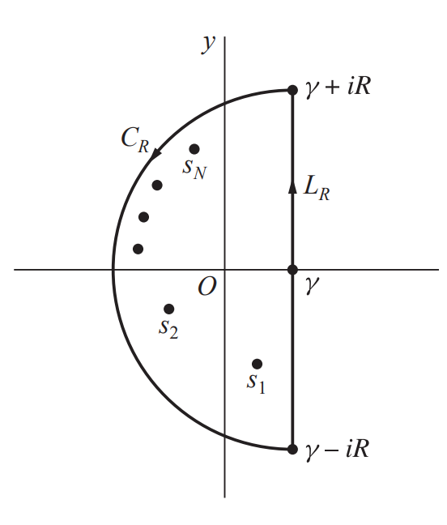

# Theorem
Let $g(t)$ be the inverse Laplace transform of $\displaystyle F(s) = \int_0^\infty e^{-st} f(t) dt$ for a function $f(t)$. Then $g(t) = f(t)$.

# Laplace Inverse Transform
함수 $f(t)$의 라플라스 변환 $\mathcal{L}\{ f(t) \}$은 다음과 같이 정의되었었다.

$$ \mathcal{L}\{ f(t) \} = \int_0^\infty e^{-st} f(t) dt $$

보통의 학부 ODE 수업에서는 라플라스 변환의 존재성이느니와 같은 구체적인 증명은 생략하고 계산에 초점을 맞추게 된다. 이 포스트에서는 라플라스 역변환을 복소해석학의 유수 정리를 이용해 구체적으로 값을 계산하는 과정을 설명한다.

함수 $F(s)$가 유한 개의 고립 특이점을 가지며, 이 점들 외에는 임의의 유한한 복소 $s$-평면에서 해석적이라고 하자. 한편 양의 실수 $\gamma$는 충분히 커서 직선 $s = \gamma$의 왼쪽에 $F$의 모든 고립 특이점이 다 놓이도록 잡아오고, $L_R$을 $s = \gamma - iR$에서 $s = \gamma + iR$까지 잇는 선분이라고 하자. 이제 $C_R$을 중심이 $s = \gamma$이고 반지름이 $R$이며 반시계 방향인 왼쪽 반원이라고 하면 다음 그림과 같은 상황이 성립한다.

이제 함수 $f(t)$를 양의 실수 $t$에 대해서 다음과 같이 정의하자.

$$\begin{align*}
f(t) = \frac{1}{2\pi i} \lim_{R \to \infty} \int_{L_R} e^{st} F(s) ds \\
&= \frac{1}{2\pi i} \mathrm{P.V.} \int_{\gamma - i \infty}^{\gamma + i \infty} e^{st} F(s) ds
\end{align*}$$

위 극한이 존재할 때에 한해서 함수 $f$는 잘 정의되고, 위와 같은 적분을 ***브롬위치 적분(Bromwich Integral)***이라고 부른다. 이때 함수 $F$의 역함수는 $f$가 되고, 이는 $F(s) = \mathcal{L}\{f(t)\}$의 역변환이 된다.

이제 유수 정리를 사용해서 구체적으로 계산하는 과정을 살펴보자. $e^{st}$가 전해석적인 함수이므로 $L_R \cup C_R$은 함수 $e^{st}F(s)$의 모든 특이점을 포함하고 있는 닫힌 경로이다. 따라서 코시 유수 정리에 의해

$$\int_{L_R} e^{st} F(s) ds = 2\pi i \sum_{n=1}^N \operatorname*{Res}_{s=s_n} [e^{st} F(s)] - \int_{C_R}e^{st} F(s) ds$$

이 성립한다. 만약

$$\lim_{R \to \infty} \int_{C_R}e^{st} F(s) ds = 0$$

이 성립한다면 함수 $f$의 정의에 의해

$$f(t) = \sum_{n=1}^N \operatorname*{Res}_{s=s_n} [e^{st} F(s)]$$

이 성립한다. 즉 라플라스 역변환은 $e^{st}F(s)$의 유수를 계산함으로써 얻어질 수 있다. 

# Reference
- Brown, James Ward, & Churchill, Ruel V. (2017). Complex Variables and Applications (9th ed.). McGraw-Hill.