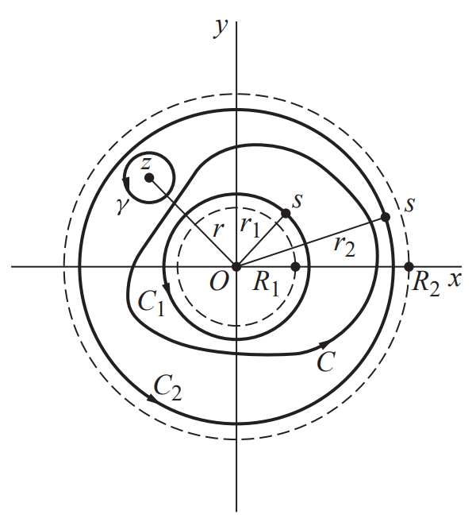

## Theorem
Suppose that a function $f$ is analytic throughout an annular domain $R_1 < \vert z - z_0 \vert < R_2$, centered at $z_0$, and let $C$ denote any positively oriented simple closed contour around $z_0$ and lying in that domain. Then $f$ has the series representation 

$$f(z) = \sum_{n=0}^\infty a_n(z-z_0)^n + \sum_{n=1}^\infty \frac{b_n}{(z-z_0)^n}$$

at each point $z$ in the domain $R_1 < \vert z - z_0 \vert < R_2$, where

$$\begin{align*}
a_n &= \frac{1}{2\pi i} \int_C \frac{f(z)}{(z-z_0)^{n+1}} \, dz \quad (n= 0, 1, 2, \cdots)\\
b_n &= \frac{1}{2\pi i} \int_C \frac{f(z)}{(z-z_0)^{-n+1}} \, dz \quad (n= 1, 2, \cdots).
\end{align*}$$

This series is called the ***Laurent series*** for $f$ about $z_0$.

### Proof
Let $z$ be a point in the domain, and let denote $\vert z- z_0 \vert = r$. Let $C$ be a positively oriented simple closed contour around $z_0$ lying in that domain. We construct a closed annular region $r_1 \le \vert z - z_0 \vert \le r_2$ that is contained in the domain $R_1 < \vert z - z_0 \vert < R_2$ and whose interior contains both the point $z$ and the contour $C$. We let $C_1$ and $C_2$ denote the positively oriented circles $\vert z - z_0 \vert = r_1$ and $\vert z - z_0 \vert = r_2$, respectively. Note that $f$ is analytic on $C_1$ and $C_2$, as well as in the annular domain between them.

Next, we construct a positively oriented circle $\gamma$ with center at $z$ and small enough to be contained in the interior of the annular region $r_1 \le \vert z - z_0 \vert \le r_2$. 

By the principle of deformation of the path, we obtain 

$$\int _{C_2} \frac{f(s)}{s - z} \, ds - \int _{C_1} \frac{f(s)}{s - z} \, ds - \int _{\gamma} \frac{f(s)}{s-z} \, ds = 0.$$

By the Cauchy integral formula, we have 

$$\begin{align*}
f(z) &= \frac{1}{2\pi i} \int _{\gamma} \frac{f(s)}{s - z} \, ds \\
&= \frac{1}{2\pi i} \int _{C_2} \frac{f(s)}{s - z} \, ds - \frac{1}{2\pi i} \int _{C_1} \frac{f(s)}{s - z} \, ds \\
&= \frac{1}{2\pi i} \int _{C_2} \frac{f(s)}{s - z} \, ds + \frac{1}{2\pi i} \int _{C_1} \frac{f(s)}{z - s} \, ds.
\end{align*}$$

Note that for $s \in C_2$, $\left \vert \frac{z-z_0}{s-z_0} \right \vert = \frac{r}{r_2} < 1$. Then we have

$$\begin{align*}
\frac{1}{s-z} &= \frac{1}{(s-z_0) - (z- z_0)} \\
&=\frac{1}{s-z_0} \cdot \frac{1}{1- \frac{z-z_0}{s-z_0}} \\
&= \frac{1}{s-z_0} \left[ \sum_{n=0}^{k-1} \left( \frac{z-z_0}{s-z_0} \right)^n + \frac{\left( \frac{z-z_0}{s-z_0} \right)^k}{1 - \frac{z-z_0}{s-z_0}} \right] \\
&= \sum_{n=0}^{k-1} \frac{\left( z-z_0 \right)^n}{(s-z_0)^{n+1}} + \frac{(z-z_0)^k}{(s-z)(s-z_0)^k},
\end{align*}$$

for all $k \ge 0$. Similarly, for $s \in C_1$, $\left \vert \frac{s-z_0}{z-z_0} \right \vert = \frac{r_1}{r} < 1$. Then we have 

$$\frac{1}{z-s} = \sum_{n=0}^{k-1} \frac{\left( s-z_0 \right)^n}{(z-z_0)^{n+1}} + \frac{(s-z_0)^k}{(z-s)(z-z_0)^k}$$

for all $k \ge 0$.

Thus, we have 

$$\begin{align*}
f(z) &= \frac{1}{2\pi i} \int _{C_2} \frac{f(s)}{s - z} \, ds + \frac{1}{2\pi i} \int _{C_1} \frac{f(s)}{z - s} \, ds \\
&= \frac{1}{2\pi i} \int _{C_1} f(s) \left[ \sum_{n=0}^{k-1} \frac{\left( z-z_0 \right)^n}{(s-z_0)^{n+1}} + \frac{(z-z_0)^k}{(s-z)(s-z_0)^k} \right] \, ds + \frac{1}{2\pi i} \int _{C_1} f(s) \left[ \sum_{n=0}^{k-1} \frac{\left( s-z_0 \right)^n}{(z-z_0)^{n+1}} + \frac{(s-z_0)^k}{(z-s)(z-z_0)^k} \right] \\
&= \left[ \sum_{n=0}^{k-1} a_n (z-z_0)^n + \rho_k(z) \right] + \left[ \sum_{n=0}^{k-1} b_{n+1} (z-z_0)^{-n-1} + \sigma_k(z) \right] \\
&= \left[ \sum_{n=0}^{k-1} a_n (z-z_0)^n + \rho_k(z) \right] + \left[ \sum_{n=1}^{k} b_{n} (z-z_0)^{-n} + \sigma_k(z) \right]
\end{align*}$$

where 

$$\begin{align*}
&a_n := \frac{1}{2\pi i} \int _{C_2} \frac{f(s)}{(s-z_0)^{n+1}} \, ds \\
& b_n := \frac{1}{2\pi i} \int _{C_1} \frac{f(s)}{(s-z_0)^{-n+1}} \, ds
\end{align*}$$

for all $n \ge 0$, and where 

$$\begin{align*}
&\rho_k(z) := \frac{(z-z_0)^k}{2\pi i} \int _{C_2} \frac{f(s)}{(s-z)(s-z_0)^{k}} \, ds \\
& \sigma_k(z) := \frac{1}{2\pi i(z-z_0)^k} \int _{C_2} \frac{f(s)(s-z_0)^{k}}{z-s} \, ds
\end{align*}$$

for all $k \ge 0$.

We claim that 

$$\lim_{k \to \infty} \rho_k(z) = 0 \quad \text{and} \quad \lim_{k \to \infty} \sigma_k(z) = 0$$

for all $z$ in the domain $R_1 < \vert z - z_0 \vert < R_2$. 

To verify this, we use $ML$-lemma.

$$\begin{align*}
\vert \rho_k(z) \vert &= \left\vert \frac{(z-z_0)^k}{2\pi i} \int _{C_2} \frac{f(s)}{(s-z)(s-z_0)^{k}} \, ds  \right \vert  \\
& \le \frac{r^k}{2\pi} \cdot \frac{\max _{s \in C_2} f(s)}{(r_2 - r)r_2^k} \cdot 2\pi r_2 \\
&= \frac{r_2}{r_2 - r} \cdot \max _{s \in C_2} f(s) \cdot \left( \frac{r}{r_2} \right)^k.
\end{align*}$$

Since $\frac{r}{r_2} < 1$, we obtain 

$$\lim_{k \to \infty} \vert \rho_k(z) \vert = 0,$$

so that 

$$\lim_{k \to \infty} \rho_k(z) = 0.$$

Similarly, we can show that 

$$\lim_{k \to \infty} \sigma_k(z) = 0.$$

Since we have chosen an arbitrary point $z$ in the domain, the result holds for any $z$ in the domain.

Thus, we have 

$$\begin{align*}
f(z) &= \lim_{k \to \infty} f(z) \\
&= \lim_{k \to \infty} \left[ \sum_{n=0}^{k-1} a_n (z-z_0)^n + \rho_k(z) + \sum_{n=1}^{k} b_{n} (z-z_0)^{-n} + \sigma_k(z) \right] \\
&= \sum_{n=0}^\infty a_n(z-z_0)^n + \sum_{n=1}^\infty \frac{b_n}{(z-z_0)^n}
\end{align*}$$

whenever $R_1 < \vert z - z_0 \vert < R_2$. 

By the deformation of the path, we have  

$$\begin{align*}
a_n &= \frac{1}{2\pi i} \int _{C_2} \frac{f(s)}{(s-z_0)^{n+1}} \, ds \\
&= \frac{1}{2\pi i} \int _{C} \frac{f(s)}{(s-z_0)^{n+1}} \, ds
\end{align*}$$

and 

$$\begin{align*}
b_n &= \frac{1}{2\pi i} \int _{C_1} \frac{f(s)}{(s-z_0)^{-n+1}} \, ds \\
&= \frac{1}{2\pi i} \int _{C} \frac{f(s)}{(s-z_0)^{-n+1}} \, ds. \quad \blacksquare
\end{align*}$$

## Remark
**(i)** Note that 

$$b_{-n} = \frac{1}{2\pi i} \int_C \frac{f(z)}{(z-z_0)^{n+1}} \quad (n = -1, -2, \cdots).$$

If we let 

$$c_n = \begin{cases}
a_n & \text{if } n \ge 0 \\
b_{-n} & \text{if }n < 0,
\end{cases}$$

then the Laurent series of $f$ about $z_0$ becomes 

$$f(z) = \sum_{n=-\infty}^\infty c_n(z-z_0)^n$$

where

$$c_n = \frac{1}{2\pi i} \int_C \frac{f(z)}{(z-z_0)^{n+1}}, \forall n \in \mathbb{Z}.$$

**(ii)** If $f$ is analytic throughtout the disk $\vert z - z_0 \vert < R_2$, then we have 

$$\begin{align*}
b_n &= \frac{1}{2\pi i} \int_C \frac{f(z)}{(z-z_0)^{-n+1}} \, dz \\
&= \frac{1}{2\pi i} \int_C f(z) (z-z_0)^{n-1} \, dz \\
&= 0,
\end{align*}$$

for all $n \in \mathbb{N}$, by the Cauchy-Goursat theorem. Thus, the Laurent series of $f$ is reduced to the Taylor series of $f$: 

$$\begin{align*}
f(z) &= \sum_{n=0}^\infty a_n(z-z_0)^n + \sum_{n=1}^\infty \frac{b_n}{(z-z_0)^n} \\
&= \sum_{n=0}^\infty a_n(z-z_0)^n
\end{align*}$$

where

$$a_n = \frac{1}{2\pi i} \int_C \frac{f(z)}{(z-z_0)^{n+1}} \, dz \quad (n= 0, 1, 2, \cdots).$$

**(iii)** Although $f$ is analytic everywhere in the complex plane $\mathbb{C}$ except at $z_0$, the Laurent series is valid at each point $z$ with $0 < \vert z-z_0 \vert < \infty$. 

**(iv)** Consider the series 

$$\sum_{n=1}^\infty \frac{b_n}{(z-z_0)^n}.$$

Let 

$$w = \frac{1}{z-z_0}.$$

If the series $\displaystyle \sum_{n=1}^\infty \frac{b_n}{(z-z_0)^n}$ converges at a point $z_1 \neq z_0$, then the series $\displaystyle \sum_{n=1}^\infty b_nw^n$ converges absolutely when 

$$\vert w \vert < \frac{1}{\vert z_1 - z_0 \vert} \iff \vert z- z_0 \vert > \vert z_1 - z_0 \vert$$

by Theorem 1. Thus, the series $\displaystyle \sum_{n=1}^\infty \frac{b_n}{(z-z_0)^n}$ converges absolutely exterior to the circle $\vert z-z_0 \vert = R_1,$ where $R_1 = \vert z_1 - z_0 \vert.$ Hence, if a function $f$ has the Laurant series expansion 

$$f(z) = \sum_{n=0}^\infty a_n(z-z_0)^n + \sum_{n=1}^\infty \frac{b_n}{(z-z_0)^n}$$

in an annulus domain $R_1 < \vert z- z_0 \vert < R_2$, then the Laurant series converges uniformly in any closed annulus which is concentric to and interior to the domain $R_1 < \vert z- z_0 \vert < R_2$. 

# Reference
- Brown, James Ward, & Churchill, Ruel V. (2017). Complex Variables and Applications (9th ed.). McGraw-Hill.