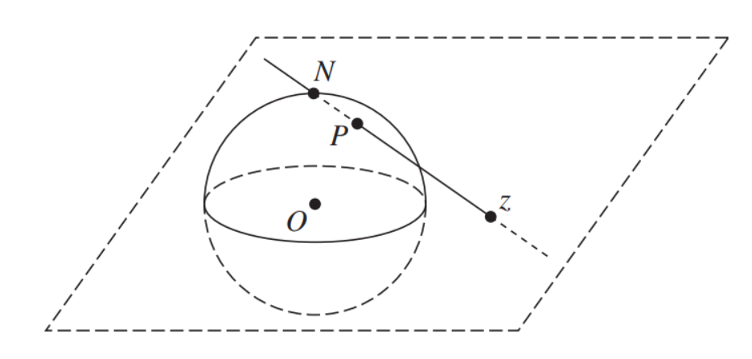

## Remark
일반적인 복소평면 $\mathbb{C}$에 무한대를 추가한 ***extended complex plane*** $\overline{\mathbb{C}} = \mathbb{C} \cup \{ \infty \}$를 고려하자. 이때 다음 그림과 같이 복소평면의 원점에 중심이 있는 단위 구를 고려하자. 

이때 복소평면 위의 점 $z$와 구의 북극점 $N$을 연결한 직선을 생각하자. 이때 직선과 구가 만나는 점 $P$가 항상 존재하고, 모든 점 $z$마다 이러한 점 $P$가 유일하게 존재함을 직관적으로 알 수 있다. 이때 무한대를 북극점 $N$과 대응시키면 복소평면과 구면을 일대일로 대응시킬 수 있고, 이러한 구를 **Riemann Sphere**라고 부른다. 

그러면 어떤 $\varepsilon > 0$에 대하여 원 $\vert z \vert = \frac{1}{\varepsilon}$ 바깥에 있는 복소평면 위의 점들은 $N$ 근방에 있는 리만 스피어 위의 점들과 대응된다는 사실을 알 수 있다. 따라서 $\vert z \vert > \frac{1}{\varepsilon}$을 만족하는 점들을 ***$\infty$의 근방***이라고 정의한다. 이제 극한의 정의에서 정의역과 공역에서 성립했던 근방의 개념을 무한대의 근방에까지 적용시킨다고 하면 복소공간에서도 무한대를 포함한 극한을 정의할 수 있다. 

## Theorem

**(i)** $\displaystyle \lim_{z \to z_0} \frac{1}{f(z)} = 0 \implies \lim_{z \to z_0} f(z) = \infty$ 

**(ii)** $\displaystyle \lim_{z \to 0} f\left( \frac{1}{z} \right) = w_0 \implies \lim_{z \to \infty} f(z) = w_0$ 

**(iii)** $\displaystyle \lim_{z \to 0} \frac{1}{f \left( \frac{1}{z} \right)} = 0 \implies \lim_{z \to \infty} f(z) = \infty$ 

### Proof
**(i)** By assumption, for any $\varepsilon > 0$, $\exists \delta > 0$ such that 

$$\begin{align*}
0 < \vert z - z_0 \vert < \delta \implies &\left \vert \frac{1}{f(z)} \right \vert < \varepsilon \\
\implies & \vert f(z) \vert > \frac{1}{\varepsilon}.
\end{align*}$$

Thus we have 

$$\lim_{z \to z_0} f(z) = \infty$$

**(ii)** By assumption, for any $\varepsilon > 0$, $\exists \delta > 0$ such that 

$$\begin{align*}
0 < \vert z\vert < \delta \implies &\left \vert f\left( \frac{1}{z} \right) - w_0 \right \vert < \varepsilon.
\end{align*}$$

Let $z' = \frac{1}{z}$. Then we have 

$$\begin{align*}
\vert z' \vert > \frac{1}{\delta} \implies &0 < \vert z \vert < \delta \\
\implies & \left \vert f\left( \frac{1}{z} \right) - w_0 \right \vert < \varepsilon \\
\implies & \vert f(z') - w_0 \vert < \varepsilon.
\end{align*}$$

Thus we have 

$$\lim_{z \to \infty} f(z) = w_0.$$

**(iii)** By assumption, for any $\varepsilon > 0$, $\exists \delta > 0$ such that 

$$\begin{align*}
0 < \vert z\vert < \delta \implies &\left \vert \frac{1}{f\left( \frac{1}{z} \right)} \right \vert < \varepsilon.
\end{align*}$$

Let $z' = \frac{1}{z}$. Then we have 

$$\begin{align*}
\vert z' \vert > \frac{1}{\delta} \implies &0 < \vert z \vert < \delta \\
\implies & \left \vert \frac{1}{f\left( \frac{1}{z} \right)} \right \vert < \varepsilon \\
\implies & \vert f(z') \vert > \frac{1}{\varepsilon}.
\end{align*}$$

Thus we have 

$$\lim_{z \to \infty} f(z) = \infty. \blacksquare$$

# Reference
- Brown, James Ward, & Churchill, Ruel V. (2017). Complex Variables and Applications (9th ed.). McGraw-Hill.