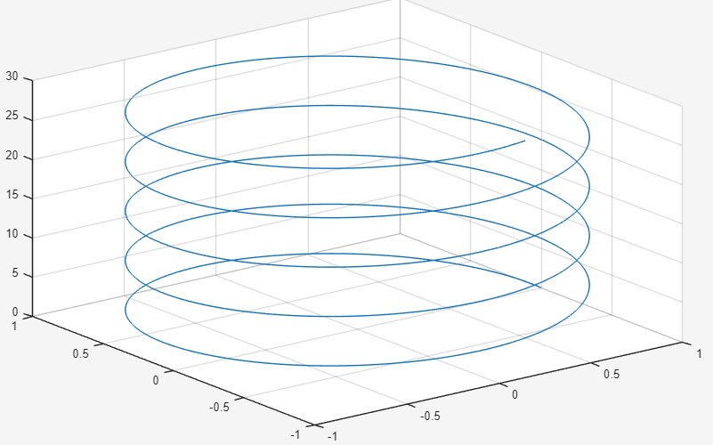
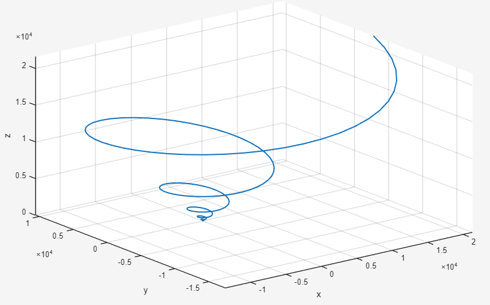
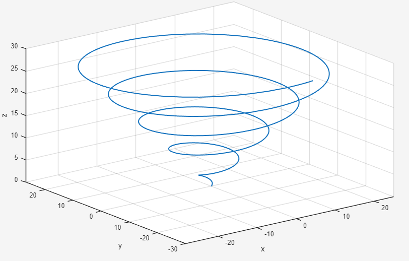

# Definition
A ***helix*** is a regular curve $\alpha$ such that $\langle T(s), u \rangle$ is a constant for some fixed vector $u \in \mathbb{R}^3$. The vector $u$ is called the ***axis*** of the helix.

보통 나선이라고 하면 $\alpha(t) = (\cos t, \sin t, t)$와 같이 일정하게 올라가는 예시만 생각할텐데, 위 정의에 따르면 굳이 이렇게 일정한 모양이 아니더라도 상관없다.

## Example
**(i)** $\alpha(t) = (e^{t}\cos 2\pi t, e^{t} \sin 2\pi t, e^t)$

**(ii)** $\alpha(t) = (t\cos t, t \sin t, t)$

# Theorem
A unit speed curve $\alpha$ with $\kappa(s) \neq 0, \forall s$ is a helix $\iff$ $\tau = c\kappa$ for some constant $c$.

## Proof
$(\implies)$ Suppose that $\alpha$ is a helix. Then $\langle T(s), u \rangle = \cos \theta$ for some fixed unit vector $u$ and constant $\theta$. Then we have

$$\begin{align*}
0 &= \frac{d}{ds} \langle T(s), u \rangle \\
&= \langle T'(s), u \rangle \\
&= \langle \kappa(s) N(s), u \rangle
\end{align*}$$

Since $\kappa \neq 0$, we have $\langle N(s), u \rangle = 0$. For an orthonormal basis $\{ T(s), N(s), B(s) \}$, we have $u = \langle T(s), u \rangle T(s) + \langle N(s), u \rangle N(s) + \langle B(s), u \rangle B(s)$. Since $\langle N(s), u \rangle = 0$, we have $u = \langle T(s), u \rangle T(s) + \langle B(s), u \rangle B(s)$. Furthermore, since $\langle T(s), u \rangle = \cos theta$ and $\| u \| = 1$, we have $\langle B(s), u \rangle = \pm \sin \theta$. WLOG, we may assume $\langle B(s), u \rangle = \sin \theta$, so that $u = \cos \theta T(s) + \sin \theta B(s)$. Then, differentiating both sides with respect to $s$, we have 

$$
\begin{align*}
0 &= \cos \theta T'(s) + \sin \theta B'(s) \\
&= \cos \theta \kappa(s) N(s) - \sin \theta \tau(s) N(s) \\
&= (\cos \theta \kappa(s) - \sin \theta \tau(s)) N(s).
\end{align*}
$$

which gives that $\cos \theta \kappa(s) = \sin \theta \tau(s)$.

If $\theta = n \pi$ for $n \in \mathbb{Z}$, then we have $\langle T(s), u \rangle = \cos \theta = \pm 1$. Since $T, u$ are unit vectors, it implies that $T(s) = \pm u$, so that $T'(s) = 0$. Then $\kappa(s) = 0$, which contradicts the fact that $\kappa \neq 0$. Thus $\theta \neq n \pi$ for any $n \in \mathbb{Z}$, so that $\sin \theta \neq 0$.

Therefore, we have $\tau(s) = \frac{\cos \theta}{\sin \theta} \kappa(s) = \cot \theta \kappa(s)$.

$(\impliedby)$ Suppose that $\tau = c \kappa$ for some constant $c$. Since $\cot$ is surjective, we may choose $\theta \in (0, \pi)$ such that $\cot \theta = c$. Then, we have $\tau = \cot \theta \kappa$, so that $\sin \theta \tau = \cos \theta \kappa$.

Let $u = \cos \theta T(s) + \sin \theta B(s)$. Then we have

$$\begin{align*}
\langle T(s), u \rangle &= \langle T(s), \cos \theta T(s) + \sin \theta B(s) \rangle \\
&= \cos \theta \langle T(s), T(s) \rangle + \sin \theta \langle T(s), B(s) \rangle \\
&= \cos \theta
\end{align*}$$

which is a constant. Thus, $\alpha$ is a helix with axis $u$. $\blacksquare$

# Reference
- R. S. Millman and G. D. Parker, Elements of Differential Geometry, Prentice-Hall, 1977.