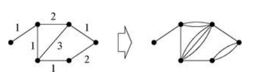

# Maximum Flow
멩거의 정리는 다음과 같은 상황에서 응용되어 사용될 수 있다. 예컨대 복잡하게 연결되어 있는 관들을 따라 물이 흐르고 있다고 가정하자. 이때 각 파이프를 에지로 두고, 파이프들이 연결되는 분기점, 즉 junction을 정점으로 잡으면 우리는 상수도를 하나의 그래프로 표현할 수 있다. 한편 편의상 하나의 파이프를 물이 통과할 때 $r$의 용량으로 흐른다고 가정하자. 즉 초당 $r$에 부피에 해당하는 물이 파이프를 따라 이동하는 상황이다. 이때 $A$라는 정점에서 $B$라는 정점까지 그래프를 따라 물이 흐르는 최대 용량은 얼마일까? 다시 말해, 하나의 파이프는 $r$의 용량으로 물이 이동하는데, 임의로 주어진 두 정점 사이에 물은 최대로 초당 얼마의 부피로 흐르게 될까? 놀랍게도 이 문제의 답은 멩거의 정리로부터 주어진다.

## Max-Flow/Min-Cut Theorem 
- In a graph where every edge has an identical capacity $r$, the maximum flow between any pair of vertices $A$ and $B$ is equal to $nr$, where $n$ denotes the maximum number of edge-independent paths connecting $A$ and $B$.

### Proof
Since the $n$ paths are edge-independent, they share no common edges. This means that each path can transport flow at rate $r$ independently of the others. Thus, the graph can sustain a total flow of at least $nr$ from $A$ to $B$. Hence, $nr$ constitutes a lower bound on the maximum flow:

$$\text{Max Flow} \ge nr$$

By Menger's Theorem, there exists an edge cut set of size $n$ separating $A$ and $B$. If we remove a single edge from this cut set, the total flow diminishes by at most $r$, because $r$ is the maximum capacity supported by any individual edge. If we remove all $n$ edges in the cut set, the maximum flow diminishes by at most $nr$. However, by the definition of a cut set, removing these $n$ edges completely disconnects vertex $A$ from vertex $B$, terminating all flow between them. It follows that the total flow cannot exceed $nr$, establishing $nr$ as an upper bound on the maximum flow:

$$\text{Max Flow} \le nr$$

Therefore, we obtain:

$$\text{Max Flow} = nr. \blacksquare$$

따라서 $A$와 $B$ 사이에 edge-independent path가 $n$개 존재한다면 maximum flow는 $n$개에 비례하여서 주어진다. 특별히 $r=1$과 같이 unit capacity로 주어진다면 우리는 다음과 같은 특별한 관계를 얻는다.

## Corollary
In any graph where each edge has unit capacity $r = 1$, the following three quantities are equal for any pair of vertices $A$ and $B$: 

**(i)** The edge connectivity: The maximum number of edge-independent paths connecting $A$ and $B$.

**(ii)** The size of the minimum edge cut set: The minimum number of edges whose removal disconnects $A$ and $B$.

**(iii)** The maximum flow: The maximum throughput achievable from $A$ to $B$.

한편 이러한 논의들은 그래프가 directed이거나 weighted여도 증명에 아무런 제약을 가하지 않으므로 동일하게 적용된다.

## Definition
Let $G$ be a weighted graph. A ***minimum edge cut set*** is a cut set such that the sum of the weights on the edges of the set has the minimum possible value. 

Unweighted graph에서는 cut set 중 가장 작은 크기를 갖는 집합을 minimum cut set이라고 불렀지만, 가중치가 부여되면 이제 cut set 중 에지의 가중치의 총합이 가장 작은 cut set을 minimum cut set으로 정의한다. 다만 unweighted graph를 모든 에지에 가중치 1이 균등하게 부여된 weighted graph의 특별한 경우라고 생각한다면 위 정의는 기존의 정의를 포함하는 보다 일반화된 정의라고 볼 수 있다. 이러한 정의 하에 max-flow min-cut theorem을 다음과 같이 일반화할 수 있다.

## General Max-Flow/Min-Cut Theorem
- The maximum flow between a given pair of vertices in a weighted graph is equal to the sum of the weights on the edges of the minimum edge cut set that separates the same two vertices.

### Proof
Consider the special case where the capacities of all edges in the graph are integer multiples of some fixed capacity $r$. Transform the graph by replacing each edge of capacity $kr$ (where $k$ is an integer) with $k$ parallel edges, each having a capacity of $r$.

It is evident that the maximum flow between any two vertices in the transformed graph is identical to that between the corresponding vertices in the original graph. Furthermore, the transformed graph is now a simple unweighted graph. By Max-Flow/Min-Cut Theorem, the maximum flow in this transformed network is equal to the size of the minimum edge cut set in terms of unit edges. 

Note that the minimum cut set on the transformed graph must include either all or none of the parallel edges between any adjacent pair of vertices. Cutting only a fraction of such parallel edges is pointless, since all of them must be removed to successfully disconnect the vertices. Consequently, the minimum cut set on the transformed graph is identical to a cut set on the original graph. Moreover, this must be a minimum cut set on the original graph because every cut set on the original translates to a cut set with the same total weight on the transformed graph. Therefore, the maximum flows and the minimum cuts are equal on both graphs.

This constraint can be removed by allowing $r \to 0$. As $r$ approaches zero, the unit of measurement for edge weights becomes infinitesimally small, meaning any arbitrary weight can be represented as a very large integer multiple of $r$. Hence, the max-flow/min-cut theorem must be generally true for any weighted graph. $\blacksquare$

# Reference
- Newman, M.E.J. (2010). Networks: An Introduction. Oxford University Press.