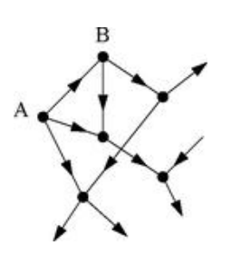

# Katz Centrality
고유벡터 중심성(eigenvector centrality)은 차수 중심성(degree centrality)보다 더 나은 척도이지만, 유향그래프를 분석할 경우 역시 완벽하지 않는 개념이다. 예를 들어 다음과 같은 유향그래프를 생각해보자.

이때 노드 $A$는 zero in-degree를 가지므로 고유벡터 중심성은 $0$이다.

> **Eigenvector Centrality**
> $$x_i = \frac{1}{\lambda_1} \sum_j A_{ij} x_j$$

$A$야 out-degree만 가지므로 그러려니 하겠지만, $B$의 경우 $1$의 in-degree를 가지지만 $A$에서 들어오는 에지이고, $A$는 $0$의 고유벡터 중심성을 가지므로 $B$ 또한 $0$의 고유벡터 중심성을 가진다. 이러한 직관에 반하는 예시가 존재하므로 유향그래프의 경우 고유벡터 중심성만으로는 충분하지 않음을 알 수 있고, 이는 새로운 중심성을 정의해야 함을 시사한다.

## Definition
Let $G$ be a network, and let $\mathbf{A}$ be the adjacency matrix of $G$. The ***Katz centrality*** $x_i$ of a vertex $i$ is defined as

$$x_i = \alpha \sum_j A_{ij} x_j + \beta$$

for some nonnegative constants $\alpha$ and $\beta$. In matrix form,

$$\mathbf{x} = \alpha \mathbf{A} \mathbf{x} + \beta \mathbf{1}$$

$\alpha = 1, \beta = 0$으로 두었을 경우 카츠 중심성은 고유벡터 중심성과 같은 값을 가진다. 식을 자세히 보면 $\beta$는 모든 노드들에 부여되는 기본값을 의미하고, $\alpha$는 고유벡터 중심성 $\sum_j A_{ij}x_j$ 항에 붙는 가중치를 의미한다. 위에서 살펴본 예시를 고려했을 때, 카츠 중심성은 고유벡터 중심성의 자연스러운 확장이라고 할 수 있다. 카츠 중심성을 사용하면 유향그래프에서도 의미있는 중심성을 정의할 수 있게 된다.

여기서 구체적으로 $\alpha, \beta$의 값을 정하는 문제가 남아있다. 우선 다음과 같이 식을 정리해보자.

$$\begin{align*}
&\mathbf{x} = \alpha \mathbf{A} \mathbf{x} + \beta \mathbf{1} \\
\implies &\mathbf{x} - \alpha \mathbf{A} \mathbf{x} = \beta \mathbf{1} \\
\implies &(\mathbf{I} - \alpha \mathbf{A}) \mathbf{x} = \beta \mathbf{1} \\
\implies &\mathbf{x} = \beta(\mathbf{I} - \alpha \mathbf{A})^{-1} \mathbf{1} 
\end{align*}$$

중심성이란 값이 그 절대적인 값이 중요하다기 보다는 상대적으로 비교할 때 의미를 가지므로 간단하게 $\beta = 1$로 두자.

$$\mathbf{x} = (\mathbf{I} - \alpha \mathbf{A})^{-1} \mathbf{1} \,\, \cdots \,\, (\ast)$$

이제 우리는 $\mathbf{I} - \alpha \mathbf{A}$가 역행렬을 가지도록 하는 적당한 $\alpha$를 선택해야 한다. 이는 $\det(\mathbf{I} - \alpha \mathbf{A})$의 값에 따라 결정되는데, 특별히 $0$인지 아닌지가 중요하므로 행렬식을 다음과 같이 조작하면 이는 사실상 인접행렬 $\mathbf{A}$의 특성방정식(characteristic polynomial)의 형태임을 알 수 있다.

$$\det \left(\mathbf{A} - \frac{1}{\alpha} \mathbf{I} \right)$$

이 값은 $\frac{1}{\alpha}$가 인접행렬 $\mathbf{A}$의 고유값 $\lambda$와 같아질 때 $0$이 되므로, $\alpha$가 $0$과 $\mathbf{A}$의 스펙트럴 래디어스 $\lambda_1$ 사이의 값을 가질 때 $\mathbf{I} - \alpha \mathbf{A}$은 역행렬을 가짐을 알 수 있다. 그러한 경우에 우리는 카츠 중심성을 식 $(\ast)$를 사용해서 계산할 수 있다.

## Extension
한편, 상수 $\beta$는 모든 노드들에 부여되는 기본값의 역할을 한다고 했다. 이때 어떤 이유에서든지 각 노드들에 서로 다른 값들을 부여하고 싶은 경우 $\beta$ 자체를 벡터로 만들면 된다. 즉 이 경우 카츠 중심성은 다음과 같이 정의된다.

$$\begin{align*}
\mathbf{x} &= \alpha \mathbf{A} \mathbf{x} + \pmb{\beta} \\
x_i &= \alpha \sum_j A_{ij} x_j + \beta_i
\end{align*}$$

# Reference
- Newman, M.E.J. (2010). Networks: An Introduction. Oxford University Press.