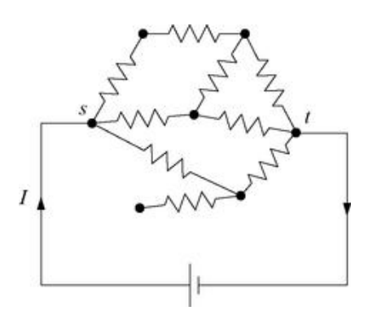

# Resistor Network

위 그림과 같은 직류 회로에서 각 분기점을 노드, 노드를 잇는 저항을 에지라고 생각한다면 회로 또한 국소적으로는 하나의 네트워크로 분석할 수 있다. 보통 회로에서 정의되는 전압, 전류, 저항 간의 관계는 옴의 법칙과 키르히호프의 법칙으로 기술되는데, 이는 철저히 국소적인 방법으로 관계를 기술한다. 특정한 저항과 지점을 지정하고, 그곳에 걸리는 전압과 흐르는 전류의 관계를 기술한다. 반면 회로를 네트워크로 바라봄으로써 전역적으로 회로를 분석할 수 있게 된다.

편의를 위해 모든 저항의 값을 $R$로 가정하고, 전류 $I$가 노드 $s$에서 $t$로 흐르고 있다고 하자. 인접한 두 노드 $i, j$ 사이에 흐르는 전류를 $I_{ij}$, 각 노드에서 측정되는 전위를 $V_i, V_j$로 둘 때 옴의 법칙에 의해 다음이 성립한다. 

$$I_{ij} = \frac{V_i - V_j}{R}$$

전위는 임의의 기준점이 주어져 있다고 가정한다. $V_i > V_j$일 경우 전류는 양의 값을 가지며, $i$에서 $j$의 방향으로 전류가 흐른다. 반대로 $V_i < V_j$일 경우 전류는 음의 값을 가지며, $j$에서 $i$의 방향으로 전류가 흐른다. 

한편 키르히호프 법칙에 의해 노드 $i$를 통과하는 모든 전류의 합 $I_i$에 대해 다음이 성립한다.

$$\begin{align*}
I_i &= \sum_{j \sim i} I_{ij} \\
&= \sum_{j \sim i} \frac{V_i - V_j}{R} \\
&= \frac{1}{R} [\mathbf{L} \mathbf{V}]_i
\end{align*}$$

$\mathbf{L}$은 그래프 라플라시안이다. 따라서 다음의 관계식을 얻는다.

$$\mathbf{L} \mathbf{V} = R \mathbf{I}$$

한편 위 식을 $\mathbf{V}$에 대해서 정리하려면 양변에 라플라시안의 역행렬 $\mathbf{L}^{-1}$을 곱해줘야 하는데, 일반적으로 라플라시안은 비가역행렬이므로 역행렬이 존재하지 않는다. 이때 랜덤 워크에서와 같은 방법으로 **축소된 라플라시안(reduced Laplacian)**을 쓰려고 한다.

축소된 라플라시안을 쓰려면 어떤 하나의 성분을 지워버리고 다시 $0$으로 만들어줘야 하는데, 어떤 노드를 잡아야 할까? 여기서 전기 퍼텐셜, 다시 말해 전위의 게이지 불변성이 사용된다. 쉽게 말해서 전위의 기준점을 우리가 원하는 곳에 $0$으로 맞춰주는 행위가 정확히 축소된 라플라시안을 쓰는 행위와 대응된다. 

다음과 같이도 표현할 수 있다. 우리가 위에서 얻은 관계식은 상수 $c$와 벡터 $\mathbf{1}$을 추가해도 여전히 성립한다.

$$\mathbf{L}(\mathbf{V} + c \mathbf{1}) = \mathbf{L}\mathbf{V} + c\mathbf{L}\mathbf{1} = \mathbf{L}\mathbf{V} = R\mathbf{I}$$

즉 모든 지점에서의 전위를 균등하게 $c$만큼 더하거나 빼주는 행위가 전체 회로를 분석하는데 전혀 영향을 주지 못한다. 뒤집어서 말하면, 우리가 $0$으로 만들어주고 싶은 노드의 전위 값만큼 상수를 더해줘도 아무런 문제가 없다는 뜻이다. 여기서는 편의를 위해 $t$에서의 전위를 $0$으로 둔다. 즉 $V_t = 0$이다. 따라서 $t$번째 행과 열을 지운 라플라시안을 $\mathbf{L}'$이라고 두고, $t$번째 성분을 지운 벡터를 각각 $\mathbf{V}', \mathbf{I}'$으로 둔다. 이제 $\mathbf{L}'$은 역행렬이 존재하고, 따라서 다음과 같이 관계식을 정리할 수 있다.

$$\mathbf{V}' = R \mathbf{L}'^{-1} \mathbf{I}'$$

한편 우리가 고려하는 회로에서는 전류가 오직 노드 $s$에서만 주입되고 노드 $t$로 빠져나간다. 즉, 벡터 $\mathbf{I}$는 $s$와 $t$ 성분만 $0$이 아닌 값을 가진다. 이때 $\mathbf{\Lambda}^{(t)}$를 $\mathbf{L}'^{-1}$과 같은 값을 가지되 $t$번째 행과 열 모두 $0$의 값을 가지도록 추가된 행렬이라고 하면 위 관계식을 다시 원래 차원으로 복원시켜서 다음과 같이 최종적으로 작성할 수 있다.

$$\mathbf{V} = R \mathbf{\Lambda}^{(t)} \mathbf{I}$$

구체적으로 $i$번째 성분은 다음과 같이 계산된다.

$$V_i = R \Lambda^{(t)}_{is} I$$

이때 $\vert I \vert = \vert I_s \vert = \vert I_t \vert$로 주어진다.

# Reference
- Newman, M.E.J. (2010). Networks: An Introduction. Oxford University Press.