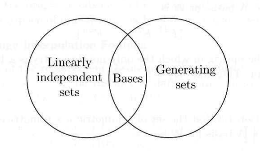

# Replacement Theorem
Let $V$ be a [vector space](../Vector_Space/index.qmd#sec-definition) generated by a set $G$ containing exactly $n$ vectors, and let $L$ be a [linearly independent](../Linear_Independence/index.qmd#sec-definition) subset of $V$ containing exactly $m$ vectors. Then $m \leq n$ and there exists a subset $H$ of $G$ containing exactly $n-m$ vectors such that $L \cup H$ [generates](../Linear_Combination/index.qmd#sec-definition) $V$.

기저란 벡터공간을 생성하는 선형 독립인 집합이다. 이때 기저에서 크기를 키우면 선형 독립의 조건이 사라지고, 크기를 줄이면 생성의 조건이 사라진다. 즉 두 조건의 경계가 기저가 됨을 알 수 있다. Replacement theorem은 이러한 생성집합과 선형 독립 집합 사이의 관계를 보여준다.

## Proof
We use induction on $m$.

**(i)** $m = 0$
Clearly $0 \leq n$, and since $L = \emptyset$, we can take $H = G$.

**(ii)** $m = k$
Assume that the theorem is true for some integer $k \geq 0$. That is, $k \leq n$ and for the linearly independent subset $L' = \{v_1, ..., v_k\}$ of $V$, $\exists H' \subset G$ containing exactly $n - k$ vectors such that $L' \cup H'$ generates $V$. Let take $H' = \{u_1, ..., u_{n-k}\}$.

**(iii)** $m = k+1$
Let $L = \{v_1, ..., v_k, v_{k+1}\}$ be a linearly independent subset of $V$. Since $v_{k+1} \in V$, 

$$v_{k+1} = \sum_{i=1}^k a_iv_i + \sum_{j=1}^{n-k} b_ju_j$$

for $a_i, b_j \in F (i = 1, ..., k, j = 1, ..., n - k)$.

Note that

**(1)** $n \neq k$,

**(2)** some $b_j$, say $b_1$, is nonzero. (($\because$) Otherwise, $L$ is linearly dependent $\bigotimes$.) 

Thus 

**(1)** $k < n \Longrightarrow k+1 \leq n$,

**(2)** 
$$u_1 = \sum_{i=1}^k \left(-\frac{a_i}{b_1}\right)v_i + \frac{1}{b_1}v_{k+1} + \sum_{j=2}^{n-k} \left(-\frac{b_j}{b_1}\right)u_j.$$

Let $H = \{u_2, ..., u_{n-k}\}$. Then $u_1 \in$ $\langle L \cup H \rangle$. Note that 

$$L' \cup H' \subset \langle L \cup H \rangle \Longrightarrow V = \langle L' \cup H' \rangle \subset \langle L \cup H \rangle.$$

Clearly $\langle L \cup H \rangle \subset V$. Thus $L \cup H$ generates $V$. $\blacksquare$

# Reference
- S. H. Friedberg, A. J. Insel, and L. E. Spence, Linear Algebra, 4th ed. (Pearson New International Edition), Pearson, 2013.