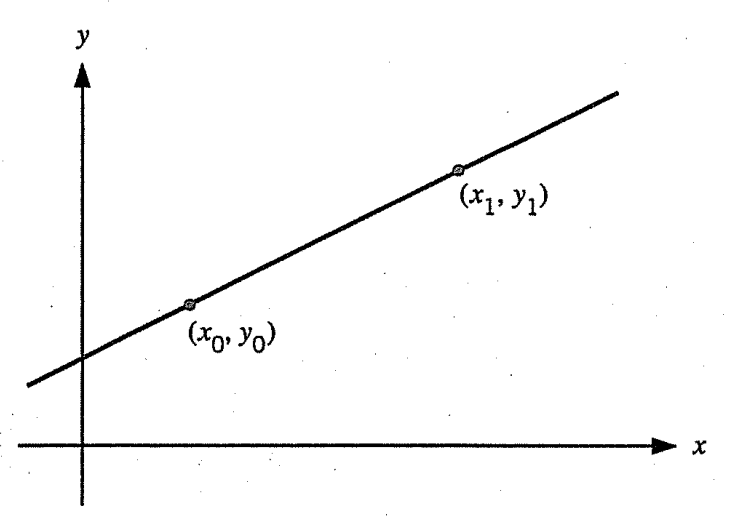
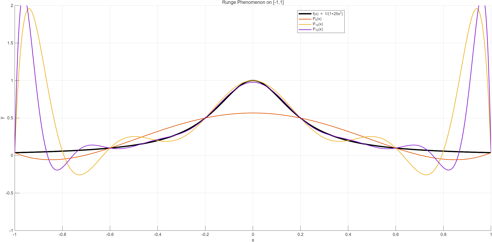

# Introduction
***보간법(Interpolation)***이란 데이터들의 집합 $\{ (x_0, y_0), (x_1, y_1), \dots, (x_n, y_n) \}$이 주어졌을 때 $f(x_i) = y_i$를 만족하면서 주어진 데이터들을 가장 잘 설명하는 함수 $f$를 찾는 과정 내지는 방법을 말한다. 이 포스트에서는 주로 ***다항식 보간법(Polynomial Interpolation)***, 즉 함수 $f$를 다항식으로 표현하는 방법에 대해서 다룬다. 아래 정리에서 볼 수 있듯이 이미 주어진 데이터들로 계산되는 다항식은 유일하게 존재함을 알 수 있는데, 그렇다면 남은 것은 존재하는 여러 표현 중에 계산 비용이 더 적은 것은 무엇인지 파악하는 것이다.

# Theorem 1
For points $(x_0, y_0), (x_1, y_1), \dots, (x_n, y_n)$ with distinct $x_i$'s, a polynomial $P_n$ is called an ***interpolating polynomial*** of $f$ at $x_0, x_1, \dots, x_n$ or $P_n$ is said to ***interpolate*** $f$ at $x_0, x_1, \dots, x_n$ if $P_n(x_i) = f(x_i)$ for all $i = 0, 1, \dots, n$ and $\deg P_n \le n$. Then there exists a unique interpolating polynomial $P_n(x)$.

## Proof
The existence comes directly from the Lagrange's interpolation formula. Suppose that there are two interpolating poloynomial $P_n(x)$ and $Q_n(x)$ at $x_0, x_1, \dots, x_n$. Define $R(x) = P_n(x) - Q_n(x)$. Since $\deg P_n, \deg Q_n \le n$, we have $\deg R \le n$. Since $R(x_i) = P_n(x_i) - Q_n(x_i) = 0$ for all $i = 0, 1, \dots, n$ and all $x_i$'s are distinct, $R(x)$ has $n+1$ distinct roots. Since $R$ has at most $n$ roots, we must obtain $R \equiv 0$, which implies $P_n = Q_n$. $\blacksquare$

# Lagrange Interpolation

간단한 경우부터 살펴보자. 단 두 개의 데이터 $(x_0, y_0), (x_1, y_1)$만 주어졌을 경우, 두 점을 지나는 직선이 데이터를 가장 잘 설명하는 함수일 것이다. 이때 방정식은 다음과 같이 주어진다.

$$y = \frac{y_1 - y_0}{x_1 - x_0}(x - x_0) + y_0$$

이러한 보간법을 ***선형 보간법(Linear Interpolation)***이라고 부른다. 한편, 이 직선은 각각 $(x_0, y_0), (x_1, y_1)$을 지나는 두 개의 직선으로 쪼개질 수 있다. 즉,

$$\begin{align*}
y &= \frac{y_1 - y_0}{x_1 - x_0}(x - x_0) + y_0 \\
&= \left[ \frac{-y_0}{x_1 - x_0}(x-x_1) + y_1 \right] + \left[ \frac{y_1}{x_1 - x_0}(x-x_0) \right] 
\end{align*}$$

이고, $y = y_0L_0(x) + y_1L_1(x)$로 표현되도록 $L_0(x)$와 $L_1(x)$를 정의하면 다음과 같다.

$$\begin{align*}
L_0(x) &= \frac{x - x_1}{x_0 - x_1}
L_1(x) &= \frac{x - x_0}{x_1 - x_0}
\end{align*}$$

이때 $L_0, L_1$의 특징을 살펴보면 다음과 같다.

1. 다항식 공간 $P_1(\mathbb{R})$의 부분집합 $\{ L_0, L_1 \}$은 선형독립이다.

2. $\deg L_0 = 1 = \deg L_1$

3. $L_i(x_j) = \delta_{ij}$

이 아이디어를 확장시키면 $n+1$ 개의 점들 $\{ (x_0, y_0), (x_1, y_1), \dots, (x_n, y_n) \}$이 주어졌을 때에도 같은 과정을 통해 주어진 점들을 지나는 다항식 $P_n$을 찾을 수 있다. 이러한 방법을 ***라그랑주 보간법(Lagrange Interpolation)***이라고 부르며 집합 $\{L_0, L_1, \dots, L_n\}$을 라그랑주 보간법의 ***기저 함수(basis functions)***라고 부른다.

# Theorem 2
Define

$$L_i(x) = \prod_{1 \le k \neq i \le n} \frac{x-x_k}{x_i - x_k}.$$

Then followings hold:

**(i)** The set $\{ L_0, L_1, \dots, L_n \}$ is a basis for the space $P_n(\mathbb{R})$.

**(ii)** $\deg L_i = n, \forall i = 0, 1, \dots, n$.

**(iii)** $L_i(x_j) = \delta_{ij}, \forall i, j = 0, 1, \dots, n$.

The ***Lagrange interpolating polynomial*** for the $n+1$ points $\{ (x_0, y_0), (x_1, y_1), \dots, (x_n, y_n) \}$ with distinct $x_i$'s is given by

$$P_n(x) = y_0L_0(x) + y_1L_1(x) + \dots + y_nL_n(x)$$

## Proof

# Newton's Divided Difference Interpolation
라그랑주 보간법은 다항식 공간 $P_n$의 기저를 제시하고 단순한 선형결합으로 다항식을 표현하게 만들어 줄 수 있다는 점에서 유용하나, 계산 코스트는 $\mathcal{O}(n^2)$ 정도로 다소 높다고 할 수 있다. 아래에서 설명할 뉴턴 계차상 보간법(Newton's Divided Difference Interpolation)은 라그랑주 보간법과 동일한 결과를 제공하면서도 $\mathcal{O}(n)$의 계산 코스트로 다항식을 구성할 수 있다.

# Definition
Let $f: \mathbb{R} \to \mathbb{R}$ be a function, and let $x_0, x_1, \dots, x_n$ be $n+1$ distinct points. Define the ***divided difference*** of $f$ as

$$\begin{align*}
f[x_0] &:= f(x_0)\\
f[x_0, x_1] &:= \frac{f(x_0) - f(x_1)}{x_0 - x_1}\\
f[x_0, x_1, x_2] &:= \frac{f[x_0, x_1] - f[x_1, x_2]}{x_0 - x_2}\\
\vdots\\
f[x_0, x_1, \dots, x_n] &:= \frac{f[x_0, x_1, \dots, x_{n-1}] - f[x_1, x_2, \dots, x_n]}{x_0 - x_n}
\end{align*}$$

$f[x_0, x_1]$을 ***first-order divided difference***, $f[x_0, x_1, x_2]$를 ***second-order divided difference***, 같은 방식으로 $f[x_0, x_1, \dots, x_n]$을 ***n-th order divided difference***라고 부른다. "Divided difference"는 한국어로 '계차상' 쯤으로 번역된다. 계차라는 것이 인접한 항끼리의 차의 의미를 갖다보니 이렇게 번역된 듯하다.

계차상을 사용한 라그랑주 보간법보다 더 연산 횟수를 줄일 수 있게 된다. 점이 $(x_0, y_0), (x_1, y_1)$만 주어지는 간단한 예를 살펴보자. 함수 $f$가 있어서 $y_i = f(x_i)$라고 하면, 이 경우 라그랑주 보간법은 다음과 같은 다항식을 준다.

$$\begin{aligned}
P_1(x) &= f(x_0) \frac{x - x_1}{x_0 - x_1} + f(x_1) \frac{x - x_0}{x_1 - x_0}
\end{aligned}$$

위 식을 잘 정리하면 다음과 같이 계차상을 이용해서 나타낼 수 있게 된다.

$$\begin{align*}
P_1(x) &= f(x_0) \frac{x - x_1}{x_0 - x_1} + f(x_1) \frac{x - x_0}{x_1 - x_0} \\
&= \frac{x - x_0 + x_0 - x_1}{x_0 - x_1}f(x_0) + \frac{x - x_0}{x_1 - x_0}f(x_1) \\
&= f(x_0) + \frac{x - x_0}{x_0 - x_1}(f(x_0) - f(x_1)) \\
&= f(x_0) + f[x_0, x_1](x-x_0) \\
&= f[x_0] + f[x_0, x_1](x-x_0)
\end{align*}$$

이때 위 모양을 잘 보면 사실상 함수 $f(x)$를 $x = x_0$에서 1차항까지 테일러 근사한 것임을 알 수 있는데, 실제로도 평균값 정리에 의해 다음을 만족하는 점 $c$가 $x_0$와 $x_1$ 사이에 존재함을 알 수 있다.

$$f[x_0, x_1] = \frac{f(x_0) - f(x_1)}{x_0 - x_1} = f'(c)$$

마찬가지로 2차 계차상에 대해서도

$$f[x_0, x_1, x_2] = \frac{f''(d)}{2!}$$ 

를 만족하는 $d$가 $x_0, x_1, x_2$ 사이에 존재함을 확인할 수 있고,

$$P_2(x) = f(x_0) + f[x_0, x_1](x-x_0) + f[x_0, x_1, x_2](x-x_0)(x-x_1)$$

와 같은 식이 주어진다. 이를 임의의 $n$에 대해 일반화한 공식이 바로 뉴턴 계차상 보간법이다.

# Theorem 2
For the points $(x_0, y_0), (x_1, y_1), \dots, (x_n, y_n)$ with distinct $x_i$'s, the ***Newton divided difference interpolating polynomial*** is given by:

**(i)** **Normal Form:**

$$\begin{aligned}
P_n(x) &= f(x_0) + \sum_{k=1}^n f[x_0, \dots, x_k] \prod_{j=0}^{k-1} (x-x_j) \\
&= f(x_0) + f[x_0, x_1](x-x_0) + f[x_0, x_1, x_2](x-x_0)(x-x_1) \\
&+ \dots + f[x_0, x_1, \dots, x_n](x-x_0)(x-x_1)\dots(x-x_{n-1})
\end{aligned}$$

**(ii)** **Recursive Form:**

$$P_n(x) = P_{n-1}(x) + f[x_0, \dots, x_n] \prod_{j=0}^{n-1} (x-x_j)$$

**(iii)** **Nested Form:**

$$P_n(x) = f(x_0) + (x-x_0) \left\{ f[x_0, x_1] + (x-x_1) \left\{ f[x_0, x_1, x_2] + \dots + (x-x_{n-1})f[x_0, \dots, x_n] \right\} \right\}$$

마지막 nested form은 마치 [Horner's method](../Horner_Method/index.qmd#sec-horner's-method)와 비슷한 구조를 가진다. 이렇게 공통인수를 묶어서 나타내면 곱셈 횟수를 더욱 줄일 수 있고, 결과적으로 더 적은 계산 비용으로 보간 다항식을 계산할 수 있다.

## Proof
We use induction on $n$. As we have shown above, the case $n = 1$ is given by

$$P_1(x) = f(x_0) + f[x_0, x_1](x-x_0).$$

:::: {.callout-note icon=false}
## Lemma
Let $P_{n-1}$ be the polynomial interpolating $f$ at $x_0, \dots, x_{n-1}$. Then

$$f[x_0, \dots, x_n] = \frac{f(x_n) - P_{n-1}(x_n)}{\prod_{j=0}^{n-1} (x_n - x_j)}$$

::: {.callout-note title="Proof" collapse="true" icon=false}
By the Lagrange's interpolation theorem,

$$P_{n-1}(x) = \sum_{i=0}^{n-1} f(x_i) \prod_{0 \le j \neq i \le n-1} \frac{x-x_j}{x_i - x_j}.$$

Then we have

$$\begin{align*}
\frac{f(x_n) - P_{n-1}(x_n)}{\prod_{j=0}^{n-1} (x_n - x_j)} &= \frac{f(x_n)}{\prod_{j=0}^{n-1} (x_n - x_j)} - \sum_{i=0}^{n-1} f(x_i) \frac{\prod_{0 \le j \neq i \le n-1} \frac{x_n - x_j}{x_i - x_j}}{\prod_{j=0}^{n-1} (x_i - x_j)} \\
&= \frac{f(x_n)}{\prod_{j=0}^{n-1} (x_n - x_j)} + \sum_{i=0}^{n-1} \frac{f(x_i)}{\prod_{j=0}^{n-1} (x_i - x_j)} \\
&= \sum_{i=0}^{n} \frac{f(x_i)}{\prod_{j=0}^{n} (x_i - x_j)} \\
&= f[x_0, \dots, x_n]
\end{align*}$$

by Theorem 3 **(i)**. $\blacksquare$
:::
::::

Suppose that the formula is valid for some $n-1$, i.e., $P_{n-1}$ is the interpolating polynomial of $f$ at $x_0, \dots, x_{n-1}$ and it is written in the Newton's form. 

Define

$$Q_n(x) := P_{n-1}(x) + \prod_{j=0}^{n-1}(x - x_j) f[x_0, \dots, x_n].$$

We will show that $Q_n = P_n$. For $i = 0, \dots, n-1$, we have

$$Q_n(x_i) = P_{n-1}(x_i) = f(x_i).$$

We need to evaluate the value $Q_n(x_n)$. By the above lemma gives

$$f[x_0, \dots, x_n] \prod_{j=0}^{n-1} (x_n - x_j) = f(x_n) - P_{n-1}(x_n).$$

Thus, we obtain

$$\begin{align*}
Q_n(x_n) &= P_{n-1}(x_n) + \prod_{j=0}^{n-1}(x_n - x_j) f[x_0, \dots, x_n] \\
&= P_{n-1}(x_n) + f(x_n) - P_{n-1}(x_n) \\
&= f(x_n).
\end{align*}$$

which means that $Q_n$ interpolates $f$ at $x_0, \dots, x_n$. By Theorem 1, $Q_n = P_n$. $\blacksquare$

# Theorem 3
Let $f \in C^n([\alpha, \beta])$, and let $x_0, x_1, \dots, x_n$ be $n+1$ distinct points in $[\alpha, \beta]$. We denote $H(x_0, \dots, x_n) := (\min\{x_0, \dots, x_n\}, \max\{x_0, \dots, x_n\})$.

**(i)**

$$f[x_0, x_1, \dots, x_n] = \sum_{i=0}^n \frac{f(x_i)}{\prod_{0 \le j \neq i \le n} (x_i - x_j)}$$

**(ii)** For any [permutation](../../Abstract_Algebra/Group_Theory/Permutation/index.qmd#definition-1) $\sigma \in S_{n+1}$,

$$f[x_0, x_1, \dots, x_n] = f[x_{\sigma(0)}, x_{\sigma(1)}, \dots, x_{\sigma(n)}]$$

**(iii)**  

$$f[x_0, x_1, \dots, x_n] = \frac{1}{n!}f^{(n)}(c)$$

for some $c \in H(x_0, \dots, x_n)$.

마지막 결과를 자연스럽게 확장해서 $x_i$들이 모두 같은 계차상을 다음과 같이 정의한다.

$$f[\underbrace{x_0, x_0, \dots, x_0}_{(n+1) \text{ times}}] = \frac{f^{(n)}(x_0)}{n!}.$$

## Proof

**(i)** We use induction on $n$. If $n = 1$, then we have

$$\begin{align*}
f[x_0, x_1] &= \frac{f(x_0) - f(x_1)}{x_0 - x_1} \\
&= \frac{f(x_0)}{x_0 - x_1} + \frac{f(x_1)}{x_1 - x_0} \\
&= \sum_{i=0}^1 \frac{f(x_i)}{\prod_{0 \le j \neq i \le 1} (x_i - x_j)}.
\end{align*}$$

Suppose that the statement is valid for some $n$. Note that

$$f[x_0, \dots, x_{n+1}] = \frac{f[x_0, \dots, x_n] - f[x_1, \dots, x_{n+1}]}{x_0 - x_{n+1}}$$

By the induction hypothesis, we have

$$\begin{align*}
f[x_0, \dots, x_{n}] &= \sum_{i=0}^n \frac{f(x_i)}{\prod_{0 \le j \neq i \le n} (x_i - x_j)} \\
f[x_1, \dots, x_{n+1}] &= \sum_{i=1}^{n+1} \frac{f(x_i)}{\prod_{1 \le j \neq i \le n+1} (x_i - x_j)}.
\end{align*}$$

For $1 \le i \le n$, the coefficient of $f(x_i)$ in $f[x_0, \dots, x_{n+1}]$ is given by

$$\frac{1}{x_0 - x_{n+1}} \left[ \frac{1}{ \prod_{0 \le j \neq i \le n} (x_i - x_j)} - \frac{1}{ \prod_{1 \le j \neq i \le n+1} (x_i - x_j)} \right] = \frac{1}{\prod_{0 \le j \neq i \le n+1} (x_i - x_j)}$$

For $i = 0$ and $i = n+1$, we can obtain the same result by direct computation. Thus, we have

$$\begin{align*}
f[x_0, \dots, x_{n+1}] &= \sum_{i=0}^{n+1} \frac{f(x_i)}{\prod_{0 \le j \neq i \le n+1} (x_i - x_j)}
\end{align*}$$

by the induction.

**(ii)** The formula of **(i)** shows that interchanging the order of $x_i$'s does not change the value of $f[x_0, \dots, x_n]$, but the order of terms of the formula.

**(iii)** Let $P_n$ be the interpolating polynomial of $f$ at $x_0, \dots, x_n$, and define

$$g(x) = f(x) - P_n(x).$$

Then $g(x_i) = 0$ for each $i = 0, 1, \dots, n$. Applying the Rolle's theorem to $g$ repeatedlly, there exists a point $c \in H(x_0, \dots, x_n)$ such that $g^{(n)}(c) = 0$. Then $f^{(n)}(c) = P^{(n)}(c)$, and from the Newton's formula, we have

$$P^{(n)}(c) = n! f[x_0, \dots, x_n],$$

which gives

$$f[x_0, \dots, x_n] = \frac{f^{(n)}(c)}{n!}. \blacksquare$$

# Theorem 4
Let $P_n$ interpolate $f$ at distinct points $x_0, \dots, x_n$ of $[\alpha, \beta]$.

**(i)** For any point $x$ distinct from all $x_i$'s,

$$f(x) - P_n(x) = f[x_0, \dots, x_n, x] \prod_{j=0}^n (x - x_j)$$

**(ii)** Let $f \in C^{n+1}([\alpha, \beta])$. For any $x \in [\alpha, \beta]$, there exists a point $c_x \in H(x_0,\dots, x_n, x)$ such that

$$f(x) - P_n(x) = \frac{f^{(n+1)}(c_x)}{(n+1)!} \prod_{j=0}^n (x - x_j)$$

## Proof
**(i)** Construct the polynomial $P_{n+1}$ interpolating $f$ at $x_0, x_1, \dots, x_n, x$.

By the recursive Newton's formula, 

$$P_{n+1}(t) = P_n(t) + f[x_0,x_1,\ldots,x_n,x] \prod_{j=0}^n (t-x_j)$$

Setting $t=x$ gives

$$f(x) = P_n(x) + f[x_0,x_1,\ldots,x_n,x] \prod_{j=0}^n (x-x_j)$$

Therefore

$$f(x) - P_n(x) = f[x_0,x_1,\ldots,x_n,x] \prod_{j=0}^n (x-x_j)$$

**(ii)** It follows directly from **(i)** and Theorem 3 **(iii)**. $\blacksquare$

# Runge Phenomenon
Let $\displaystyle x_i = a+\frac{i}{n}(b-a)$ for $i=0,\dots,n$ be equally spaced interpolation nodes, and let $P_n$ be the corresponding interpolating polynomial of $f$. The failure of the sequence $\{P_n\}$ to converge to $f$, accompanied by increasingly large oscillations near the endpoints of the interpolation interval as $n$ increases, is called the ***Runge phenomenon***.

어디까지나 $P_n$은 함수 $f$의 근사식에 불과하기에 오차가 존재한다. 정리 4에 의하면 오차는 다음과 같은 바운드를 가지게 된다.

$$\vert f(x) - P_n(x) \vert \le \frac{\max_{x \in [\alpha, \beta]} \vert f^{(n+1)} (x) \vert}{(n+1)!} \max_{x \in [\alpha, \beta]} \left \vert \prod_{j=0}^n (x - x_j) \right \vert$$

즉 오차는 두 개의 팩터 $\max \vert f^{(n+1)} (x) \vert$와 $\displaystyle \max \left \vert \prod_{j=0}^n (x - x_j) \right \vert$에 의존한다. 우리가 원하는 바가 $n$이 커질 때 $P_n \to f$로 수렴하는 것이라면 저 두 가지 팩터에 의존하는 바운드가 $0$으로 수렴해야 할 것이다. 항상 수렴하면 좋겠지만, 아래 예시와 같이 수렴하지 않고 오차가 마구 튀어버리는 ***룽게 현상(Runge Phenomenon)***이 생기기도 함이 잘 알려져 있다.

## Example
Consider the function

$$f(x) = \frac{1}{1+25x^2}, x \in [-1, 1].$$

For each $n$, let $x_j=-1+\frac{2j}{n}$ for $j=0,\dots,n$ be $n+1$ equally spaced points on $[-1,1]$, and let $P_n$ be the interpolation polynomial of $f$ at $x_j$'s. The following figure shows the graph of $f$ and $P_n$ for $n=5, 10, 15$.

$P_5$ 정도만 해도 그럭저럭 $f$를 향해서 잘 가나 싶더니, $P_{10}$만 되어도 양 끝점 $x = \pm 1$에서 엄청나게 튀어버리는 것을 볼 수 있다. 이러한 일이 일어나는 이유는 $x_i$들을 등간격으로 잡아서 끝점으로 갈수록 $\displaystyle \left \vert \prod_{j=0}^n (x - x_j) \right \vert$의 값이 점점 커지기 때문이다. 직관적으로 보아도 중앙에 가까울수록 $\vert x - x_j \vert$는 거의 균일하게 작은 값들을 가지지만, 끝점으로 가게 되면 큰 값들을 갖게 된다. 때문에 점들을 등간격으로 잡지 않고 구간의 양 끝에 점들을 몰아서 잡는 ***체비셰프 노드(Chebyshev nodes)***를 사용하거나, 아예 하나의 다항식으로 $f$를 근사하는 게 아닌 구간 별로 처리하는 ***스플라인 방법(Spline Method)***을 사용해야 한다.

# Reference
- K. E. Atkinson and W. Han, Elementary Numerical Analysis, 3rd ed., John Wiley & Sons, 2004.