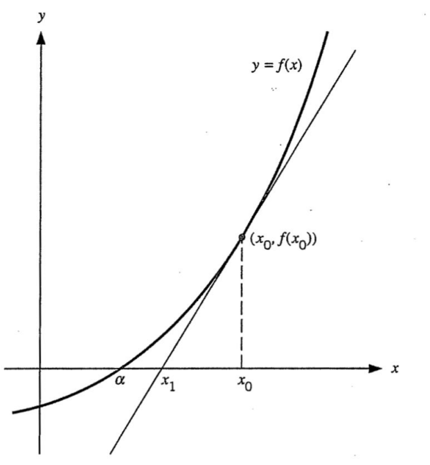

# Newton-Raphson Method
Suppose that the equation $f(x) = 0$ has a solution $\alpha$. For a given intial value $x_0$ near $\alpha$, the sequence $\{ x_n \}$ defined as

$$x_{n+1} = x_n - \frac{f(x_n)}{f'(x_n)}$$

for each $n = 0, 1, 2, \dots$ converges to $\alpha$ as $n \to \infty$. 

방정식 $f(x) = 0$이 $x = \alpha$에서 해를 가진다고 할 때, 적당히 $\alpha$ 근처에 있는 적당한 초기값 $x_0$를 택하여 거기서 함수 $f$에 접하는 접선을 긋는다. 이때 그 접선과 $x$축이 만나는 점을 $x_1$이라고 하고, $x_1$에 대해서 다시 $f$에 접선을 그어 위 과정을 반복한다. 그러면 $0 = f'(x_n)(x_{n+1} - x_n) + f(x_n)$이라는 점화식을 얻고, 정리하면

$$x_{n+1} = x_n - \frac{f(x_n)}{f'(x_n)}$$

을 얻는다. 

언뜻봐도 간단해 보이지만, 실제해인 $\alpha$ 근처에 있는 초기값 $x_0$을 적당히 잘 택해야 잘 작동한다. 또한 중간 과정에서 $f'(x_n) = 0$이 되기만 해도 실패할 것이기에 실제 코드를 구현할 때는 여러 예외처리가 필요하다.

## Example
뉴턴-랩슨 방법을 사용해 나눗셈 $\frac{a}{b}$을 덧셈, 뺄셈, 곱셈만을 이용해 계산하는 과정을 살펴보자. 이 방법은 $\frac{a}{b}$를 $a$ '나누기' $b$로 인식하는 것이 아니라, $a \times \frac{1}{b}$의 관점으로 바라본다. 즉 $b$의 역수인 $\frac{1}{b}$를 계산하면 충분하고, 우리의 목표는 방정식 

$$f(x) = a - \frac{1}{x} = 0 \,\, (a > 0)$$

을 푸는 것이다. 실제해를 $\alpha = \frac{1}{a}$, 초기값을 $x_0 (> 0)$로 두자. 도함수는 $f'(x) = \frac{1}{x^2}$으로 주어지므로 뉴턴-랩슨 방법의 점화식은 다음과 같이 주어진다.

$$\begin{align*}
x_{n+1} &= x_n - \frac{f(x_n)}{f'(x_n)} \\
&= x_n - x_n^2 \left( a - \frac{1}{x_n} \right) \\
&= x_n - ax_n^2 + x_n \\
&= 2x_n - ax_n^2 \\
&= x_n(2 - ax_n)
\end{align*}$$

혹은 다음과 같이 도함수를 근사해서 유도할 수도 있다.

$$\begin{align*}
\frac{1}{x_n^2} = f'(x_n) &\approx \frac{f(x_{n+1}) - f(x_n)}{x_{n+1} - x_n} \\
&\approx \frac{- f(x_n)}{x_{n+1} - x_n} \\
&= \frac{1}{x_n - x_{n+1}} \left(a - \frac{1}{x_n}\right)
\end{align*}$$

정리하면 동일하게 $x_{n+1} = x_n(2 - ax_n)$을 얻을 수 있다. 따라서 이 점화식을 반복하다보면 역수 $\frac{1}{b}$의 값을 근사시킬 수 있고, 나눗셈 $\frac{a}{b}$를 구현할 수 있다.

한편 위에서도 설명했듯이 뉴턴-랩슨 방법은 적당히 실제해 $\alpha$에 근접한 초기값 $x_0$를 잘 골라야 하는데, 방법이 잘 작동하도록 하는 초기값이 속한 구간은 오차를 분석함으로 얻어진다.

오차 $\alpha - x_n$을 실제해 $\alpha$로 나눈 값인 상대오차 

$$\mathrm{Rel}(x_n) = \frac{\alpha - x_n}{\alpha}$$

는 다음의 관계를 가진다.

$$\mathrm{Rel}(x_{n+1}) = [\mathrm{Rel}(x_n)]^2$$

이때 근사해 $x_n$이 실제해 $\alpha$에 수렴한다면 오차가 $0$으로 수렴해야 한다. 위 관계에서 오차는 제곱에 비례하여 변하므로 초기값 $x_0$는 $\vert \mathrm{Rel}(x_0) \vert < 1$을 만족해야 한다. 절댓값을 풀어서 정리하면 다음의 조건을 얻는다.

$$\begin{align*}
&\vert \mathrm{Rel}(x_0) \vert < 1 \\
\iff &-1 < \frac{\alpha - x_0}{\alpha} < 1 \\
\iff &0 < x_0 < 2\alpha = \frac{2}{a}
\end{align*}$$

즉 초기값 $x_0$는 구간 $\left( 0, \frac{2}{a} \right)$에서 선택해야 함을 알 수 있다. 

# Reference
- K. E. Atkinson and W. Han, Elementary Numerical Analysis, 3rd ed., John Wiley & Sons, 2004.