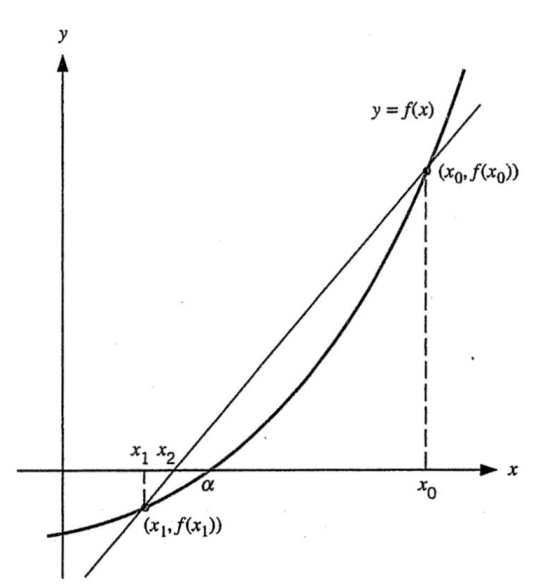

# Secant Method
Suppose that the equation $f(x) = 0$ has a solution $\alpha$. For given two intial values $x_0$ and $x_1$ near $\alpha$, the sequence $\{ x_n \}$ defined as

$$x_{n+1} = x_n - f(x_n) \frac{x_n - x_{n-1}}{f(x_n) - f(x_{n-1})}$$

for each $n = 1, 2, \dots$ converges to $\alpha$ as $n \to \infty$.

뉴턴-랩슨 메소드가 하나의 초기값 만을 요구했다면, 시컨트 메소드는 두 개의 초기값을 요구한다. 방정식 $f(x) = 0$의 실제 해 $\alpha$ 주변의 초기값 $x_0, x_1$을 가져온 뒤 함수 $y = f(x)$ 위의 두 점 $(x_0, f(x_0)), (x_1, f(x_1))$을 잇는 ***할선(secant)***을 그으면 방정식은 다음과 같이 주어진다.

$$y - f(x_1) = \frac{f(x_1) - f(x_0)}{x_1 - x_0}(x - x_1)$$

이때 이 할선의 $x$ 절편을 다음 스텝의 값인 $x_2$로 두고 $x_2$에 대해서 정리하면 다음이 성립한다.

$$x_2 = x_1 - f(x_1) \frac{x_1 - x_0}{f(x_1) - f(x_0)}$$

이제 다시 $x_1$과 $x_2$에 대해서 할선을 긋고 $x_3$를 구한 뒤 위 과정을 반복하면 위의 점화식을 얻을 수 있다.

뉴턴-랩슨 메소드에 비해 수렴속도가 느리고 두 개의 초기값을 요구한다는 단점이 있지만, 뉴턴-랩슨 메소드가 점화식에 도함수를 포함하기에 계산 비용이 상당히 높다는 점을 생각한다면 시컨트 메소드 또한 채택해 봄직한 방법이다.

# Reference
- K. E. Atkinson and W. Han, Elementary Numerical Analysis, 3rd ed., John Wiley & Sons, 2004.