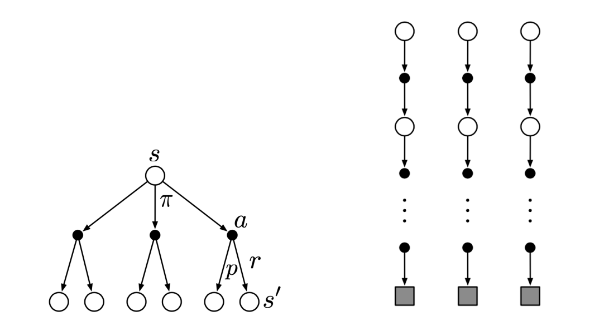

# Monte Carlo Method
Dynamic Programming으로 MDP의 문제를 풀려면 반드시 dynamics function $p$의 정보를 전부 알고 있어야 함이 가정되어 있었다. 다른 말로 하면 환경이 어떻게 행동하는지, 그 정보를 알고 있어야 하는데 현실적으로 환경의 지배 방정식을 알기란 매우 어렵다. 때문에 많은 경우 주체가 직접 환경과 상호작용을 하며 얻은 샘플 $\{(s, a, r, s)\}$로 학습하여 DP와 같은 효과를 내는 것을 목표로 하고, 그 방법 중 하나가 몬테카를로 방법이다. 

몬테카를로 방법은 하나의 에피소드가 끝날 때마다 가치 함수를 업데이트하여 기존의 정책을 평가하는 방법을 제시한다. 이때 주변 값들의 가중 평균을 내는 Bellman equation 식의 bootstrap이 아니라 roll-out 식으로 가치 함수를 개선해 나간다. 

## Prediction
업데이트 룰은 다음과 같다.

$$V(S_t) \longleftarrow V(S_t) + \alpha_t\left[ G_t - V(S_t) \right]$$

$\alpha_t$는 step size로, 오차인 $G_t - V(S_t)$를 얼마나 반영할 것인지 결정하는 값이다. $G_t$는 $t$ 시점에서 앞으로 받을 보상의 누적합으로, 다음과 같이 계산된다.

$$G_t = R_{t+1} + \gamma R_{t+2} + \gamma^2 R_{t+3} + \cdots + \gamma^{T - t - 1} R_T$$

## Control
한편, 우리는 여전히 dynamics function $p$를 모르므로 value function $v$를 통해 정책을 개선할 수는 없다. 때문에 action-value function $q$를 사용해 업데이트를 하고, $\varepsilon-$greedy 방법으로 정책을 개선해 나가야 한다.

$$Q(S_t, A_t) \longleftarrow Q(S_t, A_t) + \alpha_t \left[ G_t - \max_{a} Q(S_t, a) \right]$$

# Reference
- Richard S. Sutton, Andrew G. Barto. (2020). Reinforcement Learning : An Introduction (2nd ed.). MIT press.