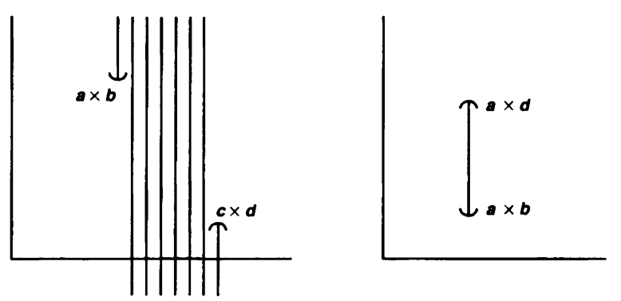
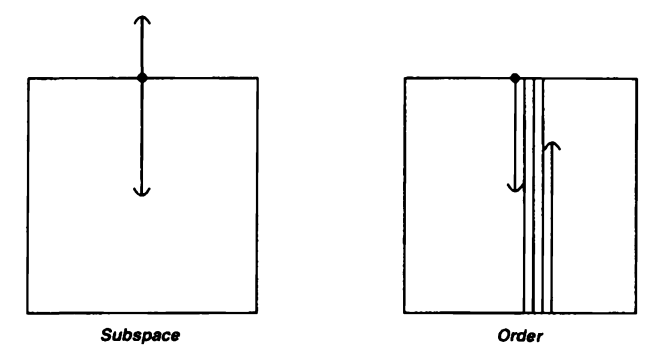

## Theorem 1
Let $X$ be a set with a simple order relation, and let assume that $X$ has more than one element. Let $\mathscr{B}$ be the collection of all sets of the following types:

**(i)** All open intervals $(a, b)$ in $X.$

**(ii)** All intervals of the form $[a_0, b)$, where $a_0$ is the smallest element (if any) of $X.$

**(iii)** All intervals of the form $(a, b_0]$. where $b_0$ is the largest element (if any) of $X.$

The collection $\mathscr{B}$ is a basis on $X.$ The topology on $X$ generated by $\mathscr{B}$ is called the ***order topology.***

$X$에 순서 관계가 주어져 있다면 일종의 "열린" 구간 $(a, b)$를 정의할 수 있다. 그러면 이 열린 구간이 오픈 셋이 되도록 $X$에 항상 위상을 줄 수 있고, 이를 순서 위상이라고 부른다.

### Proof
Let $x \in X.$ If $x$ is the smallest or the largest element of $X$, then the interval $[x, b)$ or $(a, x]$ contains $x$ and is an element of $\mathscr{B}$. (By assumption, $X$ has more than one element, so the elements $a$ or $b$ must exist in $X.$) If $x$ is not the smallest or the largest element of $X$, then there exist $a, b \in X$ such that $x \in (a, b).$ 

Suppose that $x \in B_1 \cap B_2$ for $B_1, B_2 \in \mathscr{B}$. Note that $B_1$ is of the form $(a_1, b_1)$ or $[a_1, b_1)$ or $(a_1, b_1]$, and $B_2$ is of the form $(a_2, b_2)$ or $[a_2, b_2)$ or $(a_2, b_2].$ We can easily verify that there exists $B_3 \in \mathscr{B}$ such that $x \in B_3 \subset B_1 \cap B_2$ by considering each case. $\blacksquare$

## Example 1
**(i)** The standard topology on $\mathbb{R}$ is the order topology derived from the usual order on $\mathbb{R}.$

**(ii)** Consider the set $\mathbb{R} \times \mathbb{R}$ in the dictionary order. Since $\mathbb{R} \times \mathbb{R}$ has neither a largest nor a smallest element, so the order topology of $\mathbb{R} \times \mathbb{R}$ has the basis as the collection of all open intervals of the form $((a,b), (c, d))$ for $a < c,$ and for $a = c$ and $b < d.$ 

The subcollection consisting of only intervals of the seconed type is also a basis for the order topology on $\mathbb{R} \times \mathbb{R}.$

## Definition 1
If $X$ is an ordered set, and $a \in X$, there are four subsets of $X$ that are called the ***rays*** determined by $a$. They are the following:
$$
\begin{align*}
(a, +\infty) &= \{x \in X \mid x > a\}, \\
(-\infty, a) &= \{x \in X \mid x < a\}, \\
[a, +\infty) &= \{x \in X \mid x \ge a\}, \\
(-\infty, a] &= \{x \mid x \le a\}.
\end{align*}
$$

Sets of the first two types are called ***open rays***, and sets of the last two types are called ***closed rays***.

## Remark 1
**(i)** Open rays in $X$ are open sets in the order topology.

**(ii)** Open rays form a subbasis for the order topology on $X$.

## Remark 2
Let $X$ be an ordered set in the order topology, and let $Y$ be a subset of $X.$ The order relation on $X$, when restricted to $Y$, makes $Y$ into an ordered set. However, the resulting order topology on $Y$ need **NOT** be the same as the topology that $Y$ inherits as
a subspace of $X$. Here are the examples:

두 위상 $X, Y$에서 취한 부분공간 $A, B$가 있을 때, $A \times B$를 $X \times Y$의 부분공간으로 보든지, $A \times B$ 자체를 곱공간으로 보든지 두 위상은 같은 위상공간임을 보인 바 있다. 그러나 순서 위상으로 오게 되면 이러한 성질이 성립하지 않는데, 위 진술에서 볼 수 있는 것처럼 $Y$를 $X$의 부분 공간으로 보고 만든 위상공간과 $Y$ 자체를 $X$에서의 순서를 제한해서 위상을 준 위상공간은 일반적으로 같을 필요가 없다.

## Example 2
**(i)** Consider the subset $Y = [0, 1]$ of the real line $\mathbb{R}$, in the subspace topology. The subspace topology has as basis all sets of the form $(a, b) \cap Y$, where $(a, b)$ is an open interval in $\mathbb{R}$. Such a set is of one of the following types:
$$
(a, b) \cap Y =
\begin{cases}
(a, b) & \text{if } a \text{ and } b \text{ are in } Y, \\
[0, b) & \text{if only } b \text{ is in } Y, \\
(a, 1] & \text{if only } a \text{ is in } Y, \\
Y \text{ or } \varnothing & \text{if neither } a \text{ nor } b \text{ is in } Y.
\end{cases}
$$

Note that these sets form a basis for the order topology on $Y$. Thus, we see that in the case of the set $Y = [0, 1]$, its subspace topology (as a subspace of $\mathbb{R}$) and its order topology are the same.

**(ii)** Let $Y = [0, 1) \cup \{2\}$ be a subset of $\mathbb{R}$. In the subspace topology on $Y$, the singleton $\{2\}$ is open, because $\{ 2 \} = (\frac{3}{2}, \frac{5}{2}) \cap Y$. But in the order topology on $Y$, the set $\{2\}$ is not open. Any basis element for the order topology on $Y$ that contains $2$ is of the form
$$ \{x \mid x \in Y \text{ and } a < x \le 2\} $$

for some $a \in Y$, such a set necessarily contains points of $Y$ less than $2$, which means that it is not a singleton.

**(iii)** Let $I = [0, 1]$. The dictionary order on $I \times I$ is just the restriction to $I \times I$ of the dictionary order on the plane $\mathbb{R} \times \mathbb{R}$. However, the dictionary order topology on $I \times I$ is not the same as the subspace topology on $I \times I$ obtained from the dictionary order topology on $\mathbb{R} \times \mathbb{R}$. For example, the set $\left\{\frac{1}{2} \right\} \times \left( \frac{1}{2}, 1 \right]$ is open in $I \times I$ in the subspace topology, but not in the order topology, as you can check in the following figure.

$\left\{\frac{1}{2} \right\} \times \left( \frac{1}{2}, 1 \right]$를 $\mathbb{R} \times \mathbb{R}$에서의 open ray들의 합집합과 $I \times I$의 교집합으로 나타낼 수 있음을 생각한다면 이 집합은 부분공간 $I \times I$에서 오픈 셋이다. 그러나 $I \times I$ 자체를 순서 위상으로 보게 된다면 자명하게 오픈 셋이 될 수 없다. 즉, 위상에 따라서 오픈 셋의 여부가 달라지므로 두 위상은 같은 위상이 아님을 알 수 있다. 참고로 사전식 순서가 주어진 공간 $I \times I$을 ***ordered square***라고 부르고 $I_o^2$로 적는다.

이와 같이 순서 위상에서는 부분 공간과 엮어서 생각했을 때 일반적으로 순서를 뒤집을 수 없음을 확인했다. 그러면 자연스럽게 언제 뒤집는 일이 가능한지, 그 조건을 찾아야 할 것이고, $Y$가 컨벡스 셋이면 가능하다는 게 결론이다.

## Definition 2
Given an ordered set $X$, let us say that a subset $Y$ of $X$ is ***convex*** in $X$ if for each pair of points $a < b$ of $Y$, the entire interval $(a, b)$ of points of $X$ lies in $Y$. 

자명하게 interval들이나 ray들은 모두 컨벡스 셋이다. 

## Theorem 2
Let $X$ be an ordered set in the order topology, and let $Y$ be a subset of $X$ that is convex in $X$ Then the order topology on $Y$ is the same as the topology $Y$ inherits as a subspace of $X$.

### Proof
Let $\mathscr{T}, \mathscr{T}'$ be the order topology on $Y$, and the subspace topology on $Y$ inherited from $X$, respectively.

**(i)** $\mathscr{T}' \subset \mathscr{T}$

Consider the ray $(a, \infty)$ in $X$. If $a \in Y,$ then $(a, \infty) \cap Y$ is a ray in $Y$ because $Y$ is convex. If $a \notin Y$, then $a$ is either a lower bound of $Y$, so that $(a, \infty) \cap Y = Y$, or an upper bound of $Y$, so that $(a, \infty) \cap Y = \emptyset.$ In either case, $(a, \infty) \cap Y$ is open in $Y$ with the order topology. Similarly, $(-\infty, a) \cap Y$ is open in $Y$ with the order topology. Since the sets $(a, \infty) \cap Y$ and $(-\infty, a) \cap Y$ form a subbasis for $\mathscr{T}$, we have $\mathscr{T}' \subset \mathscr{T}$.

**(ii)** $\mathscr{T} \subset \mathscr{T}'$

Consider the ray $(a, \infty)$ of $\mathscr{T}$. Clearly, $(a, \infty)$ is the intersection of the ray in $X$ with $Y.$ Since each ray is open in the order topology, and since each ray is a basis element of the order topology on $X$, we have that $(a, \infty)$ is open in $Y$ with the subspace topology. Similarly, $(-\infty, a)$ is open in $Y$ with the subspace topology. Since these sets form a subbasis for $\mathscr{T}$, we have $\mathscr{T} \subset \mathscr{T}'$. Hence, $\mathscr{T} = \mathscr{T}'. \blacksquare$

# Reference
- James R. Munkres. (2000). Topology (2nd ed.). Pearson.