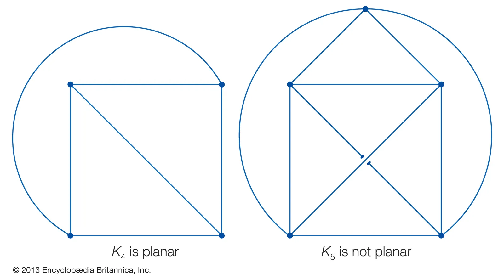
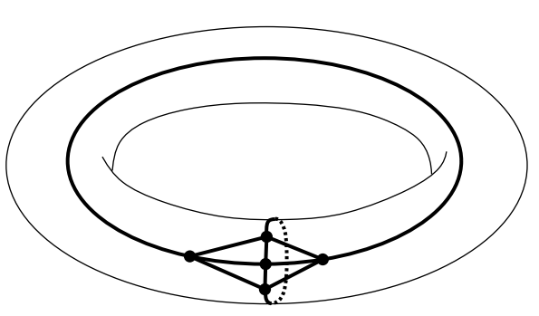
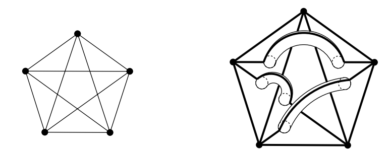
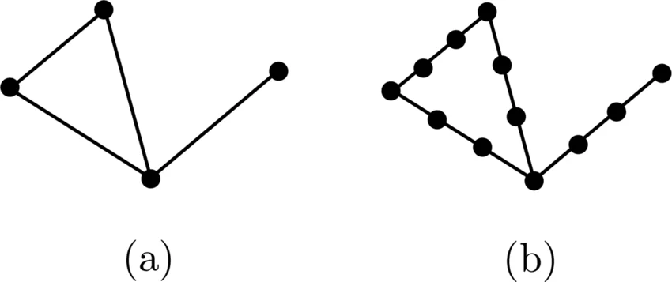
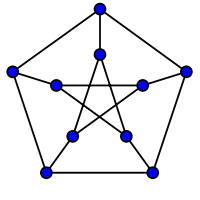

## Definition 1
A graph is said to be ***planer*** if it can be drwan in $\mathbb{R}^2$ without crossing edges. A drawing of a graph in $\mathbb{R}^2$ is a ***plane graph*** or a ***topological graph***.

쉽게 말해 평면에 그래프를 에지가 겹치지 않고 그릴 수 있으면 평면 그래프라고 부른다. 당연히 완전 그래프 $K_4$는 평면 그래프이지만 $K_5$는 그렇지 않다.

...아예 방법이 없는 건 아니다.

평면이 토러스와 위상동형임을 생각한다면, $K_5$는 토러스 위에서는 평면 그래프로 그릴 수 있다.

그렇다면 굳이 토러스만 생각할 필요도 없고, 그래프를 어떤 표면 위에 그리는 무궁무진한 방법이 있음을 짐작할 수 있다. 예컨대 다음과 같이 일종의 손잡이(...)를 달아서 그릴 수도 있다.

## Definition 2
A ***subdivision*** of a graph $G$ is is any graph we get from $G$ by adding vertices to edges. 

즉, 에지 위에 노드를 추가해서 얻은 그래프를 subdivision이라고 부른다. 기존의 그래프를 더 세밀한 단위로 쪼개는 느낌으로 생각하면 된다. 자명하게 임의의 cycle은 triangle, 즉 $K_3$의 subdivision이다.

## Kuratowski's Theorem
A graph is planer $\iff$ It contains no subdivision of $K_5$ or $K_{3, 3}$ as a subgraph.

$K_5$나 $K_{3,3}$이 평면 그래프가 아니기 때문에 이 그래프들의 subdivision을 subgraph로 가지면 평면 그래프일 수 없고, 이 조건으로 그래프가 평면인지 유일하게 결정된다. 

예제로 Peterson graph는 평면 그래프가 아님을 보일 수 있는데, $K_{3,3}$의 subdivision을 subgraph로 가지기 때문이다.

주의할 점은 이 정리를 사용해서 $K_5$와 $K_{3,3}$가 평면 그래프가 아님을 보일 수는 없는데, 정리의 증명 자체에 $K_5$와 $K_{3,3}$가 평면 그래프가 아님을 사용하기 때문이다. 

# Reference
- Matousek, J., & Nesetril, J. (2008). Invitation to Discrete Mathematics. Oxford University Press.