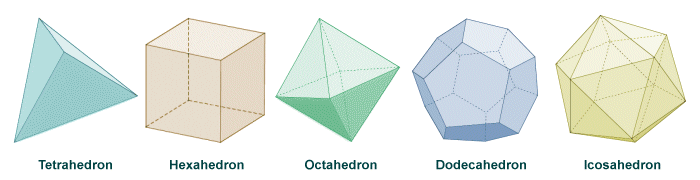
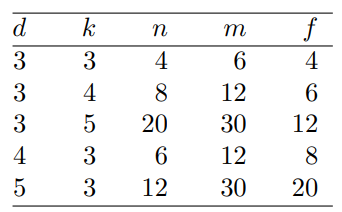

## Definition
A ***platonic solid*** is a convex $3$-dimensional polyhedron in which every face has the same number of edges, and every vertex has the same number of edges.

## Remark
There are only $5$ platonic solids. 

## Lemma
Let $G$ be a connected planar graph such that every vertex has degree $d \ge 3$ and every face has $k \ge 3$ edges. Then $G$ is one of the five above graphs.

### Proof
Note that $2m = dn$ and $fk = 2m$. Then we have 

$$f = \frac{2m}{k} \quad \text{and} \quad n = \frac{2m}{d}.$$

From Euler's formula, we get 

$$\begin{align*}
2 &= n - m + f\\
&= \frac{2m}{d} - m + \frac{2m}{k},
\end{align*}$$

which implies 

$$\frac{1}{d} + \frac{1}{k} = \frac{1}{2} + \frac{1}{m}.$$

If $d, k \ge 4,$ then $\frac{1}{d} + \frac{1}{j} \le \frac{1}{2}. \bigotimes$ If $d = 3$ and $k \ge 6$, then it contradicts similarly. $\bigotimes$ Thus, we obtain the condition $3 \le k, d \le 5.$ Thus, we obtain the conclusion: note the following table. $\blacksquare$

# Reference
- Matousek, J., & Nesetril, J. (2008). Invitation to Discrete Mathematics. Oxford University Press.